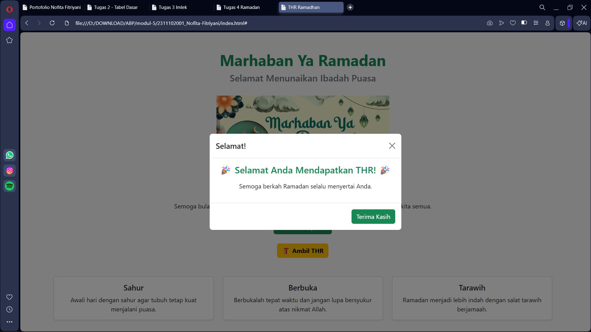

<h1 align="center">LAPORAN PRAKTIKUM</h1>
<h1 align="center">APLIKASI BERBASIS PLATFORM</h1>

<br>

<h2 align="center">MODUL 5</h2>
<h2 align="center">JAVASCRIPT & JQUERY</h2>

<br><br>

<p align="center">

</p>
<br><br><br>

<h2 align="center">Disusun Oleh :</h2>

<p align="center" style="font-size:28px;">
  <b>Nofita Fitriyani</b><br>
  <b>2311102001</b><br>
  <b>S1 IF-11-REG 01</b>
</p>
<br>
<h2 align="center">Dosen Pengampu :</h2>

<p align="center" style="font-size:28px;">
  <b>Dimas Fanny Hebrasianto Permadi, S.ST., M.Kom</b>
</p>
<br>
<h2 align="center">Asisten Praktikum :</h2>

<p align="center" style="font-size:28px;">
  <b>Apri Pandu Wicaksono</b><br>
  <b>Rangga Pradarrell Fathi</b>
</p>
<br>
<h1 align="center">LABORATORIUM HIGH PERFORMANCE</h1>
<h1 align="center">FAKULTAS INFORMATIKA</h1>
<h1 align="center">UNIVERSITAS TELKOM PURWOKERTO</h1>
<h1 align="center">TAHUN 2026</h1>

<hr>

### Dasar Teori
#### 1. Pengenalan Javascript 
Javascript merupakan bahasa pemrograman scripting yang digunakan untuk membuat halaman web menjadi lebih dinamis dan interaktif. Awalnya Javascript dikembangkan untuk mengontrol program berbasis Java, namun seiring perkembangan teknologi web, Javascript digunakan untuk memanipulasi elemen HTML dan membuat interaksi pada halaman web di dalam browser. Dengan menggunakan Javascript, halaman web yang awalnya bersifat statis dapat berubah menjadi lebih hidup karena mampu merespon tindakan pengguna seperti klik, input, maupun peristiwa lainnya.

Javascript mendukung beberapa paradigma pemrograman seperti pemrograman imperatif, fungsional, dan berorientasi objek. Bahasa ini juga memungkinkan program yang kompleks dibangun dari bagian-bagian kecil yang saling berinteraksi satu sama lain. Javascript memiliki berbagai tipe data seperti number, string, boolean, object, array, function, null, dan undefined yang digunakan untuk menyimpan serta memproses informasi di dalam program. 

Selain itu, Javascript juga mendukung konsep variabel, array, fungsi, dan struktur kontrol seperti percabangan serta perulangan. Variabel dalam Javascript digunakan untuk menyimpan nilai sementara yang dapat digunakan kembali dalam program. Fungsi digunakan untuk membungkus serangkaian perintah sehingga dapat dipanggil berulang kali tanpa harus menulis kode yang sama secara berulang.

#### 2. Pengenalan jQuery
jQuery merupakan library Javascript yang dibuat oleh John Resig pada tahun 2006 yang bertujuan untuk mempermudah manipulasi dokumen HTML. Dengan menggunakan jQuery, penulisan kode Javascript dapat menjadi lebih singkat dan sederhana. jQuery memungkinkan pengembang web untuk memodifikasi elemen HTML, menangani event seperti klik, membuat animasi, serta memanfaatkan teknologi AJAX dengan lebih mudah.

Beberapa fitur utama yang dimiliki jQuery antara lain manipulasi DOM, event handling, animasi, serta ukuran library yang ringan sehingga tidak membebani halaman web. jQuery dapat digunakan dengan dua cara yaitu mengunduh file library secara lokal atau menggunakan CDN (Content Delivery Network) sehingga file jQuery dipanggil langsung dari internet.

Pada praktikum ini konsep interaksi halaman web diterapkan menggunakan komponen **modal dari Bootstrap** yang memanfaatkan Javascript untuk menampilkan pesan pop-up ketika pengguna melakukan aksi klik pada tombol.

### Source Code
```
<!DOCTYPE html>
<html lang="id">
<head>
<meta charset="UTF-8">
<meta name="viewport" content="width=device-width, initial-scale=1.0">
<title>THR Ramadhan</title>

<link href="https://cdn.jsdelivr.net/npm/bootstrap@5.3.3/dist/css/bootstrap.min.css" rel="stylesheet">

</head>

<body class="bg-light">

<div class="container text-center mt-5">

<h1 class="text-success fw-bold">Marhaban Ya Ramadan</h1>
<h4 class="text-secondary">Selamat Menunaikan Ibadah Puasa</h4>


<p class="mt-4">
Semoga bulan Ramadan membawa keberkahan,
kedamaian, dan kebahagiaan bagi kita semua.
</p>

<a href="#" class="btn btn-success mt-2">Selamat Berpuasa</a>

<br><br>

<!-- BUTTON THR -->
<button class="btn btn-warning fw-bold" data-bs-toggle="modal" data-bs-target="#modalThr">
🎁 Ambil THR
</button>

</div>


<div class="container mt-5">

<div class="row text-center">

<div class="col-md-4">
<div class="card shadow-sm">
<div class="card-body">
<h5 class="card-title">Sahur</h5>
<p class="card-text">
Awali hari dengan sahur agar tubuh tetap kuat menjalani puasa.
</p>
</div>
</div>
</div>

<div class="col-md-4">
<div class="card shadow-sm">
<div class="card-body">
<h5 class="card-title">Berbuka</h5>
<p class="card-text">
Berbukalah tepat waktu dan jangan lupa bersyukur atas nikmat Allah.
</p>
</div>
</div>
</div>

<div class="col-md-4">
<div class="card shadow-sm">
<div class="card-body">
<h5 class="card-title">Tarawih</h5>
<p class="card-text">
Ramadan menjadi lebih indah dengan salat tarawih berjamaah.
</p>
</div>
</div>
</div>

</div>

</div>


<footer class="text-center mt-5 mb-3 text-muted">
<p>© Nofita - Bootstrap</p>
</footer>


<!-- MODAL THR -->
<div class="modal fade" id="modalThr" tabindex="-1">
<div class="modal-dialog modal-dialog-centered">
<div class="modal-content">

<div class="modal-header">
<h5 class="modal-title">Selamat!</h5>
<button type="button" class="btn-close" data-bs-dismiss="modal"></button>
</div>

<div class="modal-body text-center">

<h4 class="text-success">🎉 Selamat Anda Mendapatkan THR! 🎉</h4>

<p class="mt-3">
Semoga berkah Ramadan selalu menyertai Anda.
</p>

</div>

<div class="modal-footer">
<button class="btn btn-success" data-bs-dismiss="modal">
Terima Kasih
</button>
</div>

</div>
</div>
</div>


<script src="https://cdn.jsdelivr.net/npm/bootstrap@5.3.3/dist/js/bootstrap.bundle.min.js"></script>

</body>
</html>
```

### Output 


### Penjelasan Kode Program
Pada tugas ini halaman Ramadan yang sebelumnya telah dibuat ditambahkan fitur interaktif menggunakan komponen Modal dari Bootstrap. Modal digunakan untuk menampilkan pesan ketika pengguna menekan tombol tertentu pada halaman web.

Bagian pertama yang ditambahkan adalah tombol untuk memunculkan modal. Tombol ini dibuat menggunakan class Bootstrap `btn` dan `btn-warning` sehingga tampil sebagai tombol berwarna kuning. Pada tombol tersebut terdapat atribut `data-bs-toggle="modal"` dan `data-bs-target="#modalThr"` yang berfungsi untuk memanggil modal ketika tombol diklik.

Atribut `data-bs-toggle="modal"` digunakan untuk memberi tahu Bootstrap bahwa tombol ini akan membuka komponen modal. Sedangkan `data-bs-target="#modalThr"` menunjuk ke id modal yang akan ditampilkan.

Selanjutnya ditambahkan komponen modal Bootstrap yang berfungsi untuk menampilkan pesan kepada pengguna. Class `modal` digunakan untuk membuat komponen modal, sedangkan `fade` memberikan efek animasi ketika modal muncul.

Di dalam modal terdapat beberapa bagian utama. Bagian `modal-header` berisi judul modal dan tombol untuk menutup modal. Bagian `modal-body` berisi pesan utama yaitu "Selamat Anda Mendapatkan THR". Bagian `modal-footer` berisi tombol untuk menutup modal.

Pada bagian isi modal digunakan class `text-center` untuk membuat teks berada di tengah dan `text-success` untuk memberikan warna hijau pada teks.

Agar komponen modal dapat berfungsi dengan baik, diperlukan file JavaScript dari Bootstrap yang dipanggil pada bagian akhir dokumen HTML. Script tersebut digunakan untuk menjalankan komponen interaktif Bootstrap seperti modal, dropdown, dan komponen lainnya.

Dengan penambahan tombol dan modal tersebut, halaman Ramadan menjadi lebih interaktif karena pengguna dapat melakukan aksi klik yang kemudian memunculkan pesan pop-up berupa ucapan "Selamat Anda Mendapatkan THR".

### Kesimpulan 
Berdasarkan praktikum yang telah dilakukan, dapat disimpulkan bahwa Javascript memiliki peran penting dalam membuat halaman web menjadi lebih dinamis dan interaktif. Dengan memanfaatkan komponen interaktif dari Bootstrap yang berbasis Javascript, halaman web dapat memberikan respon terhadap aksi pengguna seperti klik tombol.

Pada tugas ini ditambahkan fitur modal yang menampilkan pesan ketika pengguna menekan tombol "Ambil THR". Dengan menggunakan Bootstrap, fitur interaktif tersebut dapat dibuat dengan lebih mudah tanpa perlu menulis kode Javascript secara manual. Hal ini menunjukkan bahwa framework dan library dapat membantu pengembang web dalam membuat halaman web yang menarik dan interaktif dengan lebih efisien.