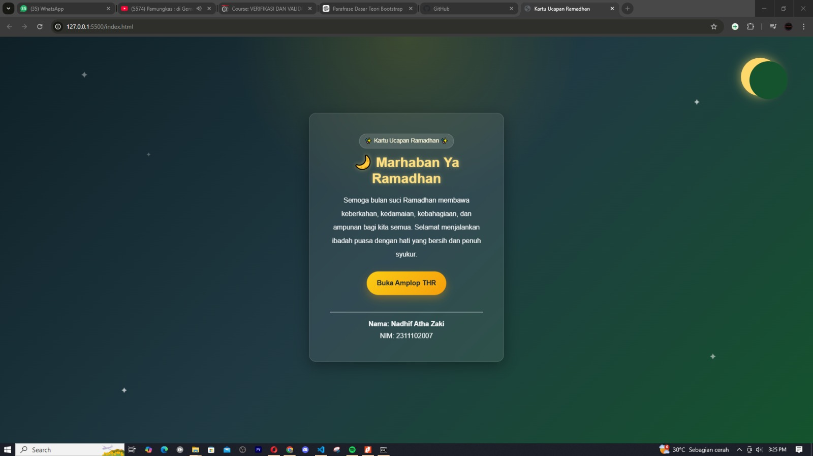
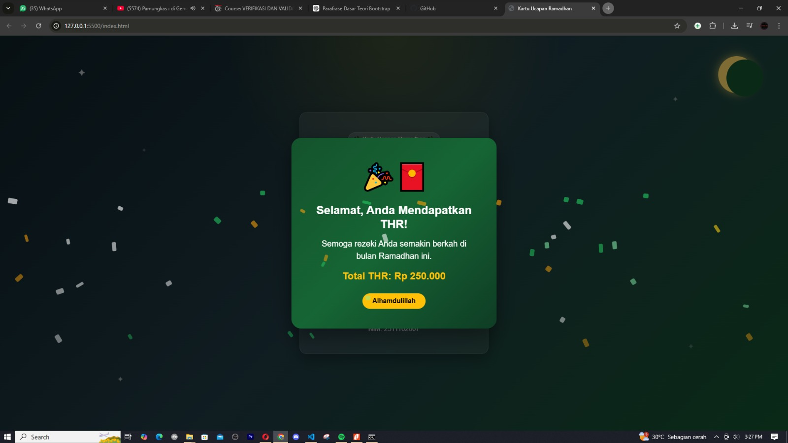

<div align="center">
  <br />
  <h1>LAPORAN PRAKTIKUM <br>APLIKASI BERBASIS PLATFORM</h1>
  <br />
  <h3>MODUL 5 <br> JAVASCRIPT</h3>
  <br />
  <br />
   
  <br />
  <br />
  <br />
  <br />
  <h3>Disusun Oleh :</h3>
  <p>
    <strong>Nadhif Atha Zaki</strong><br>
    <strong>2311102007</strong><br>
    <strong>S1 IF-11-REG01</strong>
  </p>
  <br />
  <br />
  <h3>Dosen Pengampu :</h3>
  <p>
    <strong>Dimas Fanny Hebrasianto Permadi, S.ST., M.Kom</strong>
  </p>
  <br />
  <br />
    <h4>Asisten Praktikum :</h4>
    <strong> Apri Pandu Wicaksono </strong> <br>
    <strong>Rangga Pradarrell Fathi</strong>
  <br />
  <h3>LABORATORIUM HIGH PERFORMANCE
 <br>FAKULTAS INFORMATIKA <br>UNIVERSITAS TELKOM PURWOKERTO <br>2026</h3>
</div>

---

## 1. Dasar Teori

**JavaScript (JS)** merupakan bahasa pemrograman tingkat tinggi yang digunakan untuk menambahkan sifat **interaktif, dinamis, dan responsif** pada halaman web. Bahasa ini awalnya dirancang untuk berjalan di **sisi klien (browser)** sehingga dapat berinteraksi langsung dengan pengguna, memperbarui tampilan halaman tanpa perlu melakukan _reload_, serta melakukan validasi data pada formulir sebelum data tersebut dikirim ke server.

Melalui konsep **DOM (Document Object Model)**, JavaScript dapat mengakses dan memanipulasi struktur dokumen HTML secara logis. Dengan memanfaatkan DOM, pengembang dapat menambah, menghapus, maupun mengubah elemen HTML serta menyesuaikan properti **CSS styling** secara dinamis berdasarkan _event_ atau kejadian tertentu, seperti klik, _hover_, menggulir halaman, dan berbagai interaksi pengguna lainnya.

Seiring perkembangan teknologi web, JavaScript tidak hanya digunakan pada sisi klien, tetapi juga dapat dijalankan di **sisi server** menggunakan _runtime environment_ seperti **Node.js**, sehingga memungkinkan pengembangan aplikasi web secara lebih menyeluruh menggunakan satu bahasa pemrograman yang sama.

````


---

## 2. Penjelasan Kode HTML, CSS, dan JS


### Kode HTML

```html
<!DOCTYPE html>
<html lang="id">
  <head>
    <meta charset="UTF-8" />
    <meta name="viewport" content="width=device-width, initial-scale=1.0" />
    <title>Kartu Ucapan Ramadhan</title>

    <!-- Bootstrap 5 CDN -->
    <link
      href="https://cdn.jsdelivr.net/npm/bootstrap@5.3.3/dist/css/bootstrap.min.css"
      rel="stylesheet"
    />

    <!-- CSS External -->
    <link rel="stylesheet" href="style.css" />
  </head>
  <body>
    <div
      class="container-fluid ramadan-wrapper d-flex justify-content-center align-items-center px-3"
    >
      <div class="moon"></div>

      <div class="star">✦</div>
      <div class="star">✦</div>
      <div class="star">✦</div>
      <div class="star">✦</div>
      <div class="star">✦</div>

      <div class="card ramadan-card text-center text-light rounded-4">
        <div class="card-body p-4 p-md-5">
          <div class="mini-badge">✨ Kartu Ucapan Ramadhan ✨</div>

          <h2 class="fw-bold mb-3 card-title-glow">🌙 Marhaban Ya Ramadhan</h2>

          <p class="mb-4 lh-lg">
            Semoga bulan suci Ramadhan membawa keberkahan, kedamaian,
            kebahagiaan, dan ampunan bagi kita semua. Selamat menjalankan ibadah
            puasa dengan hati yang bersih dan penuh syukur.
          </p>

          <button
            id="thrButton"
            class="btn envelope-btn rounded-pill px-4 py-3 mb-4"
            type="button"
            data-bs-toggle="modal"
            data-bs-target="#thrModal"
          >
            Buka Amplop THR
          </button>

          <hr class="border-light opacity-75" />

          <p class="mb-1 fw-semibold">Nama: Nadhif Atha Zaki</p>
          <p class="mb-0">NIM: 2311102007</p>
        </div>
      </div>
    </div>

    <!-- Modal THR -->
    <div
      class="modal fade"
      id="thrModal"
      tabindex="-1"
      aria-labelledby="thrModalLabel"
      aria-hidden="true"
    >
      <div class="modal-dialog modal-dialog-centered">
        <div class="modal-content text-center custom-modal">
          <div class="modal-body p-4 p-md-5">
            <div class="thr-icon mb-3">🎉🧧</div>

            <h3 class="fw-bold mb-3" id="thrModalLabel">
              Selamat, Anda Mendapatkan THR!
            </h3>

            <p class="mb-3 fs-5">
              Semoga rezeki Anda semakin berkah di bulan Ramadhan ini.
            </p>

            <p class="mb-4 text-warning fw-semibold fs-4" id="thrAmount">
              Total THR: Rp 0
            </p>

            <button
              type="button"
              class="btn btn-warning fw-bold px-4 rounded-pill"
              data-bs-dismiss="modal"
            >
              Alhamdulillah
            </button>
          </div>
        </div>
      </div>
    </div>

    <!-- Bootstrap Bundle JS -->
    <script src="https://cdn.jsdelivr.net/npm/bootstrap@5.3.3/dist/js/bootstrap.bundle.min.js"></script>

    <!-- JS External -->
    <script src="script.js"></script>
  </body>
</html>

````

### Kode CSS (`style.css`)

```css
body,
html {
  margin: 0;
  padding: 0;
  width: 100%;
  height: 100%;
  overflow-x: hidden;
}

.bg-animated {
  background: linear-gradient(-45deg, #0f2027, #203a43, #2c5364, #198754);
  background-size: 400% 400%;
  animation: gradientBG 15s ease infinite;
  min-height: 100vh;
  width: 100vw;
}

@keyframes gradientBG {
  0% {
    background-position: 0% 50%;
  }
  50% {
    background-position: 100% 50%;
  }
  100% {
    background-position: 0% 50%;
  }
}

.fullscreen-glass {
  background: rgba(0, 0, 0, 0.25);
  backdrop-filter: blur(10px);
  -webkit-backdrop-filter: blur(10px);
  min-height: 100vh;
  width: 100vw;
}

.title-ramadhan {
  /* Ukurannya sudah saya perkecil */
  font-size: clamp(1.8rem, 4vw, 3.5rem);
  letter-spacing: 2px;
  text-shadow: 0 4px 15px rgba(255, 193, 7, 0.4);
}

.content-wrapper {
  max-width: 1000px;
}

.pulse-btn {
  animation: pulse-animation 2s infinite;
  transition: all 0.3s ease;
}

.pulse-btn:hover {
  transform: scale(1.05);
  animation: none;
  box-shadow: 0 0 25px rgba(255, 193, 7, 0.6);
}

@keyframes pulse-animation {
  0% {
    box-shadow: 0 0 0 0 rgba(255, 193, 7, 0.7);
  }
  70% {
    box-shadow: 0 0 0 20px rgba(255, 193, 7, 0);
  }
  100% {
    box-shadow: 0 0 0 0 rgba(255, 193, 7, 0);
  }
}

.shake-icon {
  display: inline-block;
  animation: shake-animation 2.5s infinite;
}

@keyframes shake-animation {
  0%,
  100% {
    transform: rotate(0deg);
  }
  10%,
  30%,
  50% {
    transform: rotate(15deg);
  }
  20%,
  40% {
    transform: rotate(-15deg);
  }
  60% {
    transform: rotate(0deg);
  }
}
```

### Kode JS (`main.js`)

```javascript
const hour = new Date().getHours();
let greeting = "Selamat Datang";

if (hour >= 3 && hour < 11) greeting = "Selamat Pagi 🌅";
else if (hour >= 11 && hour < 15) greeting = "Selamat Siang ☀️";
else if (hour >= 15 && hour < 18) greeting = "Selamat Sore 🌇";
else greeting = "Selamat Malam 🌙";

document.getElementById("dynamic-greeting").innerText = greeting;

// Logika Gacha THR
const thrAmounts = [
  "Rp 50.000 💵",
  "Rp 100.000 💸",
  "Rp 250.000 💰",
  "Rp 500.000 🤑",
  "Rp 1.000.000 💳",
  "Pahala Puasa 🕌",
  "Zonk! Coba Lagi 🤣",
];

const thrModal = document.getElementById("thrModal");
const thrResult = document.getElementById("thr-result");
const thrMessage = document.getElementById("thr-message");

thrModal.addEventListener("show.bs.modal", (event) => {
  thrResult.innerHTML =
    '<div class="spinner-border text-warning" role="status"><span class="visually-hidden">Loading...</span></div>';

  setTimeout(() => {
    const randomThr = thrAmounts[Math.floor(Math.random() * thrAmounts.length)];
    thrResult.innerText = randomThr;

    if (randomThr.includes("Zonk")) {
      thrMessage.innerText =
        "Waduh, belum beruntung nih. Jangan menyerah, coba klik lagi amplopnya! hehehe ✌️";
    } else {
      thrMessage.innerText =
        "Semoga rezekinya berkah, puasanya lancar, dan jangan lupa sebagian disedekahkan ya. 🕌✨";

      confetti({
        particleCount: 150,
        spread: 90,
        origin: { y: 0.6 },
        colors: ["#ffc107", "#198754", "#ffffff", "#ff0000"],
      });
    }
  }, 800);
});

thrModal.addEventListener("hidden.bs.modal", (event) => {
  thrResult.innerText = "Rp 0";
});
```

### Hasil Tampilan (Screenshot)




### Penjelasan code:

#### 1. HTML (`index.html`)

- Pada bagian **head**, beberapa tag `<link>` digunakan untuk memuat **Bootstrap 5 CSS** melalui CDN serta file **`style.css`** sebagai stylesheet lokal. Bootstrap digunakan untuk menyediakan komponen antarmuka seperti _card_, _button_, serta _modal_ tanpa perlu menulis struktur UI dari awal.

- Pada bagian **konten utama**, elemen kartu ucapan Ramadhan ditempatkan di tengah halaman menggunakan kombinasi class Bootstrap seperti `container-fluid`, `d-flex`, `justify-content-center`, dan `align-items-center`. Di dalam kartu tersebut terdapat judul ucapan **“Marhaban Ya Ramadhan”**, pesan doa Ramadhan, serta identitas pembuat kartu.

- Tombol **“Buka Amplop THR”** dibuat menggunakan elemen `<button>` yang memiliki atribut `data-bs-toggle="modal"` dan `data-bs-target="#thrModal"`. Atribut ini merupakan mekanisme bawaan Bootstrap untuk **memicu tampilan komponen modal** tanpa perlu menuliskan fungsi JavaScript khusus untuk menampilkan jendela pop-up.

- Komponen **Modal Bootstrap** didefinisikan pada bagian `<div class="modal fade" id="thrModal">`. Struktur ini berfungsi sebagai jendela pop-up yang akan muncul ketika tombol diklik, berisi ikon perayaan, pesan ucapan selamat mendapatkan THR, serta nilai nominal THR yang dihasilkan secara acak.

- Pada bagian akhir dokumen, tag `<script>` digunakan untuk memuat **Bootstrap JavaScript Bundle** serta file **`script.js`** buatan sendiri. Penempatan skrip di akhir `<body>` bertujuan agar proses render HTML terlebih dahulu selesai sebelum JavaScript dijalankan.

---

#### 2. Styling CSS (`style.css`)

- Pada bagian awal stylesheet, **background halaman** dibuat menggunakan kombinasi `linear-gradient` dan `radial-gradient` untuk menghasilkan latar bernuansa malam dengan warna hijau gelap dan cahaya keemasan yang merepresentasikan suasana Ramadhan.

- Elemen dekoratif seperti **bulan sabit (`.moon`)** dan **bintang (`.star`)** ditambahkan menggunakan posisi absolut. Animasi `@keyframes twinkle` diterapkan pada bintang untuk menciptakan efek berkedip sehingga latar tampak lebih hidup.

- Komponen **kartu ucapan (`.ramadan-card`)** diberi efek _glass style_ menggunakan warna semi transparan, `backdrop-filter: blur()`, serta bayangan `box-shadow`. Animasi `floating` juga ditambahkan agar kartu terlihat sedikit melayang secara halus.

- Tombol **Buka Amplop THR** menggunakan class `.envelope-btn` dengan kombinasi warna gradasi kuning emas. Efek transisi `transform` dan `box-shadow` ditambahkan sehingga tombol terlihat responsif ketika disentuh atau diarahkan kursor.

- Pada bagian **modal**, class `.custom-modal` memberikan tampilan pop-up dengan latar gradasi hijau gelap agar selaras dengan tema Ramadhan. Ikon hadiah di dalam modal diberi animasi `popUp` menggunakan `@keyframes` sehingga muncul dengan efek membesar saat modal ditampilkan.

- Selain itu, class `.confetti` disiapkan untuk membuat elemen kecil yang jatuh dari atas layar sebagai efek **confetti** ketika pengguna memperoleh THR.

---

#### 3. Fungsi JavaScript (`script.js`)

- Pada bagian awal skrip, beberapa elemen DOM diambil menggunakan `document.getElementById()`, seperti tombol **thrButton**, teks hasil nominal **thrAmount**, serta elemen **thrModal**. Hal ini memungkinkan JavaScript untuk memanipulasi elemen HTML secara dinamis.

- Variabel `nominalTHR` mendeklarasikan sebuah **array** yang berisi beberapa kemungkinan nilai THR, mulai dari puluhan ribu hingga satu juta rupiah. Nilai ini nantinya akan dipilih secara acak setiap kali pengguna membuka amplop THR.

- Fungsi `formatRupiah()` dibuat untuk memformat angka menjadi tampilan mata uang Rupiah menggunakan metode `toLocaleString("id-ID")`, sehingga nilai THR tampil lebih rapi dan mudah dibaca.

- Fungsi `createConfetti()` bertugas membuat elemen DOM baru berbentuk kotak kecil berwarna yang dianimasikan jatuh dari atas layar. Elemen tersebut dihasilkan secara berulang menggunakan perulangan `for`, kemudian dihapus kembali setelah beberapa detik agar tidak memenuhi halaman.

- _Event listener_ pada tombol **thrButton** akan dijalankan ketika tombol diklik. Di dalamnya, JavaScript mengambil **nominal THR secara acak** dari array menggunakan kombinasi `Math.random()` dan `Math.floor()`, lalu menampilkan hasilnya pada elemen `thrAmount`.

- Event **`shown.bs.modal`** yang berasal dari komponen Bootstrap digunakan untuk mendeteksi saat modal benar-benar tampil di layar. Ketika kejadian ini terjadi, fungsi `createConfetti()` dipanggil untuk menampilkan efek perayaan berupa taburan confetti.

Secara keseluruhan, kombinasi **HTML untuk struktur, CSS untuk tampilan visual, serta JavaScript untuk logika interaktif DOM** menghasilkan halaman ucapan Ramadhan yang tidak hanya informatif tetapi juga menarik dan responsif bagi pengguna.

## Refrensi

- [Materi Modul 5](https://drive.google.com/file/d/1J27NhEO2MbOF9DetZmOtEGAcPkczzm1r/view?usp=sharing)
