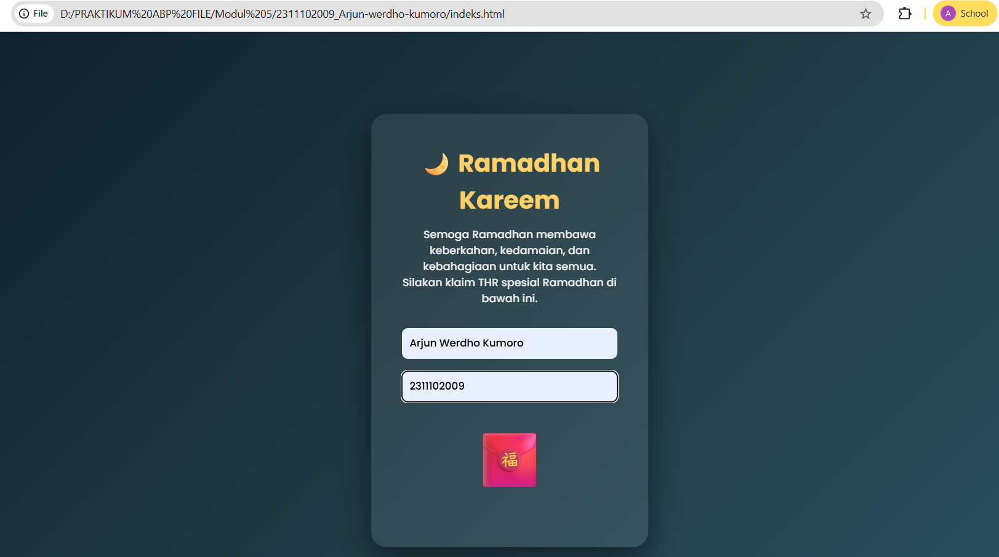
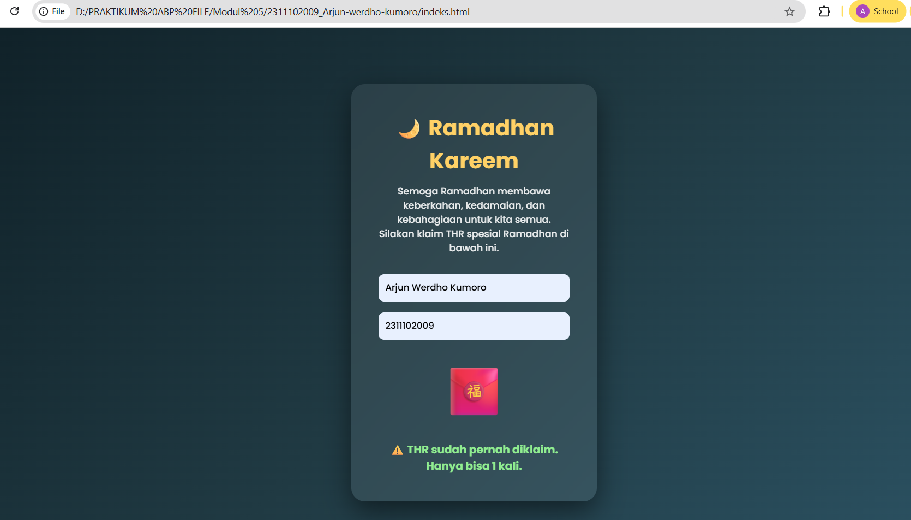

<div align="center">
  <br />
  <h1>LAPORAN PRAKTIKUM <br>APLIKASI BERBASIS PLATFORM</h1>
  <br />
  <h3>MODUL 5 <br> JS</h3>
  <br />
    
  <br /><br /><br />

  <h3>Disusun Oleh :</h3>
  <p>
    <strong>Arjun Werdho Kumoro</strong><br>
    <strong>2311102009</strong><br>
    <strong>IF-11-REG01</strong>
  </p>

  <br />

  <h3>Dosen Pengampu :</h3>
  <p>
    <strong>Dimas Fanny Hebrasianto Permadi, S.ST., M.Kom</strong>
  </p>

  <br />

  <h4>Asisten Praktikum :</h4>
  <strong>Apri Pandu Wicaksono</strong><br>
  <strong>Rangga Pradarrell Fathi</strong>

  <br /><br />

  <h3>
  LABORATORIUM HIGH PERFORMANCE <br>
  FAKULTAS INFORMATIKA <br>
  UNIVERSITAS TELKOM PURWOKERTO <br>
  2026
  </h3>
</div>

---

# DASAR TEORI

JavaScript (JS) merupakan bahasa pemrograman tingkat tinggi yang digunakan untuk menambahkan fungsi interaktif, dinamis, dan responsif pada halaman web. Bahasa ini awalnya berjalan di sisi klien melalui browser sehingga dapat merespons tindakan pengguna secara langsung, seperti memperbarui konten tanpa memuat ulang halaman serta melakukan validasi data pada formulir sebelum dikirim ke server. Dengan memanfaatkan konsep DOM (Document Object Model), JavaScript mampu mengakses, memodifikasi, menambah, maupun menghapus elemen HTML serta mengubah gaya tampilan CSS berdasarkan berbagai peristiwa seperti klik, hover, atau scroll. Seiring perkembangan teknologi web, JavaScript tidak hanya digunakan di sisi klien, tetapi juga dapat berjalan di sisi server menggunakan lingkungan seperti Node.js, sehingga memungkinkan pengembang membangun aplikasi web secara menyeluruh dengan satu bahasa pemrograman yang sama untuk front-end maupun back-end.


---

# UNGUIDED

## Code HTML

```html
<!DOCTYPE html>
<html lang="id">
<head>
<meta charset="UTF-8">
<meta name="viewport" content="width=device-width, initial-scale=1.0">

<title>THR Ramadhan</title>

<link rel="stylesheet" href="style.css">

<link href="https://fonts.googleapis.com/css2?family=Poppins:wght@300;500;700&display=swap" rel="stylesheet">

</head>

<body>

<div class="card">

<h1>🌙 Ramadhan Kareem</h1>

<p class="kata">
Semoga Ramadhan membawa keberkahan,
kedamaian, dan kebahagiaan untuk kita semua.
Silakan klaim THR spesial Ramadhan di bawah ini.
</p>

<input type="text" id="nama" placeholder="Masukkan Nama">

<input type="text" id="nim" placeholder="Masukkan NIM">

<div class="envelope" onclick="klaimTHR()">
🧧
</div>

<p id="hasil"></p>

</div>

<script src="script.js"></script>

</body>
</html>
```
## Code CSS
```
*{
margin:0;
padding:0;
box-sizing:border-box;
font-family:'Poppins',sans-serif;
}

body{
height:100vh;
display:flex;
justify-content:center;
align-items:center;
background:linear-gradient(135deg,#0f2027,#203a43,#2c5364);
color:white;
}

.card{
background:rgba(255,255,255,0.08);
padding:40px;
border-radius:20px;
text-align:center;
width:360px;
backdrop-filter:blur(10px);
box-shadow:0 15px 40px rgba(0,0,0,0.5);
}

h1{
color:#ffd166;
margin-bottom:10px;
}

.kata{
font-size:14px;
margin-bottom:20px;
opacity:0.9;
}

input{
width:100%;
padding:10px;
margin:8px 0;
border:none;
border-radius:8px;
}

.envelope{
font-size:70px;
margin-top:15px;
cursor:pointer;
transition:0.3s;
}

.envelope:hover{
transform:scale(1.2);
}

#hasil{
margin-top:20px;
font-weight:bold;
color:#90ee90;
}

.money{
position:absolute;
font-size:30px;
animation:jatuh 3s linear forwards;
}

@keyframes jatuh{
0%{
transform:translateY(-50px);
opacity:1;
}

100%{
transform:translateY(110vh);
opacity:0;
}
}
```
## Code JS
```
function klaimTHR(){

let sudahKlaim = localStorage.getItem("thrClaimed");

if(sudahKlaim){
document.getElementById("hasil").innerHTML =
"⚠️ THR sudah pernah diklaim. Hanya bisa 1 kali.";
return;
}

let nama = document.getElementById("nama").value;
let nim = document.getElementById("nim").value;

if(nama=="" || nim==""){
alert("Silakan isi Nama dan NIM terlebih dahulu");
return;
}

let thrList = [
"Rp 10.000",
"Rp 20.000",
"Rp 50.000",
"Rp 100.000",
"Rp 500.000"
];

let random = Math.floor(Math.random()*thrList.length);

document.getElementById("hasil").innerHTML =
"🎉 Selamat "+nama+" ("+nim+")! Kamu mendapatkan THR sebesar "+thrList[random];

localStorage.setItem("thrClaimed", true);

/* animasi uang */

for(let i=0;i<15;i++){

let uang=document.createElement("div");

uang.innerHTML="💸";

uang.classList.add("money");

uang.style.left=Math.random()*100+"vw";

uang.style.animationDuration=2+Math.random()*2+"s";

document.body.appendChild(uang);

setTimeout(()=>{
uang.remove();
},3000);

}

}
```
## Output



# Penjelasan

### HTML
HTML digunakan sebagai struktur utama halaman web yang menampilkan tema Ramadhan. Pada kode tersebut terdapat judul ucapan Ramadhan, teks pesan, serta dua kolom input untuk memasukkan nama dan NIM pengguna sebelum mengklaim THR. Selain itu terdapat ikon amplop yang berfungsi sebagai tombol untuk memicu proses klaim THR. Semua elemen ini disusun dalam sebuah card agar tampilan halaman lebih terpusat dan rapi.
### CSS
CSS berfungsi untuk mengatur tampilan visual halaman agar lebih menarik. Pada kode ini CSS digunakan untuk memberikan latar belakang gradasi, membuat card transparan dengan efek blur, mengatur font, warna, serta jarak antar elemen. Selain itu CSS juga menambahkan animasi seperti efek pembesaran pada ikon amplop saat diarahkan kursor dan animasi uang yang jatuh ketika THR berhasil diklaim.
### JS
JavaScript digunakan untuk memberikan interaksi pada halaman web. Script akan memeriksa apakah pengguna sudah pernah mengklaim THR menggunakan penyimpanan localStorage sehingga klaim hanya dapat dilakukan satu kali. Jika nama dan NIM sudah diisi, sistem akan memilih nominal THR secara acak lalu menampilkan pesan ucapan selamat kepada pengguna serta memunculkan animasi uang sebagai efek visual.