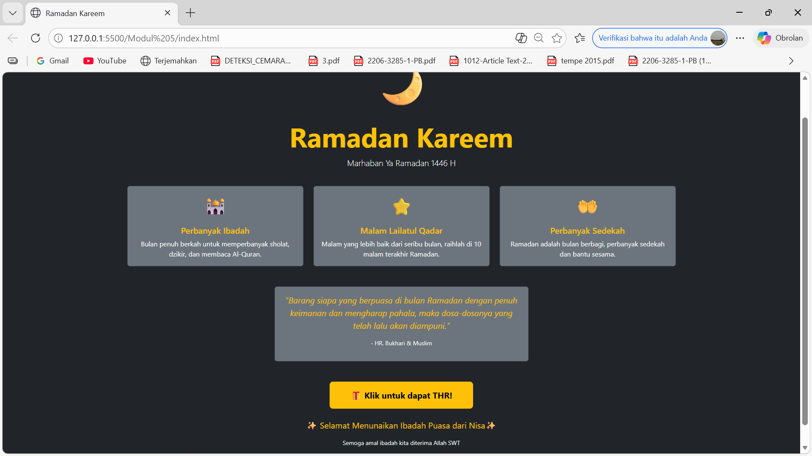
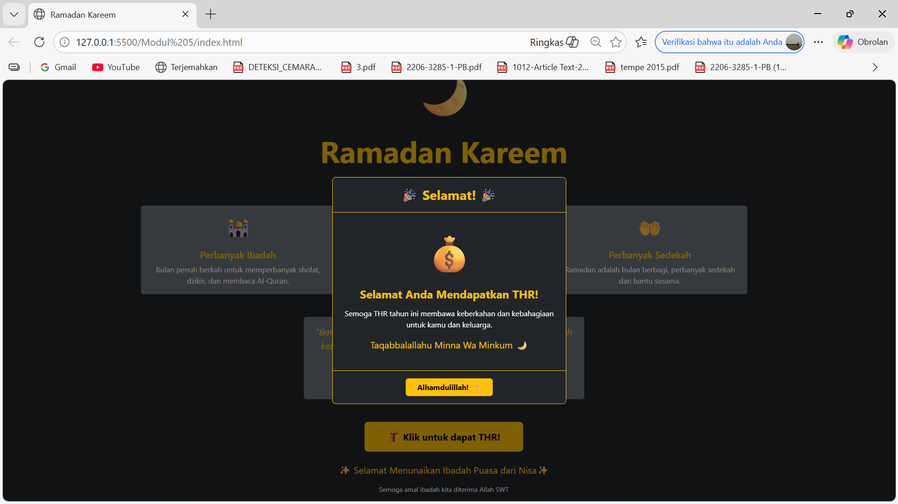

<div align="center">

# LAPORAN PRAKTIKUM
# APLIKASI BERBASIS PLATFORM

---

## MODUL 5
## HALAMAN RAMADAN DENGAN MODAL THR

---


---

**Disusun Oleh :**

**ANNISA AL JAUHAR**

**2311102014**

**S1 IF-11-REG01**

---

**Dosen Pengampu :**

Dimas Fanny Hebrasianto Permadi, S.ST., M.Kom

---

**PROGRAM STUDI S1 INFORMATIKA**

**FAKULTAS INFORMATIKA**

**UNIVERSITAS TELKOM PURWOKERTO**

**2025/2026**

</div>

---

## 1. Dasar Teori

Bootstrap merupakan framework CSS open-source yang menyediakan berbagai komponen siap pakai untuk membangun tampilan website yang responsif. Pada modul ini, Bootstrap digunakan secara lebih lanjut dengan memanfaatkan komponen interaktif yaitu **Modal** dan **Button**.

**Modal** adalah komponen Bootstrap yang menampilkan konten di atas halaman utama dalam bentuk jendela pop-up. Modal berguna untuk menampilkan informasi penting, konfirmasi, atau konten tambahan tanpa harus berpindah halaman. Komponen modal terdiri dari beberapa bagian yaitu `modal`, `modal-dialog`, `modal-content`, `modal-header`, `modal-body`, dan `modal-footer`.

Untuk menghubungkan tombol dengan modal, Bootstrap menggunakan atribut data khusus yaitu `data-bs-toggle="modal"` dan `data-bs-target="#idModal"` pada elemen tombol. Atribut `data-bs-dismiss="modal"` digunakan pada tombol di dalam modal untuk menutupnya.

**Button** merupakan komponen Bootstrap yang digunakan untuk membuat tombol interaktif. Bootstrap menyediakan berbagai class untuk mengatur tampilan tombol seperti `btn`, `btn-warning`, `btn-lg`, `fw-bold`, `px-5`, dan `py-3`.

Animasi `modal fade` pada class modal membuat modal muncul dan menghilang dengan efek fade in dan fade out yang halus. Class `modal-dialog-centered` digunakan untuk memposisikan modal tepat di tengah layar secara vertikal.

---

## 2. Penjelasan Kode

Berikut adalah implementasi halaman Ramadan dengan tambahan tombol interaktif yang menampilkan modal THR menggunakan Bootstrap 5.

### Kode HTML (index.html)
```html
<!-- 
    Nama  : Annisa Al Jauhar
    NIM   : 2311102014
    Kelas : S1 IF-11-REG01
-->
<!DOCTYPE html>
<html lang="id">
<head>
    <meta charset="UTF-8">
    <meta name="viewport" content="width=device-width, initial-scale=1.0">
    <title>Ramadan Kareem</title>
    <link href="https://cdn.jsdelivr.net/npm/bootstrap@5.3.0/dist/css/bootstrap.min.css" rel="stylesheet">
</head>
<body class="bg-dark text-white">

    <div class="min-vh-100 d-flex flex-column align-items-center justify-content-center text-center py-5">

        <div class="mb-4">
            <p style="font-size:100px">🌙</p>
            <h1 class="display-3 fw-bold text-warning">Ramadan Kareem</h1>
            <p class="lead text-light">Marhaban Ya Ramadan 1446 H</p>
        </div>

        <div class="container">
            <div class="row justify-content-center g-4">
                <div class="col-md-4">
                    <div class="card bg-secondary text-white h-100">
                        <div class="card-body text-center">
                            <p class="fs-1">🕌</p>
                            <h5 class="card-title text-warning">Perbanyak Ibadah</h5>
                            <p class="card-text">Bulan penuh berkah untuk memperbanyak sholat, dzikir, dan membaca Al-Quran.</p>
                        </div>
                    </div>
                </div>
                <div class="col-md-4">
                    <div class="card bg-secondary text-white h-100">
                        <div class="card-body text-center">
                            <p class="fs-1">⭐</p>
                            <h5 class="card-title text-warning">Malam Lailatul Qadar</h5>
                            <p class="card-text">Malam yang lebih baik dari seribu bulan, raihlah di 10 malam terakhir Ramadan.</p>
                        </div>
                    </div>
                </div>
                <div class="col-md-4">
                    <div class="card bg-secondary text-white h-100">
                        <div class="card-body text-center">
                            <p class="fs-1">🤲</p>
                            <h5 class="card-title text-warning">Perbanyak Sedekah</h5>
                            <p class="card-text">Ramadan adalah bulan berbagi, perbanyak sedekah dan bantu sesama.</p>
                        </div>
                    </div>
                </div>
            </div>
        </div>

        <div class="container mt-5">
            <div class="card bg-secondary text-white mx-auto" style="max-width:600px">
                <div class="card-body">
                    <p class="text-warning fst-italic fs-5">"Barang siapa yang berpuasa di bulan Ramadan dengan penuh keimanan dan mengharap pahala, maka dosa-dosanya yang telah lalu akan diampuni."</p>
                    <p class="text-light small">- HR. Bukhari & Muslim</p>
                </div>
            </div>
        </div>

        <!-- Tombol THR -->
        <div class="mt-5">
            <button class="btn btn-warning btn-lg fw-bold px-5 py-3 fs-5" data-bs-toggle="modal" data-bs-target="#modalTHR">
                🎁 Klik untuk dapat THR!
            </button>
        </div>

        <div class="mt-4">
            <p class="text-warning fs-5">✨ Selamat Menunaikan Ibadah Puasa dari Nisa ✨</p>
            <p class="text-light small">Semoga amal ibadah kita diterima Allah SWT</p>
        </div>

    </div>

    <!-- Modal THR -->
    <div class="modal fade" id="modalTHR" tabindex="-1">
        <div class="modal-dialog modal-dialog-centered">
            <div class="modal-content bg-dark text-white border border-warning">
                <div class="modal-header border-warning justify-content-center">
                    <h5 class="modal-title text-warning fw-bold fs-3">🎉 Selamat! 🎉</h5>
                </div>
                <div class="modal-body text-center py-4">
                    <p style="font-size:80px">💰</p>
                    <h4 class="text-warning fw-bold">Selamat Anda Mendapatkan THR!</h4>
                    <p class="text-light mt-3">Semoga THR tahun ini membawa keberkahan dan kebahagiaan untuk kamu dan keluarga.</p>
                    <p class="text-warning fs-5 mt-2">Taqabbalallahu Minna Wa Minkum 🌙</p>
                </div>
                <div class="modal-footer border-warning justify-content-center">
                    <button class="btn btn-warning fw-bold px-4" data-bs-dismiss="modal">Alhamdulillah! 🤲</button>
                </div>
            </div>
        </div>
    </div>

    <script src="https://cdn.jsdelivr.net/npm/bootstrap@5.3.0/dist/js/bootstrap.bundle.min.js"></script>
</body>
</html>
```

### Penjelasan Kode

Tombol THR menggunakan class `btn btn-warning btn-lg fw-bold px-5 py-3 fs-5` untuk tampilan tombol besar berwarna kuning. Atribut `data-bs-toggle="modal"` dan `data-bs-target="#modalTHR"` menghubungkan tombol ke modal dengan id `modalTHR` sehingga ketika tombol diklik, modal otomatis muncul tanpa perlu menulis JavaScript sama sekali.

Modal didefinisikan dengan class `modal fade` yang memberikan efek animasi fade saat muncul dan menghilang. Class `modal-dialog-centered` memposisikan modal tepat di tengah layar. Modal content menggunakan `bg-dark text-white border border-warning` untuk tampilan gelap dengan border berwarna emas sesuai tema Ramadan.

Bagian `modal-header` menampilkan judul selamat, `modal-body` berisi emoji uang, ucapan THR, dan doa, sedangkan `modal-footer` berisi tombol penutup dengan atribut `data-bs-dismiss="modal"` yang menutup modal ketika diklik.

---

## 3. Hasil

### Tampilan Halaman Utama


### Tampilan Modal THR


---

<div align="center">

</div>