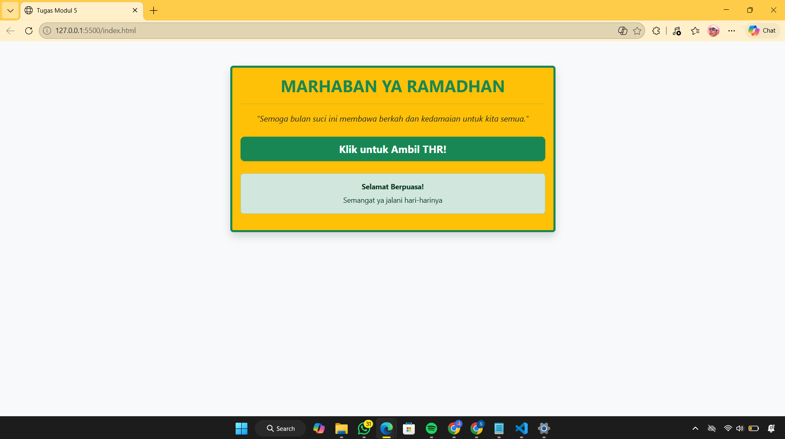
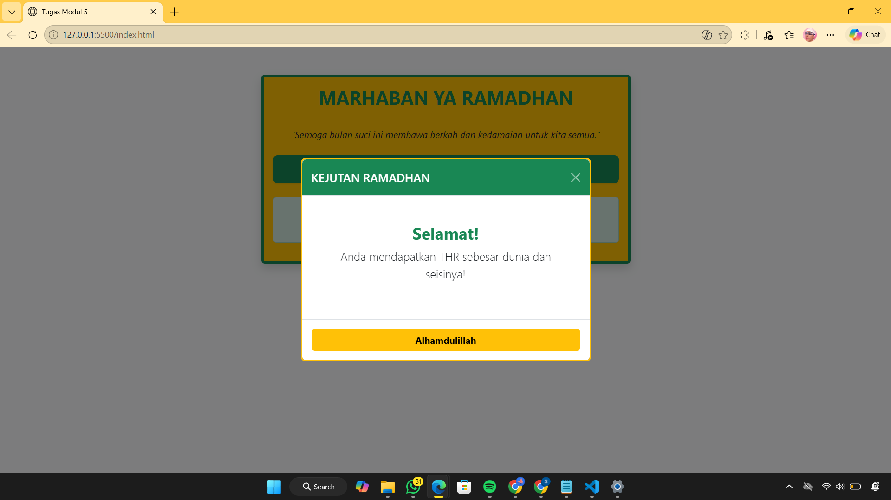

<div align="center">

# LAPORAN PRAKTIKUM
# APLIKASI BERBASIS PLATFORM


## MODUL 5
## BOOTSTRAP (PENGEMBANGAN HALAMAN RAMADHAN)


**Disusun Oleh :**

**Sherine Naura Early Gunawan**

**2311102020**

**S1 IF-11-REG01**

**Dosen Pengampu :**

Dimas Fanny Hebrasianto Permadi, S.ST., M.Kom

**PROGRAM STUDI S1 INFORMATIKA**

**FAKULTAS INFORMATIKA**

**UNIVERSITAS TELKOM PURWOKERTO**

**2025/2026**

</div>

---

## 1. Dasar Teori

Bootstrap adalah framework CSS open-source yang paling populer untuk mengembangkan situs web yang responsif dan
mobile-first. Bootstrap menyediakan kumpulan komponen desain siap pakai seperti grid system, tombol, navigasi, hingga
tabel, sehingga pengembang tidak perlu menulis kode CSS dari nol. Keunggulan utamanya adalah sistem Grid yang
menggunakan flexbox untuk mengatur tata letak halaman agar tetap rapi di berbagai ukuran layar (HP, tablet, atau
laptop). Selain itu, Bootstrap menggunakan sistem utility classes yang memungkinkan kita mengubah tampilan elemen cukup
dengan menambahkan nama class tertentu langsung pada tag HTML.

---

## 2. Source Code

```html
<!DOCTYPE html>
<html lang="id">

<head>
    <title>Tugas Modul 5</title>
    <link href="https://cdn.jsdelivr.net/npm/bootstrap@5.3.0/dist/css/bootstrap.min.css" rel="stylesheet">
</head>

<body class="bg-light">

    <div class="container mt-5">
        <div class="row justify-content-center">
            <div class="col-md-6">
                <div class="card bg-warning border-success border-4 shadow">
                    <div class="card-body text-center">
                        <h2 class="text-success fw-bold">MARHABAN YA RAMADHAN</h2>
                        <hr class="border-success">

                        <p class="fst-italic text-dark">
                            "Semoga bulan suci ini membawa berkah dan kedamaian untuk kita semua."
                        </p>

                        <div class="d-grid gap-2 mt-4">
                            <button type="button" class="btn btn-success btn-lg fw-bold shadow-sm"
                                data-bs-toggle="modal" data-bs-target="#modalTHR">
                                Klik untuk Ambil THR!
                            </button>
                        </div>

                        <div class="alert alert-success mt-4">
                            <h4 class="alert-heading small fw-bold">Selamat Berpuasa!</h4>
                            <p class="mb-0 small">Semangat ya jalani hari-harinya</p>
                        </div>
                    </div>
                </div>
            </div>
        </div>
    </div>

    <div class="modal fade" id="modalTHR" tabindex="-1" aria-hidden="true">
        <div class="modal-dialog modal-dialog-centered">
            <div class="modal-content border-warning border-3">
                <div class="modal-header bg-success text-white">
                    <h5 class="modal-title"> KEJUTAN RAMADHAN </h5>
                    <button type="button" class="btn-close btn-close-white" data-bs-dismiss="modal"
                        aria-label="Close"></button>
                </div>
                <div class="modal-body text-center p-5">
                    <h3 class="fw-bold text-success">Selamat!</h3>
                    <p class="lead">Anda mendapatkan THR sebesar dunia dan seisinya!</p>
                </div>
                <div class="modal-footer">
                    <button type="button" class="btn btn-warning fw-bold w-100"
                        data-bs-dismiss="modal">Alhamdulillah</button>
                </div>
            </div>
        </div>
    </div>

    <script src="https://cdn.jsdelivr.net/npm/bootstrap@5.3.0/dist/js/bootstrap.bundle.min.js"></script>
</body>

</html>
```

### Penjelasan Kode

Tampilan utama halaman ini dibangun menggunakan komponen card dengan warna bg-warning (kuning) dan border hijau tebal
yang memberikan kesan kontras namun tetap rapi. Seluruh konten diposisikan di tengah layar menggunakan sistem grid dan
container agar layout tetap proporsional saat dibuka di berbagai perangkat. Interaktivitas pada halaman ini terletak
pada tombol "Ambil THR". Dengan memanfaatkan atribut data-bs-toggle="modal" dan
data-bs-target="#modalTHR", tombol tersebut berfungsi sebagai pemicu untuk menampilkan jendela modal secara otomatis.

---

## 3. Hasil

<div align="center">
    
    
</div>