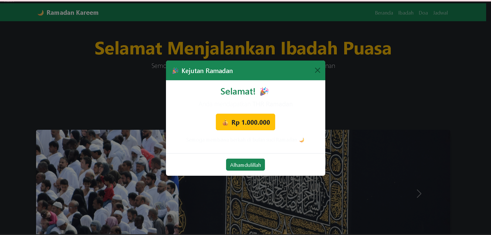

 <div align="center">

# LAPORAN PRAKTIKUM
# APLIKASI BERBASIS PLATFORM

---

## MODUL 5
## HALAMAN RAMADAN DENGAN MODAL THR

---


---

**Disusun Oleh :**

**TEGAR BANGKIT WIJAYA**

**2311102027**

**S1 IF-11-REG01**

---

**Dosen Pengampu :**

Dimas Fanny Hebrasianto Permadi, S.ST., M.Kom

---

**PROGRAM STUDI S1 INFORMATIKA**

**FAKULTAS INFORMATIKA**

**UNIVERSITAS TELKOM PURWOKERTO**

**2025/2026**

</div>

---

## 1. Dasar Teori

Bootstrap 5 merupakan versi terbaru dari framework Bootstrap yang membawa banyak pembaruan dan peningkatan dibandingkan versi sebelumnya. Salah satu perubahan utama adalah dihapuskannya ketergantungan pada jQuery sehingga Bootstrap 5 berjalan dengan JavaScript vanilla murni yang lebih ringan dan cepat.

Pada praktikum ini Bootstrap digunakan lebih lanjut dengan menambahkan komponen interaktif **Modal** pada halaman Ramadan yang sudah dibuat sebelumnya.

**Modal** adalah komponen Bootstrap yang menampilkan konten overlay di atas halaman utama tanpa berpindah halaman. Modal sangat berguna untuk menampilkan notifikasi, konfirmasi, atau informasi tambahan secara interaktif. Struktur modal terdiri dari beberapa bagian yaitu `modal` sebagai wrapper utama, `modal-dialog` untuk mengatur ukuran dan posisi, `modal-content` sebagai container konten, `modal-header` untuk judul, `modal-body` untuk isi konten, dan `modal-footer` untuk tombol aksi.

Untuk mengaktifkan modal menggunakan Bootstrap, digunakan atribut data khusus pada elemen tombol yaitu `data-bs-toggle="modal"` untuk memberitahu Bootstrap bahwa tombol ini akan membuka modal, dan `data-bs-target="#idModal"` untuk menentukan modal mana yang akan dibuka berdasarkan id nya. Untuk menutup modal digunakan atribut `data-bs-dismiss="modal"` pada tombol di dalam modal.

Class `modal-dialog-centered` digunakan untuk memposisikan modal tepat di tengah layar secara vertikal. Animasi `modal fade` memberikan efek transisi yang halus saat modal muncul dan menghilang.

---

## 2. Penjelasan Kode

Berikut adalah implementasi halaman Ramadan dengan tambahan tombol dan modal THR menggunakan Bootstrap 5.

### Kode HTML (index.html)
```html
<!-- 
    Nama  : Tegar Bangkit Wijaya
    NIM   : 2311102027
    Kelas : S1 IF-11-REG01
-->
<!DOCTYPE html>
<html lang="id">
<head>
<meta charset="UTF-8">
<meta name="viewport" content="width=device-width, initial-scale=1">
<title>Ramadan Kareem</title>
<link href="https://cdn.jsdelivr.net/npm/bootstrap@5.3.2/dist/css/bootstrap.min.css" rel="stylesheet">
</head>
<body class="bg-dark text-light">

<nav class="navbar navbar-expand-lg navbar-dark bg-success">
  <div class="container">
    <a class="navbar-brand fw-bold">🌙 Ramadan Kareem</a>
    <button class="navbar-toggler" data-bs-toggle="collapse" data-bs-target="#menu">
      <span class="navbar-toggler-icon"></span>
    </button>
    <div class="collapse navbar-collapse" id="menu">
      <ul class="navbar-nav ms-auto">
        <li class="nav-item"><a class="nav-link">Beranda</a></li>
        <li class="nav-item"><a class="nav-link">Ibadah</a></li>
        <li class="nav-item"><a class="nav-link">Doa</a></li>
        <li class="nav-item"><a class="nav-link">Jadwal</a></li>
      </ul>
    </div>
  </div>
</nav>

<div class="container text-center py-5">
  <h1 class="display-4 fw-bold text-warning">Selamat Menjalankan Ibadah Puasa</h1>
  <p class="lead">Semoga Ramadan membawa keberkahan, kedamaian, dan ampunan</p>
  <span class="badge bg-warning text-dark fs-6">Ramadan 1447 H</span>
</div>

<div class="text-center mb-5">
  <button class="btn btn-warning btn-lg shadow" data-bs-toggle="modal" data-bs-target="#thrModal">
    🎁 Klaim THR Ramadan
  </button>
</div>

<div class="container mb-5">
  <div id="ramadanCarousel" class="carousel slide" data-bs-ride="carousel">
    <div class="carousel-inner rounded shadow">
      <div class="carousel-item active">
        
      </div>
      <div class="carousel-item">
        
      </div>
      <div class="carousel-item">
        
      </div>
    </div>
    <button class="carousel-control-prev" data-bs-target="#ramadanCarousel" data-bs-slide="prev">
      <span class="carousel-control-prev-icon"></span>
    </button>
    <button class="carousel-control-next" data-bs-target="#ramadanCarousel" data-bs-slide="next">
      <span class="carousel-control-next-icon"></span>
    </button>
  </div>
</div>

<div class="container mb-5">
  <div class="row g-4">
    <div class="col-md-4">
      <div class="card text-dark shadow">
        <div class="card-body text-center">
          <h4>🕌 Sholat Tarawih</h4>
          <p>Sholat sunnah yang dilakukan pada malam hari selama Ramadan.</p>
          <button class="btn btn-success">Pelajari</button>
        </div>
      </div>
    </div>
    <div class="col-md-4">
      <div class="card text-dark shadow">
        <div class="card-body text-center">
          <h4>📖 Tadarus Qur'an</h4>
          <p>Membaca Al-Qur'an untuk menambah pahala di bulan suci Ramadan.</p>
          <button class="btn btn-success">Pelajari</button>
        </div>
      </div>
    </div>
    <div class="col-md-4">
      <div class="card text-dark shadow">
        <div class="card-body text-center">
          <h4>🤲 Sedekah</h4>
          <p>Ramadan adalah waktu terbaik untuk berbagi kepada sesama.</p>
          <button class="btn btn-success">Pelajari</button>
        </div>
      </div>
    </div>
  </div>
</div>

<div class="container mb-5">
  <h3 class="text-center mb-4">Progress Ibadah Ramadan</h3>
  <p>Puasa</p>
  <div class="progress mb-3">
    <div class="progress-bar bg-success" style="width:70%">70%</div>
  </div>
  <p>Tadarus</p>
  <div class="progress mb-3">
    <div class="progress-bar bg-warning" style="width:50%">50%</div>
  </div>
  <p>Sedekah</p>
  <div class="progress">
    <div class="progress-bar bg-info" style="width:40%">40%</div>
  </div>
</div>

<div class="modal fade" id="thrModal" tabindex="-1">
  <div class="modal-dialog modal-dialog-centered">
    <div class="modal-content text-center">
      <div class="modal-header bg-success text-white">
        <h5 class="modal-title">🎉 Kejutan Ramadan</h5>
        <button type="button" class="btn-close" data-bs-dismiss="modal"></button>
      </div>
      <div class="modal-body">
        <h3 class="text-success">Selamat! 🎉</h3>
        <p class="lead">Anda mendapatkan <b>THR Ramadan</b></p>
        <span class="badge bg-warning text-dark fs-5 p-3">💰 Rp 1.000.000</span>
        <p class="mt-3">Semoga membawa berkah di bulan suci Ramadan 🌙</p>
      </div>
      <div class="modal-footer justify-content-center">
        <button class="btn btn-success" data-bs-dismiss="modal">Alhamdulillah</button>
      </div>
    </div>
  </div>
</div>

<footer class="bg-success text-center py-3">
  <p class="mb-0">✨ Ramadan Mubarak | Semoga Amal Ibadah Kita Diterima ✨</p>
</footer>

<script src="https://cdn.jsdelivr.net/npm/bootstrap@5.3.2/dist/js/bootstrap.bundle.min.js"></script>
</body>
</html>
```

### Penjelasan Kode

Tombol THR menggunakan class `btn btn-warning btn-lg shadow` untuk tampilan tombol besar berwarna kuning dengan bayangan. Atribut `data-bs-toggle="modal"` dan `data-bs-target="#thrModal"` menghubungkan tombol ke modal dengan id `thrModal` sehingga ketika tombol diklik modal otomatis muncul tanpa perlu menulis JavaScript sama sekali.

Modal menggunakan class `modal fade` untuk efek animasi saat muncul dan menghilang. Class `modal-dialog-centered` memposisikan modal tepat di tengah layar. Modal header menggunakan `bg-success text-white` untuk tampilan hijau sesuai tema Ramadan.

Bagian modal body menampilkan ucapan selamat, nominal THR dalam badge `bg-warning`, dan doa Ramadan. Modal footer berisi tombol penutup dengan atribut `data-bs-dismiss="modal"` yang menutup modal ketika diklik.

---

## 3. Hasil

### Tampilan Halaman Utama


---

<div align="center">

*2311102027 - Tegar Bangkit Wijaya - S1 IF-11-REG01*

</div>
