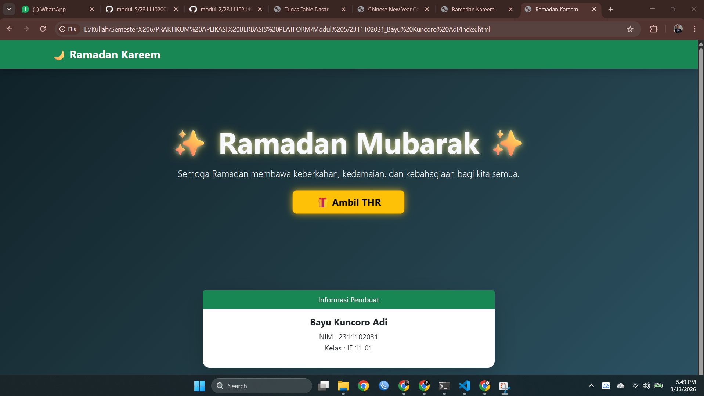
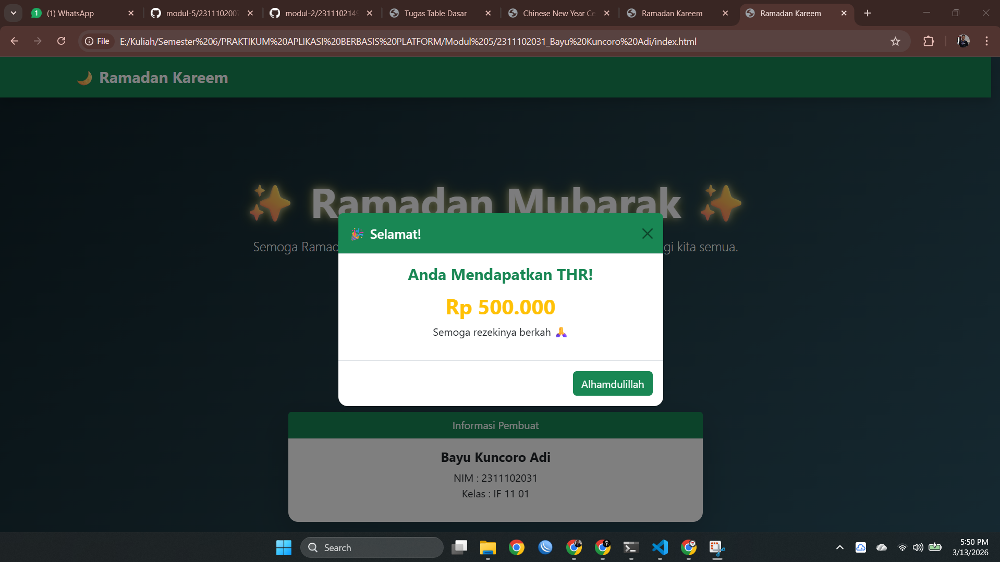

<div align="center">
  <br />
  <h1>LAPORAN PRAKTIKUM <br>APLIKASI BERBASIS PLATFORM</h1>
  <br />
  <h3>MODUL 5 <br> JAVASCRIPT</h3>
  <br />
  <br />
   
  <br />
  <br />
  <br />
  <br />
  <h3>Disusun Oleh :</h3>
  <p>
    <strong>Bayu Kuncoro Adi</strong><br>
    <strong>2311102031</strong><br>
    <strong>S1 IF-11-REG01</strong>
  </p>
  <br />
  <br />
  <h3>Dosen Pengampu :</h3>
  <p>
    <strong>Dimas Fanny Hebrasianto Permadi, S.ST., M.Kom</strong>
  </p>
  <br />
  <br />
    <h4>Asisten Praktikum :</h4>
    <strong> Apri Pandu Wicaksono </strong> <br>
    <strong>Rangga Pradarrell Fathi</strong>
  <br />
  <h3>LABORATORIUM HIGH PERFORMANCE
 <br>FAKULTAS INFORMATIKA <br>UNIVERSITAS TELKOM PURWOKERTO <br>2026</h3>
</div>

---

## 1. Dasar Teori

**JavaScript (JS)** adalah bahasa pemrograman tingkat tinggi yang digunakan untuk menambahkan sifat **interaktif, dinamis, dan responsif** pada halaman web. Bahasa ini pada awalnya dirancang untuk dijalankan di **sisi klien (browser)** sehingga dapat berinteraksi langsung dengan pengguna. Dengan JavaScript, halaman web dapat memperbarui kontennya tanpa perlu melakukan **reload**, serta mampu melakukan validasi data pada formulir sebelum informasi tersebut dikirimkan ke server.

Melalui konsep **DOM (Document Object Model)**, JavaScript dapat mengakses serta memanipulasi struktur dokumen HTML secara terstruktur. Dengan memanfaatkan DOM, pengembang dapat menambahkan, menghapus, maupun mengubah elemen HTML, serta menyesuaikan **gaya tampilan (CSS)** secara dinamis berdasarkan suatu **event** atau peristiwa tertentu, seperti klik, hover, pengguliran halaman, maupun interaksi pengguna lainnya.

Seiring berkembangnya teknologi web, penggunaan JavaScript tidak lagi terbatas pada sisi klien saja. Saat ini JavaScript juga dapat dijalankan di **sisi server** dengan bantuan *runtime environment* seperti **Node.js**, sehingga pengembang dapat membangun aplikasi web secara lebih menyeluruh dengan menggunakan satu bahasa pemrograman yang sama baik pada bagian front-end maupun back-end.

````


---

## 2. Penjelasan Kode HTML, CSS, dan JS


### Kode HTML

```html
<!DOCTYPE html>
<html lang="id">
<head>

<meta charset="UTF-8">
<meta name="viewport" content="width=device-width, initial-scale=1">

<title>Ramadan Kareem</title>

<!-- Bootstrap -->
<link href="https://cdn.jsdelivr.net/npm/bootstrap@5.3.3/dist/css/bootstrap.min.css" rel="stylesheet">

<!-- CSS -->
<link rel="stylesheet" href="style.css">

</head>

<body>

<!-- Navbar -->
<nav class="navbar navbar-dark bg-success shadow">
<div class="container">
<span class="navbar-brand fw-bold fs-4">
🌙 Ramadan Kareem
</span>
</div>
</nav>


<!-- Hero -->
<section class="hero text-center text-light">

<div class="container">

<h1 class="display-3 fw-bold mb-3">
✨ Ramadan Mubarak ✨
</h1>

<p class="lead mb-4">
Semoga Ramadan membawa keberkahan,
kedamaian, dan kebahagiaan bagi kita semua.
</p>

<button id="thrButton" class="btn btn-warning btn-lg px-5">
🎁 Ambil THR
</button>

</div>

</section>


<!-- Informasi -->
<div class="container mt-5">

<div class="row justify-content-center">

<div class="col-md-6">

<div class="card shadow-lg text-center border-0">

<div class="card-header bg-success text-white">
Informasi Pembuat
</div>

<div class="card-body">

<h5 class="fw-bold">
Bayu Kuncoro Adi
</h5>

<p>
NIM : 2311102031 <br>
Kelas : IF 11 01
</p>

</div>

</div>

</div>

</div>

</div>


<!-- Modal -->
<div class="modal fade" id="thrModal">

<div class="modal-dialog modal-dialog-centered">

<div class="modal-content text-center">

<div class="modal-header bg-success text-white">

<h5 class="modal-title">
🎉 Selamat!
</h5>

<button class="btn-close" data-bs-dismiss="modal"></button>

</div>

<div class="modal-body">

<h4 class="text-success fw-bold mb-3">
Anda Mendapatkan THR!
</h4>

<h2 id="thrAmount" class="text-warning fw-bold"></h2>

<p>Semoga rezekinya berkah 🙏</p>

</div>

<div class="modal-footer">

<button class="btn btn-success" data-bs-dismiss="modal">
Alhamdulillah
</button>

</div>

</div>
</div>
</div>


<footer class="text-center text-light mt-5 mb-3">
<p>© 2026 Ramadan Greeting Page</p>
</footer>


<script src="https://cdn.jsdelivr.net/npm/bootstrap@5.3.3/dist/js/bootstrap.bundle.min.js"></script>

<script src="script.js"></script>

</body>
</html>
````

### Kode CSS (`style.css`)

```css
body{
background:linear-gradient(135deg,#0f2027,#203a43,#2c5364);
min-height:100vh;
font-family:'Segoe UI',sans-serif;
}


/* HERO */

.hero{
padding:120px 20px;
position:relative;
}


/* efek glow */

.hero h1{
text-shadow:
0 0 10px rgba(255,255,255,0.6),
0 0 20px rgba(255,215,0,0.5);
}


/* button animation */

#thrButton{

font-size:20px;
font-weight:bold;

transition:0.3s;

animation:pulse 2s infinite;

box-shadow:
0 0 15px rgba(255,193,7,0.8);
}


#thrButton:hover{

transform:scale(1.1);

box-shadow:
0 0 30px rgba(255,193,7,1);

}


/* pulse animation */

@keyframes pulse{

0%{
transform:scale(1);
}

50%{
transform:scale(1.05);
}

100%{
transform:scale(1);
}

}


/* card */

.card{

border-radius:15px;

animation:fadeUp 1s ease;

}


@keyframes fadeUp{

from{
opacity:0;
transform:translateY(30px);
}

to{
opacity:1;
transform:translateY(0);
}

}


/* modal */

.modal-content{

border-radius:15px;

}
```

### Kode JS (`main.js`)

```javascript
const thrButton = document.getElementById("thrButton");

const thrModal = new bootstrap.Modal(
document.getElementById("thrModal")
);

const thrAmount = document.getElementById("thrAmount");

thrButton.addEventListener("click", function(){

// daftar nominal THR
const thrList = [
"Rp 50.000",
"Rp 100.000",
"Rp 250.000",
"Rp 500.000",
"Rp 1.000.000"
];

// random THR
const randomThr = thrList[Math.floor(Math.random()*thrList.length)];

thrAmount.innerText = randomThr;

thrModal.show();

});
```

### Hasil Tampilan (Screenshot)




### Penjelasan code:

#### 1. HTML (`index.html`)

File index.html merupakan struktur utama dari halaman web yang menampilkan ucapan Ramadan serta fitur interaktif untuk mengambil THR. Pada bagian awal terdapat deklarasi <!DOCTYPE html> yang berfungsi untuk memberi tahu browser bahwa dokumen menggunakan standar HTML5. Selanjutnya tag <html lang="id"> menunjukkan bahwa bahasa utama halaman menggunakan Bahasa Indonesia. Pada bagian <head> terdapat beberapa elemen penting seperti <meta charset="UTF-8"> yang digunakan untuk mengatur sistem pengkodean karakter agar berbagai karakter seperti simbol dan huruf dapat ditampilkan dengan benar. Selain itu terdapat <meta name="viewport"> yang berfungsi agar halaman dapat tampil secara responsif pada berbagai perangkat seperti komputer, tablet, maupun smartphone. Judul halaman ditentukan melalui tag <title> yaitu Ramadan Kareem. Pada bagian ini juga dimuat Bootstrap CSS melalui CDN yang memungkinkan penggunaan berbagai komponen antarmuka seperti navbar, card, grid layout, dan modal tanpa harus membuat desain dari awal. Selain itu terdapat juga file CSS eksternal style.css yang digunakan untuk menambahkan tampilan khusus di luar Bootstrap.

Pada bagian <body>, halaman dimulai dengan komponen navbar Bootstrap yang memiliki kelas navbar, navbar-dark, dan bg-success. Navbar ini berfungsi sebagai bagian header halaman yang menampilkan teks “🌙 Ramadan Kareem” sebagai identitas utama halaman web. Setelah itu terdapat bagian hero section yang dibungkus dalam elemen <section> dengan kelas hero. Bagian ini berisi judul utama “Ramadan Mubarak”, pesan ucapan Ramadan, serta sebuah tombol “🎁 Ambil THR” yang akan memicu interaksi ketika ditekan oleh pengguna. Seluruh konten ini dibungkus dalam <div class="container"> agar tata letaknya lebih rapi dan responsif.

Di bawah bagian hero terdapat bagian Informasi Pembuat yang menggunakan komponen card Bootstrap. Card ini berfungsi untuk menampilkan identitas pembuat halaman yaitu Bayu Kuncoro Adi, dengan NIM 2311102031 dan kelas IF 11 01. Penggunaan sistem grid Bootstrap seperti row, col-md-6, dan mx-auto membantu menempatkan card agar berada di tengah halaman. Setelah itu terdapat komponen modal Bootstrap yang digunakan untuk menampilkan pesan ketika pengguna berhasil mendapatkan THR. Modal ini memiliki struktur yang terdiri dari modal-header, modal-body, dan modal-footer. Bagian header menampilkan judul “Selamat!”, bagian body menampilkan pesan bahwa pengguna mendapatkan THR beserta nominalnya, sedangkan bagian footer berisi tombol “Alhamdulillah” untuk menutup modal. Pada bagian akhir dokumen dimuat Bootstrap JavaScript melalui CDN agar komponen interaktif seperti modal dapat berfungsi, serta file JavaScript eksternal script.js yang digunakan untuk mengatur logika interaksi tombol THR.

---

#### 2. Styling CSS (`style.css`)

File style.css berfungsi untuk menambahkan pengaturan tampilan visual pada halaman agar terlihat lebih menarik dan modern. Pada bagian awal terdapat pengaturan untuk elemen body yang menggunakan properti background: linear-gradient(...). Properti ini menghasilkan latar belakang berupa gradasi warna biru gelap yang memberikan kesan elegan dan modern. Selain itu properti min-height:100vh digunakan agar tinggi halaman minimal mengikuti tinggi layar perangkat. Penggunaan font-family:'Segoe UI', sans-serif bertujuan untuk memberikan tampilan teks yang lebih bersih dan modern.

Selanjutnya terdapat pengaturan untuk bagian hero section yang menggunakan selector .hero. Properti padding:120px 20px digunakan untuk memberikan jarak yang cukup luas di bagian atas dan bawah sehingga konten terlihat lebih lega dan fokus pada pesan utama. Pada elemen judul hero terdapat efek text-shadow yang memberikan efek cahaya (glow) pada teks sehingga tampilan judul menjadi lebih menarik dan sesuai dengan tema perayaan Ramadan.

Pada bagian berikutnya terdapat pengaturan untuk tombol Ambil THR dengan selector #thrButton. Tombol ini diberi properti transition agar perubahan tampilan terjadi secara halus, serta box-shadow untuk memberikan efek cahaya di sekeliling tombol. Selain itu tombol juga diberi animasi menggunakan animation: pulse 2s infinite sehingga tombol terlihat berdenyut secara halus untuk menarik perhatian pengguna. Ketika pengguna mengarahkan kursor ke tombol, aturan pada #thrButton:hover akan dijalankan. Pada kondisi ini tombol akan sedikit membesar menggunakan transform: scale(1.1) serta memiliki efek cahaya yang lebih kuat melalui box-shadow, sehingga memberikan kesan interaktif.

Selanjutnya terdapat pengaturan untuk elemen .card yang digunakan sebagai wadah konten. Card diberi properti border-radius agar sudutnya terlihat lebih halus serta animasi fadeUp agar card muncul dengan efek bergerak dari bawah ke atas ketika halaman dimuat. Animasi ini didefinisikan menggunakan @keyframes fadeUp, di mana pada kondisi awal elemen memiliki opacity:0 dan posisi sedikit lebih rendah menggunakan transform: translateY(30px), kemudian secara bertahap berubah menjadi opacity:1 dan kembali ke posisi normal. Terakhir terdapat pengaturan untuk .modal-content yang diberi border-radius agar tampilan jendela modal terlihat lebih modern dan tidak terlalu kaku.

---

#### 3. Fungsi JavaScript (`script.js`)

File script.js berfungsi untuk mengatur interaksi pada halaman web, khususnya ketika pengguna menekan tombol untuk mengambil THR. Pada bagian awal, kode document.getElementById("thrButton") digunakan untuk mengambil elemen tombol Ambil THR dari dokumen HTML dan menyimpannya ke dalam variabel thrButton. Selanjutnya dibuat variabel thrModal yang berisi objek modal Bootstrap dengan menggunakan new bootstrap.Modal(...). Kode ini mengambil elemen modal yang memiliki id thrModal pada file HTML dan mengubahnya menjadi objek modal yang dapat dikontrol menggunakan JavaScript.

Setelah itu dibuat variabel thrAmount yang digunakan untuk mengambil elemen HTML dengan id thrAmount. Elemen ini nantinya akan digunakan untuk menampilkan nominal THR yang didapatkan oleh pengguna. Pada bagian berikutnya terdapat fungsi addEventListener("click", ...) yang berfungsi untuk mendeteksi ketika tombol THR ditekan. Ketika peristiwa klik terjadi, program akan menjalankan beberapa langkah. Pertama, dibuat sebuah array bernama thrList yang berisi beberapa pilihan nominal THR seperti Rp 50.000, Rp 100.000, Rp 250.000, Rp 500.000, dan Rp 1.000.000. Setelah itu program akan memilih salah satu nilai secara acak menggunakan rumus Math.random() yang dikombinasikan dengan Math.floor() untuk menghasilkan indeks acak dari array tersebut.

Nilai THR yang terpilih kemudian disimpan dalam variabel randomThr, lalu ditampilkan pada halaman dengan mengubah isi teks dari elemen thrAmount menggunakan innerText. Setelah nilai THR berhasil ditampilkan, fungsi thrModal.show() akan dijalankan untuk memunculkan modal Bootstrap yang berisi pesan bahwa pengguna berhasil mendapatkan THR. Dengan adanya JavaScript ini, halaman web tidak hanya menampilkan informasi statis, tetapi juga memiliki interaksi dinamis yang memungkinkan pengguna berinteraksi langsung dengan halaman melalui tombol dan mendapatkan hasil yang berbeda setiap kali tombol ditekan.

## Refrensi

- [Materi Modul 5](https://drive.google.com/file/d/1J27NhEO2MbOF9DetZmOtEGAcPkczzm1r/view?usp=sharing)
