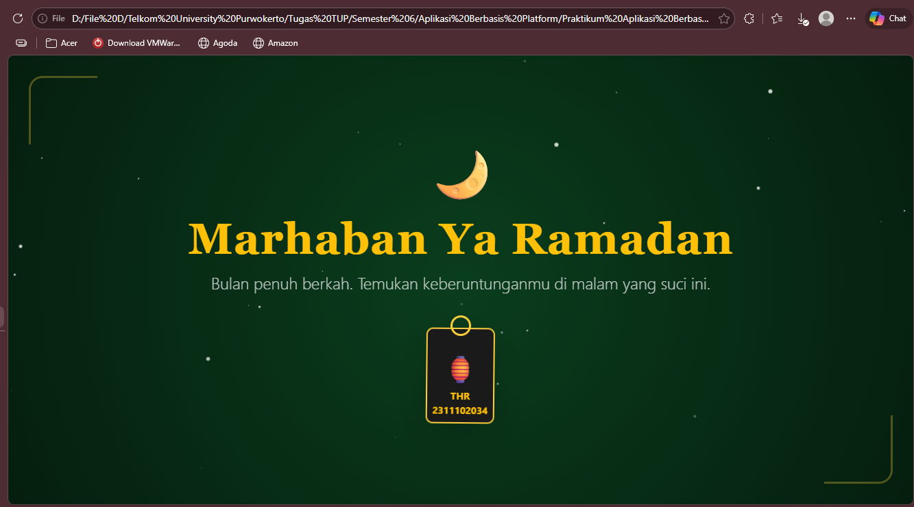
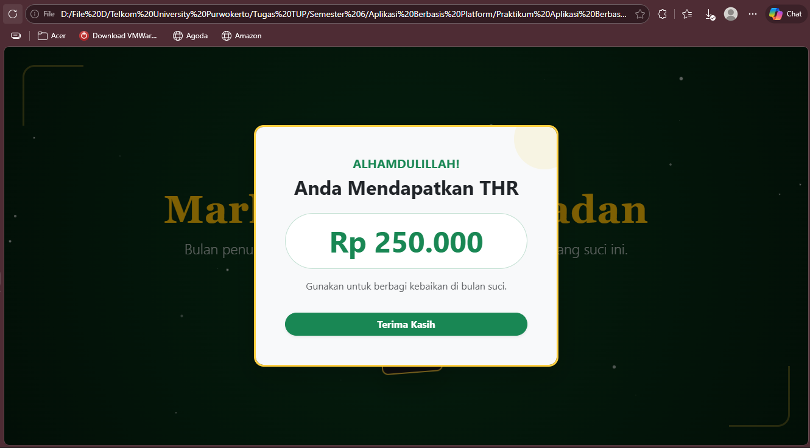

<div align="center">
  <br />
  <h1>LAPORAN PRAKTIKUM <br>APLIKASI BERBASIS PLATFORM</h1>
  <br />
  <h3>MODUL 5 <br> JAVASCRIPT & JQUERY </h3>
  <br />
   
  <br />
  <br />
  <br />
  <h3>Disusun Oleh :</h3>
  <p>
    <strong>Rizal Dwi Anggoro</strong><br>
    <strong>2311102034</strong><br>
    <strong>IF-11-REG01</strong>
  </p>
  <br />
  <h3>Dosen Pengampu :</h3>
  <p>
    <strong>Dimas Fanny Hebrasianto Permadi, S.ST., M.Kom</strong>
  </p>
  <br />
  <br />
    <h4>Asisten Praktikum :</h4>
    <strong> Apri Pandu Wicaksono </strong> <br>
    <strong>Rangga Pradarrell Fathi</strong>
  <br />
  <h3>LABORATORIUM HIGH PERFORMANCE
 <br>FAKULTAS INFORMATIKA <br>UNIVERSITAS TELKOM PURWOKERTO <br>2026</h3>
</div>

---

### DASAR MATERI
Javascript, seperti namanya, merupakan bahasa pemrograman scripting. Dan seperti bahasa scripting
lainnya, Javascript umumnya digunakan hanya untuk program yang tidak terlalu besar, biasanya hanya
beberapa ratus baris. Javascript pada umumnya mengontrol program yang berbasis Java. Jadi memang
pada dasarnya Javascript tidak dirancang untuk digunakan dalam aplikasi skala besar.
Meskipun dibuat dengan tujuan awal untuk mengendalikan program Java, komunitas Javascript
menggunakan bahasa ini untuk tujuan lain, memanipulasi gambar dan isi dari dokumen HTML. Singkatnya,
pada akhirnya Javascript digunakan untuk satu tujuan utama, “menghidupkan” dokumen HTML dengan
mengubah konten statis menjadi dinamis dan interaktif. Bersamaan dengan perkembangan Internet dan
dunia web yang pesat, Javascript akhirnya menjadi bahasa utama dan satu-satunya untuk membuat HTML menjadi interaktif di dalam browser.

### UNGUIDED
**Code HTML(indeks.html)** :
```html
<!DOCTYPE html>
<html lang="id">
<head>
    <meta charset="UTF-8">
    <meta name="viewport" content="width=device-width, initial-scale=1.0">
    <title>Ramadan Kareem - Special THR</title>
    <link href="https://cdn.jsdelivr.net/npm/bootstrap@5.3.0/dist/css/bootstrap.min.css" rel="stylesheet">
    <link rel="stylesheet" href="style.css">
</head>
<body class="bg-ramadan text-light overflow-hidden">

    <div id="particle-container"></div>

    <div class="islamic-pattern"></div>

    <section class="hero-section min-vh-100 d-flex align-items-center justify-content-center position-relative">
        
        <div class="corner-ornament top-left"></div>
        <div class="corner-ornament bottom-right"></div>

        <div class="container text-center z-2">
            <div class="text-warning mb-3">
                <span class="display-1">🌙</span>
            </div>
            <h1 class="display-3 fw-bold text-warning mb-2 serif-font">Marhaban Ya Ramadan</h1>
            <p class="lead mb-5 fs-4 opacity-75">Bulan penuh berkah. Temukan keberuntunganmu di malam yang suci ini.</p>

            <div class="lantern-wrapper">
                <button type="button" id="btnBukaThr" class="btn-lantern border-0 bg-transparent p-0">
                    <div class="lantern shadow-lg">
                        <div class="lantern-handle"></div>
                        <div class="lantern-glass">
                            <span class="fs-1 text-warning">🏮</span>
                            <span class="d-block text-warning small fw-bold">THR 2311102034</span>
                        </div>
                    </div>
                </button>
            </div>
        </div>
    </section>

    <div class="modal fade" id="thrModal" tabindex="-1" aria-hidden="true">
        <div class="modal-dialog modal-dialog-centered">
            <div class="modal-content bg-light text-dark border-warning border-3 rounded-4 overflow-hidden shadow-lg">
                <div class="modal-body text-center p-5 position-relative">
                    
                    <div class="modal-ornament"></div>

                    <h5 class="text-success text-uppercase fw-bold mb-2">Alhamdulillah!</h5>
                    <h2 class="fw-bold mb-4">Anda Mendapatkan THR</h2>
                    
                    <div class="display-5 fw-bold text-success p-3 rounded-pill bg-white border border-success border-opacity-25 mb-3" id="nominalThr">
                        Rp 0
                    </div>
                    
                    <p class="text-muted fs-6 mb-4">Gunakan untuk berbagi kebaikan di bulan suci.</p>
                    <button type="button" class="btn btn-success w-100 mt-2 rounded-pill fw-bold shadow-sm" data-bs-dismiss="modal">Terima Kasih</button>
                </div>
            </div>
        </div>
    </div>

    <script src="https://cdn.jsdelivr.net/npm/bootstrap@5.3.0/dist/js/bootstrap.bundle.min.js"></script>
    <script src="script.js"></script>
</body>
</html>
```

**Penjelasan Code :**

Kode HTML tersebut digunakan untuk membuat halaman web bertema Ramadan Kareem yang menampilkan ucapan Ramadan serta fitur pembagian THR secara interaktif. Dokumen diawali dengan deklarasi `<!DOCTYPE html>` yang menunjukkan bahwa halaman menggunakan standar HTML5, kemudian tag `<html lang="id">` menandakan bahwa bahasa yang digunakan adalah Bahasa Indonesia. Pada bagian `<head>` terdapat beberapa konfigurasi penting seperti pengaturan encoding karakter UTF-8, pengaturan viewport agar tampilan responsif di berbagai perangkat, serta judul halaman yang akan tampil pada tab browser. Selain itu, halaman juga memanggil Bootstrap CSS dari CDN untuk membantu pembuatan tampilan yang responsif dan file style.css untuk menambahkan desain khusus. Pada bagian `<body>` ditampilkan elemen dekoratif seperti particle background dan pola islami untuk memperindah tampilan halaman. Selanjutnya terdapat hero section yang menampilkan ikon bulan, judul “Marhaban Ya Ramadan”, dan deskripsi singkat mengenai bulan Ramadan. Di bagian tengah halaman terdapat tombol berbentuk lampu (lantern) yang dapat diklik untuk membuka hadiah THR. Ketika tombol tersebut ditekan, akan muncul modal Bootstrap yang menampilkan pesan ucapan serta nominal THR yang diterima pengguna. Pada bagian akhir dokumen dipanggil Bootstrap JavaScript dan file script.js yang berfungsi untuk mengatur interaksi halaman seperti menampilkan modal dan menentukan nominal THR secara dinamis.

**Code CSS(style.css)** :
```css
/* Palet Warna Ramadan */
:root {
    --deep-green: #0a3d1d;
    --gold: #ffcf40;
    --dark-bg: #051e0e;
}

/* Font Serif untuk Kesan Tradisional/Spiritual */
.serif-font {
    font-family: 'Georgia', 'Times New Roman', serif;
    letter-spacing: 1px;
}

/* Latar Belakang Ramadan: Gradasi Hijau Tua & Hitam */
.bg-ramadan {
    background: radial-gradient(circle at center, var(--deep-green) 0%, var(--dark-bg) 100%);
    position: relative;
}

/* Pola Islami sebagai Overlay */
.islamic-pattern {
    position: fixed;
    top: 0; left: 0; width: 100%; height: 100%;
    background-image: url('data:image/svg+xml;base64,PHN2ZyB4bWxucz0iaHR0cDovL3d3dy53My5vcmcvMjAwMC9zdmciIHdpZHRoPSI0MCIgaGVpZ2h0PSI0MCIgdmlld0JveD0iMCAwIDQwIDQwIj48ZyBmaWxsLXJ1bGU9ImV2ZW5vZGQiPjxnIGZpbGw9IiNmZmNmNDAiIGZpbGwtb3BhY2l0eT0iMC4wNSI+PHBhdGggZD0iTTAgMGg0MHY0MEgwVjB6bTIwIDIwaDIwdjIwSDIWMjB6TTAgMjBoMjB2MjBIMFYyMHoyMCAwaDIwdjIwSDIwVjB6Ii8+PC9nPjwvZz48L3N2Zz4=');
    background-size: 80px;
    opacity: 0.5;
    z-index: 1;
}

/* Ornamen Sudut */
.corner-ornament {
    position: absolute;
    width: 100px;
    height: 100px;
    border: 3px solid var(--gold);
    opacity: 0.3;
    z-index: 1;
}

.top-left { top: 30px; left: 30px; border-right: none; border-bottom: none; border-radius: 20px 0 0 0; }
.bottom-right { bottom: 30px; right: 30px; border-left: none; border-top: none; border-radius: 0 0 20px 0; }

/* Styling Tombol Lentera */
.btn-lantern {
    transition: transform 0.3s ease;
    z-index: 10;
    position: relative;
}

.btn-lantern:hover {
    transform: scale(1.1) translateY(-10px);
}

.lantern {
    background: #1a1a1a;
    width: 100px;
    height: 140px;
    border-radius: 10px;
    border: 2px solid var(--gold);
    display: flex;
    align-items: center;
    justify-content: center;
    padding-top: 20px;
    box-shadow: 0 0 30px rgba(255, 207, 64, 0.4);
    animation: sway 4s ease-in-out infinite;
    transform-origin: top center;
}

.lantern-handle {
    position: absolute;
    top: -20px;
    left: 50%;
    transform: translateX(-50%);
    width: 30px; height: 30px;
    border: 3px solid var(--gold);
    border-radius: 50%;
}

@keyframes sway {
    0%, 100% { transform: rotate(-5deg); }
    50% { transform: rotate(5deg); }
}

/* Partikel Cahaya (Bintang/Cahaya Malaikat) */
.light-particle {
    position: absolute;
    background-color: white;
    border-radius: 50%;
    animation: twinkle 3s infinite ease-in-out;
    pointer-events: none;
    z-index: 1;
}

@keyframes twinkle {
    0%, 100% { opacity: 0; transform: scale(0.5); }
    50% { opacity: 0.8; transform: scale(1.2); }
}

/* Styling Modal Ramadan */
.modal-content {
    border: 3px solid var(--gold) !important;
}

.modal-ornament {
    position: absolute;
    top: -30px; right: -30px; width: 100px; height: 100px;
    background-color: #f1c40f;
    opacity: 0.1;
    border-radius: 50%;
}
```

**Penjelasan Code :**

Kode CSS tersebut digunakan untuk mengatur tampilan halaman web bertema Ramadan agar terlihat lebih menarik dan bernuansa islami. Pada bagian awal terdapat deklarasi `:root` yang berisi variabel warna seperti deep green, gold, dan dark background yang digunakan sebagai palet warna utama halaman. Selanjutnya terdapat class `.serif-font` yang digunakan untuk mengatur jenis font agar terlihat lebih tradisional dan memberikan kesan spiritual. Class `.bg-ramadan` berfungsi untuk membuat latar belakang halaman menggunakan gradasi warna hijau tua dan hitam sehingga memberikan suasana malam Ramadan. Selain itu terdapat `.islamic-pattern` yang menambahkan pola islami sebagai overlay pada halaman menggunakan gambar SVG sehingga tampilan terlihat lebih dekoratif. Beberapa elemen tambahan seperti `.corner-ornament` digunakan untuk membuat ornamen di sudut halaman sebagai hiasan visual. Kemudian terdapat styling pada `.btn-lantern` dan `.lantern` yang digunakan untuk membuat tombol berbentuk lentera dengan efek animasi dan bayangan cahaya sehingga terlihat seperti lampu Ramadan yang bergoyang. Animasi tersebut dibuat menggunakan `@keyframes sway` untuk memberikan efek gerakan lentera dan `@keyframes twinkle` untuk membuat efek partikel cahaya seperti bintang yang berkelap-kelip. Selain itu terdapat juga pengaturan pada `.modal-content` dan `.modal-ornament` yang digunakan untuk mempercantik tampilan modal Bootstrap agar sesuai dengan tema Ramadan ketika menampilkan hadiah THR kepada pengguna.

**Code JS(script.js)** :
```js
document.addEventListener('DOMContentLoaded', () => {
    const btnBuka = document.getElementById('btnBukaThr');
    const nominalElement = document.getElementById('nominalThr');
    const thrModal = new bootstrap.Modal(document.getElementById('thrModal'));
    const particleContainer = document.getElementById('particle-container');

    // List nominal THR acak
    const daftarNominal = [
        "Rp 100.000",
        "Rp 250.000",
        "Rp 750.000",
        "Rp 1.500.000",
        "Rp 5.000.000"
    ];

    // 1. Buat efek partikel cahaya di latar belakang saat halaman dimuat
    createBackgroundParticles();

    btnBuka.addEventListener('click', () => {
        // 2. Pilih nominal secara acak
        const randomNominal = daftarNominal[Math.floor(Math.random() * daftarNominal.length)];
        nominalElement.innerText = randomNominal;

        // 3. Tampilkan Modal
        thrModal.show();
    });

    function createBackgroundParticles() {
        // Buat 30 partikel cahaya kecil yang berkedip
        for (let i = 0; i < 30; i++) {
            const particle = document.createElement('div');
            particle.classList.add('light-particle');
            
            // Atur posisi, ukuran, dan delay animasi secara acak
            const size = Math.random() * 4 + 1 + 'px';
            particle.style.width = size;
            particle.style.height = size;
            particle.style.left = Math.random() * 100 + 'vw';
            particle.style.top = Math.random() * 100 + 'vh';
            particle.style.animationDelay = Math.random() * 5 + 's';
            particle.style.opacity = Math.random() * 0.5 + 0.2;

            particleContainer.appendChild(particle);
        }
    }
});
```
**Penjelasan Code :**

Kode JavaScript tersebut berfungsi untuk menambahkan interaksi dan efek animasi pada halaman web bertema Ramadan. Script diawali dengan `document.addEventListener('DOMContentLoaded')` yang memastikan seluruh elemen HTML telah dimuat sebelum JavaScript dijalankan. Di dalamnya terdapat beberapa variabel yang digunakan untuk mengambil elemen HTML seperti tombol buka THR, elemen yang menampilkan nominal THR, modal Bootstrap, serta container untuk partikel latar belakang. Selanjutnya dibuat sebuah array `daftarNominal` yang berisi beberapa kemungkinan nominal THR yang akan dipilih secara acak. Ketika tombol btnBukaThr diklik, program akan memilih salah satu nominal THR secara random menggunakan fungsi `Math.random()` kemudian menampilkan nilai tersebut pada elemen `nominalThr`, setelah itu modal Bootstrap akan ditampilkan menggunakan fungsi `thrModal.show().` Selain itu terdapat fungsi `createBackgroundParticles()` yang dijalankan saat halaman dimuat untuk membuat sekitar 30 partikel cahaya kecil pada latar belakang. Partikel tersebut dibuat secara dinamis menggunakan `document.createElement`, kemudian diberikan ukuran, posisi, transparansi, serta delay animasi secara acak sehingga menghasilkan efek cahaya berkelap-kelip seperti bintang yang memperindah tampilan halaman.

#### HASIL :



