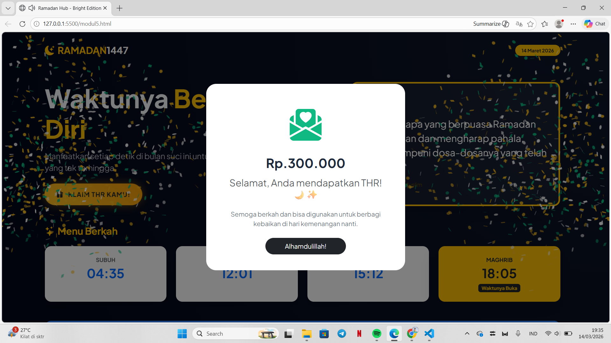

<div align="center">
  <br />
  <h1>LAPORAN PRAKTIKUM <br>APLIKASI BERBASIS PLATFORM</h1>
  <br />
  <h3>MODUL 5 <br> JAVASCRIPT</h3>
  <br />
  <br />
   
  <br />
  <br />
  <br />
  <br />
  <h3>Disusun Oleh :</h3>
  <p>
    <strong>Shiva Indah Kurnia</strong><br>
    <strong>2311102035</strong><br>
    <strong>S1 IF-11-REG01</strong>
  </p>
  <br />
  <br />
  <h3>Dosen Pengampu :</h3>
  <p>
    <strong>Dimas Fanny Hebrasianto Permadi, S.ST., M.Kom</strong>
  </p>
  <br />
  <br />
    <h4>Asisten Praktikum :</h4>
    <strong> Apri Pandu Wicaksono </strong> <br>
    <strong>Rangga Pradarrell Fathi</strong>
  <br />
  <h3>LABORATORIUM HIGH PERFORMANCE
 <br>FAKULTAS INFORMATIKA <br>UNIVERSITAS TELKOM PURWOKERTO <br>2026</h3>
</div>

---

## 1. Dasar Teori

**JavaScript (JS)** adalah bahasa pemrograman dinamis tingkat tinggi yang menjadi pilar utama dalam menciptakan pengalaman pengguna yang interaktif dan responsif di internet. Berbeda dengan HTML yang menyusun struktur atau CSS yang mengatur estetika, JavaScript berperan sebagai "otak" yang memungkinkan elemen pada halaman web bereaksi secara real-time. Hal ini mencakup pembaruan konten secara instan tanpa perlu memuat ulang (reload) halaman, hingga fungsi validasi formulir yang memastikan data akurat sebelum diproses lebih lanjut.

Melalui konsep **DOM (Document Object Model)**, JavaScript dapat mengakses dan memanipulasi struktur dokumen HTML secara logis. Dengan memanfaatkan DOM, pengembang dapat menambah, menghapus, maupun mengubah elemen HTML serta menyesuaikan properti **CSS styling** secara dinamis berdasarkan _event_ atau kejadian tertentu, seperti klik, _hover_, menggulir halaman, dan berbagai interaksi pengguna lainnya.

Seiring berjalannya waktu, peran JavaScript telah melampaui batas browser (sisi klien). Kehadiran runtime environment seperti Node.js telah merevolusi cara kerja pengembang dengan memungkinkan JavaScript berjalan di sisi server (back-end).

Fenomena ini melahirkan konsep Full-Stack JavaScript, di mana pengembang dapat membangun seluruh arsitektur aplikasi—mulai dari antarmuka pengguna, logika server, hingga pengelolaan basis data—hanya dengan satu bahasa pemrograman yang sama. Efisiensi ini tidak hanya mempercepat proses pengembangan, tetapi juga memudahkan sinkronisasi kode di seluruh ekosistem aplikasi modern.

### 2. Penjelasan Kode HTML, CSS, dan JS
````
### Kode HTML

````html
<!DOCTYPE html>
<html lang="id">
<head>
    <meta charset="UTF-8">
    <meta name="viewport" content="width=device-width, initial-scale=1.0">
    <title>Ramadan Hub - Bright Edition</title>
    
    <link href="https://cdn.jsdelivr.net/npm/bootstrap@5.3.2/dist/css/bootstrap.min.css" rel="stylesheet">
    <link rel="stylesheet" href="https://cdn.jsdelivr.net/npm/bootstrap-icons@1.11.1/font/bootstrap-icons.css">
    <link href="https://fonts.googleapis.com/css2?family=Plus+Jakarta+Sans:wght@300;400;700&family=Amiri:ital@1&display=swap" rel="stylesheet">
    <link rel="stylesheet" href="https://cdnjs.cloudflare.com/ajax/libs/animate.css/4.1.1/animate.min.css"/>
    
    <link rel="stylesheet" href="style.css">
</head>
<body>
    <canvas id="confetti-canvas"></canvas>

    <nav class="navbar navbar-expand-lg navbar-dark pt-4">
        </nav>

    <main class="container py-5">
        <button class="btn btn-thr text-dark animate__animated animate__pulse animate__infinite" 
                data-bs-toggle="modal" data-bs-target="#thrModal" onclick="startConfetti()">
            <i class="bi bi-gift-fill me-2"></i> KLAIM THR KAMU!
        </button>
    </main>

    <div class="modal fade" id="thrModal" tabindex="-1">...</div>

    <script src="https://cdn.jsdelivr.net/npm/bootstrap@5.3.2/dist/js/bootstrap.bundle.min.js"></script>
    <script src="https://cdn.jsdelivr.net/npm/canvas-confetti@1.6.0/dist/confetti.browser.min.js"></script>
    
    <script src="main.js"></script>
</body>
</html>
````

### Kode CSS (`style.css`)

```css
body { 
    font-family: 'Plus Jakarta Sans', sans-serif; 
    background: radial-gradient(circle at top right, #0f172a, #020617);
    color: #f8fafc;
}

.glass-card {
    background: rgba(255, 255, 255, 0.05);
    backdrop-filter: blur(10px);
}

.btn-thr {
    background: linear-gradient(45deg, #fbbf24, #f59e0b);
    border-radius: 50px;
    box-shadow: 0 0 20px rgba(245, 158, 11, 0.4);
    transition: all 0.3s ease;
}
```

### Kode JS (`main.js`)

```javascript
// Fungsi suara "Cling"
function playCling() {
    const audioCtx = new (window.AudioContext || window.webkitAudioContext)();
    const oscillator = audioCtx.createOscillator();
    const gainNode = audioCtx.createGain();

    oscillator.type = 'sine';
    oscillator.frequency.setValueAtTime(1200, audioCtx.currentTime);
    gainNode.gain.exponentialRampToValueAtTime(0.01, audioCtx.currentTime + 0.5);

    oscillator.connect(gainNode);
    gainNode.connect(audioCtx.destination);

    oscillator.start();
    oscillator.stop(audioCtx.currentTime + 0.5);
}

// Fungsi Ledakan Confetti
function startConfetti() {
    playCling(); // Panggil suara

    confetti({
        particleCount: 100,
        spread: 70,
        origin: { y: 0.6 },
        colors: ['#fbbf24', '#ffffff', '#10b981']
    });
}
```

### Hasil Tampilan (Screenshot)




### Penjelasan code:

#### 1. HTML: Rangka Utama (Struktur)
Bagian ini menentukan apa saja yang tampil di layar.
- (nav) & navbar: Bagian atas yang berisi logo "RAMADAN 1447" dan penunjuk tanggal. Memakai kelas-kelas dari Bootstrap agar langsung rapi tanpa bikin CSS dari nol.
- (button class="btn-thr"): Ini bagian utamanya. Tombol ini punya atribut data-bs-toggle="modal" yang fungsinya menyuruh Bootstrap memunculkan kotak (modal) saat diklik.
- Jadwal Sholat (Cards): Memakai sistem Grid Bootstrap (col-md-3) supaya jadwalnya berjejer rapi di laptop, tapi bakal bertumpuk vertikal kalau dibuka di HP (responsive).
- (div class="modal"): Ini adalah "kotak rahasia" yang awalnya tersembunyi. Dia baru akan muncul (pop-up) kalau tombol THR diklik. Isinya adalah ucapan selamat.

---

#### 2. CSS: Estetika (Tampilan)
Bagian ini yang bikin halaman kamu kelihatan "mahal" dan modern.
- Radial Gradient: Pada body, Memakai warna biru gelap ke hitam (#0f172a ke #020617) supaya teks kuning emasnya terlihat menyala (kontras).
- Glassmorphism (.glass-card): Ini teknik desain modern yang pakai backdrop-filter: blur(). Fungsinya bikin kartu jadwal sholat kelihatan seperti kaca transparan di atas latar belakang.
- Hover Effects: Kelas .card-bright:hover bikin kartu sedikit terangkat saat disentuh kursor (translateY(-5px)). Ini memberikan feedback ke user kalau elemen itu interaktif.
- Button Glow: Tombol THR diberi box-shadow warna kuning yang berpendar dan animasi pulse dari Animate.css supaya user gatal ingin klik.

---

#### 3. JavaScript: Logika & Interaksi
Ini yang bikin halaman "hidup" dan nggak kaku.
1. playCling() (Audio Synthesis):
   - Tidak pakai file .mp3 eksternal tetapi memakai Web Audio API untuk membuat suara dari nol.
   - oscillator.frequency diatur tinggi (1200Hz) lalu menurun cepat, menciptakan suara "ting!" yang bersih saat tombol diklik.

2. startConfetti():
   - Fungsi ini memanggil library pihak ketiga (canvas-confetti).
   - Mengatur particleCount dan spread supaya ledakan kertasnya meriah tapi tetap enak dilihat.

3. onclick="startConfetti()": Ini adalah jembatan antara HTML dan JS. Saat tombol di HTML diklik, dia langsung teriak ke JS: "Woi, jalankan fungsi suara dan confetti sekarang!"

## Refrensi

- [Materi Modul 5](https://drive.google.com/file/d/1J27NhEO2MbOF9DetZmOtEGAcPkczzm1r/view?usp=sharing)
