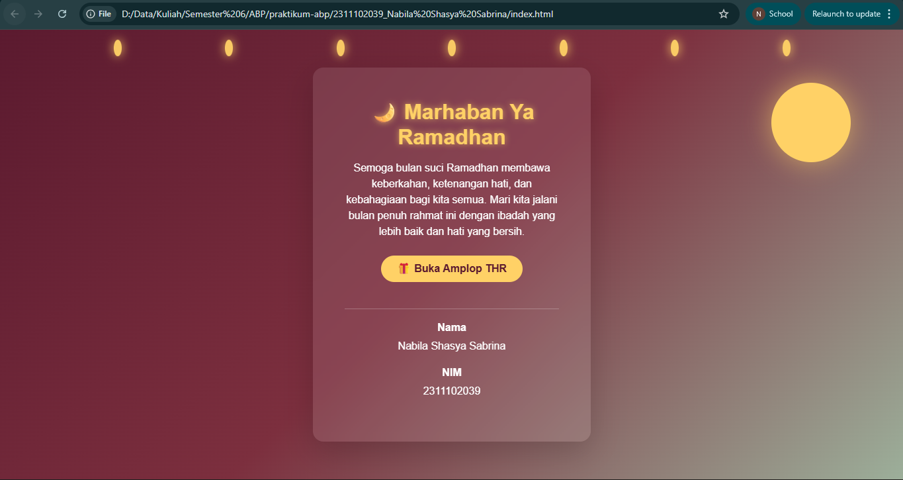
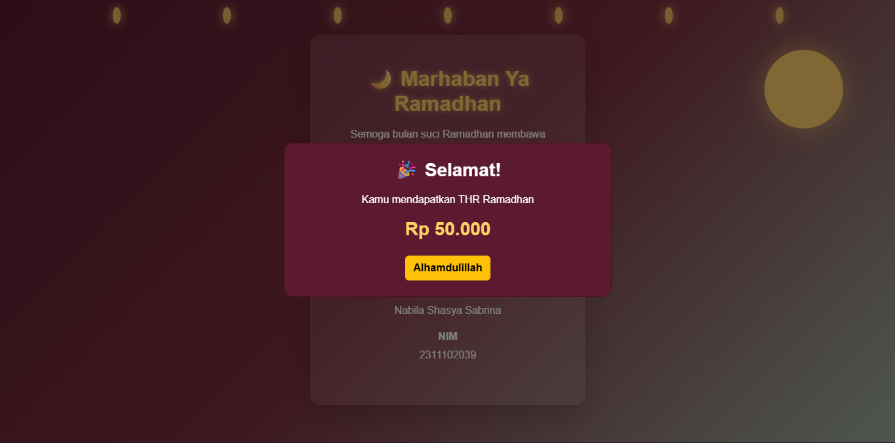

<div align="center">
  <br />
  <h1>LAPORAN PRAKTIKUM <br>APLIKASI BERBASIS PLATFORM</h1>
  <br />
  <h3>MODUL 5 <br> JAVASCRIPT</h3>
  <br />
  <br />
   
  <br />
  <br />
  <br />
  <br />
  <h3>Disusun Oleh :</h3>
  <p>
    <strong>Nabila Shasya Sabrina</strong><br>
    <strong>2311102039</strong><br>
    <strong>S1 IF-11-REG01</strong>
  </p>
  <br />
  <br />
  <h3>Dosen Pengampu :</h3>
  <p>
    <strong>Dimas Fanny Hebrasianto Permadi, S.ST., M.Kom</strong>
  </p>
  <br />
  <br />
    <h4>Asisten Praktikum :</h4>
    <strong> Apri Pandu Wicaksono </strong> <br>
    <strong>Rangga Pradarrell Fathi</strong>
  <br />
  <h3>LABORATORIUM HIGH PERFORMANCE
 <br>FAKULTAS INFORMATIKA <br>UNIVERSITAS TELKOM PURWOKERTO <br>2026</h3>
</div>

---

## 1. Dasar Teori
JavaScript merupakan bahasa pemrograman yang digunakan untuk memberikan fungsi interaktif dan dinamis pada halaman web. Dengan JavaScript, halaman web dapat merespon berbagai tindakan pengguna seperti klik tombol, mengisi formulir, membuka pop-up, ataupun menampilkan data secara dinamis tanpa perlu memuat ulang halaman. JavaScript juga dapat memanipulasi DOM (Document Object Model) sehingga elemen HTML dapat diubah, ditambah, atau dihapus secara langsung melalui kode program.

Selain itu, dalam pengembangan web modern sering digunakan Bootstrap, yaitu framework CSS yang menyediakan berbagai komponen siap pakai seperti button, card, modal, grid system, dan navigation. Bootstrap membantu pengembang membuat tampilan web yang lebih cepat, konsisten, serta responsif tanpa harus menulis banyak kode CSS dari awal. Dengan memanfaatkan Bootstrap melalui CDN, komponen antarmuka dapat langsung digunakan hanya dengan menambahkan class tertentu pada elemen HTML.

Dengan mengombinasikan HTML sebagai struktur, CSS sebagai pengatur tampilan, JavaScript sebagai pengatur logika interaksi, serta Bootstrap sebagai framework desain, pengembang dapat membuat halaman web yang lebih menarik, interaktif, dan mudah digunakan oleh pengguna.

---

## 2. Penjelasan Kode HTML, CSS. dan JS

```html
<!DOCTYPE html>
<html lang="id">
<head>
<meta charset="UTF-8">
<meta name="viewport" content="width=device-width, initial-scale=1.0">

<title>Kartu Ramadhan Interaktif</title>

<!-- Bootstrap -->
<link href="https://cdn.jsdelivr.net/npm/bootstrap@5.3.3/dist/css/bootstrap.min.css" rel="stylesheet">

<!-- CSS -->
<link rel="stylesheet" href="style.css">

</head>

<body>

<!-- Dekorasi Lampu -->
<div class="ramadan-lights">
<span></span><span></span><span></span><span></span>
<span></span><span></span><span></span>
</div>

<!-- Bulan -->
<div class="moon"></div>

<div class="container d-flex justify-content-center align-items-center vh-100">

<div class="card ramadan-card text-center shadow-lg border-0 rounded-4">

<div class="card-body p-4 p-md-5">

<h2 class="fw-bold mb-3 title">🌙 Marhaban Ya Ramadhan</h2>

<p class="mb-4">
Semoga bulan suci Ramadhan membawa keberkahan,
ketenangan hati, dan kebahagiaan bagi kita semua.
Mari kita jalani bulan penuh rahmat ini dengan
ibadah yang lebih baik dan hati yang bersih.
</p>

<button
class="btn thr-btn rounded-pill px-4 py-2 mb-4"
data-bs-toggle="modal"
data-bs-target="#thrModal"
onclick="generateTHR()"
>
🎁 Buka Amplop THR
</button>

<hr>

<p class="mb-1 fw-semibold">Nama</p>
<p>Nabila Shasya Sabrina</p>

<p class="mb-1 fw-semibold">NIM</p>
<p>2311102039</p>

</div>

</div>

</div>

<!-- Modal THR -->
<div class="modal fade" id="thrModal">

<div class="modal-dialog modal-dialog-centered">

<div class="modal-content text-center thr-modal">

<div class="modal-body p-4">

<h3 class="fw-bold mb-3">🎉 Selamat!</h3>

<p>Kamu mendapatkan THR Ramadhan</p>

<h4 id="thrValue" class="thr-value mb-4">
Rp 0
</h4>

<button
class="btn btn-warning fw-bold"
data-bs-dismiss="modal"
>
Alhamdulillah
</button>

</div>

</div>

</div>

</div>

<!-- Bootstrap JS -->
<script src="https://cdn.jsdelivr.net/npm/bootstrap@5.3.3/dist/js/bootstrap.bundle.min.js"></script>

<!-- JS -->
<script src="script.js"></script>

</body>
</html>
```

### Kode CSS (`style.css`)

```css
body{
background:linear-gradient(135deg,#5b1a2f,#7c2f3e,#9caf9a);
min-height:100vh;
font-family:Arial, Helvetica, sans-serif;
overflow:hidden;
}

/* Lampu Ramadhan */

.ramadan-lights{
position:absolute;
top:0;
width:100%;
display:flex;
justify-content:space-evenly;
padding:15px;
}

.ramadan-lights span{
width:12px;
height:25px;
background:#ffd166;
border-radius:50%;
box-shadow:0 0 15px #ffd166;
animation:blink 1.5s infinite alternate;
}

@keyframes blink{
from{opacity:0.3}
to{opacity:1}
}

/* Bulan */

.moon{
position:absolute;
top:80px;
right:80px;
width:120px;
height:120px;
background:#ffd166;
border-radius:50%;
box-shadow:0 0 40px rgba(255,209,102,0.6);
}

/* Card */

.ramadan-card{
background:rgba(255,255,255,0.1);
backdrop-filter:blur(10px);
color:white;
max-width:420px;
}

/* Judul */

.title{
color:#ffd166;
text-shadow:0 0 10px rgba(255,209,102,0.7);
}

/* Tombol */

.thr-btn{
background:#ffd166;
border:none;
color:#5b1a2f;
font-weight:bold;
transition:0.3s;
}

.thr-btn:hover{
background:#ffe08a;
transform:scale(1.05);
}

/* Modal */

.thr-modal{
background:#5b1a2f;
color:white;
border-radius:15px;
}

.thr-value{
color:#ffd166;
font-size:28px;
font-weight:bold;
}
```
### Kode JS (`main.js`)

```javascript
function generateTHR(){

const thrList = [
50000,
100000,
150000,
200000,
250000,
300000,
500000
];

const randomTHR = thrList[Math.floor(Math.random() * thrList.length)];

document.getElementById("thrValue").innerText =
"Rp " + randomTHR.toLocaleString("id-ID");

}
```
### Hasil Tampilan




### Penjelasan Code

#### 1. HTML
HTML digunakan sebagai struktur utama halaman web. Pada bagian <head> terdapat pengaturan karakter (UTF-8), pengaturan tampilan responsif menggunakan viewport, serta pemanggilan Bootstrap CSS melalui CDN. Selain itu juga dimuat file CSS eksternal bernama style.css untuk memberikan tampilan tambahan pada halaman.

Pada bagian <body>, terdapat sebuah container utama yang berfungsi menampilkan kartu ucapan Ramadhan di tengah layar. Judul utama ditampilkan menggunakan elemen <h1> dengan teks Marhaban Ya Ramadhan. Di bawahnya terdapat paragraf ucapan yang akan berubah secara otomatis sesuai waktu menggunakan JavaScript.

Selanjutnya terdapat tombol “Buka Amplop THR” yang dibuat menggunakan komponen tombol Bootstrap. Tombol ini memiliki atribut data-bs-toggle="modal" dan data-bs-target="#thrModal" yang berfungsi untuk menampilkan modal pop-up ketika tombol ditekan.

Modal Bootstrap digunakan untuk menampilkan hasil THR secara interaktif. Di dalam modal terdapat pesan ucapan, hasil nominal THR, serta tombol untuk menutup modal.

Pada bagian akhir dokumen terdapat pemanggilan Bootstrap JavaScript Bundle dan file JavaScript eksternal main.js yang berisi logika interaksi halaman.

#### CSS
CSS digunakan untuk mengatur tampilan visual halaman. Pada bagian awal kode dibuat animasi background gradient menggunakan linear-gradient yang dikombinasikan dengan @keyframes gradientBG. Animasi ini membuat warna latar belakang berubah secara perlahan sehingga halaman terlihat lebih dinamis.

Class .fullscreen-glass digunakan untuk membuat efek glassmorphism, yaitu tampilan transparan dengan efek blur menggunakan properti backdrop-filter. Hal ini memberikan kesan modern pada halaman.

Judul Ramadhan menggunakan class .title-ramadhan yang diberi efek text-shadow agar terlihat bercahaya. Selain itu ukuran font dibuat responsif menggunakan fungsi clamp() sehingga tampilan tetap proporsional pada berbagai ukuran layar.

Tombol amplop THR menggunakan animasi pulse sehingga tampak seperti berdenyut untuk menarik perhatian pengguna. Ikon amplop juga diberi animasi shake sehingga terlihat bergerak secara halus.

#### JS
JavaScript digunakan untuk memberikan interaksi dinamis pada halaman web.

Pada bagian awal kode, program mengambil jam saat ini menggunakan new Date().getHours(). Berdasarkan nilai jam tersebut, program menentukan ucapan yang sesuai seperti Selamat Pagi, Selamat Siang, Selamat Sore, atau Selamat Malam. Ucapan tersebut kemudian ditampilkan pada elemen HTML dengan id dynamic-greeting.

Selanjutnya dibuat sebuah array bernama thrAmounts yang berisi berbagai kemungkinan hadiah THR seperti Rp50.000, Rp100.000, hingga Rp1.000.000, serta beberapa hasil unik seperti “Pahala Puasa” atau “Zonk”.

Ketika modal Bootstrap akan ditampilkan, event show.bs.modal akan dijalankan. Pada awalnya program menampilkan loading spinner sebagai animasi proses pengundian hadiah.

Setelah sekitar 800 milidetik, program akan memilih satu nilai THR secara acak dari array menggunakan fungsi Math.random() dan Math.floor(). Nilai tersebut kemudian ditampilkan pada elemen dengan id thr-result.

Dengan demikian halaman web menjadi lebih interaktif, karena pengguna dapat membuka amplop THR dan mendapatkan hasil yang berbeda setiap kali tombol ditekan.
