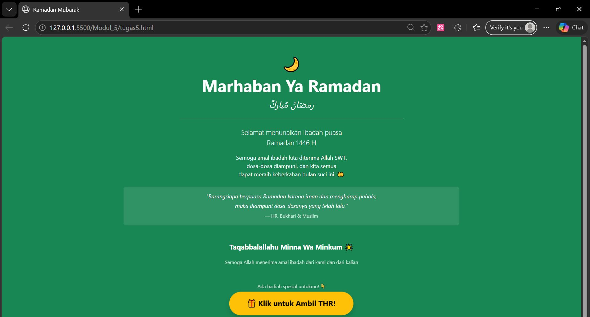
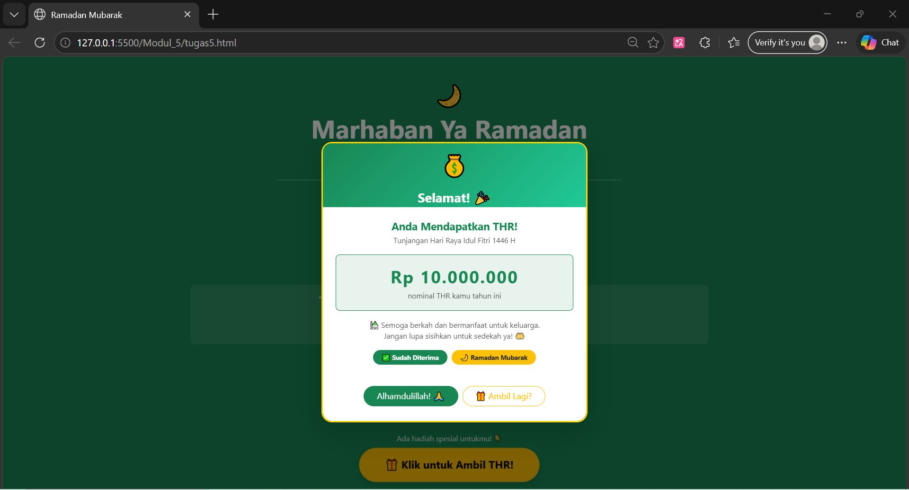

<div align="center">

# LAPORAN PRAKTIKUM  
# APLIKASI BERBASIS PLATFORM

## MODUL 5
## JAVASCRIPT & JQUERY


### Disusun Oleh
**Raihan Ramadhan**  
2311102040  
S1 IF-11-REG01  

### Dosen Pengampu
**Dimas Fanny Hebrasianto Permadi, S.ST., M.Kom**

### Asisten Praktikum
Apri Pandu Wicaksono  
Rangga Pradarrell Fathi  

### LABORATORIUM HIGH PERFORMANCE  
FAKULTAS INFORMATIKA  
UNIVERSITAS TELKOM PURWOKERTO  
2026

</div>

---

# 1. Dasar Teori

JavaScript adalah bahasa pemrograman scripting yang awalnya dibuat untuk mengendalikan program berbasis Java, namun pada perkembangannya digunakan untuk memanipulasi konten HTML agar menjadi dinamis dan interaktif di dalam browser. JavaScript mendukung tiga paradigma pemrograman sekaligus, yaitu imperatif, fungsional, dan berorientasi objek, sehingga menjadikannya bahasa yang sangat fleksibel untuk pengembangan web.

JavaScript memiliki beberapa tipe data dasar seperti Number, String, Boolean, Object, Function, Array, Date, RegExp, Null, dan Undefined. Untuk menyimpan data sementara, JavaScript menggunakan variabel yang dideklarasikan dengan kata kunci `var`. Salah satu keunikan JavaScript adalah variabel dapat diganti nilainya bahkan tipe datanya secara bebas, meskipun hal ini harus dilakukan dengan hati-hati agar tidak menimbulkan error. Selain variabel biasa, JavaScript juga memiliki tipe data Array yang digunakan untuk menampung banyak nilai sekaligus dalam satu variabel, ditulis menggunakan tanda kurung siku `[]`, dan diakses menggunakan indeks yang dimulai dari angka 0.

Untuk pengendalian alur program, JavaScript menggunakan struktur yang mirip dengan bahasa C dan Java. Percabangan dilakukan menggunakan `if`, `else if`, dan `else`, sedangkan perulangan menggunakan `for`, `while`, dan `do-while`. Satu hal yang perlu diperhatikan adalah JavaScript menggunakan tiga tanda sama dengan `===` untuk perbandingan yang lebih akurat karena operator ini juga memeriksa kesamaan tipe data, berbeda dengan `==` yang hanya membandingkan nilainya saja.

Dalam konsep berorientasi objek, JavaScript menggunakan pendekatan berbasis prototipe. Objek dibuat menggunakan notasi literal dengan kurung kurawal `{}` yang berisi pasangan properti dan nilai. Nilai properti dapat diakses menggunakan tanda titik `.` atau kurung siku `[]`. JavaScript juga mendukung objek bersarang di mana sebuah objek dapat mengandung objek lain di dalamnya. Penurunan objek dilakukan menggunakan fungsi bawaan `Object.create()` tanpa perlu mendefinisikan kelas terlebih dahulu.

Fungsi dalam JavaScript digunakan untuk membungkus sekumpulan perintah agar dapat dipanggil berulang kali. Ada dua cara membuat fungsi, yaitu function declaration yang langsung diberi nama, dan function expression yang menyimpan fungsi anonim ke dalam variabel. Fungsi dapat menerima parameter, menjalankan perintah di dalamnya, dan mengembalikan nilai menggunakan kata kunci `return`. Fungsi juga dapat dipanggil di dalam fungsi lain sehingga kode menjadi lebih modular dan efisien.

jQuery adalah library JavaScript yang dikembangkan oleh John Resig pada tahun 2006. jQuery menyederhanakan manipulasi DOM, penanganan event, pembuatan animasi, dan penggunaan AJAX hanya dalam beberapa baris kode. jQuery dapat digunakan dengan dua cara, yaitu instalasi lokal dengan mengunduh file dari situs resminya, atau menggunakan CDN agar tidak perlu mengunduh file secara manual. Beberapa fitur populer jQuery antara lain efek `hide()` dan `show()` untuk menyembunyikan atau menampilkan elemen HTML, serta fungsi `animate()` untuk membuat animasi pada elemen secara mudah dan sederhana.

---

**Code :**

```html
<!DOCTYPE html>
<html lang="id">
<head>
  <meta charset="UTF-8" />
  <meta name="viewport" content="width=device-width, initial-scale=1.0" />
  <title>Ramadan Mubarak</title>
  <link href="https://cdn.jsdelivr.net/npm/bootstrap@5.3.3/dist/css/bootstrap.min.css" rel="stylesheet" />
  <style>
    .btn-thr {
      animation: pulse 1.5s infinite;
    }
    @keyframes pulse {
      0%, 100% { transform: scale(1); }
      50% { transform: scale(1.07); }
    }
    .uang {
      font-size: 2.5rem;
      animation: bounce 0.6s infinite alternate;
      display: inline-block;
    }
    @keyframes bounce {
      from { transform: translateY(0); }
      to   { transform: translateY(-10px); }
    }
    .modal-content {
      border: 3px solid gold;
      border-radius: 20px;
    }
    .modal-header {
      background: linear-gradient(135deg, #198754, #20c997);
      border-radius: 16px 16px 0 0;
    }
    .nominal {
      font-size: 2rem;
      font-weight: bold;
      color: #198754;
      letter-spacing: 2px;
    }
  </style>
</head>
<body class="bg-success min-vh-100 d-flex align-items-center justify-content-center">

  <div class="container text-center text-white py-5">

    <p class="fs-1 mb-1">🌙</p>

    <h1 class="display-5 fw-bold">Marhaban Ya Ramadan</h1>
    <p class="fs-4 fst-italic mb-4">رَمَضَانُ مُبَارَكٌ</p>

    <hr class="border-white opacity-50 w-50 mx-auto" />

    <p class="lead mt-4">
      Selamat menunaikan ibadah puasa <br />
      Ramadan 1446 H
    </p>

    <p class="mt-3">
      Semoga amal ibadah kita diterima Allah SWT, <br />
      dosa-dosa diampuni, dan kita semua <br />
      dapat meraih keberkahan bulan suci ini. 🤲
    </p>

    <div class="mt-4 p-3 bg-white bg-opacity-10 rounded-3 w-75 mx-auto">
      <p class="fst-italic mb-1">"Barangsiapa berpuasa Ramadan karena iman dan mengharap pahala,</p>
      <p class="fst-italic mb-1">maka diampuni dosa-dosanya yang telah lalu."</p>
      <small class="opacity-75">— HR. Bukhari & Muslim</small>
    </div>

    <p class="mt-5 fw-bold fs-5">Taqabbalallahu Minna Wa Minkum 🌟</p>
    <small class="opacity-75">Semoga Allah menerima amal ibadah dari kami dan dari kalian</small>

    <!-- Tombol THR -->
    <div class="mt-5">
      <p class="text-white opacity-75 mb-2 small">Ada hadiah spesial untukmu! 👇</p>
      <button
        class="btn btn-warning btn-lg fw-bold px-5 py-3 rounded-pill shadow btn-thr"
        data-bs-toggle="modal"
        data-bs-target="#modalTHR">
        🎁 Klik untuk Ambil THR!
      </button>
    </div>

  </div>

  <!-- ===== MODAL THR ===== -->
  <div class="modal fade" id="modalTHR" tabindex="-1" aria-labelledby="labelTHR" aria-hidden="true">
    <div class="modal-dialog modal-dialog-centered">
      <div class="modal-content shadow-lg">

        <!-- Header -->
        <div class="modal-header text-white text-center d-block border-0 pb-0">
          <div class="uang">💰</div>
          <h4 class="modal-title fw-bold mt-2" id="labelTHR">
            Selamat! 🎉
          </h4>
        </div>

        <!-- Body -->
        <div class="modal-body text-center px-4 py-4">
          <h5 class="fw-bold text-success mb-1">Anda Mendapatkan THR!</h5>
          <p class="text-muted small mb-3">Tunjangan Hari Raya Idul Fitri 1446 H</p>

          <div class="bg-success bg-opacity-10 rounded-3 p-3 mb-3 border border-success">
            <div class="nominal" id="nominalTHR">Rp 0</div>
            <small class="text-muted">nominal THR kamu tahun ini</small>
          </div>

          <p class="text-muted small">
            🕌 Semoga berkah dan bermanfaat untuk keluarga.<br/>
            Jangan lupa sisihkan untuk sedekah ya! 🤲
          </p>

          <div class="d-flex gap-2 justify-content-center mt-3 flex-wrap">
            <span class="badge bg-success rounded-pill px-3 py-2">✅ Sudah Diterima</span>
            <span class="badge bg-warning text-dark rounded-pill px-3 py-2">🌙 Ramadan Mubarak</span>
          </div>
        </div>

        <!-- Footer -->
        <div class="modal-footer border-0 justify-content-center pb-4">
          <button
            type="button"
            class="btn btn-success rounded-pill px-4"
            data-bs-dismiss="modal">
            Alhamdulillah! 🙏
          </button>
          <button
            type="button"
            class="btn btn-outline-warning rounded-pill px-4"
            id="btnAmbilLagi">
            🎁 Ambil Lagi?
          </button>
        </div>

      </div>
    </div>
  </div>

  <script src="https://cdn.jsdelivr.net/npm/bootstrap@5.3.3/dist/js/bootstrap.bundle.min.js"></script>
  <script>
    // Nominal THR acak setiap buka modal
    const nominalList = [
      'Rp 50.000', 'Rp 100.000', 'Rp 150.000',
      'Rp 200.000', 'Rp 500.000', 'Rp 1.000.000',
      'Rp 2.000.000', 'Rp 5.000.000', 'Rp 10.000.000', 
      'Rp 100 (wkwk) 😂'
    ];

    function acakNominal() {
      const random = nominalList[Math.floor(Math.random() * nominalList.length)];
      document.getElementById('nominalTHR').textContent = random;
    }

    // Acak saat modal dibuka
    document.getElementById('modalTHR').addEventListener('show.bs.modal', acakNominal);

    // Tombol ambil lagi = acak ulang nominal
    document.getElementById('btnAmbilLagi').addEventListener('click', acakNominal);
  </script>
</body>
</html>
```

**Output:**

<p align="center">  </p> <p align="center">  </p>

## Penjelasan Kode Program

Kode program tersebut merupakan halaman web sederhana bertema **Ramadan** yang dibuat menggunakan **HTML dan Bootstrap 5 tanpa CSS tambahan maupun JavaScript**.

Bagian `<!DOCTYPE html>` digunakan untuk mendefinisikan bahwa dokumen menggunakan standar **HTML5**, sedangkan `<html lang="id">` menunjukkan bahwa bahasa halaman adalah **Bahasa Indonesia**.

Pada bagian `<head>` terdapat beberapa meta tag seperti `charset="UTF-8"` untuk memastikan semua karakter dapat ditampilkan dengan benar, termasuk karakter Arab seperti **رَمَضَانُ**, serta `viewport` yang membuat halaman dapat menyesuaikan ukuran layar perangkat. Judul halaman ditentukan oleh `<title>Ramadan Mubarak</title>`. Selain itu terdapat tag `<link>` yang menghubungkan halaman dengan file CSS Bootstrap 5 melalui CDN sehingga semua class Bootstrap dapat langsung digunakan tanpa perlu mengunduh file secara manual.

Elemen `<body>` dikasih class Bootstrap `bg-success` untuk mengatur warna latar belakang menjadi hijau, `min-vh-100` agar tinggi halaman minimal satu layar penuh, serta `d-flex align-items-center justify-content-center` untuk mengaktifkan Flexbox sehingga seluruh konten di dalamnya otomatis rata tengah secara horizontal maupun vertikal.

Di dalam body terdapat `<div class="container">` sebagai pembungkus utama seluruh isi halaman. Class `text-center` membuat semua teks rata tengah dan `text-white` membuat warna teks menjadi putih. Di dalamnya terdapat judul utama menggunakan tag `<h1>` dengan class `display-5 fw-bold` agar tulisannya besar dan tebal, lalu teks Arab menggunakan class `fst-italic` agar tampil miring, serta `mb-4` untuk memberikan jarak bawah.

Tag `<hr>` digunakan sebagai garis pemisah antar bagian, dikasih class `border-white opacity-50 w-50 mx-auto` agar garisnya berwarna putih dengan transparansi 50%, lebarnya setengah halaman, dan posisinya di tengah. Setelah itu terdapat beberapa tag `<p>` untuk isi teks ucapan, salah satunya menggunakan class `lead` agar ukuran teks sedikit lebih besar dari paragraf biasa.

Bagian kotak hadis menggunakan sebuah `<div>` dengan class `bg-white bg-opacity-10` agar latar belakangnya putih namun transparan 10%, `rounded-3` agar sudut kotak sedikit melengkung, `p-3` untuk padding di dalam kotak, serta `w-75 mx-auto` agar lebarnya 75% dari container dan posisinya berada di tengah. Di dalamnya terdapat teks hadis menggunakan class `fst-italic` dan keterangan sumber menggunakan tag `<small>` dengan class `opacity-75` agar terlihat lebih redup.

Secara keseluruhan, program ini membuat halaman ucapan Ramadan yang sederhana namun terstruktur dengan memanfaatkan struktur HTML untuk konten dan seluruh tampilan visual diatur sepenuhnya menggunakan class-class bawaan Bootstrap 5 tanpa menulis CSS maupun JavaScript tambahan sama sekali.

## Refrensi
- [Materi Modul  JAVASCRIPT & JQUERY](https://drive.google.com/file/d/1J27NhEO2MbOF9DetZmOtEGAcPkczzm1r/view?usp=drive_link)