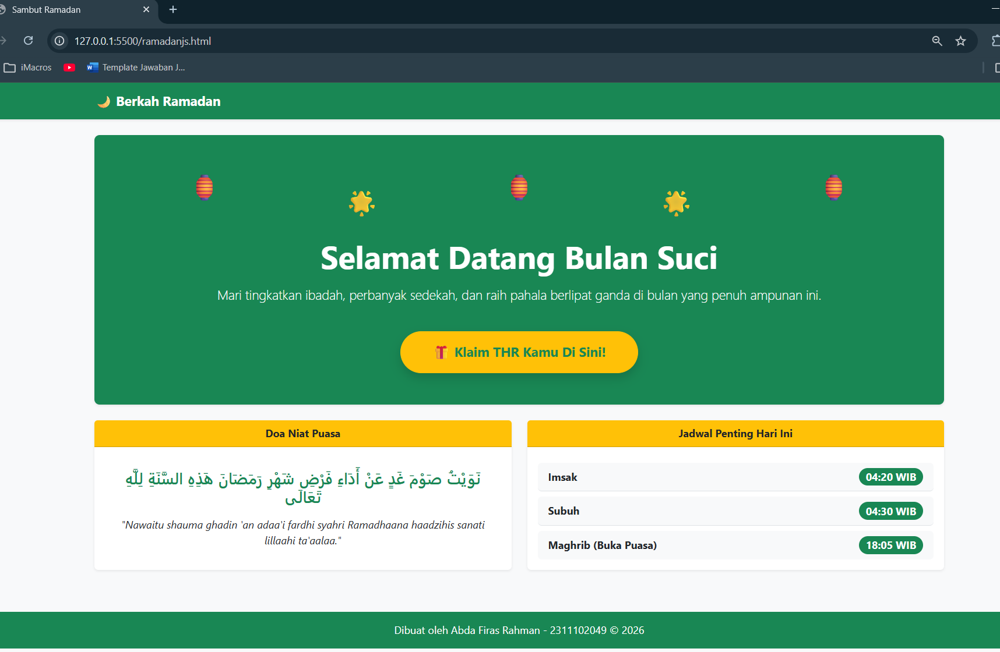
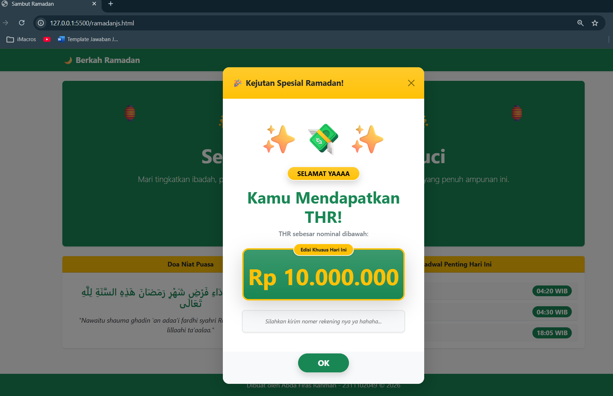

<div align="center">
  <br />

  <h1>LAPORAN PRAKTIKUM <br>
  APLIKASI BERBASIS PLATFORM
  </h1>

  <br />

  <h3>MODUL 5  <br>
  JAVASCRIPT
  </h3>

  <br />

  <p align="center">

</p>

  <br />
  <br />
  <br />

  <h3>Disusun Oleh :</h3>

  <p>
    <strong>Abda Firas Rahman</strong><br>
    <strong>2311102049</strong><br>
    <strong>S1 IF-11-REG01</strong>
  </p>

  <br />

  <h3>Dosen Pengampu :</h3>

  <p>
    <strong>Dimas Fanny Hebrasianto Permadi, S.ST., M.Kom</strong>
  </p>
  
  <br />
  <br />
    <h4>Asisten Praktikum :</h4>
    <strong>Apri Pandu Wicaksono </strong> <br>
    <strong>Rangga Pradarrell Fathi</strong>
  <br />

  <h3>LABORATORIUM HIGH PERFORMANCE
 <br>FAKULTAS INFORMATIKA <br>UNIVERSITAS TELKOM PURWOKERTO <br>2026</h3>
</div>

<hr>

### Dasar Teori

javaScript merupakan bahasa pemrograman dinamis berbasis prototipe yang menjadi pilar utama dalam menciptakan interaktivitas pada sisi klien. Sebagai bahasa yang patuh pada standar ECMAScript, ia menawarkan fleksibilitas tinggi dalam manipulasi data dibandingkan bahasa tradisional, serta mendukung berbagai paradigma mulai dari pemrograman berorientasi objek hingga fungsional. Kemampuannya dalam mengeksekusi kode didukung oleh mesin Just-In-Time (JIT) seperti V8, yang memungkinkan pemrosesan secara efisien di dalam peramban.

Meskipun beroperasi dengan sistem single-threaded, JavaScript tetap mampu menjaga responsivitas aplikasi melalui mekanisme Event Loop. Fitur ini memungkinkan operasi berat berjalan secara non-blocking, sehingga proses input/output atau pengambilan data tidak menghentikan jalannya program secara keseluruhan. Seiring perkembangannya sejak era ES6, JavaScript telah bertransformasi dengan fitur modern seperti promises dan arrow functions yang memperkuat ekosistemnya. Evolusi ini bahkan meluas hingga ke sisi server melalui Node.js, yang kini memungkinkan pengembang untuk membangun seluruh infrastruktur aplikasi full-stack hanya dengan satu bahasa tunggal.

## Kode program 
Berikut adalah kode program dari UNGUIDED nya:

```html
<!DOCTYPE html>
<html lang="id">
<head>
    <meta charset="UTF-8">
    <meta name="viewport" content="width=device-width, initial-scale=1.0">
    <title>Sambut Ramadan</title>
    <link href="https://cdn.jsdelivr.net/npm/bootstrap@5.3.0/dist/css/bootstrap.min.css" rel="stylesheet">
</head>
<body class="bg-light">

    <nav class="navbar navbar-expand-lg navbar-dark bg-success shadow-sm">
        <div class="container">
            <a class="navbar-brand fw-bold" href="#">🌙 Berkah Ramadan</a>
        </div>
    </nav>

    <div class="container mt-4">
        <div class="p-5 text-center bg-success text-white rounded-3 shadow-sm position-relative overflow-hidden">
            
            <div class="d-flex justify-content-around fs-1 mb-4">
                <span>🏮</span>
                <span class="mt-4">🌟</span>
                <span>🏮</span>
                <span class="mt-4">🌟</span>
                <span>🏮</span>
            </div>

            <h1 class="display-5 fw-bold">Selamat Datang Bulan Suci</h1>
            <p class="lead mt-3">Mari tingkatkan ibadah, perbanyak sedekah, dan raih pahala berlipat ganda di bulan yang penuh ampunan ini.</p>
            
            <button type="button" class="btn btn-warning btn-lg fw-bold shadow mt-4 px-5 py-3 rounded-pill text-success" data-bs-toggle="modal" data-bs-target="#thrModal">
                🎁 Klaim THR Kamu Di Sini!
            </button>
        </div>
    </div>

    <div class="container mt-4 mb-5">
        <div class="row">
            
            <div class="col-md-6 mb-3">
                <div class="card border-0 shadow-sm h-100">
                    <div class="card-header bg-warning text-dark fw-bold text-center">
                        Doa Niat Puasa
                    </div>
                    <div class="card-body text-center d-flex flex-column justify-content-center">
                        <h4 class="card-title text-success mb-3">نَوَيْتُ صَوْمَ غَدٍ عَنْ أَدَاءِ فَرْضِ شَهْرِ رَمَضَانَ هَذِهِ السَّنَةِ لِلَّهِ تَعَالَى</h4>
                        <p class="card-text fst-italic">"Nawaitu shauma ghadin 'an adaa'i fardhi syahri Ramadhaana haadzihis sanati lillaahi ta'aalaa."</p>
                    </div>
                </div>
            </div>

            <div class="col-md-6 mb-3">
                <div class="card border-0 shadow-sm h-100">
                    <div class="card-header bg-warning text-dark fw-bold text-center">
                        Jadwal Penting Hari Ini
                    </div>
                    <div class="card-body">
                        <ul class="list-group list-group-flush mt-2">
                            <li class="list-group-item d-flex justify-content-between align-items-center bg-light rounded mb-2">
                                <strong>Imsak</strong>
                                <span class="badge bg-success rounded-pill fs-6">04:20 WIB</span>
                            </li>
                            <li class="list-group-item d-flex justify-content-between align-items-center bg-light rounded mb-2">
                                <strong>Subuh</strong>
                                <span class="badge bg-success rounded-pill fs-6">04:30 WIB</span>
                            </li>
                            <li class="list-group-item d-flex justify-content-between align-items-center bg-light rounded">
                                <strong>Maghrib (Buka Puasa)</strong>
                                <span class="badge bg-success rounded-pill fs-6">18:05 WIB</span>
                            </li>
                        </ul>
                    </div>
                </div>
            </div>

        </div>
    </div>

    <footer class="text-center p-3 bg-success text-white mt-auto">
        <p class="mb-0">Dibuat oleh Abda Firas Rahman - 2311102049 &copy; 2026</p>
    </footer>

    <div class="modal fade" id="thrModal" tabindex="-1" aria-hidden="true">
        <div class="modal-dialog modal-dialog-centered">
            <div class="modal-content border-0 shadow-lg rounded-4 overflow-hidden">
                
                <div class="modal-header bg-warning bg-gradient text-dark border-0 p-4">
                    <h5 class="modal-title fw-bolder">🎉 Kejutan Spesial Ramadan!</h5>
                    <button type="button" class="btn-close" data-bs-dismiss="modal" aria-label="Tutup"></button>
                </div>
                
                <div class="modal-body text-center p-5 position-relative">
                    
                    <div class="display-1 mb-4">✨💸✨</div>
                    
                    <span class="badge text-bg-warning bg-gradient rounded-pill px-4 py-2 mb-3 shadow fs-6 text-uppercase fw-bold border border-light border-2">
                         Selamat Yaaaa 
                    </span>
                    
                    <h2 class="fw-bolder text-success mb-2 display-6">
                        Kamu Mendapatkan THR!
                    </h2>
                    
                    <p class="fs-6 mb-4 text-secondary fw-medium">
                        THR sebesar nominal dibawah:
                    </p>
                    
                    <div class="bg-success bg-gradient py-4 px-2 rounded-4 mb-4 shadow-lg position-relative border border-warning border-4">
                        <span class="badge bg-warning text-dark position-absolute top-0 start-50 translate-middle rounded-pill shadow-sm px-3 py-2 border border-light border-2">
                            Edisi Khusus Hari Ini
                        </span>
                        
                        <h1 class="text-warning fw-bolder mb-0 display-4 mt-2">
                            Rp 10.000.000
                        </h1>
                    </div>
                    
                    <div class="bg-light p-3 rounded-3 shadow-sm border border-secondary border-opacity-25">
                        <p class="text-muted small fst-italic mb-0">
                            Silahkan kirim nomer rekening nya ya hahaha...
                        </p>
                    </div>
                </div>
                
                <div class="modal-footer justify-content-center bg-light border-0 pb-4 pt-0">
                    <button type="button" class="btn btn-success btn-lg fw-bold px-5 rounded-pill shadow" data-bs-dismiss="modal">OK</button>
                </div>
                
            </div>
        </div>
    </div>

    <script src="https://cdn.jsdelivr.net/npm/bootstrap@5.3.0/dist/js/bootstrap.bundle.min.js"></script>
</body>
</html>
```

### Penjelasan Dari Kode Program:

Proyek ini adalah sebuah halaman web statis bertema Ramadan yang dibangun murni menggunakan kerangka kerja **Bootstrap 5** via CDN tanpa memerlukan tambahan *file* CSS terpisah. Secara keseluruhan, halaman ini menggunakan warna tema hijau dan kuning agar selaras dengan nuansa Islami. Pada bagian paling atas, terdapat navigasi sederhana yang memanfaatkan kelas `navbar-dark`, `bg-success`, dan `shadow-sm` agar posisinya terlihat sedikit menonjol. Di bawahnya, terdapat area *Hero* atau *Jumbotron* yang dibungkus dengan kelas `bg-success`, `rounded-3`, dan `shadow-sm`. Area ini memuat ucapan selamat datang dan hiasan lampion unik yang dibuat murni menggunakan emoji yang disusun merata dengan tata letak `d-flex justify-content-around`. Sebagai daya tarik utama, terdapat sebuah tombol interaktif berkelas `btn-warning` dan `rounded-pill` yang berfungsi sebagai pemicu untuk membuka sebuah *pop-up* kejutan.

Memasuki bagian konten halaman ini membagi layarnya menjadi dua buah kolom menggunakan sistem *grid* bawaan Bootstrap, yaitu `row` dan `col-md-6`. Setiap kolom memuat komponen `card` yang telah diperhalus visualnya dengan menghilangkan garis tepi bawaan (`border-0`) dan menambahkan efek bayangan lembut (`shadow-sm`). Kartu sebelah kiri dikhususkan untuk menampilkan Doa Niat Puasa dengan teks Arab yang diatur rapi di tengah kotak menggunakan `d-flex flex-column justify-content-center`. Sementara itu, kartu di sebelah kanan difungsikan untuk menampilkan Jadwal Penting Hari Ini. Jadwal tersebut disusun menggunakan komponen `list-group` dan disisipi elemen `badge bg-success rounded-pill` yang ditempatkan secara presisi ke ujung kanan berkat deretan kelas utilitas `d-flex justify-content-between align-items-center`.

Fitur paling menarik adalah kehadiran modal interaktif (kejutan THR) yang akan muncul di tengah layar ketika tombol utama ditekan. Modal dibangun menggunakan kelas `modal fade` dan `modal-dialog-centered`. Tampilan dalamnya dibuat sangat meriah, diawali dengan *header* berkelas `bg-warning bg-gradient` dan elemen teks yang menggunakan kelas `display-6`. Nominal hadiah ditampilkan mencolok di dalam kotak khusus berkelas `bg-success bg-gradient` dengan garis tepi tebal `border-warning border-4`. Untuk memberikan kesan *pop-out* atau melayang pada label "Edisi Khusus Hari Ini" label tersebut diposisikan tepat di garis atas kotak hadiah menggunakan kombinasi kelas `position-absolute top-0 start-50 translate-middle`. Fitur ini menambah unsur interaktivitas yang menyenangkan sebelum ditutup dengan tombol "OK" `btn-success rounded-pill`.

### Tampilan Hasil Kode Program:



