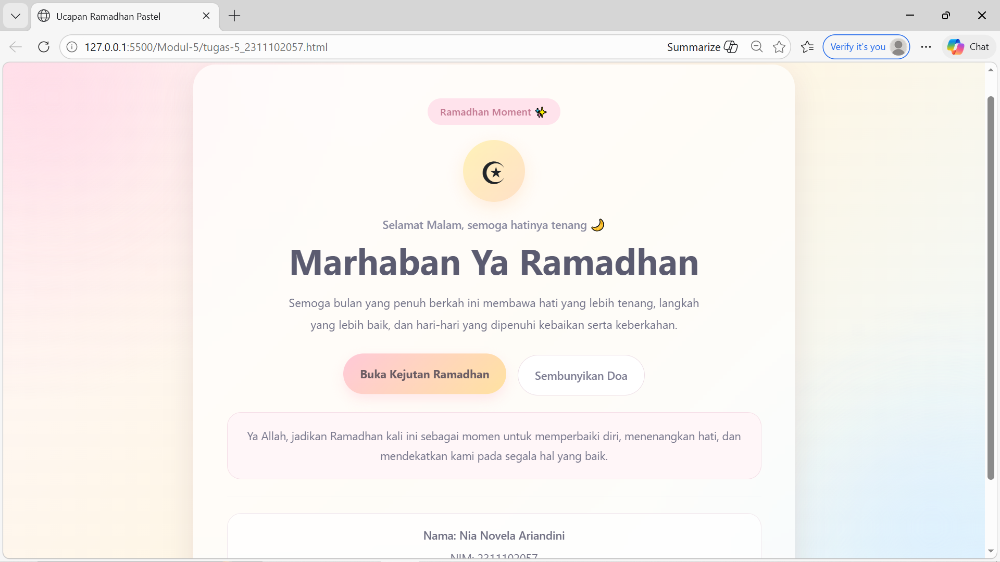
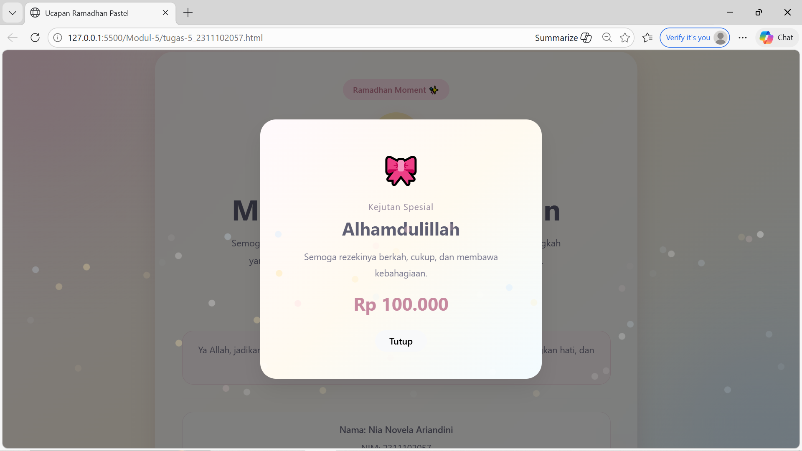

<div align="center">
  <br />
  <h1>LAPORAN PRAKTIKUM <br>APLIKASI BERBASIS PLATFORM</h1>
  <br />
  <h3>MODUL 5 <br> JAVASCRIPT</h3>
  <br />
   
  <br />
  <br />
  <br />
  <h3>Disusun Oleh :</h3>
  <p>
    <strong>Nia Novela Ariandini</strong><br>
    <strong>2311102057</strong><br>
    <strong>S1 IF-11-01</strong>
  </p>
  <br />
  <h3>Dosen Pengampu :</h3>
  <p>
    <strong>Dimas Fanny Hebrasianto Permadi, S.ST., M.Kom</strong>
  </p>
  <br />
  <br />
    <h4>Asisten Praktikum :</h4>
    <strong> Apri Pandu Wicaksono </strong> <br>
    <strong>Rangga Pradarrell Fathi</strong>
  <br />
  <br />
  <br />
  <br />
  <h3>LABORATORIUM HIGH PERFORMANCE
 <br>FAKULTAS INFORMATIKA <br>UNIVERSITAS TELKOM PURWOKERTO <br>2026</h3>
</div>

---

## 1. Dasar Teori

**JavaScript** merupakan bahasa pemrograman yang digunakan untuk membuat halaman web menjadi lebih interaktif dan tidak statis. Kalau HTML berfungsi sebagai penyusun struktur halaman, lalu CSS dipakai untuk mengatur tampilan, maka JavaScript berperan untuk memberikan aksi pada halaman, misalnya saat tombol ditekan, teks berubah, elemen dimunculkan, atau tampilan diperbarui secara langsung tanpa perlu me-*refresh* halaman.

Dalam pengembangan website, JavaScript sangat berkaitan dengan **DOM (Document Object Model)**. DOM adalah representasi dari struktur HTML yang memungkinkan JavaScript untuk mengakses, memilih, dan memanipulasi elemen di dalam halaman. Dengan DOM, developer bisa mengubah isi teks, menambah elemen baru, menghapus elemen, atau memberikan efek interaktif sesuai kebutuhan.

JavaScript juga sering dipakai untuk membuat fitur-fitur yang lebih menarik, seperti notifikasi, validasi form, animasi, tampilan pop-up, dan interaksi tombol. Karena itu, JavaScript menjadi salah satu bagian penting dalam pembuatan website modern agar pengalaman pengguna terasa lebih hidup dan nyaman.

Pada praktikum ini, JavaScript digunakan bersama HTML, CSS, dan Bootstrap untuk membuat kartu ucapan Ramadhan yang tampil lebih menarik. Seluruh kode dibuat dalam **satu file HTML**, sehingga struktur, tampilan, dan interaksinya berada dalam satu dokumen yang sama.

---

## 2. Penjelasan Kode HTML, CSS, dan JS

### Kode HTML (`tugas-5_2311102057.html`)

```html
<!DOCTYPE html>
<html lang="id">

<head>
    <meta charset="UTF-8">
    <meta name="viewport" content="width=device-width, initial-scale=1.0">
    <title>Ucapan Ramadhan Pastel</title>

    <link href="https://cdn.jsdelivr.net/npm/bootstrap@5.3.3/dist/css/bootstrap.min.css" rel="stylesheet">

    <style>
        * {
            margin: 0;
            padding: 0;
            box-sizing: border-box;
            font-family: "Segoe UI", Arial, sans-serif;
        }

        body {
            min-height: 100vh;
            background:
                radial-gradient(circle at top left, rgba(255, 196, 210, 0.45), transparent 32%),
                radial-gradient(circle at bottom right, rgba(196, 232, 255, 0.45), transparent 30%),
                linear-gradient(135deg, #fff7fb, #fef6e4, #eef9ff);
            color: #5f5f6e;
            overflow-x: hidden;
            position: relative;
        }

        .bg-decor {
            position: fixed;
            inset: 0;
            pointer-events: none;
            z-index: 0;
        }

        .blur-ball {
            position: absolute;
            border-radius: 50%;
            filter: blur(70px);
            opacity: .5;
        }

        .blur-one {
            width: 220px;
            height: 220px;
            background: #ffd6e7;
            top: -60px;
            left: -40px;
        }

        .blur-two {
            width: 250px;
            height: 250px;
            background: #d7ecff;
            bottom: -80px;
            right: -50px;
        }

        .main-wrapper {
            position: relative;
            z-index: 2;
            min-height: 100vh;
            display: flex;
            align-items: center;
            justify-content: center;
            padding: 40px 15px;
        }

        .ramadhan-card {
            background: rgba(255, 255, 255, 0.7);
            border: 1px solid rgba(255, 255, 255, 0.75);
            backdrop-filter: blur(14px);
            -webkit-backdrop-filter: blur(14px);
            box-shadow:
                0 18px 45px rgba(0, 0, 0, 0.08),
                0 0 24px rgba(255, 205, 220, 0.18);
            border-radius: 32px;
            overflow: hidden;
        }

        .top-label {
            display: inline-block;
            background: #ffe3ec;
            color: #c47b93;
            padding: 8px 18px;
            border-radius: 999px;
            font-size: .9rem;
            font-weight: 600;
            margin-bottom: 22px;
        }

        .star-icon {
            width: 88px;
            height: 88px;
            margin: 0 auto 20px;
            border-radius: 50%;
            display: flex;
            align-items: center;
            justify-content: center;
            font-size: 2.8rem;
            background: linear-gradient(135deg, #fff2b8, #ffe0c7);
            box-shadow: 0 8px 24px rgba(255, 214, 182, 0.45);
        }

        .greeting-text {
            color: #8c8ca1;
            font-size: 1rem;
            font-weight: 500;
            margin-bottom: 8px;
        }

        .main-title {
            font-size: clamp(2rem, 5vw, 3.2rem);
            font-weight: 700;
            color: #5b5b70;
            margin-bottom: 14px;
        }

        .desc-text {
            font-size: 1.03rem;
            line-height: 1.9;
            color: #707086;
            max-width: 620px;
            margin-left: auto;
            margin-right: auto;
            margin-bottom: 28px;
        }

        .btn-primary-soft {
            background: linear-gradient(135deg, #ffd6e0, #ffe9b8);
            color: #6a5c63;
            font-weight: 700;
            border: none;
            transition: .3s ease;
        }

        .btn-primary-soft:hover {
            background: linear-gradient(135deg, #ffc9d8, #ffe2a1);
            color: #6a5c63;
            transform: translateY(-2px);
            box-shadow: 0 8px 18px rgba(255, 206, 218, 0.45);
        }

        .btn-secondary-soft {
            background: #ffffff;
            color: #7d7d92;
            border: 1px solid #ecdde5;
            font-weight: 600;
            transition: .3s ease;
        }

        .btn-secondary-soft:hover {
            background: #fff6fa;
            color: #6d6d82;
            transform: translateY(-2px);
        }

        .prayer-box {
            display: none;
            margin-top: 10px;
            padding: 18px 20px;
            border-radius: 20px;
            background: rgba(255, 245, 248, 0.95);
            border: 1px solid #f4dce5;
            color: #75758a;
            line-height: 1.8;
            animation: fadeIn .4s ease;
        }

        .divider-line {
            border-color: rgba(160, 160, 180, 0.18);
        }

        .identity-box {
            background: rgba(255, 255, 255, 0.7);
            border: 1px solid #f0e6ec;
            border-radius: 20px;
            padding: 16px;
            color: #6f6f82;
            line-height: 1.8;
        }

        .modal-soft {
            background: linear-gradient(135deg, #fff9fc, #fffaf0, #f3fbff);
            color: #5f5f73;
            border-radius: 28px;
            box-shadow: 0 18px 38px rgba(0, 0, 0, 0.08);
        }

        .modal-icon {
            font-size: 3.3rem;
        }

        .modal-mini-text {
            color: #9b8fa2;
            font-size: .95rem;
            letter-spacing: 1px;
        }

        .modal-desc {
            color: #78788f;
            line-height: 1.8;
        }

        .thr-result {
            font-size: 2rem;
            font-weight: 700;
            color: #c78aa0;
        }

        .sparkle {
            position: fixed;
            width: 12px;
            height: 12px;
            border-radius: 50%;
            z-index: 9999;
            top: -20px;
            animation: fall linear forwards;
        }

        @keyframes fall {
            to {
                transform: translateY(110vh) rotate(360deg);
                opacity: 0;
            }
        }

        @keyframes fadeIn {
            from {
                opacity: 0;
                transform: translateY(8px);
            }

            to {
                opacity: 1;
                transform: translateY(0);
            }
        }
    </style>
</head>

<body>
    <div class="bg-decor">
        <div class="blur-ball blur-one"></div>
        <div class="blur-ball blur-two"></div>
    </div>

    <main class="main-wrapper">
        <div class="container">
            <div class="row justify-content-center">
                <div class="col-12 col-md-10 col-lg-8">
                    <div class="card ramadhan-card border-0 text-center">
                        <div class="card-body p-4 p-md-5">
                            <div class="top-label">Ramadhan Moment ✨</div>

                            <div class="star-icon">☪</div>

                            <p class="greeting-text" id="dynamicGreeting">
                                Assalamu’alaikum 🌷
                            </p>

                            <h1 class="main-title">Marhaban Ya Ramadhan</h1>

                            <p class="desc-text">
                                Semoga bulan yang penuh berkah ini membawa hati yang
                                lebih tenang, langkah yang lebih baik, dan hari-hari
                                yang dipenuhi kebaikan serta keberkahan.
                            </p>

                            <div class="d-flex flex-column flex-sm-row justify-content-center gap-3 mb-4">
                                <button id="giftButton" class="btn btn-primary-soft rounded-pill px-4 py-3"
                                    type="button" data-bs-toggle="modal" data-bs-target="#giftModal">
                                    Buka Kejutan Ramadhan
                                </button>

                                <button id="prayButton" class="btn btn-secondary-soft rounded-pill px-4 py-3"
                                    type="button">
                                    Tampilkan Doa
                                </button>
                            </div>

                            <div class="prayer-box" id="prayerBox">
                                Ya Allah, jadikan Ramadhan kali ini sebagai momen
                                untuk memperbaiki diri, menenangkan hati, dan
                                mendekatkan kami pada segala hal yang baik.
                            </div>

                            <hr class="my-4 divider-line">

                            <div class="identity-box">
                                <p class="mb-1 fw-semibold">
                                    Nama: Nia Novela Ariandini
                                </p>
                                <p class="mb-0">
                                    NIM: 2311102057
                                </p>
                            </div>
                        </div>
                    </div>
                </div>
            </div>
        </div>
    </main>

    <div class="modal fade" id="giftModal" tabindex="-1" aria-labelledby="giftModalLabel" aria-hidden="true">
        <div class="modal-dialog modal-dialog-centered">
            <div class="modal-content modal-soft border-0">
                <div class="modal-body text-center p-4 p-md-5">
                    <div class="modal-icon mb-3">🎀</div>

                    <p class="modal-mini-text mb-2">Kejutan Spesial</p>

                    <h2 class="fw-bold mb-3" id="giftModalLabel">
                        Alhamdulillah
                    </h2>

                    <p class="modal-desc mb-3" id="giftMessage">
                        Sedang menyiapkan hadiah kecil untukmu...
                    </p>

                    <div class="thr-result mb-4" id="giftResult">
                        ...
                    </div>

                    <button type="button" class="btn btn-light rounded-pill px-4 fw-semibold" data-bs-dismiss="modal">
                        Tutup
                    </button>
                </div>
            </div>
        </div>
    </div>

    <script src="https://cdn.jsdelivr.net/npm/bootstrap@5.3.3/dist/js/bootstrap.bundle.min.js"></script>

    <script>
        const greetingElement = document.getElementById("dynamicGreeting");
        const prayButton = document.getElementById("prayButton");
        const prayerBox = document.getElementById("prayerBox");
        const giftModal = document.getElementById("giftModal");
        const giftResult = document.getElementById("giftResult");
        const giftMessage = document.getElementById("giftMessage");

        const hour = new Date().getHours();
        let greeting = "Assalamu’alaikum 🌷";

        if (hour >= 4 && hour < 11) {
            greeting = "Selamat Pagi, semangat puasanya 🌤️";
        } else if (hour >= 11 && hour < 15) {
            greeting = "Selamat Siang, jangan lupa istirahat ☀️";
        } else if (hour >= 15 && hour < 18) {
            greeting = "Selamat Sore, semoga puasanya lancar 🌸";
        } else {
            greeting = "Selamat Malam, semoga hatinya tenang 🌙";
        }

        greetingElement.textContent = greeting;

        prayButton.addEventListener("click", () => {
            if (prayerBox.style.display === "block") {
                prayerBox.style.display = "none";
                prayButton.textContent = "Tampilkan Doa";
            } else {
                prayerBox.style.display = "block";
                prayButton.textContent = "Sembunyikan Doa";
            }
        });

        const giftList = [
            "Rp 50.000",
            "Rp 100.000",
            "Rp 250.000",
            "Pahala Berlimpah 🤲",
            "Hati yang Lebih Tenang 🌷",
            "Senyum Manis Hari Ini ✨"
        ];

        function createSparkles() {
            const colors = ["#ffd6e0", "#ffe7a8", "#d7ecff", "#ffffff"];

            for (let i = 0; i < 50; i++) {
                const sparkle = document.createElement("div");
                sparkle.classList.add("sparkle");
                sparkle.style.left = Math.random() * 100 + "vw";
                sparkle.style.backgroundColor =
                    colors[Math.floor(Math.random() * colors.length)];
                sparkle.style.animationDuration =
                    2 + Math.random() * 2 + "s";
                sparkle.style.opacity = Math.random();
                document.body.appendChild(sparkle);

                setTimeout(() => {
                    sparkle.remove();
                }, 4000);
            }
        }

        giftModal.addEventListener("show.bs.modal", () => {
            giftResult.textContent = "Membuka...";
            giftMessage.textContent =
                "Sedang menyiapkan kejutan manis Ramadhan untukmu.";

            setTimeout(() => {
                const result =
                    giftList[Math.floor(Math.random() * giftList.length)];

                giftResult.textContent = result;

                if (result.includes("Rp")) {
                    giftMessage.textContent =
                        "Semoga rezekinya berkah, cukup, dan membawa kebahagiaan.";
                } else {
                    giftMessage.textContent =
                        "Hadiah terbaik kadang bukan soal nominal, tapi rasa syukur dan hati yang tenang.";
                }

                createSparkles();
            }, 900);
        });

        giftModal.addEventListener("hidden.bs.modal", () => {
            giftResult.textContent = "...";
            giftMessage.textContent =
                "Sedang menyiapkan hadiah kecil untukmu...";
        });
    </script>
</body>

</html>
```

### Hasil Tampilan (Screenshot)




## Penjelasan Code

### 1. HTML

Pada bagian awal terdapat deklarasi `<!DOCTYPE html>` yang 
menandakan bahwa dokumen menggunakan standar **HTML5**. 
Tag `<html lang="id">` dipakai untuk menunjukkan bahwa bahasa 
utama halaman adalah **Bahasa Indonesia**.

Di dalam bagian `<head>`, terdapat tag `<meta charset="UTF-8">` 
yang berfungsi agar karakter pada halaman dapat tampil dengan 
benar. Selain itu, tag 
`<meta name="viewport" content="width=device-width, initial-scale=1.0">` 
digunakan supaya tampilan halaman tetap responsif saat dibuka 
di berbagai ukuran layar.

Tag `<title>` digunakan untuk memberi judul halaman pada tab 
browser. Lalu pada bagian ini juga dipanggil **Bootstrap 5** 
melalui CDN agar beberapa komponen seperti layout grid, tombol, 
dan modal dapat digunakan dengan lebih praktis.

Berbeda dari kode yang dipisah menjadi file HTML, CSS, dan JS, 
pada versi ini seluruh kode digabung menjadi **satu file HTML**. 
Karena itu, CSS ditulis langsung di dalam tag `<style>`, dan 
JavaScript ditulis langsung di dalam tag `<script>`.

Pada bagian `<body>`, terdapat elemen dekorasi berupa 
`<div class="bg-decor">` yang berisi dua lingkaran blur untuk 
membuat latar belakang terlihat lebih lembut.

Bagian utama halaman ada di dalam tag `<main class="main-wrapper">`. 
Di dalamnya digunakan sistem grid Bootstrap seperti 
`container`, `row`, dan `col` supaya kartu ucapan berada di 
tengah halaman dan tetap responsif.

Elemen utama kartu menggunakan 
`<div class="card ramadhan-card">`. Di dalam kartu terdapat 
label kecil, ikon bulan, teks salam dinamis, judul utama, 
deskripsi, dua tombol interaktif, kotak doa, dan identitas 
pembuat.

Tombol pertama digunakan untuk membuka modal kejutan Ramadhan 
melalui atribut `data-bs-toggle="modal"` dan 
`data-bs-target="#giftModal"`. Tombol kedua dipakai untuk 
menampilkan dan menyembunyikan doa.

Pada bagian bawah dokumen terdapat struktur modal Bootstrap 
dengan id `giftModal`. Modal ini digunakan untuk menampilkan 
hasil kejutan Ramadhan secara interaktif ketika tombol dibuka.

---

### 2. CSS

Pada selector universal `*`, properti `margin: 0`, `padding: 0`, 
dan `box-sizing: border-box` digunakan untuk mereset tampilan 
awal browser agar semua elemen memiliki jarak yang konsisten.

Pada bagian `body`, digunakan kombinasi warna pastel seperti 
pink lembut, kuning muda, dan biru muda dalam bentuk gradient. 
Tujuannya supaya tampilan halaman terasa lebih manis, lembut, 
dan berbeda dari versi sebelumnya yang memakai nuansa hijau gelap.

Class `.bg-decor`, `.blur-one`, dan `.blur-two` digunakan untuk 
membuat ornamen blur di bagian sudut halaman agar background 
terlihat lebih hidup.

Class `.ramadhan-card` digunakan untuk membuat tampilan kartu 
utama dengan efek semi transparan, sudut melengkung, dan 
bayangan halus sehingga terlihat modern.

Class `.top-label`, `.star-icon`, `.greeting-text`, dan 
`.main-title` dipakai untuk memperjelas tampilan identitas 
visual kartu ucapan.

Class `.btn-primary-soft` dan `.btn-secondary-soft` digunakan 
untuk membuat tombol dengan tampilan warna pastel dan efek 
*hover* agar lebih interaktif saat disentuh kursor.

Class `.prayer-box` dipakai untuk menampilkan kotak doa yang 
awalnya disembunyikan, kemudian akan dimunculkan dengan bantuan 
JavaScript.

Class `.identity-box` digunakan untuk menampilkan identitas 
pembuat dalam kotak kecil yang rapi.

Class `.modal-soft`, `.modal-icon`, `.modal-desc`, dan 
`.thr-result` digunakan untuk mengatur tampilan modal supaya 
selaras dengan tema pastel halaman utama.

Class `.sparkle` dipakai untuk membuat efek partikel kecil 
yang jatuh dari atas saat hadiah Ramadhan ditampilkan. 
Animasi jatuhnya diatur menggunakan `@keyframes fall`.

Selain itu, `@keyframes fadeIn` digunakan untuk memberikan 
efek muncul secara halus pada kotak doa.

---

### 3. JavaScript

Pada bagian JavaScript, beberapa elemen HTML diambil terlebih 
dahulu menggunakan `document.getElementById()`, seperti teks 
salam, tombol doa, kotak doa, modal, hasil kejutan, dan pesan 
di dalam modal.

Variabel `hour` digunakan untuk mengambil jam saat ini dari 
komputer pengguna. Berdasarkan jam tersebut, JavaScript akan 
menentukan ucapan yang sesuai, seperti pagi, siang, sore, 
atau malam. Hasilnya kemudian ditampilkan ke elemen 
`dynamicGreeting`.

Event listener pada tombol doa digunakan untuk menampilkan 
dan menyembunyikan kotak doa. Saat kotak doa muncul, teks 
tombol berubah menjadi **Sembunyikan Doa**, lalu akan kembali 
menjadi **Tampilkan Doa** saat kotak ditutup.

Array `giftList` berisi beberapa kemungkinan hasil kejutan 
Ramadhan. Isinya tidak hanya nominal uang, tetapi juga hadiah 
simbolis seperti pahala berlimpah atau hati yang lebih tenang.

Fungsi `createSparkles()` digunakan untuk membuat efek partikel 
kecil secara acak. Elemen partikel ini dibuat dengan JavaScript, 
diberi warna dan posisi acak, lalu dihapus otomatis setelah 
beberapa detik.

Event `show.bs.modal` digunakan untuk mendeteksi saat modal 
akan ditampilkan. Ketika modal dibuka, JavaScript menampilkan 
teks loading terlebih dahulu, lalu memilih hasil hadiah secara 
acak dari array `giftList`, memperbarui isi modal, dan 
menjalankan efek partikel.

Event `hidden.bs.modal` digunakan untuk mengatur ulang isi modal 
saat modal ditutup, sehingga saat dibuka lagi tampilannya akan 
kembali dari awal.

Secara keseluruhan, halaman ini menggabungkan **HTML sebagai 
struktur**, **CSS sebagai pengatur tampilan**, dan 
**JavaScript sebagai pemberi interaksi**, sehingga menghasilkan 
kartu ucapan Ramadhan yang lebih menarik, lembut, dan interaktif.

## Refrensi

- [Materi Modul 5](https://drive.google.com/file/d/1J27NhEO2MbOF9DetZmOtEGAcPkczzm1r/view?usp=sharing)