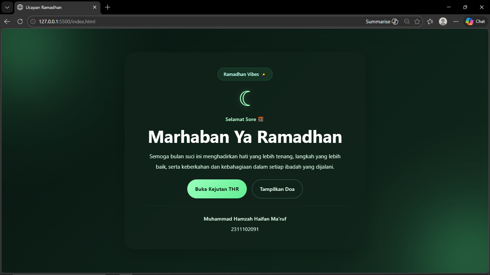
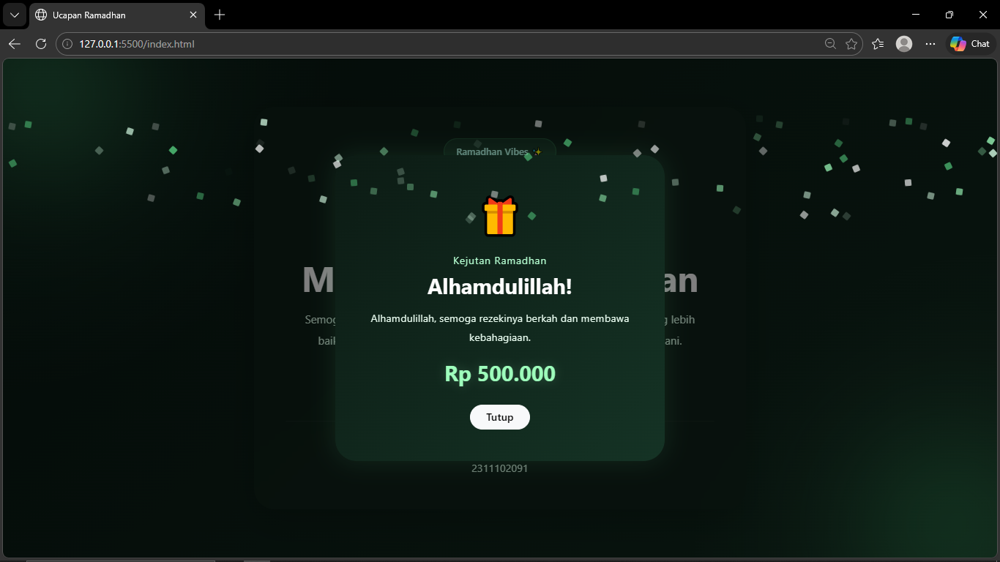

<div align="center">
  <br />
  <h1>LAPORAN PRAKTIKUM <br>APLIKASI BERBASIS PLATFORM</h1>
  <br />
  <h3>MODUL 5 <br> JAVASCRIPT</h3>
  <br />
  <br />
   
  <br />
  <br />
  <br />
  <br />
  <h3>Disusun Oleh :</h3>
  <p>
    <strong>Muhammad Hamzah Haifan Ma'ruf</strong><br>
    <strong>2311102091</strong><br>
    <strong>S1 IF-11-REG01</strong>
  </p>
  <br />
  <br />
  <h3>Dosen Pengampu :</h3>
  <p>
    <strong>Dimas Fanny Hebrasianto Permadi, S.ST., M.Kom</strong>
  </p>
  <br />
  <br />
    <h4>Asisten Praktikum :</h4>
    <strong> Apri Pandu Wicaksono </strong> <br>
    <strong>Rangga Pradarrell Fathi</strong>
  <br />
  <h3>LABORATORIUM HIGH PERFORMANCE
 <br>FAKULTAS INFORMATIKA <br>UNIVERSITAS TELKOM PURWOKERTO <br>2026</h3>
</div>

---

## 1. Dasar Teori

**JavaScript** adalah bahasa pemrograman yang digunakan untuk membuat halaman web menjadi lebih **interaktif, dinamis, dan responsif**. Jika HTML berfungsi sebagai penyusun struktur halaman dan CSS mengatur tampilannya, maka JavaScript berperan dalam menambahkan aksi atau perilaku tertentu pada elemen halaman, misalnya saat tombol diklik, data diubah, atau tampilan diperbarui tanpa harus memuat ulang halaman.

Dalam pengembangan web, JavaScript bekerja sangat erat dengan **DOM (Document Object Model)**. DOM merupakan representasi struktur dokumen HTML yang memungkinkan JavaScript untuk membaca, memilih, mengubah, menambah, maupun menghapus elemen pada halaman secara langsung. Dengan memanfaatkan DOM, pengembang dapat membuat pengalaman pengguna yang lebih hidup, seperti pop-up, validasi form, animasi, notifikasi, hingga tampilan data yang berubah secara real-time.

Selain berjalan di sisi browser, JavaScript juga dapat digunakan di sisi server melalui teknologi seperti **Node.js**. Hal ini membuat JavaScript menjadi bahasa yang sangat fleksibel karena dapat dipakai untuk membangun antarmuka web sekaligus logika backend dalam satu ekosistem yang sama.

---

## 2. Penjelasan Kode HTML, CSS, dan JS

### Kode HTML (`index.html`)

```html
<!DOCTYPE html>
<html lang="id">
<head>
  <meta charset="UTF-8">
  <meta name="viewport" content="width=device-width, initial-scale=1.0">
  <title>Ucapan Ramadhan Modern</title>

  <!-- Bootstrap 5 CDN -->
  <link
    href="https://cdn.jsdelivr.net/npm/bootstrap@5.3.3/dist/css/bootstrap.min.css"
    rel="stylesheet"
  >

  <!-- CSS External -->
  <link rel="stylesheet" href="style.css">
</head>
<body>
  <div class="bg-layer"></div>
  <div class="blur-circle blur-1"></div>
  <div class="blur-circle blur-2"></div>

  <main class="main-wrapper">
    <div class="container py-5">
      <div class="row justify-content-center">
        <div class="col-12 col-md-10 col-lg-7">
          <div class="card ramadhan-card border-0 rounded-5 shadow-lg text-center">
            <div class="card-body p-4 p-md-5">
              <div class="top-badge">Ramadhan Vibes ✨</div>

              <div class="moon-icon mb-4">☾</div>

              <p class="greeting-text mb-2" id="dynamicGreeting">Selamat Datang</p>

              <h1 class="main-title mb-3">Marhaban Ya Ramadhan</h1>

              <p class="desc-text mb-4">
                Semoga bulan suci ini menghadirkan hati yang lebih tenang,
                langkah yang lebih baik, serta keberkahan dan kebahagiaan
                dalam setiap ibadah yang dijalani.
              </p>

              <div class="d-flex flex-column flex-sm-row justify-content-center gap-3 mb-4">
                <button
                  id="thrButton"
                  class="btn btn-custom-primary rounded-pill px-4 py-3"
                  type="button"
                  data-bs-toggle="modal"
                  data-bs-target="#thrModal"
                >
                  Buka Kejutan THR
                </button>

                <button
                  id="prayButton"
                  class="btn btn-custom-secondary rounded-pill px-4 py-3"
                  type="button"
                >
                  Tampilkan Doa
                </button>
              </div>

              <div class="prayer-box" id="prayerBox">
                Ya Allah, berkahilah kami di bulan Ramadhan, kuatkan iman kami,
                lapangkan rezeki kami, dan jadikan kami pribadi yang lebih baik.
              </div>

              <hr class="my-4 divider-line">

              <div class="identity-box">
                <p class="mb-1 fw-semibold">Nama: Muhammad Hamzah Haifan Ma'ruf</p>
                <p class="mb-0">NIM: 2311102091</p>
              </div>
            </div>
          </div>
        </div>
      </div>
    </div>
  </main>

  <!-- Modal THR -->
  <div
    class="modal fade"
    id="thrModal"
    tabindex="-1"
    aria-labelledby="thrModalLabel"
    aria-hidden="true"
  >
    <div class="modal-dialog modal-dialog-centered">
      <div class="modal-content thr-modal text-center border-0 rounded-5">
        <div class="modal-body p-4 p-md-5">
          <div class="modal-icon mb-3">🎁</div>

          <p class="modal-mini-text mb-2">Kejutan Ramadhan</p>

          <h2 class="fw-bold mb-3" id="thrModalLabel">Alhamdulillah!</h2>

          <p class="modal-desc mb-3" id="thrMessage">
            Sedang menyiapkan kejutan terbaik untukmu...
          </p>

          <div class="thr-result mb-4" id="thrResult">Rp 0</div>

          <button
            type="button"
            class="btn btn-light rounded-pill px-4 fw-semibold"
            data-bs-dismiss="modal"
          >
            Tutup
          </button>
        </div>
      </div>
    </div>
  </div>

  <!-- Bootstrap Bundle JS -->
  <script src="https://cdn.jsdelivr.net/npm/bootstrap@5.3.3/dist/js/bootstrap.bundle.min.js"></script>

  <!-- JS External -->
  <script src="script.js"></script>
</body>
</html>
```

### Kode CSS (`style.css`)

```css
* {
  margin: 0;
  padding: 0;
  box-sizing: border-box;
  font-family: "Segoe UI", Arial, sans-serif;
}

body {
  min-height: 100vh;
  background: #07140f;
  color: #f4fff8;
  overflow-x: hidden;
  position: relative;
}

.bg-layer {
  position: fixed;
  inset: 0;
  background:
    radial-gradient(circle at top left, rgba(95, 255, 175, 0.10), transparent 30%),
    radial-gradient(circle at bottom right, rgba(167, 255, 196, 0.08), transparent 28%),
    linear-gradient(135deg, #081510, #0d2018, #10291d);
  z-index: 0;
}

.blur-circle {
  position: fixed;
  border-radius: 50%;
  filter: blur(90px);
  z-index: 1;
  opacity: 0.35;
}

.blur-1 {
  width: 220px;
  height: 220px;
  background: #68ff9f;
  top: -60px;
  left: -40px;
}

.blur-2 {
  width: 260px;
  height: 260px;
  background: #43d97c;
  bottom: -80px;
  right: -60px;
}

.main-wrapper {
  position: relative;
  z-index: 2;
  min-height: 100vh;
  display: flex;
  align-items: center;
}

.ramadhan-card {
  background: rgba(17, 35, 26, 0.72);
  border: 1px solid rgba(137, 255, 180, 0.12);
  backdrop-filter: blur(16px);
  -webkit-backdrop-filter: blur(16px);
  box-shadow:
    0 18px 50px rgba(0, 0, 0, 0.30),
    0 0 30px rgba(104, 255, 159, 0.06);
}

.top-badge {
  display: inline-block;
  padding: 8px 18px;
  border-radius: 999px;
  background: rgba(104, 255, 159, 0.08);
  border: 1px solid rgba(104, 255, 159, 0.16);
  color: #bffff1;
  font-size: 0.9rem;
  font-weight: 600;
  margin-bottom: 20px;
}

.moon-icon {
  font-size: 4rem;
  color: #9effbc;
  text-shadow: 0 0 18px rgba(158, 255, 188, 0.35);
  line-height: 1;
}

.greeting-text {
  color: #b6ffd2;
  font-size: 1rem;
  font-weight: 500;
}

.main-title {
  font-size: clamp(2rem, 5vw, 3.3rem);
  font-weight: 700;
  color: #ffffff;
}

.desc-text {
  font-size: 1.05rem;
  line-height: 1.9;
  color: #defdea;
  max-width: 620px;
  margin-left: auto;
  margin-right: auto;
}

.btn-custom-primary {
  background: linear-gradient(135deg, #9affbd, #63ee93);
  color: #0c1d14;
  font-weight: 700;
  border: none;
  transition: 0.3s ease;
}

.btn-custom-primary:hover {
  background: linear-gradient(135deg, #baffcf, #7bffa9);
  color: #0c1d14;
  transform: translateY(-2px);
  box-shadow: 0 0 18px rgba(123, 255, 169, 0.22);
}

.btn-custom-secondary {
  background: transparent;
  border: 1px solid rgba(176, 255, 208, 0.30);
  color: #e9fff2;
  font-weight: 600;
  transition: 0.3s ease;
}

.btn-custom-secondary:hover {
  background: rgba(255, 255, 255, 0.06);
  color: #ffffff;
  transform: translateY(-2px);
}

.prayer-box {
  display: none;
  margin-top: 8px;
  padding: 16px 18px;
  background: rgba(104, 255, 159, 0.06);
  border: 1px solid rgba(104, 255, 159, 0.14);
  border-radius: 18px;
  color: #e7fff0;
  line-height: 1.8;
  animation: fadeIn 0.4s ease;
}

.divider-line {
  border-color: rgba(255, 255, 255, 0.15);
}

.identity-box {
  color: #dffceb;
  line-height: 1.8;
}

.thr-modal {
  background: linear-gradient(135deg, #0c1b14, #153325);
  color: #ffffff;
  box-shadow: 0 0 35px rgba(110, 255, 162, 0.10);
}

.modal-icon {
  font-size: 3.5rem;
}

.modal-mini-text {
  color: #b6ffd2;
  font-size: 0.95rem;
  letter-spacing: 1px;
}

.modal-desc {
  color: #ecfff3;
  line-height: 1.8;
}

.thr-result {
  font-size: 2rem;
  font-weight: 700;
  color: #9effbc;
  text-shadow: 0 0 14px rgba(158, 255, 188, 0.20);
}

.confetti {
  position: fixed;
  width: 10px;
  height: 10px;
  top: -20px;
  z-index: 9999;
  border-radius: 2px;
  animation: fall linear forwards;
}

@keyframes fall {
  to {
    transform: translateY(110vh) rotate(720deg);
    opacity: 0;
  }
}

@keyframes fadeIn {
  from {
    opacity: 0;
    transform: translateY(6px);
  }
  to {
    opacity: 1;
    transform: translateY(0);
  }
}
```

### Kode JS (`script.js`)

```javascript
const greetingElement = document.getElementById("dynamicGreeting");
const prayerButton = document.getElementById("prayButton");
const prayerBox = document.getElementById("prayerBox");
const thrModal = document.getElementById("thrModal");
const thrResult = document.getElementById("thrResult");
const thrMessage = document.getElementById("thrMessage");

const hour = new Date().getHours();
let greeting = "Selamat Datang ✨";

if (hour >= 4 && hour < 11) {
  greeting = "Selamat Pagi 🌤️";
} else if (hour >= 11 && hour < 15) {
  greeting = "Selamat Siang ☀️";
} else if (hour >= 15 && hour < 18) {
  greeting = "Selamat Sore 🌆";
} else {
  greeting = "Selamat Malam 🌙";
}

greetingElement.textContent = greeting;

prayerButton.addEventListener("click", () => {
  if (prayerBox.style.display === "block") {
    prayerBox.style.display = "none";
    prayerButton.textContent = "Tampilkan Doa";
  } else {
    prayerBox.style.display = "block";
    prayerButton.textContent = "Sembunyikan Doa";
  }
});

const thrList = [
  "Rp 50.000",
  "Rp 100.000",
  "Rp 200.000",
  "Rp 500.000",
  "Rp 1.000.000",
  "Pahala Berlimpah 🤲",
  "Bonus Senyum Hari Ini 😄"
];

function createConfetti() {
  const colors = ["#9effbc", "#63ee93", "#ffffff", "#d7ffe6"];

  for (let i = 0; i < 70; i++) {
    const confetti = document.createElement("div");
    confetti.classList.add("confetti");
    confetti.style.left = Math.random() * 100 + "vw";
    confetti.style.backgroundColor = colors[Math.floor(Math.random() * colors.length)];
    confetti.style.animationDuration = 2 + Math.random() * 3 + "s";
    confetti.style.opacity = Math.random();
    document.body.appendChild(confetti);

    setTimeout(() => {
      confetti.remove();
    }, 5000);
  }
}

thrModal.addEventListener("show.bs.modal", () => {
  thrResult.textContent = "Membuka...";
  thrMessage.textContent = "Sedang menyiapkan kejutan Ramadhan untukmu.";

  setTimeout(() => {
    const result = thrList[Math.floor(Math.random() * thrList.length)];
    thrResult.textContent = result;

    if (result.includes("Rp")) {
      thrMessage.textContent =
        "Alhamdulillah, semoga rezekinya berkah dan membawa kebahagiaan.";
    } else {
      thrMessage.textContent =
        "Hadiah terbaik bukan hanya nominal, tapi juga hati yang penuh syukur.";
    }

    createConfetti();
  }, 900);
});

thrModal.addEventListener("hidden.bs.modal", () => {
  thrResult.textContent = "Rp 0";
  thrMessage.textContent = "Sedang menyiapkan kejutan terbaik untukmu...";
});
```

### Hasil Tampilan (Screenshot)




### Penjelasan Code

#### 1. HTML (`index.html`)

- Pada bagian `<head>`, digunakan tag `<meta>` untuk mengatur karakter dan responsivitas halaman. Selain itu, dipanggil juga **Bootstrap 5 CSS** melalui CDN dan file `style.css` sebagai stylesheet eksternal.
- Bagian utama halaman diletakkan di dalam elemen `<main>` dengan kartu ucapan Ramadhan di tengah halaman menggunakan sistem grid Bootstrap seperti `container`, `row`, dan `col`.
- Elemen `<div class="card ramadhan-card">` digunakan sebagai kartu utama yang menampilkan badge, ikon bulan, salam dinamis, judul utama, deskripsi, tombol interaktif, dan identitas pembuat.
- Tombol **Buka Kejutan THR** menggunakan atribut `data-bs-toggle="modal"` dan `data-bs-target="#thrModal"` untuk memunculkan modal Bootstrap secara otomatis.
- Tombol **Tampilkan Doa** digunakan untuk menampilkan atau menyembunyikan kotak doa dengan bantuan JavaScript.
- Modal Bootstrap pada bagian bawah dokumen digunakan untuk menampilkan hasil THR secara interaktif.
- File JavaScript Bootstrap dan `script.js` dipanggil di akhir `<body>` agar seluruh elemen HTML selesai dimuat sebelum skrip dijalankan.

#### 2. CSS (`style.css`)

- Selector `*` digunakan untuk mereset margin, padding, dan `box-sizing` seluruh elemen.
- Class `.bg-layer` membuat latar belakang dengan kombinasi gradient hijau gelap agar terlihat modern dan tenang.
- Class `.blur-circle` digunakan untuk membuat efek cahaya blur di sudut halaman agar tampilan lebih hidup.
- Class `.ramadhan-card` memberikan efek kaca transparan atau *glassmorphism* menggunakan `background` semi transparan, `backdrop-filter`, dan `box-shadow`.
- Class `.top-badge`, `.moon-icon`, `.greeting-text`, dan `.main-title` digunakan untuk memperjelas identitas visual halaman.
- Class `.btn-custom-primary` dan `.btn-custom-secondary` digunakan untuk membuat tombol dengan tampilan modern, lengkap dengan efek hover.
- Class `.prayer-box` digunakan sebagai kotak doa yang awalnya disembunyikan, lalu ditampilkan melalui JavaScript.
- Class `.thr-modal` dan `.thr-result` mengatur tampilan modal THR agar serasi dengan tema utama.
- Class `.confetti` dipakai untuk membuat elemen kecil yang jatuh dari atas halaman saat efek perayaan dijalankan.
- `@keyframes fall` dan `@keyframes fadeIn` digunakan untuk membuat animasi jatuh dan animasi muncul secara halus.

#### 3. JavaScript (`script.js`)

- JavaScript mengambil beberapa elemen DOM dengan `document.getElementById()` seperti salam dinamis, tombol doa, kotak doa, modal THR, hasil THR, dan pesan modal.
- Variabel `hour` digunakan untuk mengambil jam saat ini, lalu ditentukan ucapan yang sesuai seperti pagi, siang, sore, atau malam.
- Event listener pada tombol doa digunakan untuk menampilkan dan menyembunyikan kotak doa saat tombol diklik.
- Array `thrList` berisi beberapa kemungkinan hasil kejutan THR, baik nominal uang maupun hadiah simbolis.
- Fungsi `createConfetti()` digunakan untuk membuat elemen confetti secara acak dengan berbagai warna dan durasi animasi.
- Event `show.bs.modal` pada Bootstrap dipakai untuk mendeteksi saat modal akan ditampilkan. Saat event terjadi, JavaScript menampilkan teks loading, memilih hasil THR secara acak, memperbarui isi modal, lalu memunculkan efek confetti.
- Event `hidden.bs.modal` digunakan untuk mengatur ulang isi modal setelah pop-up ditutup.

Secara keseluruhan, halaman ini memadukan **HTML sebagai struktur**, **CSS sebagai pengatur tampilan**, dan **JavaScript sebagai logika interaktif** sehingga menghasilkan kartu ucapan Ramadhan yang lebih modern, sederhana, dan menarik.

## Refrensi

- [Materi Modul 5](https://drive.google.com/file/d/1J27NhEO2MbOF9DetZmOtEGAcPkczzm1r/view?usp=sharing)