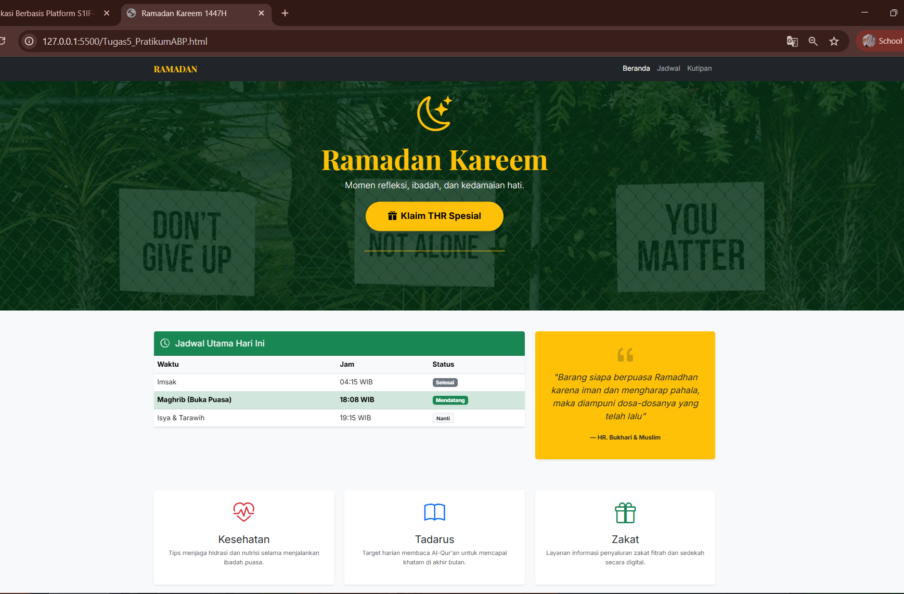
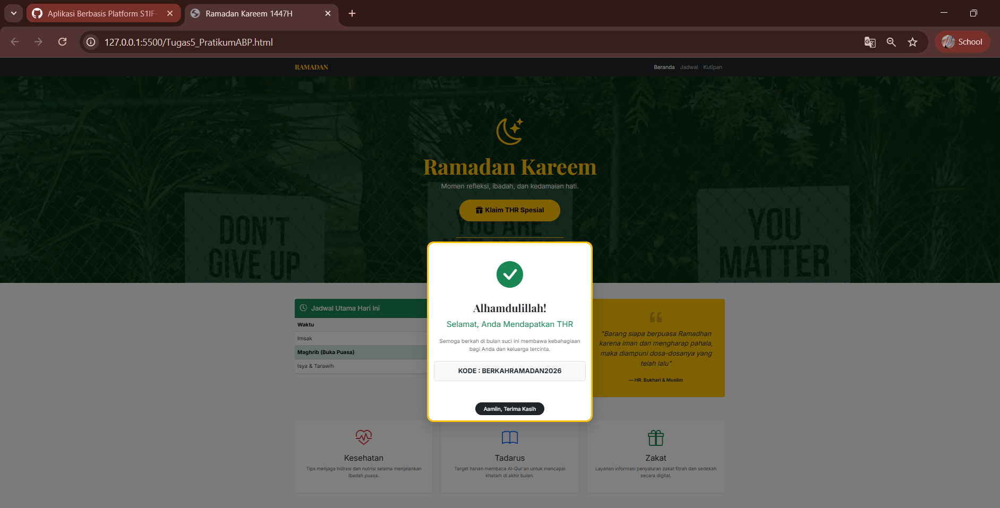

<div align="center">
  <br />

  <h1>LAPORAN PRAKTIKUM <br>
  APLIKASI BERBASIS PLATFORM
  </h1>

  <br />

  <h3>MODUL 5  <br>
  JAVASCRIPT 
  </h3>

  <br />

  <p align="center">

</p>

  <br />
  <br />
  <br />

  <h3>Disusun Oleh :</h3>

  <p>
    <strong>Aisyah Anis Mazaya</strong><br>
    <strong>2311102095</strong><br>
    <strong>S1 IF-11-REG01</strong>
  </p>

  <br />

  <h3>Dosen Pengampu :</h3>

  <p>
    <strong>Dimas Fanny Hebrasianto Permadi, S.ST., M.Kom</strong>
  </p>
  
  <br />
  <br />
    <h4>Asisten Praktikum :</h4>
    <strong>Apri Pandu Wicaksono </strong> <br>
    <strong>Rangga Pradarrell Fathi</strong>
  <br />

  <h3>LABORATORIUM HIGH PERFORMANCE
 <br>FAKULTAS INFORMATIKA <br>UNIVERSITAS TELKOM PURWOKERTO <br>2026</h3>
</div>

<hr>

## Dasar Teori

JavaScript adalah bahasa pemrograman tingkat tinggi, bersifat dinamis, dan berbasis objek (prototype-based) yang berfungsi sebagai instrumen utama interaktivitas pada sisi klien (client-side). Berbeda dengan bahasa pemrograman tradisional, JavaScript menggunakan sistem pewarisan prototipe yang memungkinkan manipulasi struktur data secara fleksibel saat aplikasi berjalan. Sebagai bahasa yang diatur oleh standar ECMAScript, JavaScript telah berevolusi dari sekadar skrip pemanis menjadi bahasa universal yang mendukung paradigma pemrograman fungsional maupun berorientasi objek (OOP).

Mekanisme Eksekusi dan Event Loop:
Secara arsitektural JavaScript beroperasi pada mesin Just-In-Time (JIT) seperti V8, yang mengompilasi kode menjadi bahasa mesin secara efisien di dalam peramban. Meskipun bersifat single-threaded (hanya menjalankan satu tugas pada satu waktu), JavaScript mampu menangani operasi berat secara non-blocking melalui mekanisme Event Loop. Fitur asinkronus ini memungkinkan program untuk terus berjalan tanpa menunggu proses input/output atau permintaan data selesai sehingga menjaga performa aplikasi tetap responsif.

Evolusi dan Implementasi Modern:
Sejak standarisasi ES6 (ECMAScript 2015), JavaScript mengalami transformasi besar dengan pengenalan fitur modern seperti arrow functions, promises, dan modules. Fleksibilitas ini membuat ekosistem JavaScript tidak lagi terbatas pada frontend, tetapi juga merambah ke sisi server melalui Node.js. Hal ini memungkinkan pengembangan aplikasi secara full-stack menggunakan satu bahasa tunggal, menjadikannya salah satu teknologi paling dominan dalam pengembangan perangkat lunak modern.

## Kode program UNGUIDED:
Berikut adalah kode nya

```html
<!DOCTYPE html>
<html lang="id">
<head>
    <meta charset="UTF-8">
    <meta name="viewport" content="width=device-width, initial-scale=1.0">
    <title>Ramadan Kareem 1447H</title>
    <link href="https://cdn.jsdelivr.net/npm/bootstrap@5.3.0/dist/css/bootstrap.min.css" rel="stylesheet">
    <link rel="stylesheet" href="https://cdn.jsdelivr.net/npm/bootstrap-icons@1.11.0/font/bootstrap-icons.css">
    <link href="https://fonts.googleapis.com/css2?family=Inter:wght@300;400;700&family=Playfair+Display:wght@700&display=swap" rel="stylesheet">
    
    <!--- 2311102095 - Aisyah Anis Mazaya -  IF-11-REG01 - Modul_5 --->

    <style>
        body {
            font-family: 'Inter', sans-serif;
            background-color: #f8f9fa;
        }
        .display-font {
            font-family: 'Playfair Display', serif;
        }
        .hero-section {
            background: linear-gradient(rgba(0, 45, 15, 0.8), rgba(0, 45, 15, 0.8)), 
                        url('https://images.unsplash.com/photo-1564121211835-e88c852648ab?ixlib=rb-1.2.1&auto=format&fit=crop&w=1350&q=80');
            background-size: cover;
            background-position: center;
            color: #ffc107;
            padding: 120px 0;
        }
        /* Animasi berdenyut untuk tombol THR agar interaktif */
        .btn-thr {
            transition: all 0.3s ease;
            animation: pulse 2s infinite;
        }
        @keyframes pulse {
            0% { transform: scale(1); box-shadow: 0 0 0 0 rgba(255, 193, 7, 0.7); }
            70% { transform: scale(1.05); box-shadow: 0 0 0 15px rgba(255, 193, 7, 0); }
            100% { transform: scale(1); box-shadow: 0 0 0 0 rgba(255, 193, 7, 0); }
        }
        .modal-content {
            border: 5px solid #ffc107;
            border-radius: 20px;
        }
    </style>
</head>
<body>

    <nav class="navbar navbar-expand-lg navbar-dark bg-dark sticky-top">
        <div class="container">
            <a class="navbar-brand display-font fw-bold text-warning" href="#">RAMADAN</a>
            <button class="navbar-toggler" type="button" data-bs-toggle="collapse" data-bs-target="#navbarNav">
                <span class="navbar-toggler-icon"></span>
            </button>
            <div class="collapse navbar-collapse" id="navbarNav">
                <ul class="navbar-nav ms-auto">
                    <li class="nav-item"><a class="nav-link active" href="#">Beranda</a></li>
                    <li class="nav-item"><a class="nav-link" href="#jadwal">Jadwal</a></li>
                    <li class="nav-item"><a class="nav-link" href="#kutipan">Kutipan</a></li>
                </ul>
            </div>
        </div>
    </nav>

    <header class="hero-section text-center">
        <div class="container">
            <i class="bi bi-moon-stars display-1"></i>
            <h1 class="display-3 fw-bold display-font mt-3">Ramadan Kareem</h1>
            <p class="lead text-light mb-4">Momen refleksi, ibadah, dan kedamaian hati.</p>
            
            <button type="button" class="btn btn-warning btn-lg fw-bold px-5 py-3 rounded-pill btn-thr shadow" data-bs-toggle="modal" data-bs-target="#thrModal">
                <i class="bi bi-gift-fill me-2"></i>Klaim THR Spesial
            </button>

            <hr class="w-25 mx-auto border-warning opacity-100 mt-5">
        </div>
    </header>

    <div class="modal fade" id="thrModal" tabindex="-1" aria-labelledby="thrModalLabel" aria-hidden="true">
        <div class="modal-dialog modal-dialog-centered">
            <div class="modal-content shadow-lg">
                <div class="modal-header border-0 justify-content-center pt-5">
                    <i class="bi bi-check-circle-fill text-success display-1"></i>
                </div>
                <div class="modal-body text-center pb-5">
                    <h2 class="display-font fw-bold text-dark mb-3">Alhamdulillah!</h2>
                    <h4 class="text-success mb-4">Selamat, Anda Mendapatkan THR</h4>
                    <p class="text-muted">Semoga berkah di bulan suci ini membawa kebahagiaan bagi Anda dan keluarga tercinta.</p>
                    <div class="bg-light p-3 rounded-3 border border-dashed mt-4">
                        <span class="text-dark fw-bold h5">KODE : BERKAHRAMADAN2026</span>
                    </div>
                </div>
                <div class="modal-footer border-0 justify-content-center">
                    <button type="button" class="btn btn-dark px-4 rounded-pill" data-bs-placeholder="Tutup" data-bs-dismiss="modal">Aamiin, Terima Kasih</button>
                </div>
            </div>
        </div>
    </div>

    <main class="container my-5">
        <div class="row g-4">
            <section id="jadwal" class="col-lg-8">
                <div class="card shadow-sm border-0">
                    <div class="card-header bg-success text-white py-3">
                        <h5 class="mb-0"><i class="bi bi-clock-history me-2"></i> Jadwal Utama Hari Ini</h5>
                    </div>
                    <div class="card-body p-0">
                        <table class="table table-hover mb-0">
                            <thead class="table-light">
                                <tr>
                                    <th>Waktu</th>
                                    <th>Jam</th>
                                    <th>Status</th>
                                </tr>
                            </thead>
                            <tbody>
                                <tr>
                                    <td>Imsak</td>
                                    <td>04:15 WIB</td>
                                    <td><span class="badge bg-secondary">Selesai</span></td>
                                </tr>
                                <tr class="table-success">
                                    <td><strong>Maghrib (Buka Puasa)</strong></td>
                                    <td><strong>18:08 WIB</strong></td>
                                    <td><span class="badge bg-success shadow-sm">Mendatang</span></td>
                                </tr>
                                <tr>
                                    <td>Isya & Tarawih</td>
                                    <td>19:15 WIB</td>
                                    <td><span class="badge bg-light text-dark border">Nanti</span></td>
                                </tr>
                            </tbody>
                        </table>
                    </div>
                </div>
            </section>

            <aside id="kutipan" class="col-lg-4">
                <div class="card bg-warning text-dark border-0 h-100 shadow-sm">
                    <div class="card-body d-flex flex-column justify-content-center text-center p-4">
                        <i class="bi bi-quote display-4 opacity-25"></i>
                        <p class="fst-italic fs-5">
                            "Barang siapa berpuasa Ramadhan karena iman dan mengharap pahala, maka diampuni dosa-dosanya yang telah lalu"
                        </p>
                        <footer class="blockquote-footer text-dark mt-2 fw-bold">HR. Bukhari & Muslim</footer>
                    </div>
                </div>
            </aside>
        </div>

        <div class="row mt-5 text-center g-4">
            <div class="col-md-4">
                <div class="p-4 bg-white shadow-sm rounded">
                    <i class="bi bi-heart-pulse text-danger display-5"></i>
                    <h4 class="mt-3">Kesehatan</h4>
                    <p class="text-muted small">Tips menjaga hidrasi dan nutrisi selama menjalankan ibadah puasa.</p>
                </div>
            </div>
            <div class="col-md-4">
                <div class="p-4 bg-white shadow-sm rounded">
                    <i class="bi bi-book text-primary display-5"></i>
                    <h4 class="mt-3">Tadarus</h4>
                    <p class="text-muted small">Target harian membaca Al-Qur'an untuk mencapai khatam di akhir bulan.</p>
                </div>
            </div>
            <div class="col-md-4">
                <div class="p-4 bg-white shadow-sm rounded">
                    <i class="bi bi-gift text-success display-5"></i>
                    <h4 class="mt-3">Zakat</h4>
                    <p class="text-muted small">Layanan informasi penyaluran zakat fitrah dan sedekah secara digital.</p>
                </div>
            </div>
        </div>
    </main>

    <footer class="bg-dark text-secondary py-4 mt-5 border-top border-warning border-4">
        <div class="container text-center">
            <p class="mb-0">&copy; 2026 Ramadan Kareem Project. Dibuat dengan dedikasi.</p>
        </div>
    </footer>

    <script src="https://cdn.jsdelivr.net/npm/bootstrap@5.3.0/dist/js/bootstrap.bundle.min.js"></script>
</body>
</html>
```

### Penjelasan Kode Program
Kode ini merupakan implementasi halaman arahan (landing page) bertema Ramadan Kareem 1447H yang dirancang untuk memberikan informasi seputar kegiatan Ramadan. Secara struktural, halaman ini dibangun menggunakan HTML5 dan kerangka kerja Bootstrap 5 untuk memastikan tampilan yang responsif dan rapi di berbagai perangkat. Bagian navigasi menggunakan komponen navbar yang bersifat sticky-top, sehingga menu tetap terlihat saat pengguna melakukan gulir (scrolling) pada halaman.

Pada bagian visual kode ini memanfaatkan CSS kustom untuk menciptakan hero-section dengan latar belakang gambar yang elegan dan gradasi warna yang gelap agar teks tetap mudah dibaca. Salah satu fitur interaktif yang menonjol adalah tombol "Klaim THR Spesial" yang dilengkapi dengan animasi pulse (berdenyut) melalui @keyframes pada CSS. Tombol ini berfungsi sebagai pemicu untuk memunculkan komponen Modal dari Bootstrap yang berisi pesan selamat dan kode promo khusus, memberikan pengalaman pengguna yang lebih dinamis.

Untuk penyajian data kode ini menggunakan table yang dimodifikasi dengan kelas table-hover untuk menampilkan jadwal ibadah harian seperti Imsak dan Maghrib. Selain itu, terdapat sistem grid (baris dan kolom) yang membagi konten menjadi dua bagian utama: tabel jadwal di sisi kiri dan kartu kutipan (quote) di sisi kanan. Di bagian bawah, digunakan elemen card untuk memberikan informasi tambahan mengenai tips kesehatan, tadarus, dan zakat yang dipercantik dengan ikon dari bootstrap-icons.

Secara fungsional seluruh interaksi seperti pembukaan modal dan navigasi responsif didukung oleh pustaka bootstrap.bundle.min.js. Penggunaan font eksternal dari Google Fonts, yaitu Playfair Display untuk judul dan Inter untuk teks tubuh, memberikan kesan tipografi yang profesional dan estetis. Kode ini sangat cocok dijadikan sebagai referensi dasar bagi mahasiswa untuk mempelajari integrasi komponen UI modern dengan logika desain yang sederhana namun efektif.

## Tampilan Hasil Kode 



