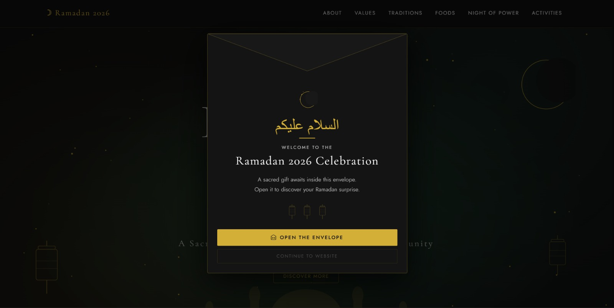
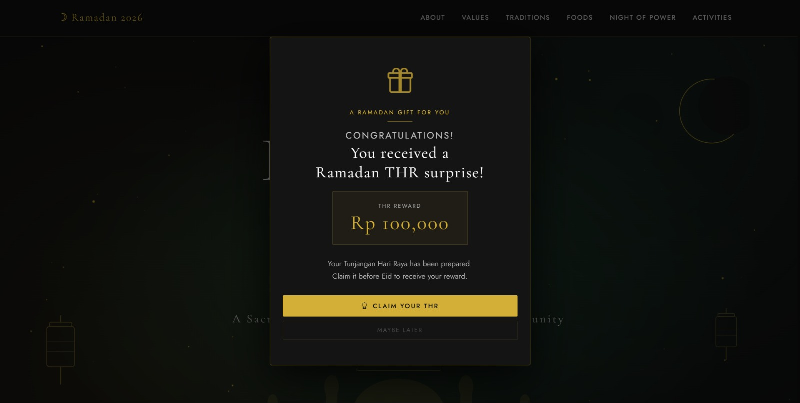
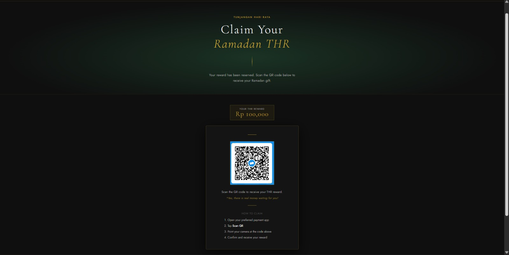
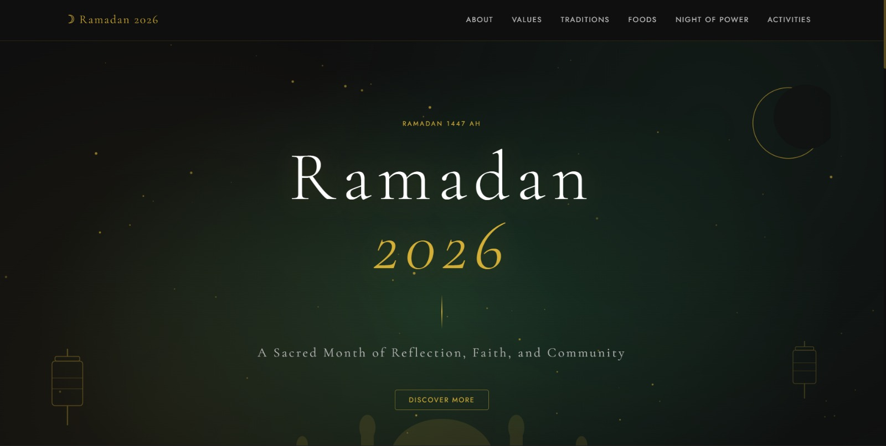
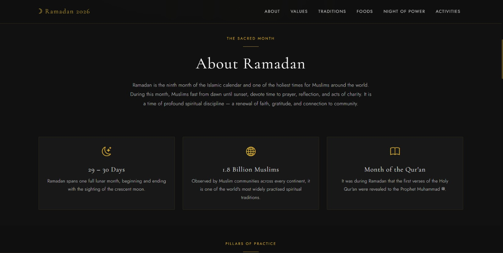
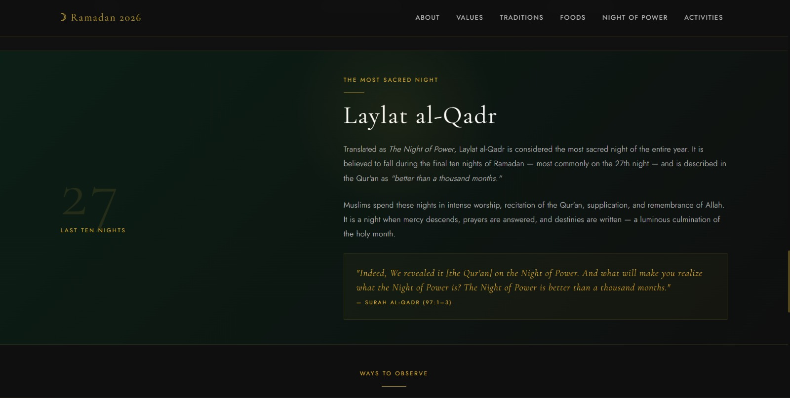

"" 
<div align="center">
  <br />
  <h1>LAPORAN PRAKTIKUM <br>APLIKASI BERBASIS PLATFORM</h1>
  <br />
  <h2>MODUL 5 <br> Javascript & JQuery </h2>
  <br />
  <br />
   
  <br />
  <br />
  <br />
  <h3>Disusun Oleh :</h3>
  <p>
    <strong>Rafaldo Al Maqdis</strong><br>
    <strong>2311102099</strong><br>
    <strong>S1 IF-11-REG 01</strong>
  </p>
  <br />
  <h3>Dosen Pengampu :</h3>
  <p>
    <strong>Dimas Fanny Hebrasianto Permadi, S.ST., M.Kom</strong>
  </p>
  <br />
  <br />
    <h4>Asisten Praktikum :</h4>
    <strong> Apri Pandu Wicaksono </strong> <br>
    <strong>Rangga Pradarrell Fathi</strong>
  <br />
  <h2>LABORATORIUM HIGH PERFORMANCE
 <br>FAKULTAS INFORMATIKA <br>UNIVERSITAS TELKOM PURWOKERTO <br>2026</h2>
</div>

---

# 1. Dasar Teori

## Karakteristik JavaScript

JavaScript adalah bahasa pemrograman yang digunakan untuk menambahkan fitur interaktif pada halaman web. Bahasa ini bekerja sebagai **scripting language** yang berjalan di sisi klien (*client-side*), sehingga mampu merespons tindakan pengguna secara langsung tanpa harus memuat ulang halaman.

Dengan menggunakan JavaScript, elemen pada halaman web dapat dimodifikasi secara dinamis. Contohnya seperti menampilkan atau menyembunyikan konten, mengubah teks secara otomatis, hingga menambahkan berbagai efek animasi. Hal ini membuat halaman web menjadi lebih interaktif dan tidak hanya bersifat statis seperti halaman yang hanya menggunakan HTML dan CSS.

---

## Struktur Objek dan Fungsi

Dalam JavaScript, data dapat disimpan dan dikelola menggunakan **objek (object)**. Salah satu cara membuat objek adalah dengan menggunakan **object literal**, yaitu struktur yang ditulis menggunakan tanda kurung kurawal `{}`. Pada struktur ini, data disimpan dalam bentuk pasangan **key** dan **value**, sehingga memudahkan pengelolaan informasi di dalam program.

Selain objek, **fungsi (function)** juga merupakan komponen penting dalam JavaScript. Fungsi digunakan untuk mengelompokkan serangkaian perintah yang dapat dijalankan kembali kapan saja ketika dibutuhkan. Dengan menggunakan fungsi, kode program menjadi lebih terorganisir, lebih mudah dibaca, serta mempermudah proses pemeliharaan dan pengembangan aplikasi.

---

## Pengenalan jQuery

jQuery merupakan sebuah **library JavaScript** yang dikembangkan untuk menyederhanakan proses manipulasi halaman web. Library ini membantu pengembang dalam mengelola **Document Object Model (DOM)**, menangani berbagai **event pengguna**, serta membuat animasi dengan cara yang lebih mudah dan efisien.

jQuery memiliki prinsip utama yaitu **"write less, do more"**, yang berarti pengembang dapat menulis kode yang lebih singkat dibandingkan dengan menggunakan JavaScript murni. Library ini menyediakan berbagai metode yang memudahkan proses pemilihan elemen HTML, pengelolaan interaksi pengguna, serta penambahan efek visual secara dinamis pada halaman web.

---

# 2. Unguided

## Implementasi JavaScript dan jQuery pada Website Ramadan Kareem

Pada bagian ini dilakukan implementasi penggunaan **JavaScript dan jQuery** dalam pengembangan halaman website bertema *Ramadan Kareem*. Teknologi tersebut dimanfaatkan untuk menambahkan berbagai elemen interaktif, seperti pengaturan animasi, manipulasi elemen halaman, serta pengelolaan interaksi pengguna agar tampilan website menjadi lebih dinamis dan menarik.

# index.html
```index.html
<!DOCTYPE html>
<html lang="en">
<head>
  <meta charset="UTF-8" />
  <meta name="viewport" content="width=device-width, initial-scale=1.0" />
  <title>Ramadan 2026 — A Sacred Month</title>

  <link href="https://cdn.jsdelivr.net/npm/bootstrap@5.3.3/dist/css/bootstrap.min.css" rel="stylesheet" />
  <link href="https://cdn.jsdelivr.net/npm/bootstrap-icons@1.11.3/font/bootstrap-icons.css" rel="stylesheet" />
  <link href="https://fonts.googleapis.com/css2?family=Cormorant+Garamond:ital,wght@0,300;0,400;0,600;1,300;1,400&family=Jost:wght@200;300;400;500&display=swap" rel="stylesheet" />
  <link rel="stylesheet" href="thr.css" />

  <style>
    :root {
      --gold:        #d4af37;
      --gold-light:  #e8cc6a;
      --silver:      #c0c0c0;
      --black:       #0f0f0f;
      --dark-grey:   #2c2c2c;
      --mid-grey:    #4a4a4a;
      --light-grey:  #e5e5e5;
      --white:       #ffffff;
      --green:       #1b4332;
      --green-light: #2d6a4f;
    }

    html { scroll-behavior: smooth; }
    body {
      background-color: var(--black);
      color: var(--light-grey);
      font-family: 'Jost', sans-serif;
      font-weight: 300;
      letter-spacing: 0.02em;
    }
    h1,h2,h3,h4,h5 { font-family:'Cormorant Garamond',serif; font-weight:400; letter-spacing:.04em; }

    .gold-line      { display:block; width:48px; height:1px; background:var(--gold); margin:0 auto 1.5rem; }
    .gold-line-left { display:block; width:40px; height:1px; background:var(--gold); margin-bottom:1rem; }

    /* Navbar */
    .navbar { background-color:rgba(15,15,15,.95)!important; border-bottom:1px solid rgba(212,175,55,.18); backdrop-filter:blur(8px); }
    .navbar-brand { font-family:'Cormorant Garamond',serif; font-size:1.25rem; color:var(--gold)!important; letter-spacing:.1em; }
    .nav-link { color:var(--silver)!important; font-size:.8rem; font-weight:400; letter-spacing:.12em; text-transform:uppercase; transition:color .25s; }
    .nav-link:hover { color:var(--gold)!important; }

    /* Section typography */
    .section-label  { font-size:.7rem; letter-spacing:.22em; text-transform:uppercase; color:var(--gold); font-weight:400; }
    .section-title  { font-size:clamp(2rem,4vw,3rem); color:var(--white); line-height:1.15; }
    .section-body   { color:var(--silver); font-size:.95rem; line-height:1.85; }

    /* Hero */
    #hero { min-height:100vh; background:radial-gradient(ellipse at 50% 60%,#1b3325 0%,#0f0f0f 65%); position:relative; overflow:hidden; }
    #hero::before { content:''; position:absolute; inset:0; background:radial-gradient(circle at 20% 80%,rgba(212,175,55,.07) 0%,transparent 50%),radial-gradient(circle at 80% 20%,rgba(27,67,50,.25) 0%,transparent 50%); pointer-events:none; }
    .stars { position:absolute; inset:0; overflow:hidden; pointer-events:none; }
    .star  { position:absolute; background:var(--gold); border-radius:50%; animation:twinkle 3s infinite ease-in-out alternate; }
    @keyframes twinkle { from{opacity:.15;transform:scale(1)} to{opacity:.7;transform:scale(1.4)} }
    .hero-svg-wrap  { position:absolute; inset:0; pointer-events:none; }
    .hero-title     { font-family:'Cormorant Garamond',serif; font-size:clamp(3.5rem,9vw,7.5rem); font-weight:300; color:var(--white); letter-spacing:.1em; line-height:1; text-shadow:0 2px 40px rgba(212,175,55,.2); }
    .hero-year      { color:var(--gold); font-style:italic; }
    .hero-subtitle  { font-family:'Cormorant Garamond',serif; font-size:clamp(1rem,2.2vw,1.4rem); color:var(--silver); font-weight:300; letter-spacing:.15em; }
    .hero-divider   { width:1px; height:60px; background:linear-gradient(to bottom,transparent,var(--gold),transparent); margin:0 auto; }

    /* Sections */
    .section-dark   { background-color:var(--black); }
    .section-darker { background-color:#111111; }
    .section-green  { background:linear-gradient(135deg,#0d2b1e 0%,#111 100%); }

    /* Cards */
    .card-ramadan { background:#181818; border:1px solid rgba(212,175,55,.14); border-radius:2px; transition:border-color .3s,transform .3s,box-shadow .3s; }
    .card-ramadan:hover { border-color:rgba(212,175,55,.45); transform:translateY(-4px); box-shadow:0 12px 40px rgba(0,0,0,.5); }
    .card-icon   { font-size:1.8rem; color:var(--gold); }
    .card-title-r { font-family:'Cormorant Garamond',serif; font-size:1.3rem; color:var(--white); letter-spacing:.05em; }
    .card-text-r  { color:var(--silver); font-size:.875rem; line-height:1.8; }

    /* Laylat */
    #laylat { background:linear-gradient(135deg,#0c1f16 0%,#0f0f0f 100%); border-top:1px solid rgba(212,175,55,.15); border-bottom:1px solid rgba(212,175,55,.15); position:relative; overflow:hidden; }
    #laylat::before { content:''; position:absolute; top:-80px; left:50%; transform:translateX(-50%); width:400px; height:400px; background:radial-gradient(circle,rgba(212,175,55,.08) 0%,transparent 70%); pointer-events:none; }
    .laylat-number { font-family:'Cormorant Garamond',serif; font-size:clamp(4rem,10vw,8rem); color:rgba(212,175,55,.12); font-weight:300; line-height:1; letter-spacing:.05em; }

    /* Tradition */
    .tradition-card { border-left:2px solid rgba(212,175,55,.35); padding-left:1.5rem; position:relative; }
    .tradition-card::before { content:''; position:absolute; left:-5px; top:6px; width:8px; height:8px; border-radius:50%; background:var(--gold); }

    /* Closing */
    #closing { background:radial-gradient(ellipse at 50% 40%,#1b3325 0%,#0f0f0f 70%); border-top:1px solid rgba(212,175,55,.12); }
    .closing-title  { font-family:'Cormorant Garamond',serif; font-size:clamp(3rem,7vw,5.5rem); color:var(--white); font-weight:300; letter-spacing:.1em; }
    .closing-arabic { font-family:'Cormorant Garamond',serif; font-size:clamp(1.6rem,4vw,2.5rem); color:var(--gold); font-style:italic; letter-spacing:.06em; }

    footer { background:#080808; border-top:1px solid rgba(212,175,55,.1); color:var(--mid-grey); font-size:.78rem; letter-spacing:.08em; }
    ::-webkit-scrollbar { width:5px; }
    ::-webkit-scrollbar-track { background:var(--black); }
    ::-webkit-scrollbar-thumb { background:rgba(212,175,55,.35); border-radius:10px; }

    .py-6 { padding-top:5rem!important; padding-bottom:5rem!important; }
  </style>
</head>
<body>

<!-- ══════════════════════════════════════════════════════════
     THR ENVELOPE MODAL
════════════════════════════════════════════════════════════ -->
<div class="modal fade" id="thrModal" tabindex="-1" data-bs-backdrop="static" data-bs-keyboard="false" aria-labelledby="thrModalLabel" aria-hidden="true">
  <div class="modal-dialog modal-dialog-centered">
    <div class="modal-content" id="thrModalContent">

      <!-- ── STEP 1 : Envelope ─────────────────────────── -->
      <div id="stepEnvelope">
        <!-- Envelope SVG flap decoration -->
        <div class="envelope-flap" aria-hidden="true">
          <svg viewBox="0 0 480 90" xmlns="http://www.w3.org/2000/svg" preserveAspectRatio="none">
            <polygon points="0,0 480,0 240,90" fill="#181818" stroke="rgba(212,175,55,.25)" stroke-width="1"/>
          </svg>
        </div>

        <div class="modal-body text-center pt-5 pb-4 px-4">
          <!-- Crescent decoration -->
          <div class="mb-3" aria-hidden="true">
            <svg width="52" height="52" viewBox="0 0 120 120" xmlns="http://www.w3.org/2000/svg">
              <circle cx="65" cy="60" r="46" fill="none" stroke="#d4af37" stroke-width="1.5"/>
              <circle cx="90" cy="52" r="42" fill="#181818"/>
              <!-- small stars -->
              <circle cx="28" cy="30" r="2.5" fill="#d4af37" opacity=".8"/>
              <circle cx="18" cy="58" r="1.8" fill="#d4af37" opacity=".6"/>
              <circle cx="36" cy="14" r="1.5" fill="#d4af37" opacity=".5"/>
            </svg>
          </div>

          <p class="thr-arabic mb-1">السلام عليكم</p>
          <span class="gold-line d-block mx-auto mb-3" style="width:40px;"></span>
          <h5 class="thr-heading mb-2">Welcome to the</h5>
          <h4 class="thr-title mb-3">Ramadan 2026 Celebration</h4>
          <p class="thr-body mb-4">A sacred gift awaits inside this envelope.<br>Open it to discover your Ramadan surprise.</p>

          <!-- Lantern row -->
          <div class="d-flex justify-content-center gap-3 mb-4" aria-hidden="true">
            <svg width="22" height="40" viewBox="0 0 60 100" xmlns="http://www.w3.org/2000/svg" opacity=".45">
              <line x1="30" y1="0" x2="30" y2="10" stroke="#d4af37" stroke-width="2"/>
              <rect x="14" y="10" width="32" height="6" rx="2" fill="none" stroke="#d4af37" stroke-width="1.2"/>
              <rect x="10" y="16" width="40" height="58" rx="4" fill="none" stroke="#d4af37" stroke-width="1.2"/>
              <line x1="10" y1="38" x2="50" y2="38" stroke="#d4af37" stroke-width=".8" opacity=".5"/>
              <line x1="10" y1="52" x2="50" y2="52" stroke="#d4af37" stroke-width=".8" opacity=".5"/>
              <line x1="30" y1="74" x2="30" y2="100" stroke="#d4af37" stroke-width="2"/>
            </svg>
            <svg width="22" height="40" viewBox="0 0 60 100" xmlns="http://www.w3.org/2000/svg" opacity=".45">
              <line x1="30" y1="0" x2="30" y2="10" stroke="#d4af37" stroke-width="2"/>
              <rect x="14" y="10" width="32" height="6" rx="2" fill="none" stroke="#d4af37" stroke-width="1.2"/>
              <rect x="10" y="16" width="40" height="58" rx="4" fill="none" stroke="#d4af37" stroke-width="1.2"/>
              <line x1="10" y1="38" x2="50" y2="38" stroke="#d4af37" stroke-width=".8" opacity=".5"/>
              <line x1="10" y1="52" x2="50" y2="52" stroke="#d4af37" stroke-width=".8" opacity=".5"/>
              <line x1="30" y1="74" x2="30" y2="100" stroke="#d4af37" stroke-width="2"/>
            </svg>
            <svg width="22" height="40" viewBox="0 0 60 100" xmlns="http://www.w3.org/2000/svg" opacity=".45">
              <line x1="30" y1="0" x2="30" y2="10" stroke="#d4af37" stroke-width="2"/>
              <rect x="14" y="10" width="32" height="6" rx="2" fill="none" stroke="#d4af37" stroke-width="1.2"/>
              <rect x="10" y="16" width="40" height="58" rx="4" fill="none" stroke="#d4af37" stroke-width="1.2"/>
              <line x1="10" y1="38" x2="50" y2="38" stroke="#d4af37" stroke-width=".8" opacity=".5"/>
              <line x1="10" y1="52" x2="50" y2="52" stroke="#d4af37" stroke-width=".8" opacity=".5"/>
              <line x1="30" y1="74" x2="30" y2="100" stroke="#d4af37" stroke-width="2"/>
            </svg>
          </div>

          <button class="btn thr-btn-gold w-100" id="btnOpenEnvelope">
            <i class="bi bi-envelope-open me-2"></i>Open the Envelope
          </button>
          <button type="button" class="btn thr-btn-ghost mt-2 w-100" data-bs-dismiss="modal">
            Continue to website
          </button>
        </div>
      </div>

      <!-- ── STEP 2 : THR Reveal ───────────────────────── -->
      <div id="stepReveal" class="d-none">
        <div class="modal-body text-center py-5 px-4">

          <div class="thr-reveal-icon mb-3" aria-hidden="true">
            <i class="bi bi-gift"></i>
          </div>

          <p class="section-label mb-2">A Ramadan Gift for You</p>
          <span class="gold-line d-block mx-auto mb-3"></span>
          <h3 class="thr-heading mb-1" style="font-size:1.1rem;letter-spacing:.15em;">Congratulations!</h3>
          <h2 class="thr-title mb-3">You received a<br>Ramadan THR surprise!</h2>

          <!-- Amount card -->
          <div class="thr-amount-card mx-auto mb-4">
            <p class="thr-amount-label mb-1">THR Reward</p>
            <p class="thr-amount-value mb-0">Rp 100,000</p>
          </div>

          <p class="thr-body mb-4">
            Your Tunjangan Hari Raya has been prepared.<br>
            Claim it before Eid to receive your reward.
          </p>

          <button class="btn thr-btn-gold w-100" id="btnClaim">
            <i class="bi bi-award me-2"></i>Claim Your THR
          </button>
          <button type="button" class="btn thr-btn-ghost mt-2 w-100" data-bs-dismiss="modal">
            Maybe later
          </button>
        </div>
      </div>

    </div><!-- /.modal-content -->
  </div>
</div>

<!-- ══════════════════════════════════════════════════════════
     TOAST NOTIFICATION
════════════════════════════════════════════════════════════ -->
<div class="toast-container position-fixed bottom-0 end-0 p-3" style="z-index:9999;">
  <div id="thrToast" class="toast align-items-center thr-toast" role="alert" aria-live="assertive" aria-atomic="true" data-bs-delay="4000">
    <div class="d-flex">
      <div class="toast-body">
        <i class="bi bi-gift-fill me-2" style="color:var(--gold);"></i>
        Your THR reward is ready to claim.
      </div>
      <button type="button" class="btn-close btn-close-white me-2 m-auto" data-bs-dismiss="toast" aria-label="Close"></button>
    </div>
  </div>
</div>


<!-- ════════════════════ NAVBAR ══════════════════════════════ -->
<nav class="navbar navbar-expand-lg sticky-top py-3">
  <div class="container">
    <a class="navbar-brand" href="#">☽ Ramadan 2026</a>
    <button class="navbar-toggler border-0" type="button" data-bs-toggle="collapse" data-bs-target="#navMenu">
      <span class="navbar-toggler-icon" style="filter:invert(1) sepia(1) saturate(2) hue-rotate(5deg);"></span>
    </button>
    <div class="collapse navbar-collapse justify-content-end" id="navMenu">
      <ul class="navbar-nav gap-3">
        <li class="nav-item"><a class="nav-link" href="#about">About</a></li>
        <li class="nav-item"><a class="nav-link" href="#values">Values</a></li>
        <li class="nav-item"><a class="nav-link" href="#traditions">Traditions</a></li>
        <li class="nav-item"><a class="nav-link" href="#foods">Foods</a></li>
        <li class="nav-item"><a class="nav-link" href="#laylat">Night of Power</a></li>
        <li class="nav-item"><a class="nav-link" href="#activities">Activities</a></li>
      </ul>
    </div>
  </div>
</nav>

<!-- ════════════════════ HERO ════════════════════════════════ -->
<section id="hero" class="d-flex align-items-center justify-content-center text-center">
  <div class="stars" id="starsContainer"></div>

  <div class="hero-svg-wrap">
    <svg style="position:absolute;top:8%;right:6%;width:clamp(80px,12vw,160px);opacity:.55;" viewBox="0 0 120 120" xmlns="http://www.w3.org/2000/svg">
      <circle cx="65" cy="60" r="46" fill="none" stroke="#d4af37" stroke-width="1"/>
      <circle cx="88" cy="52" r="42" fill="#0f0f0f"/>
    </svg>
    <svg style="position:absolute;bottom:14%;left:5%;width:clamp(40px,6vw,80px);opacity:.35;" viewBox="0 0 60 100" xmlns="http://www.w3.org/2000/svg">
      <line x1="30" y1="0" x2="30" y2="10" stroke="#d4af37" stroke-width="1.5"/>
      <rect x="14" y="10" width="32" height="6" rx="2" fill="none" stroke="#d4af37" stroke-width="1"/>
      <rect x="10" y="16" width="40" height="58" rx="4" fill="none" stroke="#d4af37" stroke-width="1"/>
      <line x1="10" y1="38" x2="50" y2="38" stroke="#d4af37" stroke-width=".8" opacity=".6"/>
      <line x1="10" y1="52" x2="50" y2="52" stroke="#d4af37" stroke-width=".8" opacity=".6"/>
      <line x1="30" y1="74" x2="30" y2="100" stroke="#d4af37" stroke-width="1.5"/>
    </svg>
    <svg style="position:absolute;bottom:20%;right:7%;width:clamp(30px,5vw,60px);opacity:.3;" viewBox="0 0 60 100" xmlns="http://www.w3.org/2000/svg">
      <line x1="30" y1="0" x2="30" y2="10" stroke="#d4af37" stroke-width="1.5"/>
      <rect x="14" y="10" width="32" height="6" rx="2" fill="none" stroke="#d4af37" stroke-width="1"/>
      <rect x="10" y="16" width="40" height="58" rx="4" fill="none" stroke="#d4af37" stroke-width="1"/>
      <line x1="10" y1="38" x2="50" y2="38" stroke="#d4af37" stroke-width=".8" opacity=".6"/>
      <line x1="10" y1="52" x2="50" y2="52" stroke="#d4af37" stroke-width=".8" opacity=".6"/>
      <line x1="30" y1="74" x2="30" y2="100" stroke="#d4af37" stroke-width="1.5"/>
    </svg>
    <svg style="position:absolute;bottom:0;left:50%;transform:translateX(-50%);width:min(100%,900px);opacity:.12;" viewBox="0 0 900 180" xmlns="http://www.w3.org/2000/svg">
      <ellipse cx="450" cy="130" rx="90" ry="70" fill="#d4af37"/>
      <rect x="360" y="130" width="180" height="50" fill="#d4af37"/>
      <rect x="310" y="80" width="22" height="100" fill="#d4af37"/>
      <ellipse cx="321" cy="75" rx="14" ry="22" fill="#d4af37"/>
      <rect x="315" y="55" width="12" height="20" fill="#d4af37"/>
      <rect x="568" y="80" width="22" height="100" fill="#d4af37"/>
      <ellipse cx="579" cy="75" rx="14" ry="22" fill="#d4af37"/>
      <rect x="573" y="55" width="12" height="20" fill="#d4af37"/>
      <rect x="200" y="110" width="16" height="70" fill="#d4af37"/>
      <ellipse cx="208" cy="106" rx="10" ry="16" fill="#d4af37"/>
      <rect x="684" y="110" width="16" height="70" fill="#d4af37"/>
      <ellipse cx="692" cy="106" rx="10" ry="16" fill="#d4af37"/>
    </svg>
  </div>

  <div class="container position-relative z-1 py-5">
    <p class="section-label mb-4">Ramadan 1447 AH</p>
    <h1 class="hero-title mb-0">Ramadan</h1>
    <h1 class="hero-title mb-4"><span class="hero-year">2026</span></h1>
    <div class="hero-divider mb-4"></div>
    <p class="hero-subtitle px-md-5">A Sacred Month of Reflection, Faith, and Community</p>
    <div class="mt-5 d-flex justify-content-center gap-4">
      <a href="#about" class="btn btn-outline-light btn-sm px-4 py-2" style="border-color:rgba(212,175,55,.5);color:var(--gold);font-size:.75rem;letter-spacing:.14em;text-transform:uppercase;">
        Discover More
      </a>
    </div>
  </div>
</section>

<!-- ════════════════════ ABOUT ═══════════════════════════════ -->
<section id="about" class="section-darker py-6">
  <div class="container py-5">
    <div class="row justify-content-center">
      <div class="col-lg-7 text-center">
        <p class="section-label mb-3">The Sacred Month</p>
        <span class="gold-line"></span>
        <h2 class="section-title mb-4">About Ramadan</h2>
        <p class="section-body">
          Ramadan is the ninth month of the Islamic calendar and one of the holiest times for Muslims around the world.
          During this month, Muslims fast from dawn until sunset, devote time to prayer, reflection, and acts of charity.
          It is a time of profound spiritual discipline — a renewal of faith, gratitude, and connection to community.
        </p>
      </div>
    </div>
    <div class="row g-4 mt-5 justify-content-center">
      <div class="col-sm-6 col-md-4">
        <div class="card-ramadan p-4 text-center h-100">
          <i class="bi bi-moon-stars card-icon mb-3 d-block"></i>
          <p class="card-title-r mb-2">29 – 30 Days</p>
          <p class="card-text-r mb-0">Ramadan spans one full lunar month, beginning and ending with the sighting of the crescent moon.</p>
        </div>
      </div>
      <div class="col-sm-6 col-md-4">
        <div class="card-ramadan p-4 text-center h-100">
          <i class="bi bi-globe2 card-icon mb-3 d-block"></i>
          <p class="card-title-r mb-2">1.8 Billion Muslims</p>
          <p class="card-text-r mb-0">Observed by Muslim communities across every continent, it is one of the world's most widely practised spiritual traditions.</p>
        </div>
      </div>
      <div class="col-sm-6 col-md-4">
        <div class="card-ramadan p-4 text-center h-100">
          <i class="bi bi-book card-icon mb-3 d-block"></i>
          <p class="card-title-r mb-2">Month of the Qur'an</p>
          <p class="card-text-r mb-0">It was during Ramadan that the first verses of the Holy Qur'an were revealed to the Prophet Muhammad ﷺ.</p>
        </div>
      </div>
    </div>
  </div>
</section>

<!-- ════════════════════ VALUES ══════════════════════════════ -->
<section id="values" class="section-dark py-6">
  <div class="container py-5">
    <div class="row justify-content-center text-center mb-5">
      <div class="col-lg-6">
        <p class="section-label mb-3">Pillars of Practice</p>
        <span class="gold-line"></span>
        <h2 class="section-title">Core Values of Ramadan</h2>
      </div>
    </div>
    <div class="row g-4">
      <div class="col-sm-6 col-lg-3">
        <div class="card-ramadan p-4 h-100">
          <span class="gold-line-left"></span>
          <p class="section-label mb-2">01</p>
          <p class="card-title-r mb-2">Fasting (Sawm)</p>
          <p class="card-text-r mb-0">Abstaining from food, drink, and negative behaviours from Fajr to Maghrib — a physical and spiritual cleansing that cultivates self-discipline and empathy for the less fortunate.</p>
        </div>
      </div>
      <div class="col-sm-6 col-lg-3">
        <div class="card-ramadan p-4 h-100">
          <span class="gold-line-left"></span>
          <p class="section-label mb-2">02</p>
          <p class="card-title-r mb-2">Prayer & Worship</p>
          <p class="card-text-r mb-0">The five daily prayers are observed with heightened devotion, supplemented by nightly Taraweeh prayers and personal supplications seeking closeness to Allah.</p>
        </div>
      </div>
      <div class="col-sm-6 col-lg-3">
        <div class="card-ramadan p-4 h-100">
          <span class="gold-line-left"></span>
          <p class="section-label mb-2">03</p>
          <p class="card-title-r mb-2">Charity & Generosity</p>
          <p class="card-text-r mb-0">Zakat and Sadaqah are especially emphasised. Ramadan is a time of open hands — giving to the poor, feeding neighbours, and strengthening bonds of community.</p>
        </div>
      </div>
      <div class="col-sm-6 col-lg-3">
        <div class="card-ramadan p-4 h-100">
          <span class="gold-line-left"></span>
          <p class="section-label mb-2">04</p>
          <p class="card-title-r mb-2">Spiritual Reflection</p>
          <p class="card-text-r mb-0">Moments of silence, gratitude, and introspection allow believers to reconnect with their faith, recalibrate their values, and seek forgiveness and renewal.</p>
        </div>
      </div>
    </div>
  </div>
</section>

<!-- ════════════════════ TRADITIONS ══════════════════════════ -->
<section id="traditions" class="section-green py-6">
  <div class="container py-5">
    <div class="row justify-content-center text-center mb-5">
      <div class="col-lg-6">
        <p class="section-label mb-3">Daily Rhythms</p>
        <span class="gold-line"></span>
        <h2 class="section-title">Ramadan Traditions</h2>
      </div>
    </div>
    <div class="row g-5">
      <div class="col-md-6">
        <div class="tradition-card mb-5">
          <p class="section-label mb-1">Iftar</p>
          <h4 class="card-title-r mb-2">Breaking the Fast</h4>
          <p class="card-text-r">As the sun sets and the Maghrib call to prayer sounds, the fast is broken — traditionally beginning with dates and water. Iftar is a joyful, communal occasion shared with family, friends, and neighbours.</p>
        </div>
        <div class="tradition-card">
          <p class="section-label mb-1">Taraweeh</p>
          <h4 class="card-title-r mb-2">Nightly Prayers</h4>
          <p class="card-text-r">After Isha prayer, Muslims gather in mosques for Taraweeh — voluntary nightly prayers in which the entire Qur'an is recited over the course of the month. The congregation and recitation create a profoundly moving atmosphere.</p>
        </div>
      </div>
      <div class="col-md-6">
        <div class="tradition-card mb-5">
          <p class="section-label mb-1">Suhoor</p>
          <h4 class="card-title-r mb-2">The Pre-Dawn Meal</h4>
          <p class="card-text-r">Before the Fajr call to prayer, Muslims rise in the stillness of the night to share Suhoor — a quiet, nourishing meal that sustains body and spirit through the day's fast. It is considered a blessed act.</p>
        </div>
        <div class="tradition-card">
          <p class="section-label mb-1">Community</p>
          <h4 class="card-title-r mb-2">Shared Gatherings</h4>
          <p class="card-text-r">Ramadan strengthens the bonds of ummah (community). Families open their tables to guests, mosques host large communal iftars, and neighbours exchange food — an expression of unity and care that transcends borders.</p>
        </div>
      </div>
    </div>
  </div>
</section>

<!-- ════════════════════ FOODS ═══════════════════════════════ -->
<section id="foods" class="section-darker py-6">
  <div class="container py-5">
    <div class="row justify-content-center text-center mb-5">
      <div class="col-lg-6">
        <p class="section-label mb-3">At the Table</p>
        <span class="gold-line"></span>
        <h2 class="section-title">Traditional Ramadan Foods</h2>
      </div>
    </div>
    <div class="row g-4">
      <div class="col-sm-6 col-lg-4">
        <div class="card-ramadan p-4 h-100">
          <div class="d-flex align-items-start gap-3">
            <i class="bi bi-brightness-alt-high card-icon mt-1"></i>
            <div>
              <p class="card-title-r mb-1">Dates</p>
              <p class="card-text-r mb-0">The Prophet's tradition of breaking the fast with dates and water is observed worldwide. Sweet, nourishing, and full of energy — dates are the first food of Iftar.</p>
            </div>
          </div>
        </div>
      </div>
      <div class="col-sm-6 col-lg-4">
        <div class="card-ramadan p-4 h-100">
          <div class="d-flex align-items-start gap-3">
            <i class="bi bi-triangle card-icon mt-1"></i>
            <div>
              <p class="card-title-r mb-1">Samosa</p>
              <p class="card-text-r mb-0">Crispy, golden pastry parcels filled with spiced meat or vegetables. A beloved Iftar snack across South Asia, the Middle East, and East Africa.</p>
            </div>
          </div>
        </div>
      </div>
      <div class="col-sm-6 col-lg-4">
        <div class="card-ramadan p-4 h-100">
          <div class="d-flex align-items-start gap-3">
            <i class="bi bi-cup-hot card-icon mt-1"></i>
            <div>
              <p class="card-title-r mb-1">Harira Soup</p>
              <p class="card-text-r mb-0">A rich, aromatic Moroccan soup of tomatoes, lentils, chickpeas, and herbs — the quintessential Iftar opener across North Africa, warming both body and soul.</p>
            </div>
          </div>
        </div>
      </div>
      <div class="col-sm-6 col-lg-4">
        <div class="card-ramadan p-4 h-100">
          <div class="d-flex align-items-start gap-3">
            <i class="bi bi-stars card-icon mt-1"></i>
            <div>
              <p class="card-title-r mb-1">Kunafa</p>
              <p class="card-text-r mb-0">A celebrated Levantine dessert of shredded pastry, sweet cheese, and rose-scented syrup — golden, gooey, and utterly indulgent after a long day of fasting.</p>
            </div>
          </div>
        </div>
      </div>
      <div class="col-sm-6 col-lg-4">
        <div class="card-ramadan p-4 h-100">
          <div class="d-flex align-items-start gap-3">
            <i class="bi bi-droplet-half card-icon mt-1"></i>
            <div>
              <p class="card-title-r mb-1">Kolak</p>
              <p class="card-text-r mb-0">A beloved Indonesian sweet dessert made with coconut milk, palm sugar, and fruits such as banana and jackfruit. Refreshing and comforting — a staple of Indonesian Iftar tables.</p>
            </div>
          </div>
        </div>
      </div>
      <div class="col-sm-6 col-lg-4">
        <div class="card-ramadan p-4 h-100">
          <div class="d-flex align-items-start gap-3">
            <i class="bi bi-egg-fried card-icon mt-1"></i>
            <div>
              <p class="card-title-r mb-1">Martabak</p>
              <p class="card-text-r mb-0">A favourite Indonesian street food synonymous with Ramadan nights — stuffed pancake or pan-fried flatbread available in savoury and sweet versions, sold at every bazaar.</p>
            </div>
          </div>
        </div>
      </div>
    </div>
  </div>
</section>

<!-- ════════════════════ LAYLAT AL-QADR ══════════════════════ -->
<section id="laylat" class="py-6">
  <div class="container py-5">
    <div class="row align-items-center">
      <div class="col-lg-5 text-center text-lg-start mb-5 mb-lg-0">
        <div class="laylat-number">27</div>
        <p class="section-label mt-n2 mb-0">Last Ten Nights</p>
      </div>
      <div class="col-lg-7">
        <p class="section-label mb-3">The Most Sacred Night</p>
        <span class="gold-line-left"></span>
        <h2 class="section-title mb-4">Laylat al-Qadr</h2>
        <p class="section-body mb-4">
          Translated as <em>The Night of Power</em>, Laylat al-Qadr is considered the most sacred night of the entire year.
          It is believed to fall during the final ten nights of Ramadan — most commonly on the 27th night — and is described in the Qur'an as <em>"better than a thousand months."</em>
        </p>
        <p class="section-body">
          Muslims spend these nights in intense worship, recitation of the Qur'an, supplication, and remembrance of Allah.
          It is a night when mercy descends, prayers are answered, and destinies are written — a luminous culmination of the holy month.
        </p>
        <div class="mt-4 p-4" style="border:1px solid rgba(212,175,55,.2);background:rgba(212,175,55,.04);">
          <p class="mb-0" style="font-family:'Cormorant Garamond',serif;font-size:1.15rem;color:var(--gold);font-style:italic;letter-spacing:.05em;">
            "Indeed, We revealed it [the Qur'an] on the Night of Power. And what will make you realize what the Night of Power is? The Night of Power is better than a thousand months."
          </p>
          <p class="mt-2 mb-0 section-label" style="font-size:.65rem;">— Surah Al-Qadr (97:1–3)</p>
        </div>
      </div>
    </div>
  </div>
</section>

<!-- ════════════════════ ACTIVITIES ══════════════════════════ -->
<section id="activities" class="section-dark py-6">
  <div class="container py-5">
    <div class="row justify-content-center text-center mb-5">
      <div class="col-lg-6">
        <p class="section-label mb-3">Ways to Observe</p>
        <span class="gold-line"></span>
        <h2 class="section-title">Ramadan Activities</h2>
      </div>
    </div>
    <div class="row g-4 justify-content-center">
      <div class="col-6 col-md-4 col-lg-2">
        <div class="card-ramadan p-4 text-center h-100">
          <i class="bi bi-house-heart card-icon mb-3 d-block" style="font-size:2rem;"></i>
          <p class="card-title-r" style="font-size:1rem;">Family Iftar</p>
          <p class="card-text-r" style="font-size:.8rem;">Sharing the breaking of the fast with loved ones</p>
        </div>
      </div>
      <div class="col-6 col-md-4 col-lg-2">
        <div class="card-ramadan p-4 text-center h-100">
          <i class="bi bi-building card-icon mb-3 d-block" style="font-size:2rem;"></i>
          <p class="card-title-r" style="font-size:1rem;">Mosque Prayers</p>
          <p class="card-text-r" style="font-size:.8rem;">Congregational Taraweeh and daily prayers</p>
        </div>
      </div>
      <div class="col-6 col-md-4 col-lg-2">
        <div class="card-ramadan p-4 text-center h-100">
          <i class="bi bi-journal-bookmark card-icon mb-3 d-block" style="font-size:2rem;"></i>
          <p class="card-title-r" style="font-size:1rem;">Qur'an Reading</p>
          <p class="card-text-r" style="font-size:.8rem;">Completing a full recitation during the month</p>
        </div>
      </div>
      <div class="col-6 col-md-4 col-lg-2">
        <div class="card-ramadan p-4 text-center h-100">
          <i class="bi bi-heart card-icon mb-3 d-block" style="font-size:2rem;"></i>
          <p class="card-title-r" style="font-size:1rem;">Charity</p>
          <p class="card-text-r" style="font-size:.8rem;">Giving Zakat and Sadaqah to those in need</p>
        </div>
      </div>
      <div class="col-6 col-md-4 col-lg-2">
        <div class="card-ramadan p-4 text-center h-100">
          <i class="bi bi-shop card-icon mb-3 d-block" style="font-size:2rem;"></i>
          <p class="card-title-r" style="font-size:1rem;">Night Markets</p>
          <p class="card-text-r" style="font-size:.8rem;">Vibrant Ramadan bazaars full of food and culture</p>
        </div>
      </div>
      <div class="col-6 col-md-4 col-lg-2">
        <div class="card-ramadan p-4 text-center h-100">
          <i class="bi bi-people card-icon mb-3 d-block" style="font-size:2rem;"></i>
          <p class="card-title-r" style="font-size:1rem;">Community</p>
          <p class="card-text-r" style="font-size:.8rem;">Volunteering, visiting neighbours, and sharing meals</p>
        </div>
      </div>
    </div>
  </div>
</section>

<!-- ════════════════════ CLOSING ═════════════════════════════ -->
<section id="closing" class="py-6 text-center">
  <div class="container py-6">
    <div class="row justify-content-center">
      <div class="col-lg-8">
        <p class="section-label mb-4">A Blessed Greeting</p>
        <div class="hero-divider mb-5"></div>
        <h2 class="closing-title mb-3">Ramadan Mubarak</h2>
        <p class="closing-arabic mb-5">رمضان مبارك</p>
        <p class="section-body px-md-4 mx-auto" style="max-width:560px;">
          May this blessed month bring peace, faith, and prosperity to everyone.
          May your fasts be accepted, your prayers answered, and your hearts filled with light and gratitude.
        </p>
        <div class="hero-divider mt-5"></div>
      </div>
    </div>
  </div>
</section>

<!-- ════════════════════ FOOTER ══════════════════════════════ -->
<footer class="py-4 text-center">
  <div class="container">
    <p class="mb-1" style="color:var(--gold);font-family:'Cormorant Garamond',serif;font-size:1rem;letter-spacing:.1em;">☽ Ramadan 2026</p>
    <p class="mb-0" style="color:var(--mid-grey);font-size:.72rem;letter-spacing:.1em;text-transform:uppercase;">
      Created for University Web Design — Bootstrap 5 · HTML5
    </p>
  </div>
</footer>

<script src="https://cdn.jsdelivr.net/npm/bootstrap@5.3.3/dist/js/bootstrap.bundle.min.js"></script>
<script src="thr.js"></script>

<!-- Star generator -->
<script>
  const starsContainer = document.getElementById('starsContainer');
  for (let i = 0; i < 70; i++) {
    const star = document.createElement('div');
    star.className = 'star';
    const size = Math.random() * 2.5 + .5;
    star.style.cssText = `width:${size}px;height:${size}px;top:${Math.random()*100}%;left:${Math.random()*100}%;animation-delay:${Math.random()*4}s;animation-duration:${2+Math.random()*3}s;`;
    starsContainer.appendChild(star);
  }
</script>

<!-- Scroll reveal -->
<script>
  const observer = new IntersectionObserver((entries) => {
    entries.forEach(e => {
      if (e.isIntersecting) { e.target.style.opacity='1'; e.target.style.transform='translateY(0)'; }
    });
  }, { threshold: 0.1 });

  document.querySelectorAll('.card-ramadan, .tradition-card').forEach(el => {
    el.style.cssText += 'opacity:0;transform:translateY(20px);transition:opacity .6s ease,transform .6s ease,border-color .3s,box-shadow .3s;';
    observer.observe(el);
  });
</script>

</body>
</html>
```

# claim.html
```
<!DOCTYPE html>
<html lang="en">
<head>
  <meta charset="UTF-8" />
  <meta name="viewport" content="width=device-width, initial-scale=1.0" />
  <title>Claim Your Ramadan THR — Ramadan 2026</title>

  <link href="https://cdn.jsdelivr.net/npm/bootstrap@5.3.3/dist/css/bootstrap.min.css" rel="stylesheet" />
  <link href="https://cdn.jsdelivr.net/npm/bootstrap-icons@1.11.3/font/bootstrap-icons.css" rel="stylesheet" />
  <link href="https://fonts.googleapis.com/css2?family=Cormorant+Garamond:ital,wght@0,300;0,400;0,600;1,300;1,400&family=Jost:wght@200;300;400;500&display=swap" rel="stylesheet" />
  <link rel="stylesheet" href="thr.css" />
</head>
<body class="claim-page">

<!-- ── Top bar ──────────────────────────────────────────── -->
<nav class="claim-navbar">
  <div class="container d-flex align-items-center justify-content-between">
    <a href="index.html" class="claim-navbar-brand">☽ Ramadan 2026</a>
    <a href="index.html" class="claim-back-link">
      <i class="bi bi-arrow-left me-1"></i>Back to website
    </a>
  </div>
</nav>

<!-- ── Hero band ────────────────────────────────────────── -->
<div class="claim-hero">
  <div class="container">
    <p class="claim-label mb-3">Tunjangan Hari Raya</p>
    <h1 class="claim-title">Claim Your<br><span style="color:var(--gold);font-style:italic;">Ramadan THR</span></h1>
    <div class="claim-divider"></div>
    <p style="font-size:.9rem;color:var(--silver);letter-spacing:.04em;max-width:420px;margin:0 auto;line-height:1.75;">
      Your reward has been reserved. Scan the QR code below to receive your Ramadan gift.
    </p>
  </div>
</div>

<!-- ── Main claim card ───────────────────────────────────── -->
<main class="flex-grow-1 py-5">
  <div class="container">

    <!-- Amount badge -->
    <div class="text-center mb-4">
      <div class="claim-amount-badge">
        <p class="label mb-0">Your THR Reward</p>
        <p class="value mb-0">Rp 100,000</p>
      </div>
    </div>

    <!-- QR card -->
    <div class="claim-qr-card">

      <!-- Decorative top rule -->
      <div style="width:40px;height:1px;background:var(--gold);margin:0 auto 1.75rem;opacity:.6;"></div>

      <!-- QR frame — replace qr-code.png with your actual QR image -->
      <div class="claim-qr-frame">
        
        <!-- Fallback placeholder shown when image is missing -->
        <div style="display:none;flex-direction:column;align-items:center;justify-content:center;width:100%;height:100%;gap:.5rem;">
          <i class="bi bi-qr-code" style="font-size:3.5rem;color:rgba(212,175,55,.35);"></i>
          <p style="font-size:.65rem;letter-spacing:.12em;text-transform:uppercase;color:rgba(192,192,192,.4);margin:0;">qr-code.png</p>
        </div>
      </div>

      <!-- Caption -->
      <p class="claim-qr-caption text-center mb-2">
        Scan the QR code to receive your THR reward.
      </p>
      <p class="claim-qr-note text-center mb-4">
        *Yes, there is real money waiting for you!
      </p>

      <!-- Decorative bottom rule -->
      <div style="width:40px;height:1px;background:var(--gold);margin:0 auto 1.75rem;opacity:.6;"></div>

      <!-- Instructions -->
      <div class="text-center">
        <p style="font-size:.7rem;letter-spacing:.12em;text-transform:uppercase;color:rgba(192,192,192,.4);margin-bottom:.5rem;">How to claim</p>
        <ol style="text-align:left;font-size:.82rem;color:var(--silver);line-height:2;padding-left:1.2rem;max-width:260px;margin:0 auto;">
          <li>Open your preferred payment app</li>
          <li>Tap <strong style="color:var(--white);font-weight:400;">Scan QR</strong></li>
          <li>Point your camera at the code above</li>
          <li>Confirm and receive your reward</li>
        </ol>
      </div>
    </div>

    <!-- Back button -->
    <div class="text-center mt-5">
      <a href="index.html" class="btn" style="background:transparent;border:1px solid rgba(212,175,55,.25);color:var(--silver);font-family:'Jost',sans-serif;font-size:.72rem;letter-spacing:.14em;text-transform:uppercase;border-radius:2px;padding:.55rem 1.75rem;transition:border-color .25s,color .25s;">
        <i class="bi bi-arrow-left me-2"></i>Return to Ramadan 2026
      </a>
    </div>

  </div>
</main>

<!-- ── Footer ────────────────────────────────────────────── -->
<footer class="claim-footer">
  <p class="mb-0" style="color:rgba(212,175,55,.5);font-family:'Cormorant Garamond',serif;font-size:.95rem;letter-spacing:.1em;">☽ Ramadan 2026</p>
  <p class="mb-0" style="font-size:.68rem;letter-spacing:.1em;text-transform:uppercase;">
    University Web Design — Bootstrap 5 · HTML5
  </p>
</footer>

<script src="https://cdn.jsdelivr.net/npm/bootstrap@5.3.3/dist/js/bootstrap.bundle.min.js"></script>
</body>
</html>
```

# thr.css
```
/* ════════════════════════════════════════════════════
   thr.css  — THR Envelope & Claim Page shared styles
   Complements the main Ramadan 2026 Bootstrap theme
════════════════════════════════════════════════════ */

:root {
  --gold:       #d4af37;
  --gold-light: #e8cc6a;
  --silver:     #c0c0c0;
  --black:      #0f0f0f;
  --dark-grey:  #2c2c2c;
  --mid-grey:   #4a4a4a;
  --green:      #1b4332;
  --white:      #ffffff;
}

/* ── Modal shell ──────────────────────────────────────────── */
#thrModal .modal-content {
  background: #141414;
  border: 1px solid rgba(212,175,55,.3);
  border-radius: 4px;
  box-shadow: 0 24px 80px rgba(0,0,0,.85), 0 0 0 1px rgba(212,175,55,.08);
  overflow: hidden;
  font-family: 'Jost', sans-serif;
  font-weight: 300;
  color: var(--silver);
}

/* ── Envelope flap (top decorative shape) ─────────────────── */
.envelope-flap {
  width: 100%;
  line-height: 0;
  margin-bottom: -2px;
}
.envelope-flap svg {
  width: 100%;
  height: auto;
  display: block;
}

/* ── Arabic greeting ─────────────────────────────────────── */
.thr-arabic {
  font-family: 'Cormorant Garamond', serif;
  font-size: clamp(1.8rem, 5vw, 2.6rem);
  color: var(--gold);
  letter-spacing: .08em;
  direction: rtl;
  line-height: 1.2;
}

/* ── Headings inside modal ───────────────────────────────── */
.thr-heading {
  font-family: 'Jost', sans-serif;
  font-size: .7rem;
  font-weight: 400;
  letter-spacing: .22em;
  text-transform: uppercase;
  color: var(--silver);
}
.thr-title {
  font-family: 'Cormorant Garamond', serif;
  font-size: clamp(1.4rem, 3.5vw, 1.9rem);
  font-weight: 400;
  color: var(--white);
  letter-spacing: .05em;
  line-height: 1.25;
}
.thr-body {
  font-size: .875rem;
  color: var(--silver);
  line-height: 1.75;
}

/* ── Reveal gift icon ────────────────────────────────────── */
.thr-reveal-icon {
  font-size: 3rem;
  color: var(--gold);
  opacity: .85;
  animation: thrPulse 2.4s ease-in-out infinite;
}
@keyframes thrPulse {
  0%, 100% { transform: scale(1);    opacity: .75; }
  50%       { transform: scale(1.08); opacity: 1;   }
}

/* ── Amount display card ─────────────────────────────────── */
.thr-amount-card {
  background: rgba(212,175,55,.06);
  border: 1px solid rgba(212,175,55,.28);
  border-radius: 2px;
  padding: 1.25rem 2rem;
  max-width: 260px;
}
.thr-amount-label {
  font-size: .65rem;
  letter-spacing: .22em;
  text-transform: uppercase;
  color: var(--silver);
  margin: 0;
}
.thr-amount-value {
  font-family: 'Cormorant Garamond', serif;
  font-size: 2.4rem;
  font-weight: 400;
  color: var(--gold);
  letter-spacing: .06em;
  line-height: 1.1;
}

/* ── Buttons ─────────────────────────────────────────────── */
.thr-btn-gold {
  background: var(--gold);
  color: #0f0f0f;
  border: none;
  border-radius: 2px;
  font-family: 'Jost', sans-serif;
  font-size: .78rem;
  font-weight: 500;
  letter-spacing: .15em;
  text-transform: uppercase;
  padding: .7rem 1.5rem;
  transition: background .25s, box-shadow .25s, transform .2s;
}
.thr-btn-gold:hover {
  background: var(--gold-light);
  color: #0f0f0f;
  box-shadow: 0 6px 24px rgba(212,175,55,.35);
  transform: translateY(-1px);
}
.thr-btn-gold:active { transform: translateY(0); }

.thr-btn-ghost {
  background: transparent;
  color: var(--mid-grey);
  border: 1px solid rgba(212,175,55,.15);
  border-radius: 2px;
  font-family: 'Jost', sans-serif;
  font-size: .72rem;
  font-weight: 400;
  letter-spacing: .14em;
  text-transform: uppercase;
  padding: .55rem 1.5rem;
  transition: color .25s, border-color .25s;
}
.thr-btn-ghost:hover { color: var(--silver); border-color: rgba(212,175,55,.35); }

/* ── Toast ───────────────────────────────────────────────── */
.thr-toast {
  background: #1a1a1a;
  border: 1px solid rgba(212,175,55,.3);
  border-radius: 2px;
  color: var(--silver);
  font-family: 'Jost', sans-serif;
  font-size: .83rem;
  font-weight: 300;
  letter-spacing: .04em;
  box-shadow: 0 8px 32px rgba(0,0,0,.6);
}

/* step transition helper */
.thr-fade-in {
  animation: thrFadeIn .45s ease forwards;
}
@keyframes thrFadeIn {
  from { opacity: 0; transform: translateY(12px); }
  to   { opacity: 1; transform: translateY(0); }
}

/* ════════════════════════════════════════════════════
   CLAIM PAGE  (claim.html)
════════════════════════════════════════════════════ */
body.claim-page {
  background: var(--black);
  min-height: 100vh;
  font-family: 'Jost', sans-serif;
  font-weight: 300;
  color: var(--silver);
  display: flex;
  flex-direction: column;
}

/* Claim header bar */
.claim-navbar {
  background: rgba(15,15,15,.95);
  border-bottom: 1px solid rgba(212,175,55,.18);
  backdrop-filter: blur(8px);
  padding: 1rem 0;
}
.claim-navbar-brand {
  font-family: 'Cormorant Garamond', serif;
  font-size: 1.2rem;
  color: var(--gold);
  letter-spacing: .1em;
  text-decoration: none;
}

/* Hero band */
.claim-hero {
  background: radial-gradient(ellipse at 50% 60%, #1b3325 0%, #0f0f0f 70%);
  border-bottom: 1px solid rgba(212,175,55,.1);
  padding: 4rem 0 3rem;
  text-align: center;
}
.claim-label {
  font-size: .68rem;
  letter-spacing: .24em;
  text-transform: uppercase;
  color: var(--gold);
  font-weight: 400;
}
.claim-title {
  font-family: 'Cormorant Garamond', serif;
  font-size: clamp(2rem, 5vw, 3.5rem);
  font-weight: 300;
  color: var(--white);
  letter-spacing: .06em;
  line-height: 1.15;
}
.claim-divider {
  width: 1px;
  height: 50px;
  background: linear-gradient(to bottom, transparent, var(--gold), transparent);
  margin: 1.5rem auto;
}

/* QR card */
.claim-qr-card {
  background: #141414;
  border: 1px solid rgba(212,175,55,.2);
  border-radius: 4px;
  padding: 2.5rem 2rem;
  max-width: 420px;
  margin: 0 auto;
  box-shadow: 0 16px 60px rgba(0,0,0,.7);
}
.claim-qr-frame {
  width: 200px;
  height: 200px;
  border: 1px solid rgba(212,175,55,.3);
  border-radius: 2px;
  background: #1a1a1a;
  display: flex;
  align-items: center;
  justify-content: center;
  margin: 0 auto 1.25rem;
  overflow: hidden;
  position: relative;
}
.claim-qr-frame img {
  width: 100%;
  height: 100%;
  object-fit: cover;
  display: block;
}
/* Corner accents */
.claim-qr-frame::before,
.claim-qr-frame::after {
  content: '';
  position: absolute;
  width: 18px;
  height: 18px;
  border-color: var(--gold);
  border-style: solid;
  opacity: .6;
}
.claim-qr-frame::before { top: 8px; left: 8px; border-width: 1px 0 0 1px; }
.claim-qr-frame::after  { bottom: 8px; right: 8px; border-width: 0 1px 1px 0; }

.claim-qr-caption {
  font-size: .82rem;
  color: var(--silver);
  letter-spacing: .04em;
  line-height: 1.7;
}
.claim-qr-note {
  font-size: .75rem;
  color: var(--gold);
  letter-spacing: .06em;
  font-style: italic;
  opacity: .8;
}

.claim-amount-badge {
  background: rgba(212,175,55,.07);
  border: 1px solid rgba(212,175,55,.25);
  border-radius: 2px;
  padding: .6rem 1.5rem;
  display: inline-block;
}
.claim-amount-badge .label { font-size: .62rem; letter-spacing: .2em; text-transform: uppercase; color: var(--silver); }
.claim-amount-badge .value { font-family: 'Cormorant Garamond', serif; font-size: 1.9rem; color: var(--gold); letter-spacing: .06em; line-height: 1.1; }

.claim-back-link {
  font-size: .72rem;
  letter-spacing: .14em;
  text-transform: uppercase;
  color: var(--mid-grey);
  text-decoration: none;
  transition: color .2s;
}
.claim-back-link:hover { color: var(--gold); }

/* claim page footer */
.claim-footer {
  background: #080808;
  border-top: 1px solid rgba(212,175,55,.1);
  color: var(--mid-grey);
  font-size: .72rem;
  letter-spacing: .08em;
  padding: 1.25rem 0;
  text-align: center;
  margin-top: auto;
}
```
# thr.js
```
/* ════════════════════════════════════════════════════
   thr.js  —  THR Envelope / Reveal / Toast / Claim
   Ramadan 2026 · Bootstrap 5
════════════════════════════════════════════════════ */

(function () {
  'use strict';

  // ── Wait for DOM + Bootstrap to be ready ────────────────
  document.addEventListener('DOMContentLoaded', function () {

    // ── References ────────────────────────────────────────
    const modalEl         = document.getElementById('thrModal');
    const stepEnvelope    = document.getElementById('stepEnvelope');
    const stepReveal      = document.getElementById('stepReveal');
    const btnOpen         = document.getElementById('btnOpenEnvelope');
    const btnClaim        = document.getElementById('btnClaim');
    const toastEl         = document.getElementById('thrToast');

    if (!modalEl) return; // guard — only runs on index.html

    const bsModal = new bootstrap.Modal(modalEl, {
      backdrop: 'static',
      keyboard: false
    });
    const bsToast = new bootstrap.Toast(toastEl, { delay: 4500 });

    // ── Auto-show on first load (no sessionStorage repeat) ─
    // Remove the sessionStorage guard below if you always
    // want the popup to appear on every visit.
    if (!sessionStorage.getItem('thr_seen')) {
      bsModal.show();
    }

    modalEl.addEventListener('hidden.bs.modal', function () {
      sessionStorage.setItem('thr_seen', '1');
    });

    // ── Step 1 → Step 2 : Open the Envelope ───────────────
    btnOpen.addEventListener('click', function () {
      // Fade out envelope step
      stepEnvelope.style.transition = 'opacity .3s ease';
      stepEnvelope.style.opacity    = '0';

      setTimeout(function () {
        stepEnvelope.classList.add('d-none');
        stepReveal.classList.remove('d-none');
        stepReveal.classList.add('thr-fade-in');
      }, 300);
    });

    // ── Step 2 → Toast + redirect ──────────────────────────
    btnClaim.addEventListener('click', function () {
      // Disable button to prevent double-click
      btnClaim.disabled    = true;
      btnClaim.textContent = 'Redirecting…';

      // Show toast
      bsToast.show();

      // Close modal smoothly then redirect
      setTimeout(function () {
        bsModal.hide();
      }, 600);

      setTimeout(function () {
        window.location.href = 'claim.html';
      }, 1800);
    });

  });

})();
```

## 2. Hasil
 <br>
 <br>
 <br>
 <br>
 <br>
 <br>
 <br>
 <br>
 <br>
 <br>
 <br>

## penjelasan
# 🎁 Ramadan THR Surprise Web Feature

Fitur ini merupakan **interactive Ramadan THR popup** yang muncul ketika pengguna pertama kali membuka website.  
Pengguna akan melihat **amplop THR**, membuka amplop tersebut, mendapatkan hadiah **Rp100.000**, lalu diarahkan ke halaman **QR Claim** untuk menerima hadiah.

Fitur ini dibuat menggunakan:

- HTML5
- CSS3
- JavaScript
- Bootstrap 5
- Bootstrap Icons

Tujuan utama fitur ini adalah memberikan **user experience yang interaktif dan menarik** pada halaman web bertema Ramadan.

---

# 📂 Struktur File

```
project-folder
│
├── index.html      → Halaman utama website
├── thr.css         → Styling untuk modal THR dan halaman claim
├── thr.js          → Script interaksi amplop THR
├── claim.html      → Halaman untuk melakukan klaim THR
└── qr-code.png     → QR code untuk menerima THR
```

---

# ⚙️ Cara Kerja Sistem

1. Ketika website dibuka, sistem akan memeriksa apakah popup sudah pernah ditampilkan menggunakan `sessionStorage`.
2. Jika belum pernah, maka **modal THR akan otomatis muncul**.
3. Pengguna menekan tombol **Open Envelope**.
4. Sistem menampilkan hadiah **THR Rp100.000**.
5. Pengguna menekan **Claim Reward**.
6. Sistem menampilkan **Toast Notification**.
7. Pengguna diarahkan ke halaman **claim.html** untuk melakukan scan QR.

---

# 🧠 Penjelasan File JavaScript (thr.js)

File `thr.js` berfungsi untuk mengatur seluruh **interaksi popup THR**.

## 1. Self Invoking Function

```javascript
(function () {
  'use strict';
```

Fungsi ini disebut **Immediately Invoked Function Expression (IIFE)**.

Tujuannya:
- Menghindari konflik dengan script lain
- Membatasi scope variabel agar tidak global

---

## 2. Menunggu DOM Selesai Dimuat

```javascript
document.addEventListener('DOMContentLoaded', function () {
```

Kode ini memastikan JavaScript **hanya dijalankan setelah seluruh HTML selesai dimuat**.

Hal ini penting agar element HTML dapat diakses dengan aman.

---

## 3. Mengambil Elemen HTML

```javascript
const modalEl = document.getElementById('thrModal');
const stepEnvelope = document.getElementById('stepEnvelope');
const stepReveal = document.getElementById('stepReveal');
const btnOpen = document.getElementById('btnOpenEnvelope');
const btnClaim = document.getElementById('btnClaim');
const toastEl = document.getElementById('thrToast');
```

Kode ini mengambil berbagai elemen HTML yang akan digunakan dalam interaksi, seperti:

| Elemen | Fungsi |
|------|------|
| thrModal | Modal popup THR |
| stepEnvelope | Tampilan amplop |
| stepReveal | Tampilan hadiah |
| btnOpenEnvelope | Tombol membuka amplop |
| btnClaim | Tombol klaim THR |
| thrToast | Notifikasi toast |

---

## 4. Membuat Bootstrap Modal

```javascript
const bsModal = new bootstrap.Modal(modalEl, {
  backdrop: 'static',
  keyboard: false
});
```

Modal Bootstrap dibuat dengan pengaturan:

| Properti | Fungsi |
|---|---|
| backdrop: static | Modal tidak bisa ditutup dengan klik di luar |
| keyboard: false | Tombol ESC tidak bisa menutup modal |

Tujuannya agar pengguna **wajib melihat popup THR terlebih dahulu**.

---

## 5. Membuat Toast Notification

```javascript
const bsToast = new bootstrap.Toast(toastEl, { delay: 4500 });
```

Toast digunakan untuk menampilkan **notifikasi bahwa hadiah sedang diproses**.

Notifikasi akan muncul selama **4.5 detik**.

---

## 6. Menampilkan Popup Saat Pertama Kali Dibuka

```javascript
if (!sessionStorage.getItem('thr_seen')) {
  bsModal.show();
}
```

Kode ini mengecek apakah pengguna sudah pernah melihat popup.

Jika belum, maka popup akan muncul.

---

## 7. Menyimpan Status Popup

```javascript
modalEl.addEventListener('hidden.bs.modal', function () {
  sessionStorage.setItem('thr_seen', '1');
});
```

Ketika modal ditutup, sistem menyimpan data ke `sessionStorage` agar popup **tidak muncul lagi selama sesi browser tersebut**.

---

## 8. Membuka Amplop THR

```javascript
btnOpen.addEventListener('click', function () {
```

Saat tombol **Open Envelope** ditekan:

1. Tampilan amplop akan **fade out**
2. Tampilan hadiah akan **muncul**

Efek animasi dilakukan menggunakan:

```javascript
stepEnvelope.style.opacity = '0';
```

dan setelah 300ms akan diganti dengan tampilan hadiah.

---

## 9. Klaim Hadiah

```javascript
btnClaim.addEventListener('click', function () {
```

Saat tombol **Claim** ditekan:

1. Tombol akan dinonaktifkan
2. Toast notification muncul
3. Modal ditutup
4. User diarahkan ke halaman claim

---

## 10. Redirect ke Halaman Claim

```javascript
window.location.href = 'claim.html';
```

Setelah beberapa detik, pengguna akan diarahkan ke halaman:

```
claim.html
```

untuk melakukan klaim hadiah.

---

# 🎨 Penjelasan File CSS (thr.css)

File ini digunakan untuk mengatur tampilan **modal THR dan halaman claim**.

## 1. CSS Variables

```css
:root {
  --gold: #d4af37;
  --silver: #c0c0c0;
  --black: #0f0f0f;
}
```

Variabel ini digunakan untuk membuat **tema warna luxury Ramadan**.

| Warna | Fungsi |
|------|------|
| Gold | aksen premium |
| Silver | teks sekunder |
| Black | background utama |

---

## 2. Styling Modal

```css
#thrModal .modal-content {
  background: #141414;
  border: 1px solid rgba(212,175,55,.3);
}
```

Modal dibuat dengan tampilan:

- dark luxury
- border emas
- shadow yang dalam

Tujuannya memberikan kesan **premium dan eksklusif**.

---

## 3. Arabic Greeting

```css
.thr-arabic {
  direction: rtl;
}
```

Digunakan untuk menampilkan teks Arab seperti:

```
السلام عليكم
```

---

# 📄 Penjelasan Halaman Claim (claim.html)

Halaman ini digunakan untuk **menerima hadiah THR melalui QR Code**.

Struktur halaman terdiri dari beberapa bagian:

### 1. Navbar

```html
<nav class="claim-navbar">
```

Menampilkan navigasi untuk kembali ke halaman utama.

---

### 2. Hero Section

Menampilkan judul:

```
Claim Your Ramadan THR
```

---

### 3. Badge Jumlah Hadiah

```html
<p class="value">Rp 100,000</p>
```

Menampilkan jumlah THR yang diterima.

---

### 4. QR Code Claim

```html

```

Pengguna dapat **scan QR** menggunakan aplikasi pembayaran untuk menerima hadiah.

---

### 5. Cara Klaim

Instruksi klaim ditampilkan dalam bentuk langkah-langkah:

1. Buka aplikasi pembayaran
2. Scan QR
3. Konfirmasi
4. Terima hadiah

---

# ✨ Fitur Utama

- Popup THR otomatis
- Animasi amplop
- Reveal hadiah
- Toast notification
- Redirect otomatis
- Halaman QR Claim
- Desain luxury Ramadan

---

# reference

| Teknologi | Fungsi | Referensi |
|------|------|------|
| HTML5 | Struktur halaman web | https://developer.mozilla.org/en-US/docs/Web/HTML |
| CSS3 | Styling dan tampilan visual website | https://developer.mozilla.org/en-US/docs/Web/CSS |
| JavaScript | Mengatur interaksi dan logika pada halaman | https://developer.mozilla.org/en-US/docs/Web/JavaScript |
| Bootstrap 5 | Framework UI untuk mempercepat pembuatan layout dan komponen | https://getbootstrap.com/docs/5.3/getting-started/introduction/ |
| Bootstrap Icons | Library icon yang digunakan dalam komponen UI | https://icons.getbootstrap.com/ |

---
[1] Materi Modul 5 Praktikum Aplikasi Berbasis Platform:(https://drive.google.com/file/d/1NKK3wu2ww23vudPo1DypbbiI9NM_9zwG/view?usp=drive_link)
