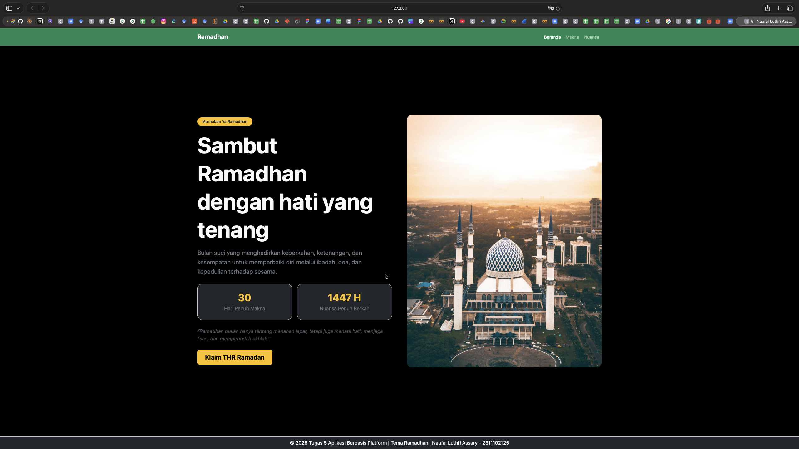
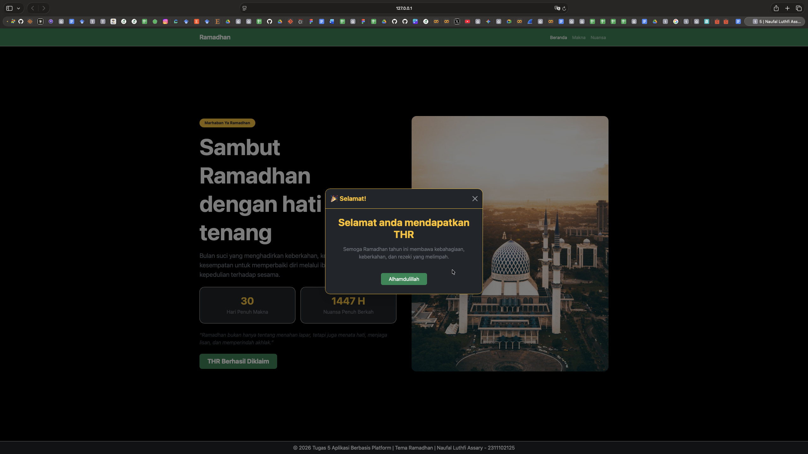

<div align="center">
  <br />
  <h1>LAPORAN PRAKTIKUM <br>APLIKASI BERBASIS PLATFORM</h1>
  <br />
  <h3>MODUL 5 <br> JAVASCRIPT & JQUERY</h3>
  <br />
  <br />
   
  <br />
  <br />
  <br />
  <br />
  <h3>Disusun Oleh :</h3>
  <p>
    <strong>NAUFAL LUTHFI ASSARY</strong><br>
    <strong>2311102125</strong><br>
    <strong>S1 IF-11-REG01</strong>
  </p>
  <br />
  <h3>Dosen Pengampu :</h3>
  <p>
    <strong>Dimas Fanny Hebrasianto Permadi, S.ST., M.Kom</strong>
  </p>
  <br />
  <br />
    <h4>Asisten Praktikum :</h4>
    <strong> Apri Pandu Wicaksono </strong> <br>
    <strong>Rangga Pradarrell Fathi</strong>
  <br />
  <h3>LABORATORIUM HIGH PERFORMANCE
 <br>FAKULTAS INFORMATIKA <br>UNIVERSITAS TELKOM PURWOKERTO <br>2026</h3>
</div>

---

## 1. Dasar Teori

**JavaScript** merupakan bahasa pemrograman *scripting* yang digunakan untuk membuat halaman web menjadi lebih dinamis dan interaktif. Dalam modul dijelaskan bahwa JavaScript pada awalnya digunakan untuk mengontrol program berbasis Java, namun seiring perkembangan web, JavaScript berkembang menjadi bahasa utama yang digunakan untuk memanipulasi isi dokumen HTML di dalam browser. Dengan JavaScript, halaman yang awalnya hanya menampilkan konten statis dapat diubah menjadi halaman yang mampu merespons aksi pengguna secara langsung.  

JavaScript memiliki beberapa prinsip dasar yang mendukung berbagai paradigma pemrograman, yaitu imperatif, fungsional, dan orientasi objek. Hal ini membuat JavaScript cukup fleksibel untuk digunakan dalam berbagai kebutuhan pemrograman web. Selain itu, JavaScript memiliki beberapa tipe data dasar seperti *number*, *string*, *boolean*, *object*, *function*, *array*, *date*, *null*, dan *undefined*. Keberadaan tipe data tersebut memungkinkan pengembang mengolah berbagai jenis data di dalam program sesuai kebutuhan. 

Dalam JavaScript, variabel digunakan sebagai tempat penyimpanan data sementara. Modul menjelaskan bahwa variabel dibuat menggunakan kata kunci `var`, dan nilai di dalam variabel dapat diubah, bahkan tipe datanya pun dapat berganti. Selain variabel, JavaScript juga memiliki array yang digunakan untuk menampung banyak data sekaligus. Array pada JavaScript ditulis menggunakan tanda kurung siku `[]`, dan setiap elemennya dapat memiliki tipe data yang berbeda. Fitur ini memudahkan pengelolaan data yang beragam dalam satu wadah. 

JavaScript juga mendukung struktur pengendalian program seperti percabangan dan perulangan. Percabangan dapat dilakukan dengan `if`, `else if`, dan `else`, sedangkan perulangan dapat menggunakan `for`, `while`, dan `do while`. Pada modul juga dijelaskan bahwa untuk perbandingan nilai yang lebih akurat disarankan menggunakan operator `===`, karena operator ini membandingkan nilai sekaligus tipe datanya. Dengan adanya struktur kontrol tersebut, program dapat mengambil keputusan dan melakukan pengulangan proses sesuai kondisi tertentu. 

Selain itu, JavaScript mendukung konsep objek. Objek dalam JavaScript didefinisikan sebagai kumpulan properti yang nilainya dapat berubah. Pembuatan objek dapat dilakukan dengan notasi *object literal*, yaitu menggunakan tanda kurung kurawal `{}` yang berisi pasangan nama properti dan nilainya. Properti objek dapat diakses menggunakan notasi titik (`.`) atau kurung siku (`[]`). Dukungan terhadap objek ini menjadikan JavaScript mampu menerapkan konsep pemrograman berorientasi objek secara fleksibel. 

Fungsi dalam JavaScript digunakan untuk membungkus satu atau lebih perintah agar dapat dipanggil kembali saat diperlukan. Modul menjelaskan bahwa fungsi bermanfaat untuk *code reuse* dan *information hiding*. Fungsi dapat ditulis dengan dua cara, yaitu *function declaration* dan *function expression*. Ketika fungsi dipanggil, perintah-perintah di dalamnya akan dijalankan, dan fungsi dapat mengembalikan nilai menggunakan kata kunci `return`. Dengan demikian, fungsi menjadi bagian penting dalam menyusun program yang lebih terstruktur dan efisien.  

Selain JavaScript, modul juga membahas **jQuery**, yaitu library JavaScript yang dibuat oleh John Resig pada tahun 2006. jQuery memungkinkan manipulasi dokumen HTML dilakukan hanya dalam beberapa baris kode. Beberapa fitur utama jQuery yang dijelaskan dalam modul meliputi *DOM manipulation*, *event handling*, *AJAX support*, *animations*, dan ukuran library yang ringan. Dengan jQuery, pengembang dapat membuat halaman web interaktif dengan sintaks yang lebih sederhana dibandingkan JavaScript murni.  

jQuery dapat digunakan dengan dua cara, yaitu instalasi lokal dan menggunakan CDN (*Content Delivery Network*). Instalasi lokal dilakukan dengan mengunduh file library jQuery dan meletakkannya di folder proyek, kemudian memanggilnya melalui tag `<script>`. Sementara itu, penggunaan CDN dilakukan dengan memanggil file jQuery secara online melalui tautan tertentu. Penggunaan CDN lebih praktis karena tidak memerlukan proses unduh manual dan cocok digunakan untuk pengembangan web yang cepat. 

---

## 2. Penjelasan Kode HTML

Berikut merupakan implementasi Tema Ramadhan dengan menggunakan HTML. Tugas 5, Buka kembali halaman ramadan dan tambahkan button atau semacam nya ketika di klik akan menampilkan modal "selamat anda mendapatkan THR" buat se interaktif itu dan sebagus mungkin.

### Kode HTML (`Ramadhan.html`)

```html
<!DOCTYPE html>
<html lang="id">
<head>
  <meta charset="UTF-8">
  <meta name="viewport" content="width=device-width, initial-scale=1.0">
  <title>Ramadhan - Tugas 5 | Naufal Luthfi Assary-2311102125 </title>

  <!-- Bootstrap CSS -->
  <link href="https://cdn.jsdelivr.net/npm/bootstrap@5.3.3/dist/css/bootstrap.min.css" rel="stylesheet">
</head>
<body class="bg-black text-light vh-100 overflow-hidden d-flex flex-column">

  <!-- Navbar -->
  <nav class="navbar navbar-expand-lg navbar-dark bg-success border-bottom border-secondary-subtle flex-shrink-0">
    <div class="container">
      <a class="navbar-brand fw-semibold" href="#">Ramadhan</a>

      <div class="collapse navbar-collapse show">
        <ul class="navbar-nav ms-auto small">
          <li class="nav-item"><a class="nav-link active" href="#">Beranda</a></li>
          <li class="nav-item"><a class="nav-link" href="#">Makna</a></li>
          <li class="nav-item"><a class="nav-link" href="#">Nuansa</a></li>
        </ul>
      </div>
    </div>
  </nav>

  <!-- Main -->
  <main class="flex-grow-1 d-flex align-items-center">
    <div class="container">
      <div class="row align-items-center g-5">

        <!-- Kiri -->
        <div class="col-lg-6">
          <span class="badge rounded-pill text-bg-warning text-dark px-3 py-2 mb-3">
            Marhaban Ya Ramadhan
          </span>

          <h1 class="display-2 fw-bold lh-sm mb-3">
            Sambut Ramadhan<br>
            dengan hati yang tenang
          </h1>

          <p class="fs-5 text-secondary mb-4" id="deskripsiRamadan">
            Bulan suci yang menghadirkan keberkahan, ketenangan, dan kesempatan
            untuk memperbaiki diri melalui ibadah, doa, dan kepedulian terhadap sesama.
          </p>

          <div class="row g-3 mb-4">
            <div class="col-6">
              <div class="card bg-dark border border-secondary-subtle text-light shadow-sm h-100 rounded-4">
                <div class="card-body text-center py-4">
                  <h2 class="fw-bold text-warning mb-1">30</h2>
                  <p class="mb-0 text-secondary">Hari Penuh Makna</p>
                </div>
              </div>
            </div>

            <div class="col-6">
              <div class="card bg-dark border border-secondary-subtle text-light shadow-sm h-100 rounded-4">
                <div class="card-body text-center py-4">
                  <h2 class="fw-bold text-warning mb-1">1447 H</h2>
                  <p class="mb-0 text-secondary">Nuansa Penuh Berkah</p>
                </div>
              </div>
            </div>
          </div>

          <p class="mb-4 text-light-emphasis fst-italic" id="quoteRamadan">
            “Ramadhan bukan hanya tentang menahan lapar, tetapi juga menata hati,
            menjaga lisan, dan memperindah akhlak.”
          </p>

          <!-- Button THR -->
          <button
            type="button"
            id="btnThr"
            class="btn btn-warning btn-lg fw-bold px-4 py-2 shadow"
            data-bs-toggle="modal"
            data-bs-target="#modalTHR">
            Klaim THR Ramadhan
          </button>
        </div>

        <!-- Kanan -->
        <div class="col-lg-6">
          <div class="card border-0 bg-dark shadow-lg rounded-4 overflow-hidden">
            
          </div>
        </div>

      </div>
    </div>
  </main>

  <!-- Footer -->
  <footer class="py-2 bg-dark text-white text-center border-top border-secondary-subtle flex-shrink-0">
    <div class="container">
      <p class="mb-0">© 2026 Tugas 5 Aplikasi Berbasis Platform | Tema Ramadhan | Naufal Luthfi Assary - 2311102125</p>
    </div>
  </footer>

  <!-- Modal -->
  <div class="modal fade" id="modalTHR" tabindex="-1" aria-labelledby="modalTHRLabel" aria-hidden="true">
    <div class="modal-dialog modal-dialog-centered">
      <div class="modal-content bg-dark text-light border border-warning rounded-4 shadow-lg">

        <div class="modal-header border-warning">
          <h5 class="modal-title fw-bold text-warning" id="modalTHRLabel">
            🎉 Selamat!
          </h5>
          <button type="button" class="btn-close btn-close-white" data-bs-dismiss="modal" aria-label="Close"></button>
        </div>

        <div class="modal-body text-center py-4">
          <h2 class="fw-bold text-warning mb-3">Selamat anda mendapatkan THR</h2>
          <p class="text-secondary mb-0">
            Semoga Ramadhan tahun ini membawa kebahagiaan, keberkahan, dan rezeki yang melimpah.
          </p>
        </div>

        <div class="modal-footer border-0 justify-content-center pb-4">
          <button type="button" class="btn btn-success px-4" data-bs-dismiss="modal">Alhamdulillah</button>
        </div>

      </div>
    </div>
  </div>

  <!-- jQuery -->
  <script src="https://code.jquery.com/jquery-3.7.1.min.js"></script>

  <!-- Bootstrap JS -->
  <script src="https://cdn.jsdelivr.net/npm/bootstrap@5.3.3/dist/js/bootstrap.bundle.min.js"></script>

  <!-- Interaksi -->
  <script>
    $(document).ready(function () {
      $("#btnThr").click(function () {
        $("#deskripsiRamadan").slideUp(200).slideDown(200);
        $("#quoteRamadan").fadeOut(200).fadeIn(400);
        $(this).removeClass("btn-warning").addClass("btn-success");
        $(this).text("THR Berhasil Diklaim");
      });

      $("#modalTHR").on("hidden.bs.modal", function () {
        $("#btnThr").removeClass("btn-success").addClass("btn-warning");
        $("#btnThr").text("Klaim THR Ramadan");
      });
    });
  </script>
</body>
</html>

```

### Hasil Tampilan (Screenshot)




### Penjelasan Code:

- `<DOCTYPE html>`
  - Digunakan untuk menyatakan bahwa dokumen yang dibuat menggunakan HTML5.

- `<html lang="id">`
  - Merupakan tag utama yang menandai awal dan akhir seluruh dokumen HTML.
  - Atribut `lang="id"` menunjukkan bahwa bahasa utama pada halaman adalah Bahasa Indonesia.

- `<head>`
  - Berisi informasi halaman yang tidak langsung tampil di isi web.

- `<meta charset="UTF-8">`
  - Digunakan untuk mengatur *encoding* karakter agar teks dapat ditampilkan dengan baik.

- `<meta name="viewport" content="width=device-width, initial-scale=1.0">`
  - Membuat tampilan halaman menjadi responsif di berbagai ukuran layar.

- `<title>Ramadan Kareem - Tugas 5</title>`
  - Menampilkan judul halaman pada tab browser.

- `<link href="https://cdn.jsdelivr.net/npm/bootstrap@5.3.3/dist/css/bootstrap.min.css" rel="stylesheet">`
  - Menghubungkan file HTML dengan framework Bootstrap melalui CDN.
  - Digunakan agar halaman dapat menggunakan class bawaan Bootstrap untuk mempercepat pembuatan tampilan.

- `<body class="bg-black text-light vh-100 overflow-hidden d-flex flex-column">`
  - Merupakan bagian utama yang berisi seluruh elemen yang tampil pada halaman web.
  - `bg-black` digunakan untuk memberi warna latar hitam.
  - `text-light` digunakan agar teks berwarna terang.
  - `vh-100` membuat tinggi halaman memenuhi 1 layar penuh.
  - `overflow-hidden` membuat halaman tidak bisa di-*scroll*.
  - `d-flex flex-column` digunakan untuk menyusun elemen secara vertikal.

- `<nav class="navbar navbar-expand-lg navbar-dark bg-success border-bottom border-secondary-subtle flex-shrink-0">`
  - Digunakan untuk membuat bagian **navbar** atau navigasi halaman.
  - `navbar` merupakan class utama Bootstrap untuk navigasi.
  - `navbar-expand-lg` membuat navbar responsif pada layar besar.
  - `navbar-dark` digunakan agar teks navbar terlihat jelas pada background gelap.
  - `bg-success` memberi warna hijau pada navbar.
  - `border-bottom border-secondary-subtle` menambahkan garis tipis di bagian bawah navbar.
  - `flex-shrink-0` menjaga ukuran navbar agar tidak menyusut.

- `<div class="container">`
  - Digunakan sebagai wadah utama agar isi halaman berada di tengah dan rapi.

- `<a class="navbar-brand fw-semibold" href="#">Ramadhan</a>`
  - Menampilkan nama brand atau judul website pada navbar.
  - `fw-semibold` membuat teks terlihat lebih tegas.

- `<div class="collapse navbar-collapse show">`
  - Menjadi wadah menu navigasi pada navbar.

- `<ul class="navbar-nav ms-auto small">`
  - Digunakan untuk menampung daftar menu navbar.
  - `ms-auto` membuat posisi menu berada di sebelah kanan.
  - `small` membuat ukuran teks menu lebih kecil.

- `<li class="nav-item"><a class="nav-link active" href="#">Beranda</a></li>`
  - Membuat item menu **Beranda**.
  - `active` menunjukkan bahwa menu tersebut sedang aktif.

- `<li class="nav-item"><a class="nav-link" href="#">Makna</a></li>`
  - Membuat item menu **Makna**.

- `<li class="nav-item"><a class="nav-link" href="#">Nuansa</a></li>`
  - Membuat item menu **Nuansa**.

- `<main class="flex-grow-1 d-flex align-items-center">`
  - Menjadi wadah isi utama halaman.
  - `flex-grow-1` membuat bagian ini mengisi sisa ruang di antara navbar dan footer.
  - `d-flex align-items-center` membuat isi konten berada di tengah secara vertikal.

- `<div class="row align-items-center g-5">`
  - Digunakan untuk membuat layout grid Bootstrap.
  - `align-items-center` membuat isi kolom sejajar di tengah.
  - `g-5` memberi jarak antar kolom.

- `<div class="col-lg-6">`
  - Digunakan untuk membagi halaman menjadi dua kolom dengan lebar masing-masing 6 grid pada layar besar.

- `<span class="badge rounded-pill text-bg-warning text-dark px-3 py-2 mb-3">Marhaban Ya Ramadan</span>`
  - Digunakan untuk menampilkan *badge* atau label kecil.
  - `rounded-pill` membuat bentuk badge menjadi lonjong.
  - `text-bg-warning` memberi warna kuning pada badge.
  - `text-dark` membuat teks badge berwarna gelap.
  - `px-3 py-2` memberi *padding*.
  - `mb-3` memberi jarak bawah.

- `<h1 class="display-2 fw-bold lh-sm mb-3">`
  - Digunakan untuk menampilkan judul utama halaman.
  - `display-2` membuat ukuran huruf sangat besar.
  - `fw-bold` membuat teks tebal.
  - `lh-sm` mengatur jarak antarbaris menjadi lebih rapat.
  - `mb-3` memberi margin bawah.

- `<p class="fs-5 text-secondary mb-4" id="deskripsiRamadan">`
  - Digunakan untuk menampilkan deskripsi utama halaman.
  - `fs-5` membuat ukuran teks lebih besar dari normal.
  - `text-secondary` memberi warna abu-abu.
  - `mb-4` memberi jarak bawah.
  - `id="deskripsiRamadan"` digunakan agar elemen ini dapat dipanggil oleh jQuery untuk diberi efek animasi.

- `<div class="row g-3 mb-4">`
  - Digunakan untuk membuat baris yang berisi dua *card* informasi.
  - `g-3` memberi jarak antar *card*.
  - `mb-4` memberi margin bawah.

- `<div class="card bg-dark border border-secondary-subtle text-light shadow-sm h-100 rounded-4">`
  - Digunakan untuk membuat *card* informasi.
  - `bg-dark` memberi latar belakang gelap.
  - `border border-secondary-subtle` memberi garis tepi tipis.
  - `text-light` membuat warna teks terang.
  - `shadow-sm` memberi bayangan halus.
  - `h-100` membuat tinggi *card* seragam.
  - `rounded-4` membuat sudut *card* membulat.

- `<div class="card-body text-center py-4">`
  - Menjadi isi utama dari *card*.
  - `text-center` membuat isi *card* rata tengah.
  - `py-4` memberi *padding* atas dan bawah.

- `<h2 class="fw-bold text-warning mb-1">30</h2>`
  - Menampilkan angka utama pada *card* pertama.
  - `fw-bold` membuat teks tebal.
  - `text-warning` memberi warna kuning emas.
  - `mb-1` memberi jarak bawah kecil.

- `<p class="mb-0 text-secondary">Hari Penuh Makna</p>`
  - Menampilkan keterangan *card* pertama.

- `<h2 class="fw-bold text-warning mb-1">1447 H</h2>`
  - Menampilkan informasi tahun Hijriah pada *card* kedua.

- `<p class="mb-0 text-secondary">Nuansa Penuh Berkah</p>`
  - Menampilkan deskripsi untuk *card* kedua.

- `<p class="mb-4 text-light-emphasis fst-italic" id="quoteRamadan">`
  - Digunakan untuk menampilkan kutipan bertema Ramadan.
  - `text-light-emphasis` memberi warna teks terang yang lebih lembut.
  - `fst-italic` membuat teks menjadi miring.
  - `mb-4` memberi jarak bawah.
  - `id="quoteRamadan"` digunakan agar elemen ini dapat dipanggil oleh jQuery untuk diberikan efek *fade*.

- `<button type="button" id="btnThr" class="btn btn-warning btn-lg fw-bold px-4 py-2 shadow" data-bs-toggle="modal" data-bs-target="#modalTHR">`
  - Digunakan untuk membuat tombol interaktif.
  - `type="button"` menandakan bahwa elemen ini adalah tombol.
  - `id="btnThr"` digunakan agar tombol dapat dipanggil dan dimanipulasi dengan jQuery.
  - `btn` adalah class dasar Bootstrap untuk tombol.
  - `btn-warning` memberi warna kuning pada tombol.
  - `btn-lg` membuat ukuran tombol lebih besar.
  - `fw-bold` membuat teks tombol tebal.
  - `px-4 py-2` memberi *padding* agar tombol terlihat proporsional.
  - `shadow` memberi efek bayangan pada tombol.
  - `data-bs-toggle="modal"` digunakan untuk mengaktifkan modal Bootstrap.
  - `data-bs-target="#modalTHR"` menentukan bahwa tombol akan membuka modal dengan id `modalTHR`.

- `Klaim THR Ramadan`
  - Merupakan teks awal yang ditampilkan pada tombol.

- `<div class="card border-0 bg-dark shadow-lg rounded-4 overflow-hidden">`
  - Digunakan sebagai wadah gambar utama.
  - `border-0` menghilangkan garis tepi.
  - `bg-dark` memberi warna latar gelap.
  - `shadow-lg` memberi bayangan besar agar lebih elegan.
  - `rounded-4` membuat sudut *card* membulat.
  - `overflow-hidden` memastikan gambar mengikuti bentuk *card*.

- ``
  - Digunakan untuk menampilkan gambar utama bertema Ramadan.
  - `img-fluid` membuat gambar responsif.
  - `max-height: 60vh` membatasi tinggi gambar maksimal 60% dari tinggi layar.
  - `width: 100%` membuat gambar memenuhi lebar *card*.
  - `object-fit: cover` menjaga gambar tetap proporsional dan rapi.

- `<footer class="py-2 bg-dark text-white text-center border-top border-secondary-subtle flex-shrink-0">`
  - Digunakan untuk membuat bagian *footer* atau penutup halaman.
  - `py-2` memberi *padding* atas dan bawah.
  - `bg-dark` memberi latar belakang gelap.
  - `text-white` membuat teks berwarna putih.
  - `text-center` membuat isi *footer* rata tengah.
  - `border-top border-secondary-subtle` memberi garis tipis di bagian atas *footer*.
  - `flex-shrink-0` menjaga *footer* agar tidak mengecil.

- `<p class="mb-0">© 2026 Tugas 5 Aplikasi Berbasis Platform | Tema Ramadhan | Naufal Luthfi Assary - 2311102125</p>`
  - Menampilkan identitas tugas, tema, nama mahasiswa, dan NIM.
  - `mb-0` menghilangkan margin bawah agar *footer* terlihat ringkas.

- `<div class="modal fade" id="modalTHR" tabindex="-1" aria-labelledby="modalTHRLabel" aria-hidden="true">`
  - Digunakan untuk membuat modal Bootstrap.
  - `modal` adalah class utama modal.
  - `fade` memberi efek transisi saat modal muncul atau menghilang.
  - `id="modalTHR"` digunakan sebagai identitas modal agar dapat dipanggil oleh tombol.
  - `tabindex="-1"` digunakan agar modal dapat menerima fokus.
  - `aria-labelledby="modalTHRLabel"` menghubungkan modal dengan judulnya untuk aksesibilitas.
  - `aria-hidden="true"` menunjukkan bahwa modal awalnya tersembunyi.

- `<div class="modal-dialog modal-dialog-centered">`
  - Digunakan untuk membungkus isi modal.
  - `modal-dialog-centered` membuat modal tampil di tengah layar.

- `<div class="modal-content bg-dark text-light border border-warning rounded-4 shadow-lg">`
  - Digunakan sebagai isi utama modal.
  - `bg-dark` memberi *background* gelap.
  - `text-light` memberi teks warna terang.
  - `border border-warning` memberi *border* kuning.
  - `rounded-4` membuat sudut membulat.
  - `shadow-lg` memberi bayangan besar agar modal terlihat menonjol.

- `<div class="modal-header border-warning">`
  - Digunakan sebagai *header* modal.
  - `border-warning` memberi garis dengan warna kuning.

- `<h5 class="modal-title fw-bold text-warning" id="modalTHRLabel">🎉 Selamat!</h5>`
  - Menampilkan judul modal.
  - `modal-title` adalah class Bootstrap untuk judul modal.
  - `fw-bold` membuat teks tebal.
  - `text-warning` memberi warna kuning.

- `<button type="button" class="btn-close btn-close-white" data-bs-dismiss="modal" aria-label="Close"></button>`
  - Digunakan untuk menutup modal.
  - `btn-close` adalah tombol *close* bawaan Bootstrap.
  - `btn-close-white` membuat ikon *close* berwarna putih.
  - `data-bs-dismiss="modal"` membuat tombol dapat menutup modal.

- `<div class="modal-body text-center py-4">`
  - Digunakan untuk isi utama modal.
  - `text-center` membuat isi modal rata tengah.
  - `py-4` memberi *padding* atas dan bawah.

- `<h2 class="fw-bold text-warning mb-3">Selamat anda mendapatkan THR</h2>`
  - Menampilkan pesan utama pada modal.
  - `fw-bold` membuat teks tebal.
  - `text-warning` memberi warna kuning.
  - `mb-3` memberi jarak bawah.

- `<p class="text-secondary mb-0">`
  - Menampilkan deskripsi tambahan pada modal.
  - `text-secondary` memberi warna abu-abu.
  - `mb-0` menghilangkan margin bawah.

- `<div class="modal-footer border-0 justify-content-center pb-4">`
  - Digunakan untuk bagian *footer* modal.
  - `border-0` menghilangkan garis tepi.
  - `justify-content-center` membuat tombol berada di tengah.
  - `pb-4` memberi *padding* bawah.

- `<button type="button" class="btn btn-success px-4" data-bs-dismiss="modal">Alhamdulillah</button>`
  - Digunakan sebagai tombol untuk menutup modal.
  - `btn btn-success` memberi tampilan tombol hijau Bootstrap.
  - `px-4` memberi *padding* horizontal.
  - `data-bs-dismiss="modal"` membuat tombol dapat menutup modal.

- `<script src="https://code.jquery.com/jquery-3.7.1.min.js"></script>`
  - Digunakan untuk memanggil library jQuery.
  - jQuery digunakan agar manipulasi elemen HTML dan efek animasi menjadi lebih mudah.

- `<script src="https://cdn.jsdelivr.net/npm/bootstrap@5.3.3/dist/js/bootstrap.bundle.min.js"></script>`
  - Digunakan untuk memanggil file JavaScript Bootstrap.
  - Script ini diperlukan agar komponen interaktif Bootstrap seperti modal dapat berjalan.

- `$(document).ready(function () { ... });`
  - Digunakan agar seluruh kode jQuery dijalankan setelah dokumen HTML selesai dimuat.

- `$("#btnThr").click(function () { ... });`
  - Digunakan untuk mendeteksi ketika tombol THR diklik.

- `$("#deskripsiRamadan").slideUp(200).slideDown(200);`
  - Memberi efek animasi pada paragraf deskripsi.
  - `slideUp(200)` membuat elemen menghilang ke atas selama 200 milidetik.
  - `slideDown(200)` menampilkan kembali elemen dari atas selama 200 milidetik.

- `$("#quoteRamadan").fadeOut(200).fadeIn(400);`
  - Memberi efek memudar pada kutipan.
  - `fadeOut(200)` membuat elemen menghilang perlahan.
  - `fadeIn(400)` membuat elemen muncul kembali secara perlahan.

- `$(this).removeClass("btn-warning").addClass("btn-success");`
  - Digunakan untuk mengubah warna tombol setelah diklik.
  - `removeClass("btn-warning")` menghapus warna kuning.
  - `addClass("btn-success")` menambahkan warna hijau.

- `$(this).text("THR Berhasil Diklaim");`
  - Mengubah teks tombol setelah tombol ditekan.

- `$("#modalTHR").on("hidden.bs.modal", function () { ... });`
  - Digunakan untuk menjalankan aksi ketika modal selesai ditutup.

- `$("#btnThr").removeClass("btn-success").addClass("btn-warning");`
  - Mengembalikan warna tombol dari hijau ke kuning setelah modal ditutup.

- `$("#btnThr").text("Klaim THR Ramadan");`
  - Mengembalikan teks tombol ke kondisi awal setelah modal ditutup.


## Refrensi
- [Materi Modul 5](https://drive.google.com/file/d/1J27NhEO2MbOF9DetZmOtEGAcPkczzm1r/view?usp=sharing)