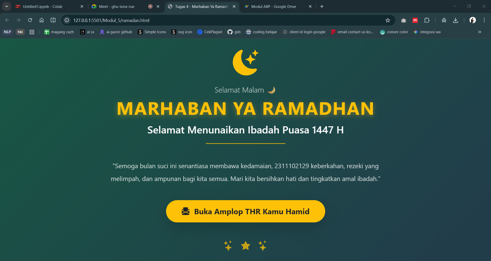

<div align="center">
  <br />
  <h1>LAPORAN PRAKTIKUM <br>APLIKASI BERBASIS PLATFORM</h1>
  <br />
  <h3>MODUL 5 <br> JAVASCRIPT</h3>
  <br />
  <br />
   
  <br />
  <br />
  <br />
  <br />
  <h3>Disusun Oleh :</h3>
  <p>
    <strong>HAMID SABIRIN</strong><br>
    <strong>2311102129</strong><br>
    <strong>S1 IF-11-REG01</strong>
  </p>
  <br />
  <br />
  <h3>Dosen Pengampu :</h3>
  <p>
    <strong>Dimas Fanny Hebrasianto Permadi, S.ST., M.Kom</strong>
  </p>
  <br />
  <br />
    <h4>Asisten Praktikum :</h4>
    <strong> Apri Pandu Wicaksono </strong> <br>
    <strong>Rangga Pradarrell Fathi</strong>
  <br />
  <h3>LABORATORIUM HIGH PERFORMANCE
 <br>FAKULTAS INFORMATIKA <br>UNIVERSITAS TELKOM PURWOKERTO <br>2026</h3>
</div>

---

## 1. Dasar Teori

**JavaScript (JS)** adalah bahasa pemrograman tingkat tinggi yang digunakan untuk membuat halaman web menjadi interaktif, dinamis, dan responsif. JavaScript awalnya dikembangkan untuk bekerja di sisi klien (browser) untuk berinteraksi dengan pengguna, mengubah tampilan halaman tanpa harus memuat ulang, serta memvalidasi input dari formulir sebelum dikirim ke server.

Melalui **DOM (Document Object Model)**, JavaScript dapat berinteraksi dengan logikal struktur dokumen HTML untuk memanipulasi, menambah, atau menghapus elemen dan memodifikasi properti styling CSS secara dinamis sesuai dengan *event* (kejadian) interaksi yang dilakukan oleh pengguna (tindakan klik, hover, menggulir tetikus, dan lainnya). JavaScript modern kini juga digunakan di sisi server melalui *environment* seperti Node.js.

---

## 2. Penjelasan Kode HTML, CSS, dan JS

Berikut ini adalah implementasi interaktif antarmuka ucapan "Marhaban Ya Ramadhan" dengan fitur "Buka Amplop THR" menggunakan interaksi tingkat *Document Object Model* (DOM) yang ditulis murni dalam tata JavaScript.

### Kode HTML (`ramadan.html`)

```html
<!doctype html>
<html lang="id">
  <head>
    <meta charset="UTF-8" />
    <meta name="viewport" content="width=device-width, initial-scale=1.0" />
    <title>Tugas 4 - Marhaban Ya Ramadhan</title>

    <link
      href="https://cdn.jsdelivr.net/npm/bootstrap@5.3.3/dist/css/bootstrap.min.css"
      rel="stylesheet"
    />
    <link
      rel="stylesheet"
      href="https://cdn.jsdelivr.net/npm/bootstrap-icons@1.11.3/font/bootstrap-icons.min.css"
    />
    <script src="https://cdn.jsdelivr.net/npm/canvas-confetti@1.6.0/dist/confetti.browser.min.js"></script>
    <link rel="stylesheet" href="style.css" />
  </head>
  <body class="text-light">
    <div class="bg-animated position-relative">
      <div
        class="fullscreen-glass d-flex flex-column justify-content-center align-items-center text-center p-4"
      >
        <div class="content-wrapper w-100">
          <div class="display-1 text-warning mb-4">
            <i class="bi bi-moon-stars-fill shadow-sm"></i>
          </div>

          <h4 id="dynamic-greeting" class="text-light opacity-75 mb-2 fw-light">
            Selamat Datang
          </h4>
          <h1 class="title-ramadhan text-warning fw-bolder mb-3 text-uppercase">
            Marhaban Ya Ramadhan
          </h1>
          <h2 class="fw-semibold text-light mb-4 fs-2">
            Selamat Menunaikan Ibadah Puasa 1447 H
          </h2>

          <hr
            class="border-warning border-3 opacity-75 w-25 mx-auto mb-5 rounded"
          />

          <p class="fs-5 text-light text-opacity-75 mb-5 lh-lg px-md-5">
            "Semoga bulan suci ini senantiasa membawa kedamaian, 2311102129
            keberkahan, rezeki yang melimpah, dan ampunan bagi kita semua. Mari
            kita bersihkan hati dan tingkatkan amal ibadah."
          </p>

          <div class="mt-4 mb-5">
            <button
              type="button"
              id="btn-klaim"
              class="btn btn-warning rounded-pill fw-bolder text-dark px-5 py-3 fs-4 pulse-btn shadow-lg"
              data-bs-toggle="modal"
              data-bs-target="#thrModal"
            >
              <i class="bi bi-envelope-paper-fill me-2"></i> Buka Amplop THR
              Kamu Hamid
            </button>
          </div>

          <div
            class="mt-5 text-warning opacity-75 d-flex justify-content-center align-items-center gap-4 fs-2"
          >
            <i class="bi bi-stars"></i>
            <i class="bi bi-star-fill fs-3"></i>
            <i class="bi bi-stars"></i>
          </div>
        </div>
      </div>
    </div>

    <div
      class="modal fade"
      id="thrModal"
      tabindex="-1"
      aria-labelledby="thrModalLabel"
      aria-hidden="true"
    >
      <div class="modal-dialog modal-dialog-centered">
        <div
          class="modal-content bg-dark bg-opacity-75 text-light text-center border-warning border-2 rounded-4"
          style="backdrop-filter: blur(15px)"
        >
          <div class="modal-header border-0 pb-0 justify-content-end">
            <button
              type="button"
              class="btn-close btn-close-white"
              data-bs-dismiss="modal"
              aria-label="Close"
            ></button>
          </div>

          <div class="modal-body pt-0 pb-5 px-4">
            <div class="display-1 text-warning mb-3">
              <i class="bi bi-envelope-open-heart-fill shake-icon"></i>
            </div>

            <h2 class="fw-bolder text-warning mb-2">Selamat! 🎉</h2>
            <p class="mb-4 fs-5">
              Anda mendapatkan THR spesial dari <br /><span
                class="fw-bold text-white"
                >Hamid Sabirin</span
              >
              sebesar:
            </p>

            <div
              class="bg-black bg-opacity-50 border border-warning rounded-4 py-3 px-4 mb-4 d-inline-block shadow-lg"
            >
              <h1
                id="thr-result"
                class="fw-bold text-warning mb-0 m-0 display-5"
              >
                Rp 0
              </h1>
            </div>

            <p
              id="thr-message"
              class="text-light text-opacity-75 mb-0 small px-3"
            >
              Semoga rezekinya berkah, puasanya lancar, dan jangan lupa sebagian
              disedekahkan ya. 🕌✨
            </p>

            <button
              type="button"
              class="btn btn-outline-warning rounded-pill mt-4 px-4 py-2 fw-bold"
              data-bs-dismiss="modal"
            >
              Alhamdulillah!
            </button>
          </div>
        </div>
      </div>
    </div>

    <script src="https://cdn.jsdelivr.net/npm/bootstrap@5.3.3/dist/js/bootstrap.bundle.min.js"></script>
    <script src="main.js"></script>
  </body>
</html>
```

### Kode CSS (`style.css`)

```css
body,
html {
  margin: 0;
  padding: 0;
  width: 100%;
  height: 100%;
  overflow-x: hidden; 
}

.bg-animated {
  background: linear-gradient(-45deg, #0f2027, #203a43, #2c5364, #198754);
  background-size: 400% 400%;
  animation: gradientBG 15s ease infinite;
  min-height: 100vh;
  width: 100vw;
}

@keyframes gradientBG {
  0% {
    background-position: 0% 50%;
  }
  50% {
    background-position: 100% 50%;
  }
  100% {
    background-position: 0% 50%;
  }
}

.fullscreen-glass {
  background: rgba(0, 0, 0, 0.25); 
  backdrop-filter: blur(10px); 
  -webkit-backdrop-filter: blur(10px);
  min-height: 100vh;
  width: 100vw;
}

.title-ramadhan {
  /* Ukurannya sudah saya perkecil */
  font-size: clamp(1.8rem, 4vw, 3.5rem);
  letter-spacing: 2px;
  text-shadow: 0 4px 15px rgba(255, 193, 7, 0.4);
}

.content-wrapper {
  max-width: 1000px;
}

.pulse-btn {
  animation: pulse-animation 2s infinite;
  transition: all 0.3s ease;
}

.pulse-btn:hover {
  transform: scale(1.05);
  animation: none;
  box-shadow: 0 0 25px rgba(255, 193, 7, 0.6);
}

@keyframes pulse-animation {
  0% {
    box-shadow: 0 0 0 0 rgba(255, 193, 7, 0.7);
  }
  70% {
    box-shadow: 0 0 0 20px rgba(255, 193, 7, 0);
  }
  100% {
    box-shadow: 0 0 0 0 rgba(255, 193, 7, 0);
  }
}

.shake-icon {
  display: inline-block;
  animation: shake-animation 2.5s infinite;
}

@keyframes shake-animation {
  0%,
  100% {
    transform: rotate(0deg);
  }
  10%,
  30%,
  50% {
    transform: rotate(15deg);
  }
  20%,
  40% {
    transform: rotate(-15deg);
  }
  60% {
    transform: rotate(0deg);
  }
}
```

### Kode JS (`main.js`)

```javascript
const hour = new Date().getHours();
let greeting = "Selamat Datang";

if (hour >= 3 && hour < 11) greeting = "Selamat Pagi 🌅";
else if (hour >= 11 && hour < 15) greeting = "Selamat Siang ☀️";
else if (hour >= 15 && hour < 18) greeting = "Selamat Sore 🌇";
else greeting = "Selamat Malam 🌙";

document.getElementById("dynamic-greeting").innerText = greeting;

// Logika Gacha THR
const thrAmounts = [
    "Rp 50.000 💵",
    "Rp 100.000 💸",
    "Rp 250.000 💰",
    "Rp 500.000 🤑",
    "Rp 1.000.000 💳",
    "Pahala Puasa 🕌",
    "Zonk! Coba Lagi 🤣",
];

const thrModal = document.getElementById("thrModal");
const thrResult = document.getElementById("thr-result");
const thrMessage = document.getElementById("thr-message");

thrModal.addEventListener("show.bs.modal", (event) => {
    thrResult.innerHTML =
        '<div class="spinner-border text-warning" role="status"><span class="visually-hidden">Loading...</span></div>';

    setTimeout(() => {
        const randomThr =
            thrAmounts[Math.floor(Math.random() * thrAmounts.length)];
        thrResult.innerText = randomThr;

        if (randomThr.includes("Zonk")) {
            thrMessage.innerText =
                "Waduh, belum beruntung nih. Jangan menyerah, coba klik lagi amplopnya! hehehe ✌️";
        } else {
            thrMessage.innerText =
                "Semoga rezekinya berkah, puasanya lancar, dan jangan lupa sebagian disedekahkan ya. 🕌✨";

            confetti({
                particleCount: 150,
                spread: 90,
                origin: { y: 0.6 },
                colors: ["#ffc107", "#198754", "#ffffff", "#ff0000"],
            });
        }
    }, 800);
});

thrModal.addEventListener("hidden.bs.modal", (event) => {
    thrResult.innerText = "Rp 0";
});
```

### Hasil Tampilan (Screenshot)



### Penjelasan code:

#### 1. HTML (`ramadan.html`)
- Pada baris **8-17**, `<link>` serta `<script>` luar ditambahkan untuk mengimpor framework eksternal *Bootstrap CSS*, ikon *Bootstrap Icons*, file `style.css` lokal, serta utilitas *Canvas Confetti* agar tersedia efek taburan kertas meriah (*confetti*).
- Pada baris **50-59**, `<button>` bernama **Buka Amplop THR** memiliki atribut *trigger* fungsional bawaan Bootstrap berupa `data-bs-toggle="modal"` dan `data-bs-target="#thrModal"` yang bertugas untuk memanggil dan memunculkan jendela Pop-up Modal saat ditekan tanpa perlu menulis *event listener* pada JS tambahan.
- Pada baris **73-137**, elemen-elemen di bungkus dalam kontainer `<div class="modal fade" id="thrModal" ...>` adalah struktur komponen Modal Bootstrap tersembunyi yang akan ditampilkan di layar untuk memberitahu *reward* nominal yang didapat pengguna.
- Pada baris **139-140**, baris `<script>` digunakan untuk mengimpor *JavaScript Bundle Bootstrap* serta file `main.js` buatan sendiri di akhir body agar tidak memblokir render HTML pertama.

#### 2. Styling CSS (`style.css`)
- Pada baris **10-28**, *class* utama pelapis `.bg-animated` berisi properti `animation: gradientBG 15s ease infinite` bersama blok `@keyframes gradientBG` untuk menciptakan pergerakan paduan warna *gradient* latar yang halus tanpa henti.
- Pada baris **30-36**, properti turunan `backdrop-filter: blur(10px)` disematkan pada *class* `.fullscreen-glass`. Tujuannya untuk memberikan efek buram kaca tembus pandang atau *Glassmorphism* layaknya lapisan transparan yang berada di atas background animasi.
- Pada baris **49-70**, desain interaktif ditambatkan ke tombol klaim melalui `.pulse-btn` berupa *keyframes pulse-animation* yang mengatur efek bayang bersinar (`box-shadow`) yang timbul dan hilang sehingga tampil menarik dan merangsang pengguna mengkliknya (*Glowing CTA*).
- Pada baris **72-95**, *class* `.shake-icon` diciptakan lewat `@keyframes shake-animation` yang memberikan gaya transform getar kemiringan (*rotate*) bagi ikon amplop di dalam modal secara berulang.

#### 3. Fungsi JavaScript (`main.js`)
- Pada baris **1-9**, variabel jam `hour` menggunakan metode *object* `new Date().getHours()` diubah menjadi aturan *conditional statement* (if/else) untuk mencocokkan teks `greeting` apakah masuk Pagi/Siang/Sore/Malam. Selanjutnya memanipulasi DOM ID `dynamic-greeting` ke HTML lewat `.innerText`. 
- Pada baris **12-20**, `thrAmounts` mendeklarasikan sebuah referensi kumpulan *Array* yang memuat ragam *strings* kemungkinan hasil undian dapatan THR, termask di antaranya tulisan `Zonk!`.
- Pada baris **26-50**, DOM mendeteksi *Event Listener* menggunakan argumen `show.bs.modal` bawaan Bootstrap guna mendeteksi kejadian saat Modal mulai terlihat. Variabel `randomThr` berfungsi menarik indeks secara random dari *array* menggunakan perpaduan `Math.floor(Math.random() * thrAmounts.length)`. Fungsi global `setTimeout` dimanfaatkan memberikan rentang waktu jeda penantian (0.8 detik) sebelum nominal dimunculkan kembali seakan terdapat *loading* pada sistem, dilengkapi dengan injeksi perpustakaan fungsi visual `confetti()` jika nominal kemenangannya valid.
- Pada baris **52-54**, fungsi *listener* `hidden.bs.modal` dieksekusi tatkala Pop-up Modal ditarik mundur/ditutup dengan tujuan *mereset* ulang kolom hasil tulisan `thrResult` menjadi tulisan "Rp 0" kembali.

## Refrensi
- [Materi Modul 5](https://drive.google.com/file/d/1J27NhEO2MbOF9DetZmOtEGAcPkczzm1r/view?usp=sharing)
