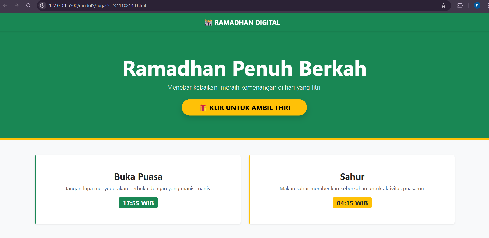
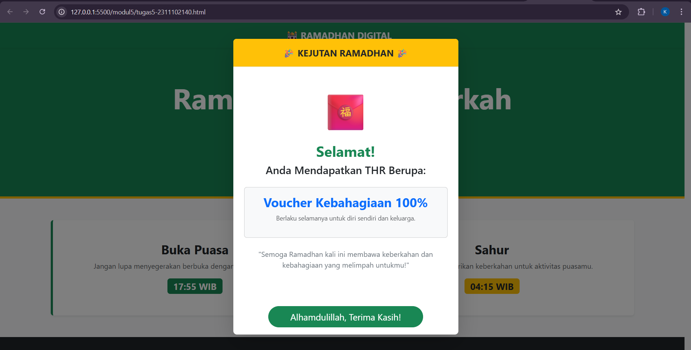

<div align="center">

# LAPORAN PRAKTIKUM

## ALGORITMA PEMROGRAMAN

### MODUL 5

### JavaScript & jQuery


### Disusun Oleh

**Kanasya Abdi Aziz**  
2311102140  
S1 IF-11-01

### Dosen Pengampu

**Dimas Fanny Hebrasianto Permadi, S.ST., M.Kom**

### Asisten Praktikum

Apri Pandu Wicaksono
Rangga Pradarrell Fathi

### Laboratorium High Performance

Fakultas Informatika
Universitas Telkom Purwokerto
2026

</div>

---

# 1. Dasar Teori

**JavaScript (JS)** adalah bahasa pemrograman yang digunakan untuk menciptakan dinamika dan interaksi pada halaman web. Dengan JavaScript, dokumen HTML yang awalnya bersifat statis dapat diubah menjadi aplikasi web yang **interaktif dan responsif**.

JavaScript bekerja dengan memanfaatkan **Document Object Model (DOM)**, yaitu struktur yang merepresentasikan elemen-elemen HTML pada halaman web. Melalui DOM, JavaScript dapat melakukan berbagai manipulasi terhadap elemen pada halaman.

Beberapa hal yang dapat dilakukan JavaScript melalui DOM antara lain:

* Mengakses elemen HTML
* Mengubah isi atau atribut elemen
* Menambahkan atau menghapus elemen baru
* Mengubah gaya tampilan (CSS) secara langsung

Proses-proses tersebut biasanya dipicu oleh **event dari pengguna**, seperti:

* Klik tombol
* Pergerakan kursor
* Pengisian formulir
* Interaksi lainnya pada halaman web

Saat ini, JavaScript tidak hanya digunakan pada sisi **client (browser)**, tetapi juga pada sisi **server** menggunakan runtime seperti **Node.js**. Hal ini memungkinkan pengembang membuat aplikasi web secara lengkap hanya dengan menggunakan satu bahasa pemrograman.

---

# 2. Penjelasan Kode (Unguided)

Berikut merupakan implementasi **JavaScript pada halaman web** yang dipadukan dengan framework Bootstrap untuk membuat tampilan lebih menarik dan interaktif.

## Kode HTML (`tugas5-2311102140.html`)

```html
<!DOCTYPE html>
<html lang="id">
<head>
    <meta charset="UTF-8">
    <meta name="viewport" content="width=device-width, initial-scale=1.0">
    <title>Ramadhan Kareem 1447H - Berbagi THR</title>
    <link href="https://cdn.jsdelivr.net/npm/bootstrap@5.3.0/dist/css/bootstrap.min.css" rel="stylesheet">
    <style>
        .btn-thr {
            animation: pulse-animation 2s infinite;
        }

        @keyframes pulse-animation {
            0% { transform: scale(1); box-shadow: 0 0 0 0 rgba(255, 193, 7, 0.7); }
            70% { transform: scale(1.05); box-shadow: 0 0 0 15px rgba(255, 193, 7, 0); }
            100% { transform: scale(1); box-shadow: 0 0 0 0 rgba(255, 193, 7, 0); }
        }
    </style>
</head>
<body class="bg-light">

    <nav class="navbar navbar-dark bg-success shadow-sm sticky-top">
        <div class="container text-center justify-content-center">
            <a class="navbar-brand fw-bold" href="#">🕌 RAMADHAN DIGITAL</a>
        </div>
    </nav>

    <header class="bg-success text-white text-center py-5 border-bottom border-warning border-5">
        <div class="container py-4">
            <h1 class="display-3 fw-bold">Ramadhan Penuh Berkah</h1>
            <p class="lead mb-4">Menebar kebaikan, meraih kemenangan di hari yang fitri.</p>

            <button type="button" 
                    class="btn btn-warning btn-lg fw-bold btn-thr px-5 rounded-pill shadow"
                    data-bs-toggle="modal"
                    data-bs-target="#modalTHR">
                🎁 KLIK UNTUK AMBIL THR!
            </button>
        </div>
    </header>

    <main class="container my-5">
        <div class="row text-center g-4">

            <div class="col-md-6">
                <div class="p-5 bg-white rounded shadow-sm border-start border-success border-5 h-100">
                    <h3 class="fw-bold">Buka Puasa</h3>
                    <p class="text-muted">Jangan lupa menyegerakan berbuka dengan yang manis-manis.</p>
                    <span class="badge bg-success fs-5">17:55 WIB</span>
                </div>
            </div>

            <div class="col-md-6">
                <div class="p-5 bg-white rounded shadow-sm border-start border-warning border-5 h-100">
                    <h3 class="fw-bold">Sahur</h3>
                    <p class="text-muted">Makan sahur memberikan keberkahan untuk aktivitas puasamu.</p>
                    <span class="badge bg-warning text-dark fs-5">04:15 WIB</span>
                </div>
            </div>

        </div>
    </main>

    <div class="modal fade" id="modalTHR" tabindex="-1">
        <div class="modal-dialog modal-dialog-centered">
            <div class="modal-content border-0 shadow-lg">

                <div class="modal-header bg-warning text-dark justify-content-center">
                    <h5 class="modal-title fw-bold">🎉 KEJUTAN RAMADHAN 🎉</h5>
                </div>

                <div class="modal-body text-center py-5 px-4">
                    <h1 class="display-1 mb-4">🧧</h1>
                    <h2 class="fw-bold text-success">Selamat!</h2>
                    <h4 class="mb-4">Anda Mendapatkan THR Berupa:</h4>

                    <div class="card bg-light mb-4">
                        <div class="card-body">
                            <h3 class="text-primary fw-bold">Voucher Kebahagiaan 100%</h3>
                            <p class="small text-muted">Berlaku selamanya untuk diri sendiri dan keluarga.</p>
                        </div>
                    </div>

                    <p class="text-secondary">
                        "Semoga Ramadhan kali ini membawa keberkahan dan kebahagiaan yang melimpah untukmu!"
                    </p>
                </div>

                <div class="modal-footer justify-content-center border-0">
                    <button type="button"
                            class="btn btn-success btn-lg px-5 rounded-pill"
                            data-bs-dismiss="modal">
                        Alhamdulillah, Terima Kasih!
                    </button>
                </div>

            </div>
        </div>
    </div>

    <footer class="text-center py-4 bg-dark text-white-50">
        <small>&copy; 2026 Ramadhan Interactive - Dibuat dengan Bootstrap 5</small>
    </footer>

    <script src="https://cdn.jsdelivr.net/npm/bootstrap@5.3.0/dist/js/bootstrap.bundle.min.js"></script>
</body>
</html>
```

---

# Hasil Tampilan

### Tampilan Halaman



### Tampilan Modal



---

# 3. Penjelasan Kode

### 1. Animasi CSS Kustom (`@keyframes`)

Pada bagian `<style>`, dibuat animasi bernama **pulse-animation** yang diterapkan pada tombol THR melalui class `.btn-thr`.

Animasi ini bekerja dengan cara memperbesar ukuran tombol sedikit menggunakan `transform: scale()` serta menambahkan efek bayangan (`box-shadow`) yang melebar dan memudar. Efek tersebut menghasilkan tampilan seperti **denyut (pulse)** sehingga tombol terlihat lebih hidup dan menarik perhatian pengguna.

---

### 2. Komponen Bootstrap Modal

Fitur interaktif utama pada halaman ini adalah **Bootstrap Modal**, yaitu jendela pop-up yang muncul tanpa perlu berpindah halaman.

Tombol pemicu modal menggunakan atribut:

```
data-bs-toggle="modal"
data-bs-target="#modalTHR"
```

Saat tombol diklik, Bootstrap secara otomatis menampilkan elemen dengan ID `modalTHR`.

Struktur utama modal terdiri dari:

* `.modal` → wadah utama modal
* `.modal-dialog-centered` → memposisikan modal di tengah layar
* `.modal-content` → wadah isi modal

Pada kode ini, modal diberi tambahan `shadow-lg` dan `border-0` agar tampil lebih modern.

---

### 3. Utility Classes Bootstrap

Beberapa **utility classes** Bootstrap digunakan untuk memperindah tampilan halaman:

* **sticky-top**
  Membuat navbar tetap berada di bagian atas layar saat pengguna melakukan scroll.

* **rounded-pill**
  Digunakan pada tombol agar memiliki bentuk lonjong seperti kapsul.

* **border-start** dan **border-5**
  Memberikan garis tebal pada sisi kiri komponen informasi seperti bagian Buka Puasa dan Sahur.

Utility classes ini membantu mempercepat desain tanpa perlu menulis CSS tambahan.

---

### 4. Responsivitas Layout

Bootstrap menggunakan **grid system** untuk mengatur tata letak halaman agar responsif.

Pada kode ini digunakan:

```
col-md-6
```

Artinya:

* Pada layar **tablet atau laptop**, elemen akan ditampilkan dalam **2 kolom**.
* Pada layar **smartphone**, elemen otomatis berubah menjadi **1 kolom** sehingga lebih nyaman dilihat.

Selain itu, class `g-4` digunakan untuk memberikan jarak antar kolom agar tampilan tidak terlihat terlalu rapat.

---

# Referensi

* [Materi Modul 5](https://drive.google.com/file/d/1J27NhEO2MbOF9DetZmOtEGAcPkczzm1r/view)