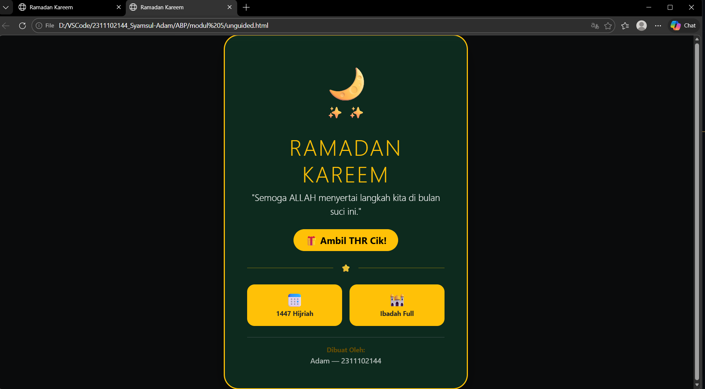
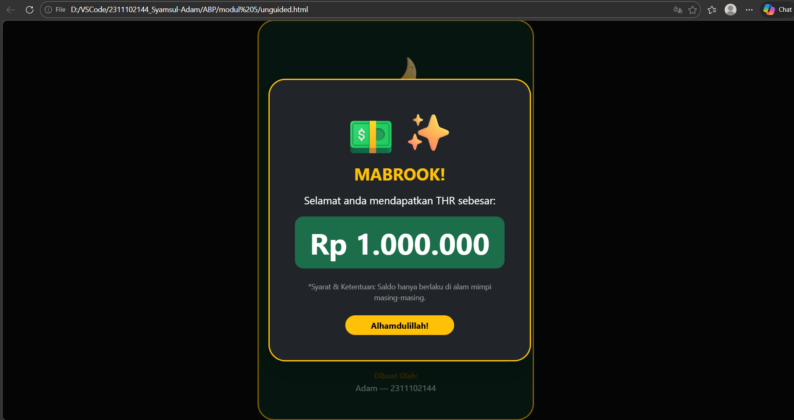

<div align="center">
  <br />
  <h1>LAPORAN PRAKTIKUM <br>APLIKASI BERBASIS PLATFORM</h1>
  <br />
  <h3>MODUL 5 <br> JAVASCRIPT</h3>
  <br />
  <br />
   
  <br />
  <br />
  <br />
  <br />
  <h3>Disusun Oleh :</h3>
  <p>
    <strong>Syamsul Adam</strong><br>
    <strong>2311102144</strong><br>
    <strong>S1 IF-11-REG01</strong>
  </p>
  <br />
  <br />
  <h3>Dosen Pengampu :</h3>
  <p>
    <strong>Dimas Fanny Hebrasianto Permadi, S.ST., M.Kom</strong>
  </p>
  <br />
  <br />
    <h4>Asisten Praktikum :</h4>
    <strong> Apri Pandu Wicaksono </strong> <br>
    <strong>Rangga Pradarrell Fathi</strong>
  <br />
  <h3>LABORATORIUM HIGH PERFORMANCE
 <br>FAKULTAS INFORMATIKA <br>UNIVERSITAS TELKOM PURWOKERTO <br>2026</h3>
</div>

---

## 1. Dasar Teori

**JavaScript (JS)** adalah bahasa pemrograman tingkat tinggi yang berperan penting dalam menghidupkan sebuah halaman web. Jika HTML membangun struktur dan CSS mengatur tampilan, maka JavaScript memberikan kemampuan agar halaman tersebut menjadi **interaktif, dinamis, dan responsif**. Pada awalnya, JS dirancang untuk bekerja di **sisi klien (browser)**, sehingga memungkinkan halaman web untuk merespons tindakan pengguna secara langsung—seperti memproses data formulir atau memperbarui konten—tanpa perlu melakukan muat ulang (*reload*) halaman.

Salah satu kunci kekuatan JavaScript terletak pada konsep **DOM (Document Object Model)**. Melalui DOM, JavaScript dapat "berkomunikasi" dengan struktur HTML secara logis. Hal ini memungkinkan pengembang untuk menambah, menghapus, atau mengubah elemen dan gaya CSS secara otomatis berdasarkan kejadian tertentu (*event*), seperti ketika pengguna melakukan klik, mengarahkan kursor (*hover*), atau menggulir halaman.

Kini, peran JavaScript telah berkembang pesat. Tidak hanya terbatas pada sisi *browser*, JavaScript juga bisa dijalankan di **sisi server** berkat adanya lingkungan seperti **Node.js**. Perkembangan ini memudahkan pengembang untuk membangun aplikasi web yang utuh (dari tampilan depan hingga logika belakang) hanya dengan menguasai satu bahasa pemrograman yang sama.


### Kode HTML

```html
<!DOCTYPE html>
<html lang="id">

<head>
    <meta charset="UTF-8">
    <meta name="viewport" content="width=device-width, initial-scale=1.0">
    <title>Ramadan Kareem</title>
    <link href="https://cdn.jsdelivr.net/npm/bootstrap@5.3.0/dist/css/bootstrap.min.css" rel="stylesheet">
    <style>
        /* Efek hover pada tombol agar lebih interaktif */
        .btn-get-thr {
            transition: all 0.3s ease;
        }
        .btn-get-thr:hover {
            transform: scale(1.1);
            box-shadow: 0 0 20px rgba(255, 193, 7, 0.6);
        }
    </style>
</head>

<body class="bg-dark text-white vh-100 d-flex justify-content-center align-items-center" 
      style="background: linear-gradient(rgba(0,0,0,0.7), rgba(0,0,0,0.7)), url('https://images.unsplash.com/photo-1548013146-72479768bbaa?auto=format&fit=crop&q=80&w=1600') center/cover;">

    <div class="container">
        <div class="row justify-content-center">
            <div class="col-11 col-sm-10 col-md-8 col-lg-5">
                <div class="p-4 p-md-5 bg-success bg-opacity-25 border border-warning border-3 rounded-5 shadow-lg text-center" 
                     style="backdrop-filter: blur(8px);">
                    
                    <div class="mb-4">
                        <span class="display-1 text-warning">🌙</span>
                        <div class="d-flex justify-content-center gap-2 mt-n3">
                            <span class="fs-3 text-light">✨</span>
                            <span class="fs-3 text-light">✨</span>
                        </div>
                    </div>

                    <h1 class="display-5 fw-black text-warning text-uppercase mb-2" style="letter-spacing: 3px;">
                        Ramadan Kareem
                    </h1>
                    <p class="lead text-light mb-4 italic">"Semoga ALLAH menyertai langkah kita di bulan suci ini."</p>

                    <div class="mb-4">
                        <button class="btn btn-warning btn-lg rounded-pill fw-bold px-4 btn-get-thr" 
                                data-bs-toggle="modal" data-bs-target="#modalTHR">
                            🎁 Ambil THR Cik!
                        </button>
                    </div>

                    <div class="d-flex align-items-center justify-content-center mb-4">
                        <div class="flex-grow-1 border-bottom border-warning opacity-50"></div>
                        <span class="mx-3 text-warning">⭐</span>
                        <div class="flex-grow-1 border-bottom border-warning opacity-50"></div>
                    </div>

                    <div class="row g-3 mb-4 text-dark">
                        <div class="col-6">
                            <div class="bg-warning p-3 rounded-4 shadow-sm h-100">
                                <h3 class="m-0">📅</h3>
                                <small class="fw-bold">1447 Hijriah</small>
                            </div>
                        </div>
                        <div class="col-6">
                            <div class="bg-warning p-3 rounded-4 shadow-sm h-100">
                                <h3 class="m-0">🕌</h3>
                                <small class="fw-bold">Ibadah Full</small>
                            </div>
                        </div>
                    </div>

                    <div class="mt-4 pt-3 border-top border-secondary border-opacity-50">
                        <p class="small text-warning-emphasis mb-0 fw-bold">Dibuat Oleh:</p>
                        <p class="text-light opacity-75 mb-0">Adam — 2311102144</p>
                    </div>
                </div>
            </div>
        </div>
    </div>

    <div class="modal fade" id="modalTHR" tabindex="-1" aria-labelledby="modalTHRLabel" aria-hidden="true">
        <div class="modal-dialog modal-dialog-centered">
            <div class="modal-content bg-dark border-warning border-3 rounded-5 shadow-lg">
                <div class="modal-body text-center p-5">
                    <div class="display-1 mb-3">💵✨</div>
                    <h2 class="text-warning fw-bold mb-3">MABROOK!</h2>
                    <p class="fs-5 text-white">Selamat anda mendapatkan THR sebesar:</p>
                    <div class="bg-success bg-opacity-75 p-3 rounded-4 mb-4">
                        <h1 class="display-4 fw-bold text-white mb-0">Rp 1.000.000</h1>
                    </div>
                    <p class="text-white-50 small mb-4">*Syarat & Ketentuan: Saldo hanya berlaku di alam mimpi masing-masing.</p>
                    <button type="button" class="btn btn-warning rounded-pill px-5 fw-bold" data-bs-dismiss="modal">Alhamdulillah!</button>
                </div>
            </div>
        </div>
    </div>

    <script src="https://cdn.jsdelivr.net/npm/bootstrap@5.3.0/dist/js/bootstrap.bundle.min.js"></script>
</body>

</html>
```

### Hasil Tampilan (Screenshot)




### Penjelasan code:

Program ini merupakan halaman web interaktif berbasis Bootstrap 5.3 yang dirancang sebagai kartu ucapan digital tematik Ramadan dengan pendekatan desain modern. Secara visual, program ini mengadopsi estetika glassmorphism pada kartu utama, di mana perpaduan latar belakang transparan yang kabur (backdrop blur) dan bingkai emas yang tegas menciptakan kesan mewah namun tetap religius. Penggunaan elemen dekoratif seperti emoji bulan sabit dan bintang, dikombinasikan dengan sistem grid yang rapi untuk menampilkan informasi tambahan, memberikan pengalaman visual yang tenang dan terstruktur bagi pengguna saat mengakses ucapan tersebut.

Secara teknis, program ini menonjolkan kemampuan interaktivitas tanpa membebani performa melalui integrasi komponen Bootstrap Modal dan mikro-interaksi pada tombol. Fitur kejutan "Ambil THR" dikelola secara efisien menggunakan sistem pemicu atribut data, yang memungkinkan jendela pop-up muncul secara dinamis di tengah layar dengan transisi yang halus. Selain itu, optimasi pada aspek responsivitas memastikan bahwa seluruh tata letak tetap presisi dan fungsional di berbagai resolusi perangkat, sementara sedikit tambahan kustom CSS pada efek hover memberikan sentuhan umpan balik visual yang membuatnya terasa lebih profesional dan hidup.

## Refrensi

- [Materi Modul 5](https://drive.google.com/file/d/1J27NhEO2MbOF9DetZmOtEGAcPkczzm1r/view?usp=sharing)
