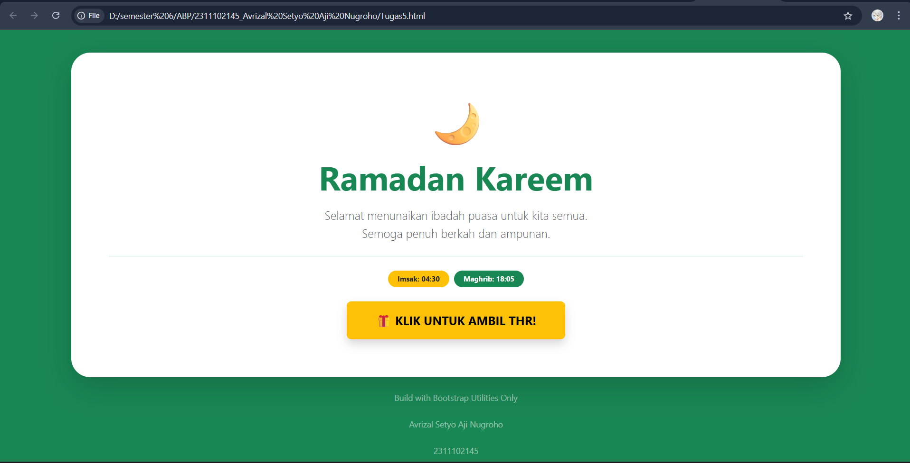
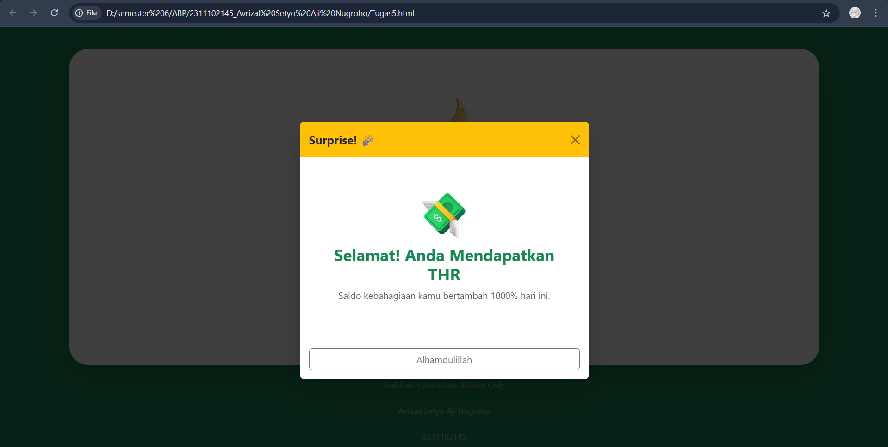

<div align="center">
  <br />
  <h1>LAPORAN PRAKTIKUM <br>APLIKASI BERBASIS PLATFORM</h1>
  <br />
  <h3>MODUL 5 <br> JAVASCRIPT</h3>
  <br />
  <br />
   
  <br />
  <br />
  <br />
  <h3>Disusun Oleh :</h3>
  <p>
    <strong>Avrizal Setyo Aji Nugroho</strong><br>
    <strong>2311102145</strong><br>
    <strong>S1 IF-11-01</strong>
  </p>
  <br />
  <h3>Dosen Pengampu :</h3>
  <p>
    <strong>Dimas Fanny Hebrasianto Permadi, S.ST., M.Kom</strong>
  </p>
  <br />
  <br />
    <h4>Asisten Praktikum :</h4>
    <strong> Apri Pandu Wicaksono </strong> <br>
    <strong>Rangga Pradarrell Fathi</strong>
  <br />
  <h3>LABORATORIUM HIGH PERFORMANCE
 <br>FAKULTAS INFORMATIKA <br>UNIVERSITAS TELKOM PURWOKERTO <br>2026</h3>
</div>

---

## 1. Dasar Teori

**JavaScript (JS)** adalah bahasa pemrograman tingkat tinggi yang berperan penting dalam menghidupkan sebuah halaman web. Jika HTML membangun struktur dan CSS mengatur tampilan, maka JavaScript memberikan kemampuan agar halaman tersebut menjadi **interaktif, dinamis, dan responsif**. Pada awalnya, JS dirancang untuk bekerja di **sisi klien (browser)**, sehingga memungkinkan halaman web untuk merespons tindakan pengguna secara langsung—seperti memproses data formulir atau memperbarui konten—tanpa perlu melakukan muat ulang (_reload_) halaman.

Salah satu kunci kekuatan JavaScript terletak pada konsep **DOM (Document Object Model)**. Melalui DOM, JavaScript dapat "berkomunikasi" dengan struktur HTML secara logis. Hal ini memungkinkan pengembang untuk menambah, menghapus, atau mengubah elemen dan gaya CSS secara otomatis berdasarkan kejadian tertentu (_event_), seperti ketika pengguna melakukan klik, mengarahkan kursor (_hover_), atau menggulir halaman.

Kini, peran JavaScript telah berkembang pesat. Tidak hanya terbatas pada sisi _browser_, JavaScript juga bisa dijalankan di **sisi server** berkat adanya lingkungan seperti **Node.js**. Perkembangan ini memudahkan pengembang untuk membangun aplikasi web yang utuh (dari tampilan depan hingga logika belakang) hanya dengan menguasai satu bahasa pemrograman yang sama.

## 2. Penjelasan Kode HTML

Berikut ini adalah implementasi tabel berdasarkan struktur dasar HTML murni beserta hasil tampilannya.

### Kode HTML (`Tugas5.html`)

```html
<!DOCTYPE html>
<html lang="id">
  <head>
    <meta charset="UTF-8" />
    <meta name="viewport" content="width=device-width, initial-scale=1.0" />
    <title>Tugas5_Avrizal Setyo Aji Nugroho</title>
    <link
      href="https://cdn.jsdelivr.net/npm/bootstrap@5.3.0/dist/css/bootstrap.min.css"
      rel="stylesheet"
    />
  </head>

  <body
    class="bg-success d-flex align-items-center justify-content-center vh-100"
  >
    <div class="container text-center">
      <div class="card bg-white shadow-lg border-0 rounded-5 p-5">
        <div class="card-body">
          <div class="display-1 mb-3">🌙</div>

          <h1 class="fw-bold text-success display-4 mb-3">Ramadan Kareem</h1>

          <p class="lead text-muted mb-4">
            Selamat menunaikan ibadah puasa untuk kita semua. <br />
            Semoga penuh berkah dan ampunan.
          </p>

          <hr class="my-4 text-success opacity-25" />

          <div class="d-flex justify-content-center gap-2">
            <span class="badge rounded-pill bg-warning text-dark px-3 py-2"
              >Imsak: 04:30</span
            >
            <span class="badge rounded-pill bg-success px-3 py-2"
              >Maghrib: 18:05</span
            >
          </div>
          <div class="text-center mt-4">
            <button
              type="button"
              class="btn btn-warning btn-lg px-5 py-3 fw-bold shadow"
              data-bs-toggle="modal"
              data-bs-target="#thrModal"
            >
              🎁 KLIK UNTUK AMBIL THR!
            </button>
          </div>

          <div
            class="modal fade"
            id="thrModal"
            tabindex="-1"
            aria-hidden="true"
          >
            <div class="modal-dialog modal-dialog-centered">
              <div class="modal-content border-0 shadow-lg">
                <div class="modal-header bg-warning text-dark border-0">
                  <h5 class="modal-title fw-bold">Surprise! 🎉</h5>
                  <button
                    type="button"
                    class="btn-close"
                    data-bs-dismiss="modal"
                    aria-label="Close"
                  ></button>
                </div>
                <div class="modal-body text-center p-5">
                  <h1 class="display-1">💸</h1>
                  <h3 class="text-success fw-bold">
                    Selamat! Anda Mendapatkan THR
                  </h3>
                  <p class="text-muted">
                    Saldo kebahagiaan kamu bertambah 1000% hari ini.
                  </p>
                </div>
                <div class="modal-footer border-0">
                  <button
                    type="button"
                    class="btn btn-outline-secondary w-100"
                    data-bs-dismiss="modal"
                  >
                    Alhamdulillah
                  </button>
                </div>
              </div>
            </div>
          </div>

          <script src="https://cdn.jsdelivr.net/npm/bootstrap@5.3.0/dist/js/bootstrap.bundle.min.js"></script>
        </div>
      </div>

      <p class="text-white-50 mt-4 small">
        Build with Bootstrap Utilities Only
      </p>
      <p class="text-white-50 mt-4 small">Avrizal Setyo Aji Nugroho</p>
      <p class="text-white-50 mt-4 small">2311102145</p>
    </div>

    <script src="https://cdn.jsdelivr.net/npm/bootstrap@5.3.0/dist/js/bootstrap.bundle.min.js"></script>
  </body>
</html>
```

### Hasil Tampilan (Screenshot)




### Penjelasan Code

### A. Struktur Pemicu (Trigger Button)

- **Button Component**: Tombol pengambil THR dirancang menggunakan _class_ `btn-warning` (kuning) dan `btn-lg` (ukuran besar) agar tampil mencolok sebagai elemen interaktif utama pada kartu. Tambahan _class_ `shadow` memberikan efek kedalaman pada tombol saat dipandang.
- **Atribut Data (Interaktivitas)**:
  - `data-bs-toggle="modal"`: Atribut ini berfungsi menginstruksikan framework Bootstrap bahwa elemen tombol ini bertugas memicu pemunculan jendela modal.
  - `data-bs-target="#thrModal"`: Berfungsi sebagai penunjuk target untuk menghubungkan tombol dengan ID elemen modal yang sesuai, yaitu `#thrModal`.

### B. Komponen Modal (Pop-up)

- **Struktur Berlapis**: Menggunakan struktur standar Bootstrap yang terdiri dari `modal-dialog` sebagai bingkai dan `modal-content` sebagai kontainer utama pesan kejutan.
- **Modal Dialog Centered**: Penggunaan _class_ `modal-dialog-centered` memastikan jendela _pop-up_ muncul secara estetis tepat di tengah layar pengguna (vertikal dan horizontal).
- **Konten & Gaya**:
  - Bagian _header_ modal menggunakan warna `bg-warning` untuk kesan ceria, sementara bagian _body_ berisi teks keberuntungan berwarna hijau (`text-success`) untuk memperkuat nuansa kebahagiaan Ramadan.
  - **Dismiss Function**: Tombol "Alhamdulillah" dilengkapi atribut `data-bs-dismiss="modal"` yang berfungsi untuk menutup kembali jendela modal secara instan.

### C. Integrasi JavaScript

- **Bootstrap Bundle**: Pada bagian akhir dokumen, saya menyertakan tag `<script>` yang memanggil `bootstrap.bundle.min.js`. File ini sangat krusial karena mengandung logika JavaScript yang menangani fungsionalitas komponen modal. Tanpa _bundle_ ini, tombol tidak akan mampu memicu munculnya jendela _pop-up_ meskipun struktur HTML sudah benar.

---

## Refrensi

- [Materi Modul 5](https://drive.google.com/file/d/1J27NhEO2MbOF9DetZmOtEGAcPkczzm1r/view?usp=sharing)
