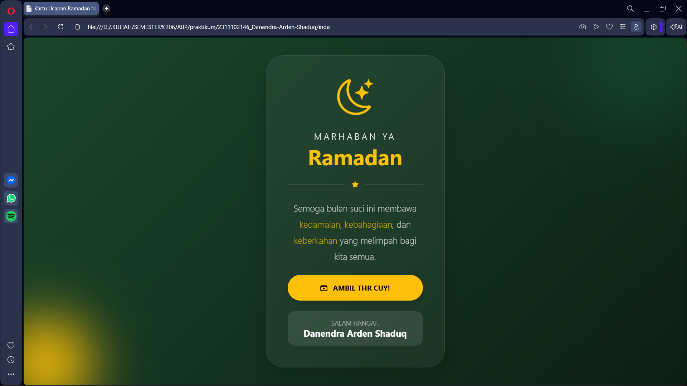
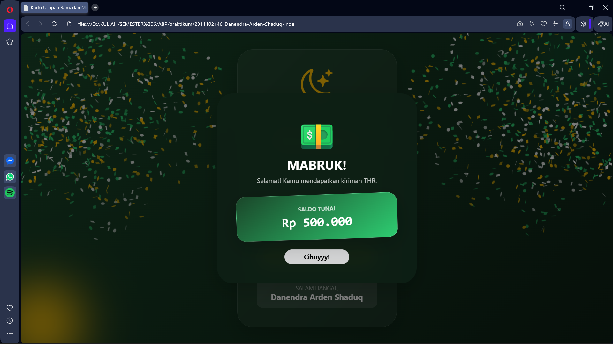

<div align="center">
  <br />
  <h1>LAPORAN PRAKTIKUM <br>APLIKASI BERBASIS PLATFORM</h1>
  <br />
  <h3>MODUL 5 <br> JAVASCRIPT & JQUERY</h3>
  <br />
  <br />
   
  <br />
  <br />
  <br />
  <br />
  <h3>Disusun Oleh :</h3>
  <p>
    <strong>Danendra Arden Shaduq</strong><br>
    <strong>2311102146</strong><br>
    <strong>S1 IF-11-REG01</strong>
  </p>
  <br />
  <br />
  <h3>Dosen Pengampu :</h3>
  <p>
    <strong>Dimas Fanny Hebrasianto Permadi, S.ST., M.Kom</strong>
  </p>
  <br />
  <br />
    <h4>Asisten Praktikum :</h4>
    <strong> Apri Pandu Wicaksono </strong> <br>
    <strong>Rangga Pradarrell Fathi</strong>
  <br />
  <h3>LABORATORIUM HIGH PERFORMANCE
 <br>FAKULTAS INFORMATIKA <br>UNIVERSITAS TELKOM PURWOKERTO <br>2026</h3>
</div>

---

## 1. Dasar Teori

JavaScript dan jQuery merupakan teknologi utama yang digunakan untuk mengubah dokumen HTML statis menjadi interaktif dan dinamis melalui manipulasi konten serta elemen secara real-time. JavaScript berfungsi sebagai bahasa scripting yang mengontrol perilaku halaman web, sementara jQuery hadir sebagai library yang menyederhanakan penulisan sintaks JavaScript, seperti dalam penanganan event klik tombol dan penerapan efek animasi. Dengan mengintegrasikan kedua teknologi ini bersama kerangka kerja Bootstrap, sebuah halaman web dapat menyajikan fitur interaktif seperti kemunculan modal secara otomatis, efek visual yang menarik, hingga fungsi responsif yang meningkatkan pengalaman pengguna secara keseluruhan.

---

## 2. Penjelasan Kode HTML, CSS, dan JS

Dengan menerapkan prinsip dasar JavaScript, antarmuka ucapan Ramadan ini dimodifikasi agar tidak lagi statis. Fitur 'Buka Amplop THR' menjadi komponen utama yang menunjukkan bagaimana skrip JavaScript dapat mengendalikan perilaku dokumen HTML melalui interaksi DOM.

### Kode HTML (`index.html`)

```html
<!DOCTYPE html>
<html lang="id">
<head>
    <meta charset="UTF-8">
    <meta name="viewport" content="width=device-width, initial-scale=1.0">
    <title>Kartu Ucapan Ramadan Modern</title>
    <link href="https://cdn.jsdelivr.net/npm/bootstrap@5.3.0/dist/css/bootstrap.min.css" rel="stylesheet">
    <link rel="stylesheet" href="https://cdn.jsdelivr.net/npm/bootstrap-icons@1.11.0/font/bootstrap-icons.css">
    <link rel="stylesheet" href="style.css">
</head>
<body class="bg-dark d-flex align-items-center justify-content-center vh-100 p-4 main-bg">

    <div class="position-absolute rounded-circle bg-success opacity-25 glow-1"></div>
    <div class="position-absolute rounded-circle bg-warning opacity-10 glow-2"></div>

    <div class="card border-0 shadow-lg text-white text-center main-card">
        <div class="card-body p-5">
            <div class="mb-4 icon-float">
                <i class="bi bi-moon-stars text-warning display-1 shadow-sm"></i>
            </div>

            <h5 class="text-uppercase fw-lighter tracking-widest mb-1" style="letter-spacing: 0.3rem;">Marhaban Ya</h5>
            <h1 class="display-5 fw-bold mb-4 text-warning">Ramadan</h1>
            
            <div class="d-flex align-items-center justify-content-center mb-4 text-white-50">
                <div class="flex-grow-1 border-bottom border-secondary"></div>
                <i class="bi bi-star-fill mx-3 text-warning small"></i>
                <div class="flex-grow-1 border-bottom border-secondary"></div>
            </div>

            <p class="lead fw-light mb-4 opacity-75" style="line-height: 1.8;">
                Semoga bulan suci ini membawa <span class="text-warning">kedamaian</span>, 
                <span class="text-warning">kebahagiaan</span>, dan <span class="text-warning">keberkahan</span> yang melimpah bagi kita semua.
            </p>

            <button class="btn btn-warning btn-thr w-100 py-3 rounded-pill fw-bold mb-4 shadow" 
                    data-bs-toggle="modal" 
                    data-bs-target="#thrModal">
                <i class="bi bi-cash-stack me-2"></i> AMBIL THR CUY!
            </button>

            <div class="bg-white bg-opacity-10 py-3 rounded-4">
                <p class="small mb-0 opacity-50 text-uppercase">Salam Hangat,</p>
                <p class="h5 mb-0 fw-bold">Danendra Arden Shaduq</p>
            </div>
        </div>
    </div>

    <div class="modal fade" id="thrModal" tabindex="-1" aria-hidden="true">
        <div class="modal-dialog modal-dialog-centered">
            <div class="modal-content text-white text-center border-0 shadow-lg">
                <div class="modal-body p-5">
                    <div class="display-1 mb-3">💵</div>
                    <h2 class="fw-bold mb-2">MABRUK!</h2>
                    <p class="opacity-75 mb-4">Selamat! Kamu mendapatkan kiriman THR:</p>
                    
                    <div class="thr-cash-box p-4 shadow-lg mb-4 text-white">
                        <p class="small mb-1 fw-bold opacity-75">SALDO TUNAI</p>
                        <h2 class="fw-bold mb-0 font-monospace">Rp 500.000</h2>
                    </div>

                    <button type="button" class="btn btn-light rounded-pill px-5 fw-bold shadow-sm" data-bs-dismiss="modal">
                        Cihuyyy!
                    </button>
                </div>
            </div>
        </div>
    </div>

    <script src="https://cdn.jsdelivr.net/npm/bootstrap@5.3.0/dist/js/bootstrap.bundle.min.js"></script>
    <script src="https://cdn.jsdelivr.net/npm/canvas-confetti@1.6.0/dist/confetti.browser.min.js"></script>
    <script src="script.js"></script>
</body>
</html>
```

### Kode CSS (`style.css`)

```css
.main-bg {
    background: linear-gradient(135deg, #1a472a 0%, #0d1f14 100%) !important;
    overflow: hidden;
}

.glow-1 { width: 300px; height: 300px; top: -100px; right: -50px; filter: blur(80px); }
.glow-2 { width: 200px; height: 200px; bottom: -50px; left: -50px; filter: blur(60px); }

.main-card {
    max-width: 400px;
    border-radius: 2.5rem;
    background: rgba(255, 255, 255, 0.05) !important;
    backdrop-filter: blur(15px);
    border: 1px solid rgba(255, 255, 255, 0.1) !important;
}

.modal-content {
    background: rgba(13, 31, 20, 0.95) !important;
    backdrop-filter: blur(20px);
    border-radius: 2.5rem;
    border: 1px solid rgba(255, 255, 255, 0.1);
}

.thr-cash-box {
    background: linear-gradient(145deg, #1a472a, #2ecc71);
    border-radius: 1.5rem;
    transform: rotate(-2deg);
    border: 1px solid rgba(255, 255, 255, 0.2);
}

.btn-thr {
    animation: pulse-yellow 2s infinite;
    transition: transform 0.3s ease;
}

.btn-thr:hover { transform: scale(1.05); }

@keyframes pulse-yellow {
    0% { box-shadow: 0 0 0 0 rgba(255, 193, 7, 0.5); }
    70% { box-shadow: 0 0 0 15px rgba(255, 193, 7, 0); }
    100% { box-shadow: 0 0 0 0 rgba(255, 193, 7, 0); }
}

.icon-float { animation: floating 3s ease-in-out infinite; }
@keyframes floating {
    0%, 100% { transform: translateY(0); }
    50% { transform: translateY(-10px); }
}
```

### Kode JS (`main.js`)

```javascript
document.addEventListener('DOMContentLoaded', () => {
    const modalElement = document.getElementById('thrModal');
    
    function fireConfetti() {
        const end = Date.now() + (3 * 1000);
        const colors = ['#ffc107', '#2ecc71', '#ffffff'];

        (function frame() {
            confetti({
                particleCount: 3,
                angle: 60,
                spread: 55,
                origin: { x: 0 },
                colors: colors
            });
            confetti({
                particleCount: 3,
                angle: 120,
                spread: 55,
                origin: { x: 1 },
                colors: colors
            });

            if (Date.now() < end) {
                requestAnimationFrame(frame);
            }
        }());
    }

    modalElement.addEventListener('shown.bs.modal', fireConfetti);
});
```

### Hasil Tampilan (Screenshot)




### Penjelasan code:

#### 1. HTML (`index.html`)

* **Pada baris 6-11**, tag `<link>` digunakan untuk mengimpor *framework* eksternal **Bootstrap 5 CSS** dan **Bootstrap Icons** guna mengatur tata letak serta ikon secara instan, sementara file `style.css` lokal dihubungkan untuk menerapkan kustomisasi efek *glassmorphism* dan animasi pendaran cahaya (*glow*).
* **Pada baris 37-41**, elemen `<button>` dengan teks **AMBIL THR CUY!** dilengkapi dengan atribut data Bootstrap yaitu `data-bs-toggle="modal"` dan `data-bs-target="#thrModal"` yang berfungsi sebagai pemicu (*trigger*) otomatis untuk menampilkan jendela dialog tanpa memerlukan skrip JavaScript manual tambahan.
* **Pada baris 51-70**, struktur kontainer `<div class="modal fade" id="thrModal" ...>` mendefinisikan komponen **Modal Bootstrap** yang berisi informasi hadiah saldo tunai, di mana elemen ini tetap tersembunyi hingga pengguna menekan tombol pemicu yang sesuai dengan ID-nya.
* **Pada baris 72-74**, tag `<script>` diletakkan di akhir dokumen untuk memuat **Bootstrap JS Bundle** guna mengaktifkan fitur interaktif komponen, serta memanggil pustaka **Canvas Confetti** dan file `script.js` lokal untuk menjalankan efek selebrasi visual saat modal terbuka.

#### 2. Styling CSS (`style.css`)

* **Pada baris 1-5**, kelas `.main-bg` mengatur latar belakang halaman menggunakan gradasi warna hijau gelap (*linear-gradient*) dan menyembunyikan elemen yang melewati batas layar dengan `overflow: hidden` agar dekorasi cahaya tidak merusak tata letak.
* **Pada baris 7-8**, kelas `.glow-1` dan `.glow-2` menciptakan elemen dekoratif berbentuk lingkaran dengan efek *blur* tinggi untuk memberikan pendaran cahaya estetis di sudut-sudut halaman web.
* **Pada baris 10-23**, kelas `.main-card` dan `.modal-content` menerapkan teknik desain **Glassmorphism**, yang menggunakan latar belakang transparan (`rgba`), efek buram di belakang elemen (`backdrop-filter: blur`), serta sudut yang membulat agar kartu terlihat modern.
* **Pada baris 25-31**, kelas `.thr-cash-box` mengatur tampilan kotak hadiah dengan kemiringan dua derajat (`rotate`) dan gradasi hijau cerah untuk memberikan kesan visual yang dinamis dan menonjol di dalam modal.
* **Pada baris 33-44**, kelas `.btn-thr` mendefinisikan animasi **Pulse**, di mana tombol akan "berdenyut" secara berulang melalui manipulasi `box-shadow` guna menarik perhatian pengguna secara visual.
* **Pada baris 46-50**, kelas `.icon-float` menggunakan `@keyframes floating` untuk menciptakan efek animasi melayang secara halus pada ikon bulan dengan cara menggeser posisi elemen ke atas dan ke bawah secara berkelanjutan.

#### 3. Fungsi JavaScript (`script.js`)

* **Pada baris 1**, fungsi `document.addEventListener('DOMContentLoaded', ...)` digunakan untuk memastikan bahwa seluruh struktur HTML telah dimuat sepenuhnya oleh peramban sebelum skrip JavaScript dijalankan.
* **Pada baris 2**, variabel `modalElement` dideklarasikan untuk mengambil referensi elemen modal dari dokumen HTML berdasarkan ID `thrModal` agar dapat dimanipulasi lebih lanjut.
* **Pada baris 4-26**, dibuat sebuah fungsi bernama `fireConfetti()` yang bertugas mengatur logika selebrasi visual, termasuk menentukan durasi efek selama 3 detik dan palet warna (emas, hijau, putih) yang akan digunakan.
* **Pada baris 7-25**, terdapat fungsi *self-invoking* bernama `frame()` yang memanfaatkan `requestAnimationFrame` untuk menciptakan animasi hujan kertas (*confetti*) secara berkelanjutan dan halus dari sisi kiri serta kanan layar.
* **Pada baris 28**, sebuah *event listener* dengan tipe `'shown.bs.modal'` ditambahkan pada elemen modal, yang berfungsi untuk memicu eksekusi fungsi `fireConfetti()` tepat setelah jendela modal tampil sempurna di layar pengguna.

## Refrensi
- [Materi Modul 5](https://drive.google.com/file/d/1J27NhEO2MbOF9DetZmOtEGAcPkczzm1r/view?usp=sharing)
