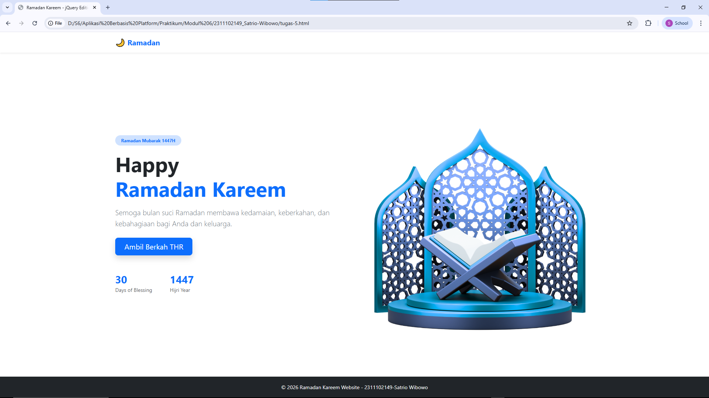
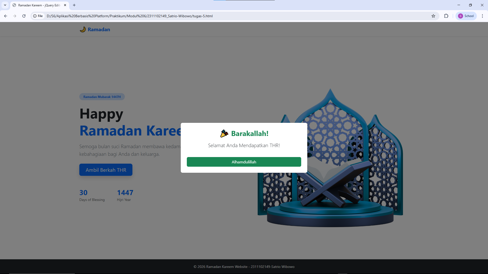
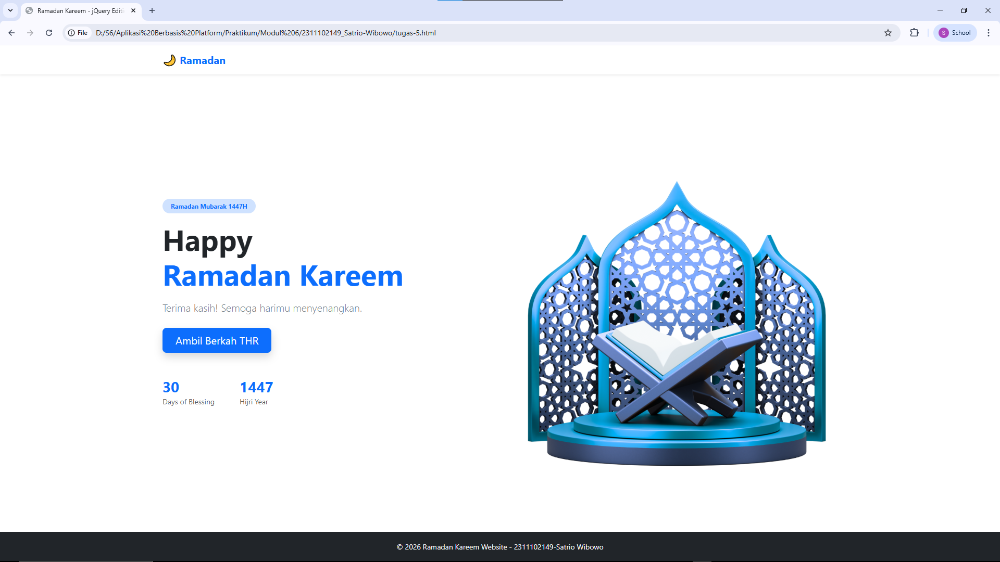

"" 
<div align="center">
  <br />
  <h1>LAPORAN PRAKTIKUM <br>APLIKASI BERBASIS PLATFORM</h1>
  <br />
  <h2>MODUL 5 <br> Javascript & JQuery </h2>
  <br />
  <br />
   
  <br />
  <br />
  <br />
  <h3>Disusun Oleh :</h3>
  <p>
    <strong>Satrio Wibowo</strong><br>
    <strong>2311102149</strong><br>
    <strong>S1 IF-11-REG 01</strong>
  </p>
  <br />
  <h3>Dosen Pengampu :</h3>
  <p>
    <strong>Dimas Fanny Hebrasianto Permadi, S.ST., M.Kom</strong>
  </p>
  <br />
  <br />
    <h4>Asisten Praktikum :</h4>
    <strong> Apri Pandu Wicaksono </strong> <br>
    <strong>Rangga Pradarrell Fathi</strong>
  <br />
  <h2>LABORATORIUM HIGH PERFORMANCE
 <br>FAKULTAS INFORMATIKA <br>UNIVERSITAS TELKOM PURWOKERTO <br>2026</h2>
</div>

---

# 1. Dasar Teori

## Karakteristik JavaScript
JavaScript merupakan bahasa pemrograman jenis scripting yang berfungsi untuk memberikan logika interaktif pada halaman web. Meskipun awalnya dikembangkan untuk berjalan berdampingan dengan Java, JavaScript berevolusi menjadi alat utama untuk memanipulasi elemen HTML secara dinamis. Fokus utamanya adalah "menghidupkan" dokumen yang statis agar dapat merespons aksi pengguna secara langsung.

## Struktur Objek dan Fungsi
Dalam JavaScript, pembuatan objek sangat fleksibel menggunakan notasi kurung kurawal yang disebut *object literal*. Selain itu, penggunaan fungsi (*function*) sangat krusial untuk membungkus serangkaian perintah agar dapat digunakan kembali (*code reuse*). Hal ini memungkinkan pengembang untuk membangun logika program yang modular dan efisien.

## Pengenalan JQuery
jQuery adalah pustaka (library) JavaScript yang dirancang untuk menyederhanakan proses manipulasi DOM, penanganan *event*, serta pembuatan animasi. Dengan moto *"write less, do more"*, jQuery memungkinkan perintah yang biasanya membutuhkan banyak baris kode JavaScript murni menjadi jauh lebih singkat. Pustaka ini juga mendukung teknologi AJAX dan memiliki ukuran file yang sangat ringan.

# 2. Unguided 

## 1. Implementasi JavaScript & jQuery pada Website Ramadan Kareem
```html
<!DOCTYPE html>
<html lang="id">
<head>
    <meta charset="UTF-8">
    <meta name="viewport" content="width=device-width, initial-scale=1.0">
    <title>Ramadan Kareem - jQuery Edition</title>
    <link href="https://cdn.jsdelivr.net/npm/bootstrap@5.3.2/dist/css/bootstrap.min.css" rel="stylesheet">
</head>

<body class="bg-light d-flex flex-column min-vh-100">

    <nav class="navbar navbar-expand-lg navbar-light bg-white shadow-sm">
        <div class="container">
            <a class="navbar-brand fw-bold text-primary" href="#">🌙 Ramadan</a>
            <button class="navbar-toggler" type="button" data-bs-toggle="collapse" data-bs-target="#navbarNav">
                <span class="navbar-toggler-icon"></span>
            </button>
            <div class="collapse navbar-collapse justify-content-end" id="navbarNav">
                <ul class="navbar-nav">
                </ul>
            </div>
        </div>
    </nav>

    <main class="bg-white flex-grow-1 d-flex align-items-center">
        <section class="container py-5">
            <div class="row align-items-center">
                <div class="col-lg-6">
                    <span class="badge bg-primary-subtle text-primary mb-3 px-3 py-2 rounded-pill">
                        Ramadan Mubarak 1447H
                    </span>
                    <h1 class="display-4 fw-bold mb-3">
                        Happy <br>
                        <span class="text-primary">Ramadan Kareem</span>
                    </h1>
                    <p class="lead text-secondary mb-4">
                        Semoga bulan suci Ramadan membawa kedamaian, keberkahan, dan kebahagiaan bagi Anda dan keluarga.
                    </p>
                    <button id="btnAmbilTHR" class="btn btn-primary btn-lg px-4 shadow">
                        Ambil Berkah THR
                    </button>
                    <div class="d-flex gap-5 mt-5">
                        <div>
                            <h3 class="fw-bold text-primary mb-0">30</h3>
                            <small class="text-muted">Days of Blessing</small>
                        </div>
                        <div>
                            <h3 class="fw-bold text-primary mb-0">1447</h3>
                            <small class="text-muted">Hijri Year</small>
                        </div>
                    </div>
                </div>

                <div class="col-lg-6 text-center mt-5 mt-lg-0">
                    
                </div>
            </div>
        </section>
    </main>

    <div class="modal fade" id="thrModal" tabindex="-1">
        <div class="modal-dialog modal-dialog-centered">
            <div class="modal-content text-center p-4">
                <h3 class="fw-bold text-success mb-3">🎉 Barakallah!</h3>
                <p class="lead" id="modalText">Selamat Anda Mendapatkan THR!</p>
                <button class="btn btn-success mt-3" data-bs-dismiss="modal">Alhamdulillah</button>
            </div>
        </div>
    </div>

    <footer class="bg-dark text-light text-center py-3 mt-auto">
        <small>© 2026 Ramadan Kareem Website - 2311102149-Satrio Wibowo</small>
    </footer>

    <script src="https://code.jquery.com/jquery-3.7.1.min.js"></script>
    
    <script src="https://cdn.jsdelivr.net/npm/bootstrap@5.3.2/dist/js/bootstrap.bundle.min.js"></script>

    <script>
        $(document).ready(function() {
            $('#btnAmbilTHR').on('click', function() {
                $(this).fadeOut(100).fadeIn(100);
                var myModal = new bootstrap.Modal(document.getElementById('thrModal'));
                myModal.show();
            });

            $('#thrModal').on('hidden.bs.modal', function () {
                console.log("Modal ditutup, pengguna sudah mengucap Alhamdulillah.");
                $('p.lead.text-secondary').text("Terima kasih! Semoga harimu menyenangkan.");
            });
        });
    </script>
</body>
</html>
```

## 2. Hasil
 <br>
 <br>
 

## 3. Penjelasan
Program di atas merupakan halaman web bertema Ramadan yang mengintegrasikan framework **Bootstrap 5** dan library **jQuery**. 

* **Bootstrap 5**: Digunakan untuk menyusun tata letak (*layout*) yang responsif melalui sistem grid dan komponen UI seperti Navbar, Card, serta Modal. 
* **Estetika Modern**: Penggunaan *utility class* seperti `d-flex` dan `shadow` memberikan tampilan yang lebih bersih dan profesional pada halaman.

#### Logika Interaktivitas
Interaktivitas utama pada program ini sepenuhnya dikendalikan oleh **jQuery**. Berbeda dengan metode atribut data standar (declarative), pada kode ini tombol **Ambil Berkah THR** diproses secara manual di dalam skrip:

1.  **Aksi Klik**: Saat terdeteksi aksi klik pada elemen dengan ID `#btnAmbilTHR`, jQuery menjalankan fungsi untuk menampilkan modal secara terprogram (*programmatic*).
2.  **Manipulasi DOM**: Terdapat logika manipulasi DOM yang berfungsi mengubah konten teks pada paragraf utama secara dinamis tepat setelah pengguna menutup modal (`hidden.bs.modal`).

# 3. Refrensi

- [Materi Modul 5](https://drive.google.com/file/d/1NKK3wu2ww23vudPo1DypbbiI9NM_9zwG/view?usp=drive_link)