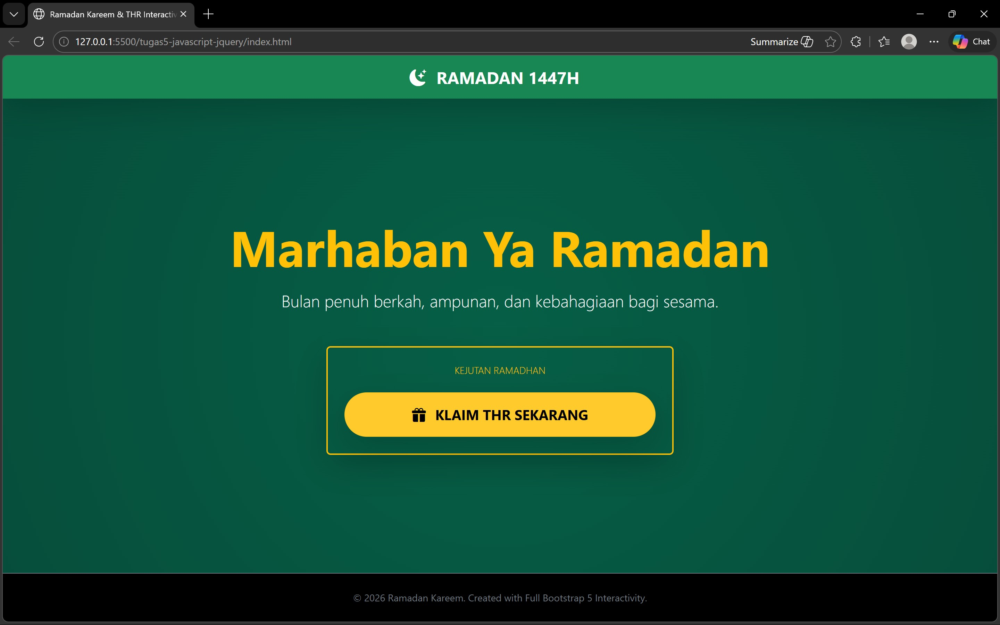
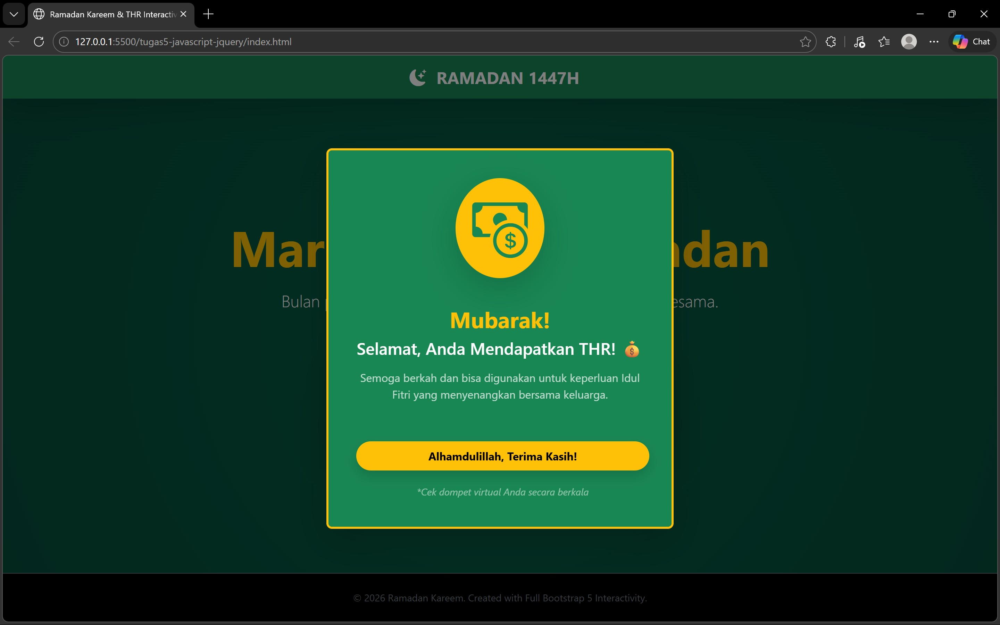
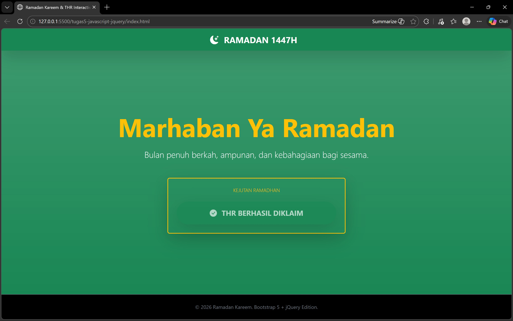

<div align="center">
  <br />
  <h1>LAPORAN PRAKTIKUM <br>APLIKASI BERBASIS PLATFORM</h1>
  <br />
  <h3>MODUL 5 <br> Javascript & JQuery </h3>
  <br />
   
  <br />
  <br />
  <br />
  <h3>Disusun Oleh :</h3>
  <p>
    <strong>Nisrina Amalia Iffatunnisa</strong><br>
    <strong>2311102156</strong><br>
    <strong>S1 IF-11-01</strong>
  </p>
  <br />
  <h3>Dosen Pengampu :</h3>
  <p>
    <strong>Dimas Fanny Hebrasianto Permadi, S.ST., M.Kom</strong>
  </p>
  <br />
  <br />
    <h4>Asisten Praktikum :</h4>
    <strong> Apri Pandu Wicaksono </strong> <br>
    <strong>Rangga Pradarrell Fathi</strong>
  <br />
  <h3>LABORATORIUM HIGH PERFORMANCE
 <br>FAKULTAS INFORMATIKA <br>UNIVERSITAS TELKOM PURWOKERTO <br>2026</h3>
</div>

---

## 1. Dasar Teori
#### Sejarah Singkat Javascript
Javascript, seperti namanya, merupakan bahasa pemrograman scripting. Dan seperti bahasa scripting lainnya, Javascript umumnya digunakan hanya untuk program yang tidak terlalu besar, biasanya hanya beberapa ratus baris. Javascript pada umumnya mengontrol program yang berbasis Java. Jadi memang pada dasarnya Javascript tidak dirancang untuk digunakan dalam aplikasi skala besar. Meskipun dibuat dengan tujuan awal untuk mengendalikan program Java, komunitas Javascript menggunakan bahasa ini untuk tujuan lain, memanipulasi gambar dan isi dari dokumen HTML. Singkatnya, pada akhirnya Javascript digunakan untuk satu tujuan utama, “menghidupkan” dokumen HTML dengan mengubah konten statis menjadi dinamis dan interaktif.

#### Pembuatan Object pada Javascript
Notasi pembuatan objek pada Javascript sangat sederhana, yaitu sepasang kurung kurawal yang membungkus properti. Notasi pembuatan objek ini dikenal dengan nama object literal. Object literal dapat digunakan kapanpun pada ekspresi Javascript yang valid:
```JS
var objek_kosong = {};
var mobil = {
"warna-badan": "merah",
"nomor-polisi": "BK1234AB"
};
```

#### Function pada Javascript
Sebuah fungsi membungkus satu atau banyak perintah. Setiap kali fungsi dipanggil, maka perintahperintah yang ada di dalam fungsi tersebut dijalankan. Secara umum fungsi digunakan untuk penggunaan kembali kode (code reuse) dan penyimpanan informasi (information hiding). Implementasi fungsi kelas pertama juga memungkinkan penggunaan fungsi sebagai unit-unit yang dapat dikombinasikan, seperti layaknya sebuah lego. Dukungan terhadap pemrograman berorientasi objek juga berarti fungsi dapat digunakan untuk memberikan perilaku tertentu dari sebuah objek. Pembuatan Fungsi pada Javascript Sebuah fungsi pada Javascript dibuat dengan cara seperti berikut: 
```JS
function tambah(a, b) 
    { hasil = a + b; 
    return hasil; 
}
```

#### Pemanggilan Function
Sebuah fungsi dapat dipanggil untuk menjalankan seluruh kode yang ada di dalam fungsi tersebut, sesuai dengan parameter yang kita berikan. Pemanggilan fungsi dilakukan dengan cara menuliskan nama fungsi tersebut, kemudian mengisikan argumen yang ada di dalam tanda kurung. Misalkan fungsi tambah yang kita buat pada bagian sebelumnya:
```JS
var tambah = function (a, b) {
    hasil = a + b;
    return hasil;
};
```
dapat dipanggil seperti berikut:
```JS    
    tambah(3, 5);
```

#### Pengenalan JQuery
jQuery adalah sebuah library Javascript yang dibuat oleh John Resig pada tahun 2006. jQuery memungkinkan manipulasi dokumen HTML dilakukan hanya dalam beberapa baris code. Beberapa fitur utama yang terdapat pada jQuery adalah: 
- DOM manipulation: jQuery memungkinkan untuk memodifikasi DOM (Document Object Model) menggunakan source selector yang disebut dengan Sizzle. 
- Event Handling: jQuery dapat menangani sebuah aksi pada dokumen HTML seperti saat pengguna melakukan click pada sebuah objek. 
- Ajax Support: jQuery dapat memfasilitasi pembuatan website menggunakan teknologi AJAX. 
- Animations: pada jQuery terdapat build-in animasi yang dapat digunakan pada halaman web. 
- Lightweight: ukuran file jQuery sangat ringan yaitu sekitar 19KB.

### Penggunaan JQuery
jQuery dapat dengan mudah digunakan pada sebuah situs web dengan beberapa cara, di antaranya:
1. Instalasi Lokal
- Kunjungi link `https://jquery.com/download/` untuk mengunduh library jQuery.
- Letakkan library yang sudah diunduh pada satu folder yang sama dengan file HTML.
- Buka file HTML tersebut menggunakan web browser seperti Mozilla atau Chrome. Dan hasil yang didapatkan adalah sebuah teks “Hello World” seperti yang ditulis pada bagian document.write().
2. Menggunakan CDN (Content Delivery Network)
- Buka file HTML tersebut menggunakan web browser seperti Mozilla atau Chrome. Dan hasil yang didapatkan adalah sebuah teks “Hello World” seperti yang ditulis pada bagian document.write(). `https://code.jquery.com/jquery-3.7.1.min.js`
- Buka file HTML menggunakan web browser dan hasil yang ditampilkan akan sama dengan cara instalasi lokal.

##  2. Unguided 

### 1.) Implementasi JS JQuery

```HTML
<!DOCTYPE html>
<html lang="id">
<head>
    <meta charset="UTF-8">
    <meta name="viewport" content="width=device-width, initial-scale=1.0">
    <title>Ramadan Kareem & THR Interactive</title>

    <!-- Bootstrap CSS -->
    <link href="https://cdn.jsdelivr.net/npm/bootstrap@5.3.2/dist/css/bootstrap.min.css" rel="stylesheet">

    <!-- Bootstrap Icons -->
    <link rel="stylesheet" href="https://cdn.jsdelivr.net/npm/bootstrap-icons@1.11.1/font/bootstrap-icons.css">
</head>

<body class="bg-dark text-light min-vh-100 d-flex flex-column">

    <!-- Navbar -->
    <nav class="navbar navbar-dark bg-success shadow-lg sticky-top">
        <div class="container justify-content-center">
            <span class="navbar-brand fw-bold fs-4">
                <i class="bi bi-moon-stars-fill me-2"></i> RAMADAN 1447H
            </span>
        </div>
    </nav>

    <!-- Hero Section -->
    <section class="py-5 text-center flex-grow-1 d-flex align-items-center bg-success bg-gradient">
        <div class="container py-5">
            <h1 class="display-2 fw-bold text-warning mb-3">Marhaban Ya Ramadan</h1>
            <p class="lead fs-4 mb-5 text-light">
                Bulan penuh berkah, ampunan, dan kebahagiaan bagi sesama.
            </p>
            
            <div class="card bg-transparent border-warning border-2 mx-auto p-4 shadow-lg" style="max-width: 500px;">
                <h3 class="text-warning mb-4 fw-light small text-uppercase">
                    Kejutan Ramadhan
                </h3>

                <button id="thrButton" type="button"
                        class="btn btn-warning btn-lg rounded-pill px-5 py-3 fw-bold shadow-lg"
                        data-bs-toggle="modal" data-bs-target="#thrModal">
                    <i class="bi bi-gift-fill me-2"></i>
                    KLAIM THR SEKARANG
                </button>
            </div>
        </div>
    </section>

    <!-- Modal -->
    <div class="modal fade" id="thrModal" tabindex="-1">
        <div class="modal-dialog modal-dialog-centered">
            <div class="modal-content bg-success border-warning border-3 text-center p-4 shadow-lg">

                <div class="modal-header border-0 justify-content-center">
                    <div class="bg-warning rounded-circle p-4 shadow-lg">
                        <i class="bi bi-cash-coin display-1 text-success"></i>
                    </div>
                </div>

                <div class="modal-body py-4">
                    <h2 class="fw-bold text-warning mb-2">Mubarak!</h2>
                    <h4 class="text-white mb-3">
                        Selamat, Anda Mendapatkan THR! 💰
                    </h4>
                    <p class="text-light opacity-75">
                        Semoga berkah dan bisa digunakan untuk keperluan Idul Fitri.
                    </p>
                </div>

                <div class="modal-footer border-0 flex-column">
                    <button type="button"
                            class="btn btn-warning w-100 fw-bold rounded-pill py-2 shadow"
                            data-bs-dismiss="modal">
                        Alhamdulillah, Terima Kasih!
                    </button>

                    <small class="mt-3 text-white-50 fst-italic">
                        *Cek dompet virtual Anda secara berkala
                    </small>
                </div>

            </div>
        </div>
    </div>

    <!-- Footer -->
    <footer class="py-4 bg-black text-center border-top border-secondary mt-auto">
        <div class="container">
            <p class="text-secondary mb-0 small">
                © 2026 Ramadan Kareem. Bootstrap 5 + jQuery Edition.
            </p>
        </div>
    </footer>

    <!-- jQuery CDN -->
    <script src="https://code.jquery.com/jquery-3.7.1.min.js"></script>

    <!-- Bootstrap JS -->
    <script src="https://cdn.jsdelivr.net/npm/bootstrap@5.3.2/dist/js/bootstrap.bundle.min.js"></script>

    <!-- jQuery Custom Script -->
    <script>
        $(document).ready(function () {

            // Saat tombol THR diklik
            $("#thrButton").click(function () {

                // Ubah teks tombol
                $(this).html('<i class="bi bi-check-circle-fill me-2"></i> THR BERHASIL DIKLAIM');

                // Ubah warna tombol
                $(this).removeClass("btn-warning")
                       .addClass("btn-success");

                // Disable tombol agar tidak bisa diklik lagi
                $(this).prop("disabled", true);
            });

            // Animasi fade-in saat modal muncul
            $("#thrModal").on("shown.bs.modal", function () {
                $(".modal-content").hide().fadeIn(800);
            });

        });
    </script>

</body>
</html>
```
Kode di atas merupakan halaman web interaktif bertema Ramadan yang dibangun menggunakan kombinasi Bootstrap 5 dan jQuery. Bootstrap digunakan untuk mengatur layout, warna, komponen, serta responsivitas halaman melalui class bawaan seperti navbar, container, card, modal, dan berbagai utility class lainnya. Sementara itu, Bootstrap Icons dimanfaatkan untuk menambahkan ikon dekoratif seperti bulan, hadiah, dan koin agar tampilan lebih menarik secara visual.

Interaktivitas pada halaman ini diatur menggunakan jQuery. Ketika tombol `“KLAIM THR SEKARANG”` diklik, jQuery akan mengubah teks tombol menjadi `“THR BERHASIL DIKLAIM”`, mengganti warna tombol dari kuning menjadi hijau, serta menonaktifkannya agar tidak dapat ditekan kembali. Selain itu, saat modal muncul, ditambahkan efek animasi fadeIn() untuk memberikan transisi visual yang lebih halus. Bootstrap JavaScript tetap digunakan untuk mengaktifkan komponen modal melalui atribut `data-bs-toggle`.

## SS Tugas





## Kesimpulan
Secara keseluruhan, penugasan memadukan Bootstrap dan jQuery untuk menghasilkan tampilan yang responsif sekaligus interaktif. Bootstrap berperan dalam desain dan struktur layout, sedangkan jQuery menangani manipulasi elemen dan efek animasi. Implementasi JavaScript terlihat jelas melalui perubahan teks, warna, dan status tombol setelah diklik. Fitur modal juga berjalan dengan dukungan Bootstrap JS. Dengan demikian, tugas ini memberikan pemahaman yang baik dalam mengintegrasikan framework CSS dan library JavaScript dalam satu halaman web.

## Referensi
[1] [Materi Modul 6](https://drive.google.com/file/d/1J27NhEO2MbOF9DetZmOtEGAcPkczzm1r/view?usp=sharing) </br>
