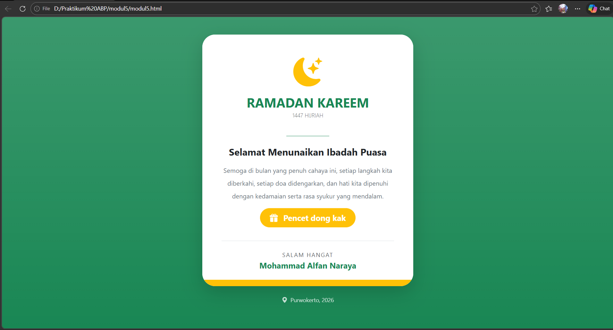
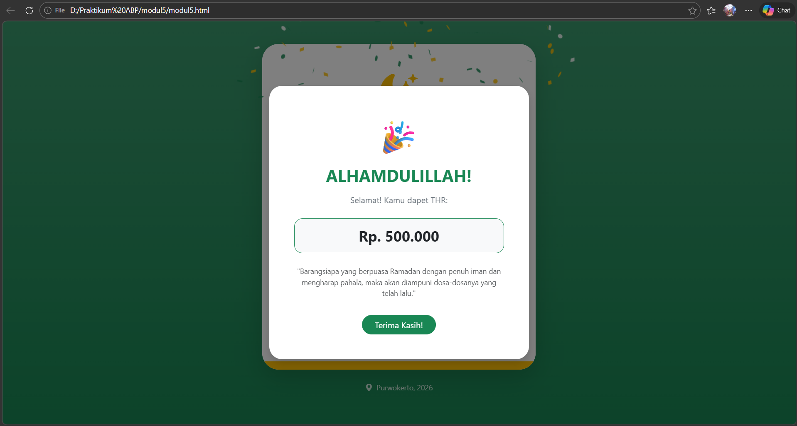

<div align="center">
  <br />
  <h1>LAPORAN PRAKTIKUM <br>APLIKASI BERBASIS PLATFORM</h1>
  <br />
  <h3>MODUL 5 <br> JAVASCRIPT</h3>
  <br />
  <br />
   
  <br />
  <br />
  <br />
  <br />
  <h3>Disusun Oleh :</h3>
  <p>
    <strong>Mohammad Alfan Naraya</strong><br>
    <strong>2311102170</strong><br>
    <strong>S1 IF-11-REG01</strong>
  </p>
  <br />
  <br />
  <h3>Dosen Pengampu :</h3>
  <p>
    <strong>Dimas Fanny Hebrasianto Permadi, S.ST., M.Kom</strong>
  </p>
  <br />
  <br />
    <h4>Asisten Praktikum :</h4>
    <strong> Apri Pandu Wicaksono </strong> <br>
    <strong>Rangga Pradarrell Fathi</strong>
  <br />
  <h3>LABORATORIUM HIGH PERFORMANCE
 <br>FAKULTAS INFORMATIKA <br>UNIVERSITAS TELKOM PURWOKERTO <br>2026</h3>
</div>

---

## 1. Dasar Teori

**JavaScript (JS)** adalah bahasa pemrograman dinamis tingkat tinggi yang menjadi pilar utama dalam menciptakan pengalaman pengguna yang interaktif dan responsif di internet. Berbeda dengan HTML yang menyusun struktur atau CSS yang mengatur estetika, JavaScript berperan sebagai "otak" yang memungkinkan elemen pada halaman web bereaksi secara real-time. Hal ini mencakup pembaruan konten secara instan tanpa perlu memuat ulang (reload) halaman, hingga fungsi validasi formulir yang memastikan data akurat sebelum diproses lebih lanjut.

Melalui konsep **DOM (Document Object Model)**, JavaScript dapat mengakses dan memanipulasi struktur dokumen HTML secara logis. Dengan memanfaatkan DOM, pengembang dapat menambah, menghapus, maupun mengubah elemen HTML serta menyesuaikan properti **CSS styling** secara dinamis berdasarkan _event_ atau kejadian tertentu, seperti klik, _hover_, menggulir halaman, dan berbagai interaksi pengguna lainnya.

Seiring berjalannya waktu, peran JavaScript telah melampaui batas browser (sisi klien). Kehadiran runtime environment seperti Node.js telah merevolusi cara kerja pengembang dengan memungkinkan JavaScript berjalan di sisi server (back-end).

Fenomena ini melahirkan konsep Full-Stack JavaScript, di mana pengembang dapat membangun seluruh arsitektur aplikasi—mulai dari antarmuka pengguna, logika server, hingga pengelolaan basis data—hanya dengan satu bahasa pemrograman yang sama. Efisiensi ini tidak hanya mempercepat proses pengembangan, tetapi juga memudahkan sinkronisasi kode di seluruh ekosistem aplikasi modern.

````
### 2. Penjelasan Kode HTML, CSS, dan JS


### Kode HTML

````html
<div class="card shadow-lg border-0 rounded-5">
    <div class="card-header bg-white border-0 pt-5">
        <i class="bi bi-moon-stars-fill text-warning display-2"></i>
        <h2 class="fw-bold text-success mt-3 mb-0">RAMADAN KAREEM</h2>
    </div>
    <div class="card-body">
        <button class="btn-thr" data-bs-toggle="modal" data-bs-target="#modalTHR">
            Pencet dong kak
        </button>
    </div>
</div>

<div class="modal fade" id="modalTHR">
    <div class="modal-content shadow">
        <div class="modal-body">
            <h2>ALHAMDULILLAH!</h2>
            <h3>Rp. 500.000</h3>
        </div>
    </div>
</div>
````

### Kode CSS (`style.css`)

```css
<style>
    /* Membuat tombol bergerak naik-turun otomatis */
    @keyframes floating {
        0% { transform: translateY(0px); }
        50% { transform: translateY(-10px); }
        100% { transform: translateY(0px); }
    }

    .btn-thr {
        animation: floating 2s infinite ease-in-out;
        transition: all 0.3s ease;
    }

    /* Efek saat tombol diarahkan kursor */
    .btn-thr:hover {
        transform: scale(1.1) rotate(2deg);
    }
</style>
```

### Kode JS (`main.js`)

```javascript
<script>
    const modal = document.getElementById('modalTHR');

    // Listener: Jalankan fungsi saat modal selesai muncul (shown)
    modal.addEventListener('shown.bs.modal', () => {
        confetti({
            particleCount: 150,     // Jumlah kertas
            spread: 70,             // Jangkauan ledakan
            origin: { y: 0.6 },     // Titik munculnya ledakan
            colors: ['#198754', '#ffc107', '#ffffff'] // Hijau, Kuning, Putih
        });
    });
</script>
```

### Hasil Tampilan (Screenshot)




### Penjelasan code:

#### 1. HTML (`modul5.html`)
Komponen ini berfungsi sebagai kerangka dasar untuk menampilkan konten ucapan dan jendela kejutan.
* **Card Component:** Menggunakan kelas `.card` dari Bootstrap untuk menciptakan kontainer ucapan yang modern.
* **Modal Pop-up:** Menggunakan ID `#modalTHR` sebagai kontainer tersembunyi yang akan muncul membawa pesan kejutan.
* **Bootstrap Icons:** Integrasi ikon seperti `bi-moon-stars-fill` untuk memperkuat nuansa religius.

---

#### 2. Styling CSS (`style.css`)

Bagian ini bertanggung jawab atas estetika visual dan memberikan "kehidupan" pada elemen statis.
* **Floating Animation:** Menggunakan `@keyframes` kustom untuk membuat tombol bergerak naik-turun secara halus, memberikan kesan dinamis pada halaman.
* **Hover Effects:** Menambahkan transisi `scale` (pembesaran) dan `rotate` (perputaran) saat tombol disentuh untuk meningkatkan *User Experience* (UX) yang responsif.
* **Gradient Styling:** Menggunakan utilitas `.bg-gradient` pada latar belakang untuk menciptakan kedalaman visual (depth) agar tampilan tidak terlihat datar.

---

#### 3. Fungsi JavaScript (`script.js`)

Komponen JavaScript pada proyek ini berfungsi sebagai "otak" yang menangani interaksi pengguna dan memicu efek perayaan secara dinamis.

* **Integrasi Library Canvas-Confetti:** Menggunakan library eksternal untuk menghasilkan simulasi fisik partikel (kembang api kertas) yang ringan dan berperforma tinggi.
* **Event Listener (`shown.bs.modal`):** Logika ini memastikan bahwa efek visual hanya akan dimulai tepat setelah transisi modal Bootstrap selesai terbuka sepenuhnya. Hal ini memberikan efek kejutan (*surprise*) yang maksimal.
* **Custom Configuration:** Partikel dikonfigurasi secara khusus untuk menciptakan estetika yang sesuai:
    * `particleCount`: Menentukan kepadatan ledakan kertas.
    * `spread`: Mengatur luas jangkauan sebaran partikel ke seluruh layar.
    * `colors`: Menggunakan palet warna tema (Hijau, Kuning/Emas, Putih).

## Refrensi

- [Materi Modul 5](https://drive.google.com/file/d/1J27NhEO2MbOF9DetZmOtEGAcPkczzm1r/view?usp=sharing)
