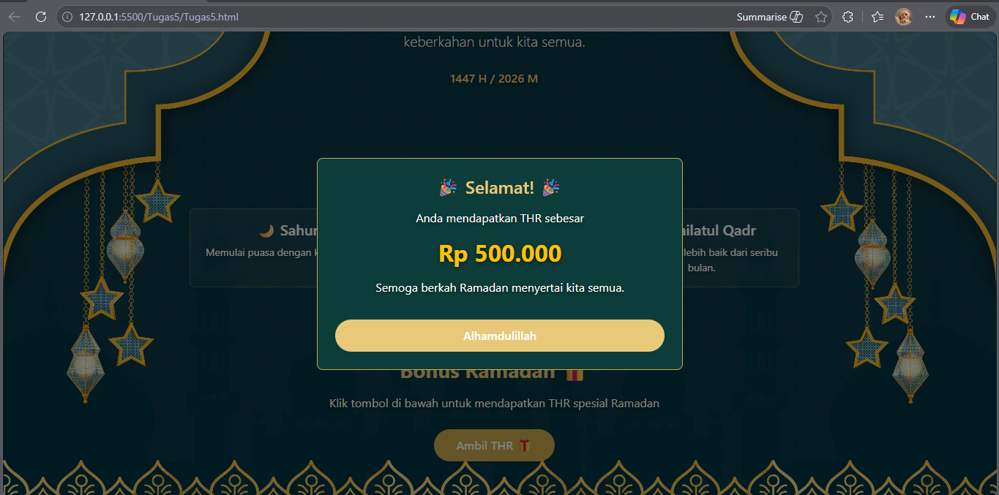

<div align="center">

<br>

<h1>
LAPORAN PRAKTIKUM <br>
APLIKASI BERBASIS PLATFORM
</h1>

<br>

<h3>
MODUL 5 <br>
GIT
</h3>

<br>


<br><br><br>

<h3>Disusun Oleh :</h3>

<strong>Boutefhika Nuha Ziyadatul Khair</strong><br>
<strong>2311102316</strong><br>
<strong>S1 IF-11-01</strong>

<br><br>

<h3>Dosen Pengampu :</h3>

<strong>Dimas Fanny Hebrasianto Permadi, S.ST., M.Kom</strong>

<br><br>

<h4>Asisten Praktikum :</h4>

Apri Pandu Wicaksono <br>
Rangga Pradarrell Fathi

<br><br>

<h3>
LABORATORIUM HIGH PERFORMANCE <br>
FAKULTAS INFORMATIKA <br>
UNIVERSITAS TELKOM PURWOKERTO <br>
2026
</h3>

</div>

<hr>


# Dasar Teori

## 6.1. Pengenalan Javascript
### 6.1.1. Sejarah Singkat Javascript
Javascript, seperti namanya, merupakan bahasa pemrograman scripting. Dan seperti bahasa scripting lainnya, Javascript umumnya digunakan hanya untuk program yang tidak terlalu besar, biasanya hanya beberapa ratus baris. Javascript pada umumnya mengontrol program yang berbasis Java. Jadi memang pada dasarnya Javascript tidak dirancang untuk digunakan dalam aplikasi skala besar. Meskipun dibuat dengan tujuan awal untuk mengendalikan program Java, komunitas Javascript
menggunakan bahasa ini untuk tujuan lain, memanipulasi gambar dan isi dari dokumen HTML. Singkatnya, pada akhirnya Javascript digunakan untuk satu tujuan utama, “menghidupkan” dokumen HTML dengan mengubah konten statis menjadi dinamis dan interaktif. Bersamaan dengan perkembangan Internet dan dunia web yang pesat, Javascript akhirnya menjadi bahasa utama dan satu-satunya untuk membuat HTML menjadi interaktif di dalam browser.

### 6.1.2. Prinsip Dasar Javascript
Prinsip dasar yang terdapat pada bahasa pemrograman javascript adalah sebagai berikut.
1. Javascript mendukung paradigma pemrograman imparatif (Javascript dapat menjalankan perintah
program baris demi baris, dengan masing-masing baris berisi satu atau lebih perintah), fungsional (struktur dan elemen-elemen dalam program sebagai fungsi matematis yang tidak memiliki keadaan (state) dan data yang dapat berubah (mutable data)), dan orientasi objek (segala sesuatu yang terlibat dalam program dapat disebut sebagai “objek”).
2. Javascript memiliki model pemrograman fungsional yang sangat ekspresif.
3. Pemrograman berorientasi objek (PBO) pada Javascript memiliki perbedaan dari PBO pada umumnya.
4. Program kompleks pada Javascript umumnya dipandang sebagai program-program kecil yang saling
berinteraksi.

## 6.2. Sintaks Umum pada Javascript
### 6.2.1. Tipe data dasar
Seperti kebanyakan bahasa pemrograman lainnya, Javascript memiliki beberapa tipe data untuk
dimanipulasi. Seluruh nilai yang ada dalam Javascript selalu memiliki tipe data. Tipe data yang dimiliki oleh Javascript adalah sebagai berikut:
• Number (bilangan)
• String (serangkaian karakter)
• Boolean (benar / salah)
• Object
• Function (fungsi)
• Array
• Date
• RegExp (regular expression)
• Null (tidak berlaku / kosong)
• Undefined (tidak didefinisikan)
Kebanyakan dari tipe data yang disebutkan di atas sama seperti tipe data sejenis pada bahasa
pemrograman lainnya. Misalnya, sebuah boolean terdiri dari dua nilai saja, yaitu true dan false.

### 6.2.2. Variabel
Seperti pada bahasa pemrograman lainnya, variabel dalam Javascript merupakan sebuah tempat untuk
menyimpan data sementara. Variabel dibuat dengan kata kunci var pada Javascript.
```
var a; // a berisi undefined
var nama = "Budi"; // nama berisi "Budi"
```
Nilai yang ada di dalam variabel dapat diganti dengan mengisikan nilai baru, dan bahkan dapat diganti tipe datanya juga.
```
nama = "Anton"; // nama sekarang berisi string "Anton"
nama = 1; // nama sekarang berisi integer 1
```
Walaupun kemampuan untuk menggantikan tipe data ini sangat memudahkan kita dalam mengembangkan
aplikasi, fitur ini harus digunakan dengan sangat hati-hati. Perubahan tipe data yang tidak diperkirkan dengan baik dapat menyebabkan berbagai kesalahan (error) pada program, misalnya jika kita mencoba mengakses method charAt() (fungsi yang mengembalikan nilai char pada indeks sebuah string) setelah mengubah tipe pada contoh di atas.

### 6.2.3. Array
Array merupakan sebuah tipe data yang digunakan untuk menampung banyak tipe data lainnya. Berbeda dengan tipe data object, array pada Javascript merupakan sebuah tipe khusus. Walaupun memiliki method dan properti, array bukanlah objek, melainkan sebuah tipe yang “mirip objek”. Pembuatan array dalam Javascript dilakukan dengan menggunakan kurung siku ([]):
```
var data = ["satu", 2, true];
```
Elemen array pada Javascript tidak harus memiliki tipe data yang sama seperti contoh diatas. Selain itu Javascript juga mendukung untuk membuat array di dalam array yang biasa dikenal dengan array dua dimensi seperti contoh dibawah ini.
```
var arr2 = [["satu", "dua"], ["tiga", "empat"]];
```
Pengaksesan elemen dalam array dilakukan dengan menggunakan kurung siku. Nilai yang kita berikan
dalam kurung siku adalah urutan elemen penulisan array (indeks), yang dimulai dari nilai 0. Jika indeks yang diakses tidak ada, maka kita akan mendapatkan nilai undefined.
```
data[2]; // mengembalikan true
arr2[0][1]; // mengembalikan "dua"
data[10]; // mengembalikan undefined
```
Sebagai sebuah objek khusus, array juga memiliki method dan properti. Beberapa method dan properti yang populer misalnya length, pop(), dan push().
```
var data = ["a", "b", "c"];
// data.length mengembalikan 3
data.push("d"); // mengembalikan 4 data menjadi ["a", "b", "c", "d"]
data.pop(); // mengembalikan "d", data menjadi ["a", "b", "c"]
```

### 6.2.4. Pengendalian Struktur
Javascript memiliki perintah-perintah pengendalian struktur (control stucture) yang sama dengan bahasa dalam keluarga C. Perintah if dan else digunakan untuk percabangan, sementara perintah for, for-in, while, dan do-while digunakan untuk perulangan. Percabangan pada Javascript bisa dikatakan sama persis dengan C atau Java:
```
var gelar;
var pendidikan = "S2";
if (pendidikan === "S1") {
gelar = "Sarjana";
} else if (pendidikan === "S2") {
gelar = "Master";
} else if (pendidikan === "S3") {
gelar = "Doktor";
} else {
gelar = "Tidak Diketahui";
}
gelar; // gelar berisi "Master"
```
Satu hal yang perlu diperhatikan, tiga buah sama dengan (===) digunakan pada operasi perbandingan di Javascript. Javascript mendukung dua operator perbandingan sama dengan, yaitu == dan ===. Perbedaan utamanya adalah == mengubah tipe data yang dicek menjadi nilai terdekat, sementara === memastikan tipe data dari dua nilai yang dibandingkan sama. Untuk mendapatkan nilai perbandingan paling akurat, selalu gunakan === ketika mengecek nilai. Sama seperti if, perulangan do, do-while, dan for memiliki cara pemakaian yang dapat dikatakan sama persis dengan C atau Java:
```
while (true) {
    // tak pernah berhenti
} var input; do {
input = get_input();
} while (inputIsNotValid(input)) for
(var i = 0; i < 5; i++) {
    // berulang sebanyak 5 kali }
```

## 6.3. Object orientation pada Javascript
Javascript memiliki dua jenis tipe data utama, yaitu tipe data dasar dan objek. Tipe data dasar pada Javascript adalah angka (numbers), rentetan karakter (strings), boolean (true dan false), null, dan undefined. Nilai-nilai selain tipe data dasar secara otomatis dianggap sebagai objek. Objek dalam Javascript didefinisikan sebagai mutable properties collection, yang artinya adalah sekumpulan properti (ciri khas) yang dapat berubah nilainya. Karena nilai-nilai selain tipe data dasar merupakan objek, maka pada Javascript sebuah Array adalah objek. Fungsi adalah objek dan Regular expression juga merupakan objek.

### 6.3.1. Pembuatan Object pada Javascript
Notasi pembuatan objek pada Javascript sangat sederhana, yaitu sepasang kurung kurawal yang
membungkus properti. Notasi pembuatan objek ini dikenal dengan nama object literal. Object literal dapat digunakan kapanpun pada ekspresi Javascript yang valid:
```
var objek_kosong = {};
var mobil = {
    "warna-badan": "merah",
    "nomor-polisi": "BK1234AB"
};
```
Nama properti dari sebuah objek harus berupa string, dan boleh berisi string kosong (""). Jika merupakan nama Javascript yang legal, kita tidak memerlukan petik ganda pada nama properti. Petik ganda seperti pada contoh ("warna-badan") hanya diperlukan untuk nama Javascript ilegal atau kata kunci seperti “if” atau “var”. Misalnya, "nomor-polisi" memerlukan tanda petik, sementara nomor_polisi tidak. Contoh lain, variasi tidak memerlukan tanda petik, sementara "var" perlu.

Sebuah objek dapat menyimpan banyak properti, dan setiap properti dipisahkan dengan tanda koma (,). Jika ada banyak properti, nilai dari properti pada setiap objek boleh berbeda-beda:
```
var jadwal = {
  platform: 34,
  telah_berangkat: false,
  tujuan: "Medan",
  asal: "Jakarta"
};
```
Karena dapat diisikan dengan nilai apapun (termasuk objek), maka kita dapat membuat objek yang
mengandung objek lain (nested object; objek bersarang) seperti berikut:
```
var jadwal = { platform: 34,
telah_berangkat: false, asal:
{       kode_kota: "MDN",
nama_kota: "Medan",
waktu: "2013-12-29 14:00"
    }, tujuan: {
kode_kota: "JKT",
nama_kota: "Jakarta",
waktu: "2013-12-29 17.30"
    }
};
```

### 6.3.2. Akses Nilai Property
Akses nilai properti dapat dilakukan dengan dua cara, yaitu.
1. Penggunaan kurung siku ([]) setelah nama objek. Kurung siku kemudian diisikan dengan nama
properti, yang harus berupa string. Cara ini biasanya digunakan untuk nama properti yang adalah
nama ilegal atau kata kunci Javascript.
2. Penggunaan tanda titik (.) setelah nama objek diikuti dengan nama properti. Notasi ini merupakan
notasi yang umum digunakan pada bahasa pemrograman lainnya. Notasi ini tidak dapat digunakan
untuk nama ilegal atau kata kunci Javascript.

Contoh penggunaan kedua cara pemanggilan di atas adalah sebagai berikut:
```
mobil["warna-badan"] // Hasil: "merah"
jadwal.platform // Hasil: 34
```
Sebagai bahasa dinamis, Javascript tidak akan melemparkan pesan kesalahan jika kita mengakses properti yang tidak ada dalam objek. Kita akan menerima nilai undefined jika mengakses properti yang tidak ada:
```
jadwal.nomor_kursi // Hasil: undefined mobil
["jumlah-roda"] // Hasil: undefined
```
Pengaksesan properti pada Javascript juga dapat digunakan secara dinamis untuk mengubah nilai dari properti tersebut. Perubahan nilai properti juga dapat dilakukan untuk properti yang bahkan tidak ada pada objek tersebut:
```
mobil["jumlah-roda"] = 4;
mobil.bahan_bakar = "Bensin";
```

### 6.3.3. Prototype pada Javascript
Pada Javascript yang mengimplementasikan PBO kita tidak lagi perlu menuliskan kelas, dan langsung melakukan penurunan terhadap objek. Misalkan kita memiliki objek mobil yang sederhana seperti berikut:
```
var mobil = { nama: "Mobil",
jumlahBan: 4 };
```
Kita dapat langsung menurunkan objek tersebut dengan menggunakan fungsi Object.create seperti
berikut:
```
var truk = Object.create(mobil);
// truk.nama === "Mobil"
// truk.jumlahBan === 4
```

## 6.4. Function pada Javascript
Sebuah fungsi membungkus satu atau banyak perintah. Setiap kali fungsi dipanggil, maka perintahperintah yang ada di dalam fungsi tersebut dijalankan. Secara umum fungsi digunakan untuk penggunaan kembali kode (code reuse) dan penyimpanan informasi (information hiding). Implementasi fungsi kelas pertama juga memungkinkan penggunaan fungsi sebagai unit-unit yang dapat dikombinasikan, seperti layaknya sebuah lego. Dukungan terhadap pemrograman berorientasi objek juga berarti fungsi dapat digunakan untuk
memberikan perilaku tertentu dari sebuah objek.

### 6.4.1/ Pembuatan Fungsi pada Javascript
Sebuah fungsi pada Javascript dibuat dengan cara seperti berikut:
```
function tambah(a, b) {
hasil = a + b;
return hasil;
}
```
Cara penulisan fungsi seperti diatas dikenal dengan nama function declaration, atau deklarasi fungsi.
Terdapat empat komponen yang membangun fungsi di atas, yaitu:
1. Kata kunci function, yang memberitahu Javascript bahwa akan dibuat sebuah fungsi.
2. Nama fungsi, dalam contoh di atas adalah tambah. Dengan memberikan sebuah fungsi nama maka
pemanggilan fungsi dapat dirujuk dengan nama tersebut. Harus diingat bawa nama fungsi bersifat
opsional, yang berarti fungsi pada Javascript tidak harus diberi nama.
3. Daftar parameter fungsi, yaitu a, b pada contoh di atas. Daftar parameter ini selalu dikelilingi oleh tanda kurung (()). Parameter boleh kosong, tetapi tanda kurung wajib tetap dituliskan. Parameter fungsi akan secara otomatis didefinisikan menjadi variabel yang hanya bisa dipakai di dalam fungsi. Variabel pada parameter ini diisi dengan nilai yang dikirimkan kepada fungsi secara otomatis.
4. Sekumpulan perintah yang ada di dalam kurung kurawal ({}). Perintah-perintah ini dikenal dengan nama badan fungsi. Badan fungsi dieksekusi secara berurut ketika fungsi dijalankan.
Penulisan deklarasi fungsi (function declaration) seperti di atas merupakan cara penulisan fungsi yang umumnya kita gunakan pada bahasa pemrograman imperatif dan berorientasi objek. Tetapi selain deklarasi fungsi Javascript juga mendukung cara penulisan fungsi lain, yaitu dengan memanfaatkan ekspresi fungsi (function expression). Ekspresi fungsi merupakan cara pembuatan fungsi yang memperbolehkan menuliskan fungsi tanpa nama. Fungsi yang dibuat tanpa nama dikenal dengan sebutan fungsi anonim atau fungsi lambda. Berikut adalah cara membuat fungsi dengan ekspresi fungsi:
```
var tambah = function (a, b) {
hasil = a + b;
return hasil;
};
```

Terdapat hanya sedikit perbedaan antara ekspresi fungsi dan deklarasi fungsi:
1. Penamaan fungsi. Pada deklarasi fungsi, nama fungsi langsung diberikan sesuai dengan sintaks yang disediakan Javascript. Penggunaan ekspresi fungsi pada dasarnya menyimpan sebuah fungsi anonim ke dalam variabel dan nama fungsi adalah nama variabel yang dibuat. Perlu diingat juga bahwa pada dasarnya ekspresi fungsi adalah fungsi anonim. Penyimpanan ke dalam variabel hanya diperlukan karena kita akan memanggil fungsi nantinya.
2. Ekspresi fungsi dapat dipandang sebagai sebuah ekspresi atau perintah standar bagi Javascript, sama seperti penuliskan kode var i = 0. Deklarasi fungsi merupakan konstruksi khusus untuk membuat fungsi. Hal ini berarti pada akhir dari ekspresi fungsi kita harus menambahkan, sementara pada
deklarasi fungsi hal tersebut tidak penting.

### 6.4.2. Pemanggilan Fungsi
Sebuah fungsi dapat dipanggil untuk menjalankan seluruh kode yang ada di dalam fungsi tersebut, sesuai dengan parameter yang kita berikan. Pemanggilan fungsi dilakukan dengan cara menuliskan nama fungsi tersebut, kemudian mengisikan argumen yang ada di dalam tanda kurung.

Misalkan fungsi tambah yang kita buat pada bagian sebelumnya:
```
var tambah = function (a, b) {
hasil = a + b;
return hasil;
};
```
dapat dipanggil seperti berikut:
```
tambah(3, 5);
```
Yang terjadi pada kode di atas adalah nilai a dan b masing-masing digantikan dengan 3 dan 5. Seperti yang dapat dilihat, hal ini berarti pengisian argumen pada saat pemanggilan fungsi harus berurut sesuai dengan deklarasi fungsi.

Sama seperti sebuah variabel, fungsi juga mengembalikan nilai ketika dipanggil. Dalam kasus di atas, tambah(3, 5) akan mengembalikan nilai 8. Nilai ini tentunya dapat disimpan ke dalam variabel baru, atau bahkan dikirimkan sebagai sebuah argumen ke fungsi lain lagi:
```
var simpan = tambah(3, 5); // simpan === 8
tambah(simpan, 2); // mengembalikan 10
tambah(tambah(3, 5), 2) // juga mengembalikan 10
tambah(tambah(2, 3), 4) // mengembalikan 9
```
Fungsi akan mengembalikan nilai ketika kata kunci return ditemukan. Pengembalian nilai fungsi dapat dilakukan kapanpun, dan fungsi akan segera berhenti ketika kata kunci return ditemukan. Berikut adalah contoh kode yang memberikan gambaran tentang pengembalian nilai fungsi:
```
var naikkan = function (n) {
var hasil = n + 10; return
hasil;
// kode di bawah tidak dijalankan lagi hasil
= hasil * 100;
} naikkan(10); // mengembalikan
20 naikkan(25); // mengembalikan
35
```
Sebuah ekspresi dapat juga diberikan langsung kepada keyword return, dan ekspresi tersebut akan
dijalankan sebelum nilai dikembalikan. Hal ini berarti fungsi tambah maupun naikkan yang sebelumnya bisa disederhanakan dengan tidak lagi menyimpan nilai di variabel hasil terlebih dahulu:
```
var naikkan = function (n) {
return n + 10;
} var tambah = function (a,
b) { return a + b;
} tambah(4, 4); // mengembalikan 8
naikkan(10); // mengembalikan 20
tambah(naikkan(5), 7); // mengembalikan 22
```

## 6.5. Pengenalan jQuery
jQuery adalah sebuah library Javascript yang dibuat oleh John Resig pada tahun 2006. jQuery
memungkinkan manipulasi dokumen HTML dilakukan hanya dalam beberapa baris code. Beberapa fitur
utama yang terdapat pada jQuery adalah:

- DOM manipulation – jQuery memungkinkan untuk memodifikasi DOM (Document Object Model)
menggunakan source selector yang disebut dengan Sizzle.
- Event Handling – jQuery dapat menangani sebuah aksi pada dokumen HTML seperti saat pengguna
melakukan click pada sebuah objek.
- Ajax Support – jQuery dapat memfasilitasi pembuatan website menggunakan teknologi AJAX.
- Animations – pada jQuery terdapat build-in animasi yang dapat digunakan pada halaman web.
- Lightweight – ukuran file jQuery sangat ringan yaitu sekitar 19KB.

jQuery dapat dengan mudah digunakan pada sebuah situs web dengan berbagai cara.
1. Instalasi Lokal
- Kunjungi link https://jquery.com/download/ untuk mengunduh library jQuery.
- Letakkan library yang sudah diunduh pada satu folder yang sama dengan file HTML dengan kode berikut.
```
<html>

<head>
  <title>The jQuery Example</title>
  <script type="text/javascript" src="jquery-3.7.0.min.js">
  </script>
  <script type="text/javascript">
    $(document).ready(function() {
    document.write("Hello, World!");
    });
  </script>

</head>

<body>
  <h1>Hello</h1>
</body>

</html>
```
Note: pastikan atribut src memiliki nilai yang sama dengan nama file library jQuery.
- Buka file HTML tersebut menggunakan web browser seperti Mozilla atau Chrome. Dan hasil yang
didapatkan adalah sebuah teks “Hello World” seperti yang ditulis pada bagian document.write().

2. Menggunakan CDN (Content Delivery Network)
- Buka file HTML tersebut menggunakan web browser seperti Mozilla atau Chrome. Dan hasil yang
didapatkan adalah sebuah teks “Hello World” seperti yang ditulis pada bagian document.write().
https://code.jquery.com/jquery-3.7.1.min.js
- Buka file HTML menggunakan web browser dan hasil yang ditampilkan akan sama dengan cara
instalasi lokal.

## 6.6. Kegunaan Lanjutan jQuery
### 6.6.1. Efek hide/show
contoh code:
```
<!DOCTYPE html>
<html>
<head>
  <script src="https://code.jquery.com/jquery-3.7.1.min.js"></script>
  <script>
    $(document).ready(function() {
      $("#hide").click(function() {
        $("p").hide();
      });
      $("#show").click(function() {
        $("p").show();
      });
    });
  </script>
</head>

<body>

  <p>If you click on the "Hide" button, I will disappear.</p>
  <button id="hide">Hide</button>
  <button id="show">Show</button>

</body>

</html>
```
Penjelasan code:
- Pada baris 4-5, dilakukan pemanggilan library jQuery menggunakan CDN.
- Pada baris 6-15, fungsi jQuery hide/show diaplikasikan pada tag html <p>. Apabila button dengan id ‘hide’ diklik, maka semua konten pada tag <p> akan disembunyikan. Selain itu, apabila button dengan id ‘show’ diklik, maka semua konten pada tag <p> akan dimunculkan.

### 6.6.2. Efek animasi
Contoh code:
```
<!DOCTYPE html>
<html>

<head>
    <script src="https://code.jquery.com/jquery-3.7.1.min.js"></script>
    <script>
        $(document).ready(function () {
            $("button").click(function () {
                $("div").animate({
                    height: 'toggle'
                });
            });
        });
    </script>
</head>

<body>
    <p>Click the button multiple times to toggle the animation.</p>
    <button>Start Animation</button>
    <p>By default, all HTML elements have a static position, and cannot be moved.
        To manipulate the position, remember to first set the CSS position property of
        the element to relative, fixed, or absolute!</p>
    <div style="background:#98bf21; height:100px; width:100px; position:absolute;">
    </div>
</body>

</html>
```
Penjelasan code:
- Pada baris 6-15, fungsi jQuery menganimasikan “toggle” pada tag <div> yang terdapat pada body HTML berdasarkan tinggi elemen.

# UNGUIDED 
Buka kembali halaman ramadan dan tambahkan button atau semacam nya ketika di klik akan menampilkan modal "selamat anda mendapatkan THR" buat se interaktif itu dan sebagus mungkin.

```
//2311102316
//Boutefhika Nuha Ziyadatul Khair

<!DOCTYPE html>
<html lang="id">
<head>
<meta charset="UTF-8">
<meta name="viewport" content="width=device-width, initial-scale=1">

<title>Marhaban Ya Ramadan</title>

<link href="https://cdn.jsdelivr.net/npm/bootstrap@5.3.6/dist/css/bootstrap.min.css" rel="stylesheet">

<style>

:root{
--teal:#0d3d3a;
--gold:#c9a84c;
--gold-light:#e8c97a;
}

body{
background-image:url("ramadhan.png");
background-size:cover;
background-position:center;
background-repeat:no-repeat;
background-attachment:fixed;
color:white;
font-family:system-ui;
}

/* hero */

.hero{
min-height:100vh;
display:flex;
align-items:center;
justify-content:center;
text-align:center;
}

h1,h2,p{
text-shadow:0 2px 6px rgba(0,0,0,0.6);
}

/* moon */

.moon{
width:90px;
height:90px;
border-radius:50%;
background:var(--gold-light);
position:relative;
box-shadow:0 0 40px rgba(201,168,76,.6);
}

.moon::after{
content:"";
position:absolute;
width:80px;
height:80px;
border-radius:50%;
background:var(--teal);
top:-5px;
left:18px;
}

/* gold text */

.text-gold{
color:var(--gold-light);
}

/* divider */

.divider{
width:120px;
height:2px;
background:var(--gold);
margin:auto;
opacity:.7;
}

/* cards */

.card-ramadan{
background:rgba(255,255,255,.05);
border:1px solid rgba(201,168,76,.3);
backdrop-filter:blur(4px);
}

/* tombol thr */

.btn-thr{
background:var(--gold);
color:white;
font-weight:600;
padding:10px 30px;
border-radius:30px;
border:none;
}

.btn-thr:hover{
background:var(--gold-light);
}

/* modal */

.modal-content{
background:#0d3d3a;
color:white;
border:1px solid var(--gold);
}

</style>
</head>

<body>

<!-- HERO -->
<section class="hero">

<div class="container">

<div class="row justify-content-center">

<div class="col-lg-8">

<div class="d-flex justify-content-center mb-4">
<div class="moon"></div>
</div>

<p class="text-uppercase text-light mb-2">
Selamat Menyambut
</p>

<h2 class="fw-bold display-4">
Marhaban Ya
</h2>

<h1 class="display-1 fw-bold text-gold">
Ramadan
</h1>

<div class="divider my-4"></div>

<p class="lead mb-4">
Semoga bulan yang penuh berkah ini membawa
kedamaian, kebahagiaan, dan keberkahan
untuk kita semua.
</p>

<p class="text-gold fw-semibold">
1447 H / 2026 M
</p>

</div>
</div>

</div>

</section>


<!-- SECTION KEUTAMAAN -->
<section class="pt-3 pb-5">

<div class="container">

<div class="text-center mb-4">
<h2 class="fw-bold text-gold">
Keutamaan Ramadan
</h2>
</div>

<div class="row justify-content-center g-3 text-center">

<div class="col-md-3">
<div class="card card-ramadan p-3 h-100 text-white">
<h5>🌙 Sahur</h5>
<p class="small mb-0">
Memulai puasa dengan keberkahan.
</p>
</div>
</div>

<div class="col-md-3">
<div class="card card-ramadan p-3 h-100 text-white">
<h5>🕌 Tarawih</h5>
<p class="small mb-0">
Memperbanyak ibadah di malam Ramadan.
</p>
</div>
</div>

<div class="col-md-3">
<div class="card card-ramadan p-3 h-100 text-white">
<h5>⭐ Lailatul Qadr</h5>
<p class="small mb-0">
Malam yang lebih baik dari seribu bulan.
</p>
</div>
</div>

</div>

</div>

</section>


<!-- SECTION THR -->
<section class="py-5 text-center">

<div class="container">

<h3 class="text-gold fw-bold mb-3">
Bonus Ramadan 🎁
</h3>

<p class="mb-4">
Klik tombol di bawah untuk mendapatkan THR spesial Ramadan
</p>

<button class="btn btn-thr"
onclick="generateTHR()"
data-bs-toggle="modal"
data-bs-target="#thrModal">
Ambil THR 🎁
</button>

</div>

</section>


<!-- MODAL THR -->

<div class="modal fade" id="thrModal">

<div class="modal-dialog modal-dialog-centered">

<div class="modal-content text-center p-4">

<h4 class="text-gold mb-3">
🎉 Selamat! 🎉
</h4>

<p>
Anda mendapatkan THR sebesar
</p>

<h2 id="thrAmount" class="text-warning fw-bold">
Rp 0
</h2>

<p class="mt-2">
Semoga berkah Ramadan menyertai kita semua.
</p>

<button class="btn btn-thr mt-3" data-bs-dismiss="modal">
Alhamdulillah
</button>

</div>
</div>
</div>


<script src="https://cdn.jsdelivr.net/npm/bootstrap@5.3.6/dist/js/bootstrap.bundle.min.js"></script>

<script>

/* random thr */

function generateTHR(){

let thr = [
10000,
25000,
50000,
100000,
250000,
500000,
1000000
];

let random = thr[Math.floor(Math.random()*thr.length)];

document.getElementById("thrAmount").innerHTML =
"Rp " + random.toLocaleString("id-ID");

}

</script>

</body>
</html>
```
Output:



Deskripsi Program:
Program ini merupakan halaman web ucapan Marhaban Ya Ramadan yang dibuat menggunakan HTML, CSS, Bootstrap, dan JavaScript. HTML digunakan untuk menyusun struktur halaman seperti bagian hero, judul ucapan Ramadan, teks doa, section keutamaan Ramadan, serta fitur bonus THR. CSS digunakan untuk mengatur tampilan visual halaman seperti warna tema, latar belakang gambar, bayangan teks, serta pembuatan elemen dekoratif seperti bulan sabit menggunakan pseudo-element. Selain itu, program memanfaatkan CSS Variable (`:root`) untuk pengaturan warna, Flexbox untuk penataan elemen, serta komponen Bootstrap seperti container, row, col, card, button, dan modal agar tampilan halaman menjadi rapi dan responsif. JavaScript digunakan untuk membuat fitur interaktif berupa pengambilan THR secara acak, di mana saat tombol “Ambil THR” ditekan, sistem akan menampilkan nominal THR yang dipilih secara random di dalam modal. Halaman ini dirancang agar menampilkan ucapan Ramadan dengan tampilan yang menarik, modern, serta memiliki interaksi sederhana bagi pengguna.
