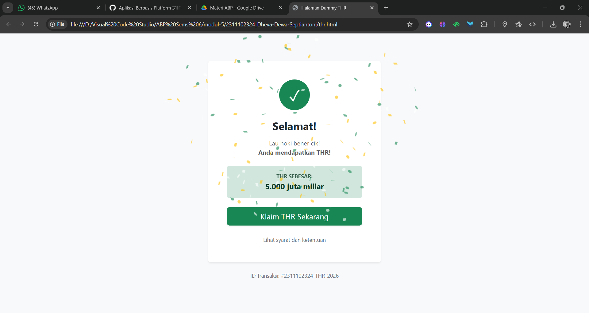
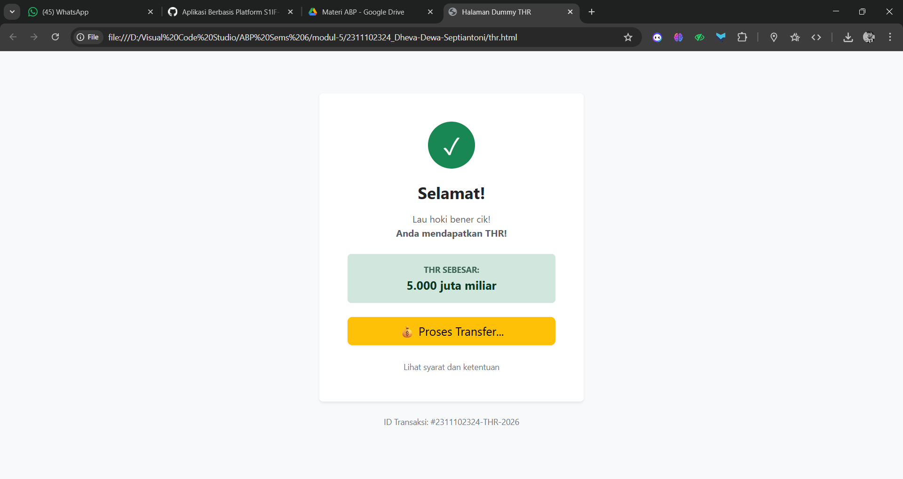
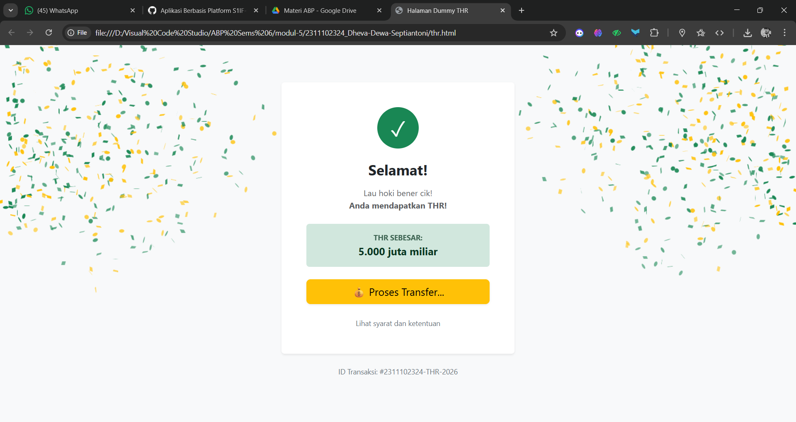

<div align="center">
   <h2>LAPORAN PRAKTIKUM<br>APLIKASI BERBASIS PLATFORM</h2>
   <h>
   <br>
   <h4>MODUL 5<br>JAVASCRIPT</h4>
   <br>
   
   <br><br>
 
**Disusun Oleh :**<br>
Dheva Dewa Septiantoni<br>
2311102324<br>
IF-11-01
<br><br>
 
**Dosen Pengampu :**<br>
Dimas Fanny Hebrasianto Permadi, S.ST., M.Kom
<br><br>
 
**Assisten Praktikum :**<br>
Apri Pandu Wicaksono
<br>Rangga Pradarrell Fathi
<br><br>
 
PROGRAM STUDI S1 TEKNIK INFORMATIKA<br>
FAKULTAS INFORMATIKA<br>
UNIVERSITAS TELKOM PURWOKERTO<br>
2026

</div>

---

## 1. Dasar Teori

**Javascript** merupakan bahasa pemrograman scripting yang digunakan untuk mengubah dokumen HTML statis menjadi dinamis dan interaktif, umumnya digunakan hanya untuk program yang tidak terlalu besar, biasanya hanya beberapa ratus baris, dan mengontrol program yang berbasis Java. Pada dasarnya Javascript tidak dirancang untuk digunakan dalam aplikasi skala besar.

**Prinsip Dasar Javascript** terdapat pada bahasa pemrograman javascript adalah sebagai berikut.

1. Javascript mendukung paradigma pemrograman imparatif (Javascript dapat menjalankan perintah program baris demi baris, dengan masing-masing baris berisi satu atau lebih perintah), fungsional (struktur dan elemen-elemen dalam program sebagai fungsi matematis yang tidak memiliki keadaan (state) dan data yang dapat berubah (mutable data)), dan orientasi objek (segala sesuatu yang terlibat dalam program dapat disebut sebagai "objek").
2. Javascript memiliki model pemrograman fungsional yang sangat ekspresif.
3. Pemrograman berorientasi objek (PBO) pada Javascript memiliki perbedaan dari PBO pada umumnya.
4. Program kompleks pada Javascript umumnya dipandang sebagai program-program kecil yang saling berinteraksi.

**Tipe data dasar** Seperti kebanyakan bahasa pemrograman lainnya, Javascript memiliki beberapa tipe data untuk dimanipulasi. Seluruh nilai yang ada dalam Javascript selalu memiliki tipe data. Tipe data yang dimiliki oleh
Javascript adalah sebagai berikut:
• Number (bilangan)
• String (serangkaian karakter)
• Boolean (benar / salah)
• Object
• Function (fungsi)
• Array
• Date
• RegExp (regular expression)
• Null (tidak berlaku / kosong)
• Undefined (tidak didefinisikan)

**Variabel** dideklarasikan dengan "var" dan tipe datanya dapat berubah secara dinamis. JavaScript memiliki tipe data seperti "Number", "String", "Boolean", "Object", "Function", "Array", "Date", "RegExp", "Null", dan "Undefined".

**Array** Tipe khusus (mirip objek) untuk menampung banyak nilai (termasuk beda tipe data) yang diakses menggunakan indeks mulai dari 0. Memiliki method bawaan seperti "push()", "pop()", dan properti "length".

**Pengendalian Struktur** Menggunakan "if"/"else" untuk percabangan serta "for", "while", dan "do-while" untuk perulangan. Evaluasi data yang paling akurat menggunakan operator "===" untuk memastikan tipe data dan nilai sama.

**Objek** Merupakan sekumpulan properti yang dapat berubah nilainya (mutable properties collection). Dibuat menggunakan kurung kurawal "{}" atau object literal. Nilai objek diakses menggunakan tanda kurung siku "[]" atau titik "." . Pewarisan objek pada JavaScript tidak menggunakan kelas, melainkan prototipe melalui fungsi "Object.create".

**Function** Digunakan untuk menyimpan perintah agar dapat digunakan ulang (code reuse) dan menyembunyikan informasi. Dapat dibuat dengan nama (function declaration) maupun tanpa nama / fungsi anonim (function expression). Fungsi mengembalikan nilai dan akan langsung berhenti bekerja ketika program menemukan kata kunci "return".

**Pengenalan dan Penggunaan jQuery** Library JavaScript ringan yang menyederhanakan manipulasi dokumen HTML hanya dengan beberapa baris kode. Memudahkan manipulasi DOM, penanganan event (seperti klik pengguna), dukungan AJAX, dan pembuatan animasi. Dapat diimplementasikan melalui file lokal (download) atau menggunakan Content Delivery Network (CDN). Mampu mengelola efek tampilan seperti menampilkan "show" atau menyembunyikan "hide" elemen HTML, serta menerapkan efek animasi seperti "toggle" Pada elemen.

## 2. Kode Program Unguided

Tugas 5, Buka kembali halaman ramadan dan tambahkan button atau semacam nya ketika di klik akan menampilkan modal "selamat anda mendapatkan THR" buat se interaktif itu dan sebagus mungkin.

### Kode HTML (ramadhan.html)

```html
<!DOCTYPE html>
<html lang="id">
<head>
    <meta charset="UTF-8">
    <meta name="viewport" content="width=device-width, initial-scale=1.0">
    <title>Ramadan Kareem - Full Bootstrap</title>
    <link href="https://cdn.jsdelivr.net/npm/bootstrap@5.3.2/dist/css/bootstrap.min.css" rel="stylesheet">
</head>
<body class="bg-success bg-gradient vh-100 d-flex align-items-center justify-content-center text-white">

    <div class="container">
        <div class="row justify-content-center">
            <div class="col-11 col-sm-8 col-md-6 col-lg-5">
                
                <div class="card bg-dark bg-opacity-50 border border-warning border-3 shadow-lg rounded-5">
                    <div class="card-body text-center p-4 p-md-5">
                        
                        <div class="display-2 text-warning mb-3">🌙</div>
                        
                        <h1 class="fw-bold text-warning border-bottom border-warning pb-3 mb-4">
                            Ramadan Kareem
                        </h1>
                        
                        <blockquote class="blockquote mb-4">
                            <p class="fs-4 italic">"Marhaban Ya Ramadan"</p>
                        </blockquote>

                        <div class="mb-5">
                            <p class="fs-5 lh-base">
                                Selamat menunaikan ibadah puasa 1447 H. <br>
                                Semoga setiap detik di bulan suci ini menjadi keberkahan untuk kita semua.
                            </p>
                        </div>

                        <div class="d-grid gap-2">
                            <a href="thr.html" class="btn btn-warning btn-lg rounded-pill fw-bold shadow-sm">
                                Pengen THR gak nih? Klik aja disini!
                            </a>
                        </div>

                        <div class="mt-4 pt-3 border-top border-secondary text-secondary small">
                            Dheva Dewa Septiantoni &bull; 2311102324
                        </div>

                    </div>
                </div>

            </div>
        </div>
    </div>

    <script src="https://cdn.jsdelivr.net/npm/bootstrap@5.3.2/dist/js/bootstrap.bundle.min.js"></script>
</body>
</html>

```

### Kode HTML (thr.html)
```html
<!DOCTYPE html>
<html lang="id">
<head>
    <meta charset="UTF-8">
    <meta name="viewport" content="width=device-width, initial-scale=1.0">
    <title>Halaman Dummy THR</title>
    <link href="https://cdn.jsdelivr.net/npm/bootstrap@5.3.2/dist/css/bootstrap.min.css" rel="stylesheet">
</head>
<body class="bg-light vh-100 d-flex align-items-center justify-content-center">

    <div class="container text-center">
        <div class="card shadow-sm border-0 mx-auto" style="max-width: 450px;">
            <div class="card-body p-5">
                
                <div class="rounded-circle bg-success text-white d-inline-flex align-items-center justify-content-center mb-4" style="width: 80px; height: 80px;">
                    <span class="fs-1">✓</span>
                </div>

                <h1 class="h3 fw-bold mb-3">Selamat!</h1>
                <p class="text-muted mb-4">
                    Lau hoki bener cik! <br>
                    <strong>Anda mendapatkan THR!</strong>
                </p>

                <div class="alert alert-success border-0 py-3 mb-4">
                    <span class="d-block small text-uppercase fw-bold opacity-75">THR Sebesar:</span>
                    <span class="fs-5 fw-bold">5.000 juta miliar</span>
                </div>

                <div class="d-grid">
                    <button class="btn btn-success btn-lg shadow-sm">
                        Klaim THR Sekarang
                    </button>
                </div>

                <div class="mt-4">
                    <a href="thr.html" class="text-decoration-none small text-secondary">
                        Lihat syarat dan ketentuan
                    </a>
                </div>

            </div>
        </div>

        <p class="mt-4 text-secondary small">
            ID Transaksi: #2311102324-THR-2026
        </p>
    </div>

    <script src="https://cdn.jsdelivr.net/npm/bootstrap@5.3.2/dist/js/bootstrap.bundle.min.js"></script>

    <script src="https://cdn.jsdelivr.net/npm/canvas-confetti@1.6.0/dist/confetti.browser.min.js"></script>

    <script>
        // A. Animasi Confetti saat halaman dibuka
        window.onload = function() {
            // Efek Confetti Sederhana
            confetti({
                particleCount: 150,
                spread: 70,
                origin: { y: 0.6 },
                colors: ['#198754', '#ffc107', '#ffffff'] // Warna Hijau, Kuning, Putih
            });
        };

        // B. Animasi Confetti terus-menerus saat tombol diklik
        const btnKlaim = document.querySelector('.btn-success');
        btnKlaim.addEventListener('click', function() {
            var duration = 3 * 1000;
            var end = Date.now() + duration;

            (function frame() {
                confetti({
                    particleCount: 5,
                    angle: 60,
                    spread: 55,
                    origin: { x: 0 },
                    colors: ['#198754', '#ffc107']
                });
                confetti({
                    particleCount: 5,
                    angle: 120,
                    spread: 55,
                    origin: { x: 1 },
                    colors: ['#198754', '#ffc107']
                });

                if (Date.now() < end) {
                    requestAnimationFrame(frame);
                }
            }());
            
            // Mengubah teks tombol setelah diklik
            this.innerHTML = "💰 Proses Transfer...";
            this.classList.replace('btn-success', 'btn-warning');
        });
    </script>
</body>
</html>

```
### Hasil Output





### Penjelasan Kode HTML

1. Struktur Dokumen & Framework
Bootstrap 5 (CDN): Digunakan untuk mengatur tata letak (layout) dan gaya visual secara instan tanpa menulis CSS manual. Class seperti `vh-100`, `d-flex`, `align-items-center`, dan `justify-content-center` pada `<body>` berfungsi untuk meletakkan konten tepat di tengah layar secara vertikal dan horizontal.<br>
Card Component: Elemen utama pembungkus pesan yang menggunakan class `shadow-sm` (bayangan tipis) dan `border-0` agar tampilannya terlihat modern dan bersih (clean design).

2. Komponen UI Bootstrap
Rounded Circle (Icon): Menggunakan `rounded-circle` dan `bg-success` untuk membuat lingkaran hijau. Simbol centang (✓) diletakkan di tengah menggunakan flexbox utilities.<br>
Alert Component: Digunakan pada bagian "THR Sebesar". Ini memanfaatkan class alert-success untuk memberikan penekanan visual bahwa informasi tersebut adalah kabar baik (positif).<br>
Utility Spacing: Penggunaan class seperti `mb-4` (margin bottom), `p-5` (padding), dan `mt-4` (margin top) untuk mengatur jarak antar elemen agar tidak rapat dan enak dipandang.

3. Canvas Confetti Library
Eksternal Script: Kode memanggil library `canvas-confetti.js` melalui CDN. Library ini berbasis HTML5 Canvas yang mampu merender ratusan partikel animasi secara ringan tanpa membebani performa browser.

4. Logika JavaScript (Interaktivitas)
Ada dua skenario logika yang dijalankan di sini:<br>
A. Auto-Trigger (Window Onload)
JavaScript
`window.onload = function()` { ... }
Fungsi ini memastikan begitu seluruh aset halaman (gambar, style, script) selesai dimuat, animasi kembang api kertas (confetti) langsung muncul satu kali. Ini memberikan efek "surprise" pertama kepada pengguna.<br>
B. Event Listener (Interaction)
JavaScript
`const btnKlaim` = `document.querySelector('.btn-success')`;<br>
`btnKlaim.addEventListener('click', function() { ... });`<br
`requestAnimationFrame`: Digunakan untuk menjalankan fungsi frame() secara terus-menerus selama 3 detik. Ini lebih halus (smooth) dibandingkan menggunakan setInterval.<br>
Two-Sided Animation: Partikel ditembakkan dari origin: `{ x: 0 }` (kiri) dan origin: `{ x: 1 }` (kanan) secara bersamaan untuk menciptakan efek perayaan yang megah.<br>
DOM Manipulation: Saat diklik, teks tombol diubah (innerHTML) dan class Bootstrap-nya diganti (classList.replace) dari hijau ke kuning sebagai indikator bahwa "proses" sedang berjalan.

## 3. Kesimpulan dan Penutup

Modul ini menjelaskan konsep dasar dan implementasi Javascript beserta library jQuery untuk mengubah dokumen HTML statis menjadi dinamis dan interaktif , dengan fokus materi pada pemahaman sintaks dasar, fungsi, orientasi objek, hingga manipulasi DOM dan efek animasi. Cocok digunakan sebagai panduan pembelajaran praktikum pemrograman web bagi mahasiswa program studi Informatika di Telkom University Purwokerto untuk membangun situs web modern.

## 4. Referensi

- [Materi Modul 5](https://drive.google.com/file/d/1NKK3wu2ww23vudPo1DypbbiI9NM_9zwG/view)